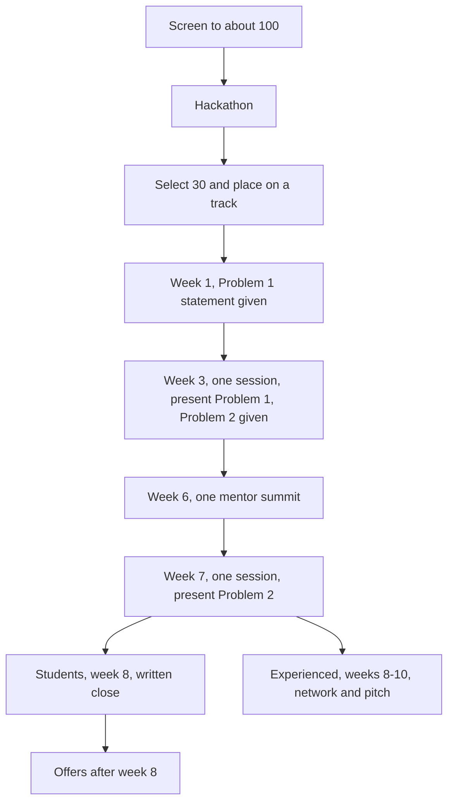

# Initial plan

One pilot cohort. Handpick a high bar, then put those people on small, real problems that the BD team has already brought in from companies. After the hackathon, the group splits into two tracks.

Placement is the product. Students spend 8 weeks on the problems. A problem statement is given, they solve it, and they present it at the deadline. The week-1 statement is presented in week 3, and that presentation is the one session that month. Interviews open there for people who hold the bar. Experienced people use the same give-and-present rhythm, then 4 weeks on networking and the pitch. Investment does not hold up the start. It is a separate agreement, and only if Masai actually invests.

The club works when each side gets something that costs them little.

| Who | What they get | What it costs |
| --- | --- | --- |
| Students and experienced people | A visible edge: company problems, a written record, and a path to an interview or a network | The 90% screen and the hackathon. Membership has to be earned. |
| Companies | A short, pre-vetted list, for a small amount of their time | A scoped problem, a named assessor, an interview, and written feedback. No stipend. |
| Masai | Placements, and a selective club that means something | BD time, mentor time, and one cohort run properly before a second one |

## 1. Before the cohort opens

Nothing opens until the companies are signed.

BD signs 4 to 6 pilot companies. Each company supplies 2 to 3 small problems, tagged for the Students track or the Experienced track, with a named assessor. Each track runs 2 of those problems. The rest are spare, so one company dropping out does not stop the cohort.

Ask each company, before signing, how many weeks its hiring cycle takes. That answer decides whether that company needs an interview window after week 8. Offers and notice periods sit outside the cohort either way.

Each problem is real enough that the company cares about the answer, and small enough to finish inside the cadence below. The submission is an evaluation exercise. It is not a claim on the company's product. Sharing the work outside the assessment needs the company's permission.

## 2. Screening

Target 100. All three bars must be cleared.

| Bar | Cut |
| --- | --- |
| Assignment | More than 90% |
| Attendance | More than 90% |
| Eval score | More than 90% |

If fewer than 100 clear all three, take the next highest combined scores. Do not go below 80% on any one bar. If that still leaves a short list, invite that shorter list. Do not fill the hackathon with scores under the floor.

## 3. Invite and hackathon

Invite everyone who cleared the screen.

- One hackathon. Two problem sets, one suited to each track.
- Mentors assess the work.
- Select 30 in total, and place each person on a track.
- Tell each selected person exactly what that track offers, including what is committed and what is only possible.
- The hackathon is the gate. The company problems start after it.

## 4. Two tracks

The hackathon is shared. The months after it are not.

There is no weekly class. A problem has two moments: the statement is given, and the solution is presented at the deadline. The live session is that presentation, once in a month. A statement given in week 1 is presented in week 3. The next statement is given at that presentation and presented at the next month's session.

| | Students | Experienced |
| --- | --- | --- |
| Goal | An interview with the company whose problem they solved | Network, growth, and a pitch if the idea is strong |
| Length | 8 weeks | 10 weeks. Second presentation in week 7, then network and pitch through week 10 |
| Work | 2 company problems | 2 company problems |
| Cadence | One session a month. Statement given, solved, presented at the deadline | Same cadence. The second presentation opens the pitch phase |
| Payoff | Interviews from the week-3 presentation, plus written feedback | Four weeks with company leaders and peers, and a pitch day if an idea earns it |

People who hold the bar move to the next problem. People who miss it leave that problem with written feedback. They are not left in silence, and they are not carried forward. There is no recovery round.

### Students

Eight weeks cover two problems and two sessions. The week-1 statement is presented in week 3. People who hold that bar start interviews then, and receive the second statement. They present it in week 7. An interview is the commitment. An offer is the company's decision after that, and it can land after the 8 weeks.

### Experienced

A job may be the wrong outcome. They get the same two problems: statement in week 1, presented in week 3, then a second statement presented in week 7. Week 7 is the start of the network and pitch phase, which runs through week 10. It is not an open-ended tail.

If Masai invests in one of those startups, a share of the employees comes from Masai alumni and from this club. That share is set in the investment agreement before the pitch. It is not part of the company agreement that starts the cohort.

## 5. Mentor summit

One summit in the cohort, in week 6, both tracks together with the mentors.

It is not a third problem session. The presentations stay in week 3 and week 7. The summit is the one time the whole selected group and the mentors are in the same room: the work so far, the week-7 presentation coming next, and the experienced track's network and pitch phase.

## 6. The agreement

BD brings the companies, the problem statements, and a company willing to interview the people who solve its problem. A problem with no interview path is a class exercise, and it does not go on the calendar.

Before the cohort starts, BD and the company sign an MoU, or a written workflow if a full MoU is too heavy. It locks five things.

| In the MoU or workflow | What it locks |
| --- | --- |
| The problem | The statement, the track it is tagged for, and the person at the company who owns it. The submission is an evaluation exercise. Sharing it outside needs permission. |
| The rhythm | One session a month. The problem statement is given, members solve it, and they present at the deadline. A statement given in week 1 is presented in week 3. A named company assessor is in the room for that presentation, with the Masai mentors. |
| Hiring | Interviews open at the week-3 presentation for members who hold the bar. Anyone who holds the bar at the week-7 presentation and is not already in process is interviewed then. Written feedback either way. A fast-track past an early screening round is included only where that company agrees to it. This is not a promise of a job. The company also states how many weeks its hiring cycle takes. |
| Endorsement | Written feedback for those who clear the assessments, and approval of a certificate co-signed by Masai and the company. A reference or an introduction is at the assessor's discretion. |
| The startup case | Not in this agreement. If Masai invests later, the employee share is a separate agreement, signed before the pitch. |

No MoU or written workflow, no company on the calendar.

## 7. Perks

Say these in two lists when members are told what they are joining. Committed is what this pilot will do. Possible is what can happen, and is not promised.

Endorsement is earned. A letter or a certificate for everyone would make it meaningless. Only people who clear the assessments receive one. The wording names the problem and the level reached. Assessors write only for people they will actually vouch for. The certificate carries a verification link or ID so an employer can confirm it.

### Committed, all members

1. Selective status. The 90% screen and a mentor-assessed hackathon. Membership is a signal because most people were not picked.
2. Real company problems the company actually cares about, scoped as evaluation exercises. Each track does 2. A statement is given, solved, and presented at the deadline.
3. Mentor assessment of the work.
4. A written record after each assessment, and again at the end of the track.
5. The peer group of people who also cleared the hackathon.
6. A clear bar. Hold it, and you move to the next problem. Miss it, and you leave with feedback.
7. One mentor summit, in week 6.
8. A Masai credential for members who clear the assessments. Where the company has signed, that credential is the co-signed certificate.

### Committed on the Students track

1. An interview from the week-3 presentation if that presentation held the bar, and an interview after the week-7 presentation for anyone who holds the bar then and is not already in process.
2. Written feedback from that company, including for people who are not hired.
3. The company sees the work before it sees the resume.

### Committed on the Experienced track

1. Two problems on the same give-and-present rhythm, with the same written record.
2. From week 7: company leaders and peers, the second presentation, and the pitch phase.
3. Mentor guidance on the next step, not only on the submission.

### Possible

These depend on the company, the assessor, or an idea being strong enough. They are not part of the offer.

1. Permission to show the solved problem as a portfolio piece.
2. A fast-track that skips an early screening round.
3. A LinkedIn recommendation from an assessor, for someone that assessor will vouch for.
4. A reference to a later employer, at the assessor's discretion.
5. A warm introduction, at the endorser's discretion.
6. Named recognition, with a company quote, for the strongest work.
7. A pitch day, if an experienced-track idea is strong enough.
8. Investment, and any alumni hiring preference inside that investment. Separate agreement, and it may not happen.

### Not promised

- A job. The agreement promises an interview and written feedback.
- A stipend. No company is paying one.
- Investment, or a named famous mentor.
- An endorsement for every member.

## 8. Weeks

Screening and the hackathon happen before week 1. There is no weekly class. One session in a month, and that session is the deadline. The problem statement is given, members solve it, and they present at that deadline. A statement given in week 1 is presented in week 3. The next statement is given in that same session and presented at the next month's session.

### Students: 8 weeks

| Week | What happens |
| --- | --- |
| 1 | Problem 1 statement is given. They solve it. No session. |
| 3 | The month's session. Present Problem 1. Interviews open for anyone who holds the bar. Problem 2 statement is given. |
| 6 | Mentor summit, once, with the experienced track. Not a problem session. |
| 7 | The next month's session. Present Problem 2. |
| 8 | Written close. Interviews continue for anyone who held the week-7 bar and is not already in process. |

Offers and notice periods come after week 8. A company whose hiring cycle needs longer gets a 3 to 4 week interview window after week 8. That window is for that company, not a longer program for everyone.

### Experienced: 10 weeks

| Week | What happens |
| --- | --- |
| 1 | Problem 1 statement is given. They solve it. No session. |
| 3 | The month's session, with the students. Present Problem 1. Problem 2 statement is given. |
| 6 | The same mentor summit. Not a second summit, and not a problem session. |
| 7 | Present Problem 2. This session opens the network and pitch phase. |
| 8–10 | Network and pitch. No new problem. Pitch day in week 10 if an idea has held up. Investment, if any, is a separate agreement before that pitch. |

## 9. After this cohort

Review before a second cohort.

- The week of the first interview, and the week of the offer
- Offers per member
- Whether each company would join again
- Where people left the track
- Whether the 90% screen was too strict or too loose

## 10. Best suitable names

| Name | How the name looks | What it says |
| --- | --- | --- |
| Guild | Masai Guild, The Guild, Masai Guild Club | First choice. A group of skilled practitioners. Works for students and experienced members. Selective, and it does not sound like an award. |
| Forge | Masai Forge, The Forge, Masai Forge Club | Second choice. More energetic, and it fits work on real problems. Suits students better than experienced members. |
| Savants | The Savants Club, Masai Savants, Masai Savants Club | Deep specialists. |
| Laureates | The Laureates Club, Masai Laureates, Masai Laureates Club | People a panel has already chosen. |
| Fellows | The Fellows Club, Masai Fellows, Masai Fellows Club | Members of a learned cohort. |
| Mavens | The Mavens Club, Masai Mavens, Masai Mavens Club | The people others consult. |
| Eminences | The Eminences Club, Masai Eminences, Masai Eminences Club | People who already stand out in the field. |

Left until after the pilot: the final name and brand, a headline mentor, any fee charged to companies, and investment as its own track.
