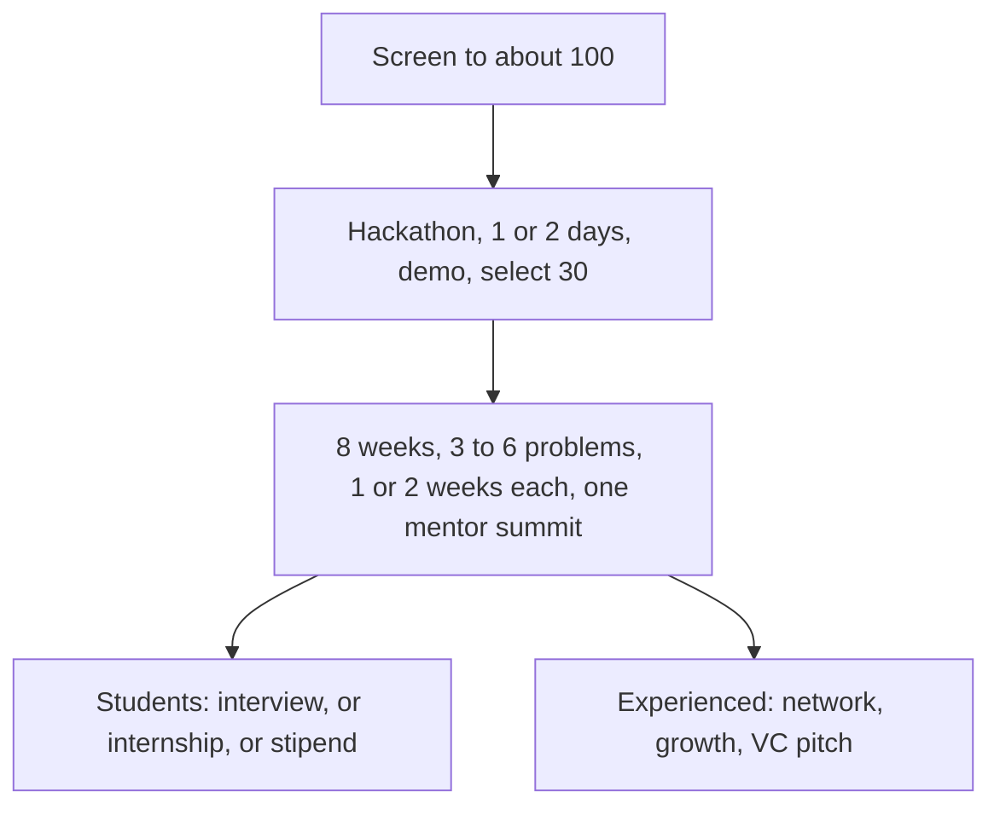

# Initial plan

## 1. Problem statement

Masai wants to build an **exclusive club for its top students**.

The club helps its members to:

- **Start companies.** Masai connects them with VCs and fund raisers who back innovation.
- **Solve real problems.** Government-level problems, and B2B problems that companies bring.
- **Earn.** Stipends and bounties.
- **Grow.** Network, growth opportunities, and summits.

The club needs people with an innovation mindset and a problem-solving mindset. Masai has to find them inside a part-time learner base, where online scores alone are easy to copy. So the club picks through a screen and a hackathon, and then tests people on real problems.

## 2. Mission and vision

**Vision.** An exclusive club that builds an innovation and startup path, and at the same time gets its top students a job that is clearly better than a regular placement: a good salary, or a good company, or a good role.

**Mission.**

- Find the top students and put them on real problems brought by BD and by companies.
- Use BD to open interviews, internships for freshers, and consultant roles for experienced members.
- Use the experienced members' own companies and networks. Where an experienced member brings their company in as a hiring partner, Masai signs that MoU, and that member gets a good incentive from Masai.
- Listen to problem statements from experienced members as well. Those problems can become startup ideas.
- Connect freshers with experienced members, so the fresher gets help with a job, or with building something.

## 3. Target audience

- Masai's **part-time students**.
- Mixed backgrounds and mixed experience, from new learners to working professionals.
- Time with Masai: **2 to 4 hours a week, for 4 to 6 months**.

### By specialisation

| Specialisation | Working | NWNS | Studying, I/II year | Studying, pre-final | Studying, final year | Overall |
| --- | ---: | ---: | ---: | ---: | ---: | ---: |
| PM | 203 | 83 | 5 | 17 | 11 | 319 |
| CSE | 24 | 22 | 35 | 37 | 9 | 127 |
| DM | 57 | 43 | 4 | 6 | 17 | 127 |
| BA | 56 | 54 | 6 | 5 | 5 | 126 |
| AI | 35 | 21 | 11 | 22 | 9 | 99 |
| ML | 4 | 20 | 23 | 12 | 4 | 63 |
| DS | 14 | 16 | 7 | 8 | 7 | 52 |
| DevOpsCloud | 1 | 4 | 0 | 1 | 3 | 9 |
| Cybersecurity | 3 | 0 | 1 | 0 | 3 | 7 |
| DA | 2 | 0 | 0 | 0 | 0 | 2 |

## 4. Solution

### Challenge

The club has to work for the audience recorded above. The sheets are here:

- [Specialisation and current status](documents/learners-by-status.png)
- [Availability by specialisation](documents/available-by-specialisation.png)
- [Learners by zone](documents/learners-by-zone.png)
- [Experience and salary](documents/experience-by-salary.png)
- [Existing case study](existing-case-study.md)

- **612 of 933** on the salary sheet are freshers. The majority of the pool are freshers, and they need a good job. This club is for the top students, and the job has to be different from the regular placement cell: a good salary, or a good company, or a good role.
- Most experienced members join for a certification. Some join for a promotion in the job they already have.
- Everyone is part-time, **2 to 4 hours a week, for 4 to 6 months**. Spotting an innovation mindset here is harder than at edtechs that handpick full-time residential degree students on campus, most of whom missed the JEE cutoff.
- The specialisation table above shows the mix: working, NWNS, and students in I/II year, pre-final year, and final year.

### What we run

One pilot cohort. Screening, then the hackathon, then the program below.

**Tentative screening.** Target **100** students. All three bars must be cleared.

| Bar | Cut |
| --- | --- |
| Assignment | More than 90% |
| Attendance | More than 90% |
| Eval score | More than 90% |

If fewer than 100 clear all three, take the next highest combined scores. No bar goes below 80%. If the list is still short, invite that shorter list.

**Hackathon.** Everyone who clears the screen is invited.

- A timed hackathon on a real problem statement.
- The hackathon runs for **1 day or 2 days**, depending on the problem statement.
- Team or individual participation is decided later.
- At the deadline, members give a demo to the mentors.
- Mentors assess in real time, and the members are selected from that assessment.
- **30** are selected and placed on a track.

### How the typical program runs after selection

Problem solving is **8 weeks for both tracks**.

- Members work on **3 to 6** problem statements.
- Each statement is **1 week or 2 weeks**. The company or the government decides that length from the type of problem. It is decided later.
- The statement is given, solved, and presented at its deadline.
- One mentor summit in these 8 weeks, both tracks.
- Hold the bar, and you take the next problem. Miss it, and you leave with written feedback.

| When | Students | Experienced |
| --- | --- | --- |
| 8 weeks | 3 to 6 problems. Each problem is 1 week or 2 weeks. | The same problems and the same 8 weeks. |
| During the 8 weeks | One mentor summit, with the experienced track. | The same summit. |
| After the 8 weeks | An interview, or an internship, or a stipend, for those who held the bar. | Their perks: network, growth, and the VC pitch. |

## 5. Perks

| # | Perk | Who gets it |
| --- | --- | --- |
| 1 | VC and funding connect | Experienced track, when the pitch holds up |
| 2 | Real problems: B2B and government | All members |
| 3 | Summit: exclusive network and growth | All members |
| 4 | Placement: assured interview, internship, or stipend | Members who hold the bar |
| 5 | Endorsement | Members who complete the 8 weeks |

### 1. VC and funding connect

- Masai connects the pitch to VCs and fund raisers.
- This starts after the 8 weeks of problem solving.
- The VC decides whether to fund.

### 2. Real problems: B2B and government

- BD, in collaboration with companies, brings the problems. They may be company-level problems or government-level problems.
- A proper mentor assessment will be decided later.
- Bounty: where the owner attaches a reward to a problem, the member who solves it earns it. The owner sets this in the agreement.
- Hold the bar, and you take the next problem. Miss it, and you leave with written feedback.

### 3. Summit: exclusive network and growth

- One summit during the 8 weeks of problem solving.
- Both tracks, with the mentors. Only the 30 selected.
- It is a meeting, not a problem deadline.

### 4. Placement: assured interview, internship, or stipend

- After the 8 weeks, a student who has held the bar gets an **interview, or an internship, or a stipend**.
- The partner signs this before the cohort opens. That is what "assured" means.
- A full-time job offer is the employer's later decision.
- If a partner's hiring cycle needs longer than the placement window, add 3 to 4 weeks for that partner only.

### 5. Endorsement

- One endorsement for the whole 8 weeks. It is not given after every problem statement.
- It is a certificate that the person is a problem solver. For example: "XYZ is a problem solver."
- It is given by a mentor, or by the company, or by Masai.
- It is a prestigious certificate.

## 6. BD Team's Involvement

- BD brings companies that have the potential to hire.
- For freshers, that means an internship. For experienced members, that means a consultant position.
- The companies test the students with the problem statement.
- BD should prioritise bringing companies that work closely with the government, and that bring government-level problem statements.
- BD brings a network of VCs and founders who are willing to fund, or at least to listen to the pitches.

## 7. Names

| Name | How the name looks | What it says |
| --- | --- | --- |
| Guild | Masai Guild, The Guild, Masai Guild Club | First choice. A group of skilled practitioners. Works for students and experienced members. Selective, and it does not sound like an award. |
| Forge | Masai Forge, The Forge, Masai Forge Club | Second choice. More energetic, and it fits work on real problems. Suits students better than experienced members. |
| Savants | The Savants Club, Masai Savants, Masai Savants Club | Deep specialists. |
| Laureates | The Laureates Club, Masai Laureates, Masai Laureates Club | People a panel has already chosen. |
| Fellows | The Fellows Club, Masai Fellows, Masai Fellows Club | Members of a learned cohort. |
| Mavens | The Mavens Club, Masai Mavens, Masai Mavens Club | The people others consult. |
| Eminences | The Eminences Club, Masai Eminences, Masai Eminences Club | People who already stand out in the field. |
