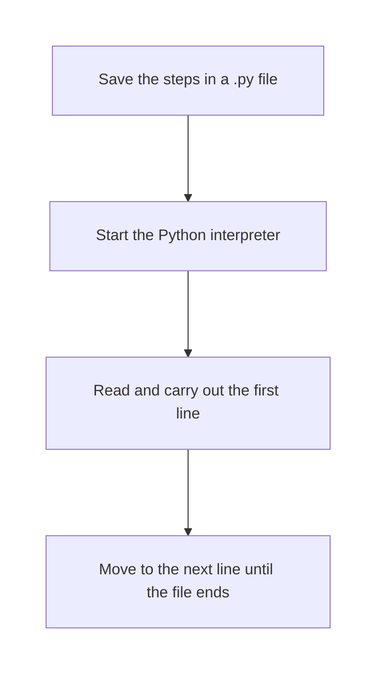
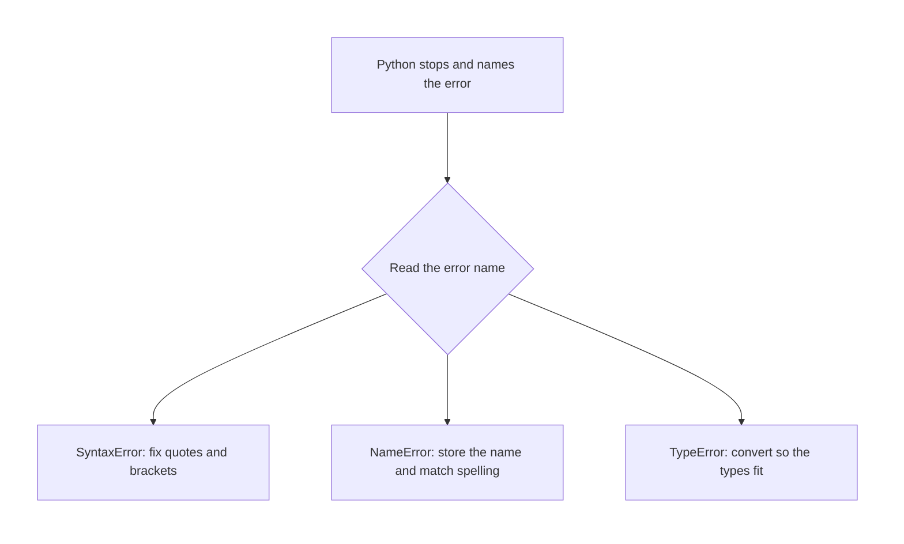

# Python — Introduction to Programming & Python Basics

## What You Will Learn in This Lesson

A college help desk, a kirana counter, and an IRCTC window repeat small jobs all day. A person can do the work by hand. A program repeats it from written steps.

This lesson covers what programming is, why people write programs, and what Python is. You will see how a `.py` file runs, how `print()` shows a message, and how a comment works.

You will store values in names, follow naming rules, and use **int**, **float**, **str**, and **bool**. You will use `type()`, `input()`, and `int()`, `float()`, and `str()`. You will meet **SyntaxError**, **NameError**, and **TypeError**, with a fix for each.

## What Programming Is

**Programming**

**Official Definition:** Programming is the work of writing clear, ordered instructions that a computer can follow.

**In Simple Words:** You write the steps. The computer carries them out. It does not invent a step you left out.

**Real-Life Example:** At a kirana shop, “note the item, note the price, tell the customer the amount” is a list of steps. A program is that kind of list, written for a computer.

A **program** is the finished list. A **programming language** is the set of words and marks used to write it. **Code** means those written lines in Python.

## Why People Write Programs

People write programs when a job repeats, when a small mistake is costly, or when the same steps must be used for many people.

**Official Definition:** A program stores a defined task so a computer can repeat it accurately.

**In Simple Words:** You decide the steps once. The computer follows them whenever you run the file.

**Real-Life Example:** IRCTC checks a PNR and shows the booking. The same kind of check happens for a huge number of passengers, so the steps live in a program.

You still choose the steps. The computer follows the file, and that file is written in Python.

## What Python Is

**Python**

**Official Definition:** Python is a programming language used to write instructions that a Python interpreter can run.

**In Simple Words:** Python is the language of the lines you type. People also use the name for the tool that reads those lines.

**Real-Life Example:** A shop notice can be written in English. A small program that shows the notice on a screen can be written in Python.

You will write **Python 3**. The programs in this lesson use only tools that come with Python. A Python file is plain text whose name ends in `.py`, such as `welcome.py`.

A `.txt` file is only a note until you ask Python to run those lines as a program. The language is one half of the story. The tool that reads the file is the other half.

## How a .py File Runs

**Interpreter**

**Official Definition:** An interpreter is a program that reads a Python file and carries out the instructions line by line.

**In Simple Words:** You save `welcome.py`. The interpreter starts at the top, finishes one line, then moves to the next line.

**Real-Life Example:** A railway announcer reads a printed list: platform, train, time. The announcer is like the interpreter. The list is like your `.py` file.



**A .py file holds the steps. The interpreter carries them out from top to bottom.** The first step most beginners write is a line that shows a message.

## Showing a Message with print()

**print()**

**Official Definition:** `print()` is a Python instruction that displays a value on the screen.

**In Simple Words:** The value inside the brackets is shown, then the run moves on. Each `print()` starts on a new line.

**Real-Life Example:** A kirana board shows the shop name. `print("Sharma Kirana")` shows that name on the screen.

```python
# Show one welcome line on the screen.
print("Welcome to the college help desk")  # Show this value.
# Show the counter name on the next line.
print("Help desk counter")  # Show this value.
```

How the code works:

- `print` displays the text inside the quotes.
- The first line shows `Welcome to the college help desk`.
- The second line shows `Help desk counter` under it.
- `print()` displays a value. It does not store that value for later.

## Writing Comments with #

**Comment**

**Official Definition:** A comment is a note in the file that the interpreter ignores.

**In Simple Words:** A comment is for the person reading the file. Python skips it.

**Real-Life Example:** A clerk pencils “check berth” in the margin of an IRCTC form. The pencil note guides the clerk. A comment guides the reader in the same way.

A comment begins with `#`. The rest of that line is the note. A short comment may also sit after a code line.

```python
# The next line is only a title for the counter.
print("Fee counter")  # Show this value.
# Show which window is open.
print("Window 3")  # Window number for the fee queue.
```

How the code works:

- Every `#` note is skipped.
- The two `print()` lines run.
- The screen shows `Fee counter` and then `Window 3`.

Use a comment to say why a line is there. A comment does not store a value. A variable does that job.

## Variables: A Name That Stores a Value

**Variable**

**Official Definition:** A variable is a name that stores a value in the program.

**In Simple Words:** The `=` sign here means “this name stores this value.” It is the act of storing.

**Real-Life Example:** Cloakroom token `B12` stands for one bag. The name `student_name` can stand for the text `Meera`.

```python
# This name stores the student's first name.
student_name = "Meera"  # Store this value.
# This name stores the roll number as a whole number.
roll_number = 42  # Store this value.
# Show the stored name.
print(student_name)  # Show this value.
# Show the stored roll number.
print(roll_number)  # Show this value.
```

How the code works:

- `student_name` stores the text `Meera`. Quotes mark text.
- `roll_number` stores `42`. A number used as a number has no quotes.
- The screen shows `Meera` and then `42`.

The same name can store a new value later. The new value replaces the old one. Later lines see the latest value.

## Naming Rules for Variables

**Official Definition:** A variable name is a label Python accepts for a stored value.

**In Simple Words:** Later lines use the label to reach the value. A clear label is easier to read next week.

**Real-Life Example:** A college register uses `roll_number`, so the clerk knows what the column means.

Follow these rules:

- Start with a letter or an underscore.
- Then use letters, digits, or underscores.
- Do not use a space. Write `student_name`.
- Capital and small letters differ. `City` and `city` are two names.
- Do not use a word Python keeps for itself, such as `True` or `False`.
- Prefer a name that says what is stored, such as `fee_paid` or `home_city`.

## The Four Beginner Data Types

**Data type**

**Official Definition:** A data type is the kind of value stored.

**In Simple Words:** A city name, a whole number of marks, a fee with paise, and a yes-or-no fact are different kinds.

**Real-Life Example:** A college form has a name box, a marks box, a fee box, and a tick box for hostel. Those boxes match the four types below.

### int

**int**

**Official Definition:** An `int` is a whole number: positive, negative, or zero, with no decimal point.

**In Simple Words:** Use an int for a count or for marks with no fractional part.

**Real-Life Example:** A score of `78` marks is an int.

### float

**float**

**Official Definition:** A `float` is a number written with a decimal point.

**In Simple Words:** Use a float for rupees and paise, or any value that may have a fractional part.

**Real-Life Example:** A kirana bill of `1250.50` rupees is a float.

### str

**str**

**Official Definition:** A `str` is text, written inside quotes.

**In Simple Words:** Names, cities, and codes are text. Digits inside quotes are still text.

**Real-Life Example:** Store an IRCTC PNR as text so a leading zero stays in the code.

You may use single quotes or double quotes. `'Pune'` and `"Pune"` are both text.

### bool

**bool**

**Official Definition:** A `bool` is a value that is either `True` or `False`.

**In Simple Words:** Use a bool for a yes-or-no fact. Write `True` and `False` with a capital letter and no quotes.

**Real-Life Example:** “Fee paid” on a college form is `True` or `False`.

`"True"` with quotes is text. `True` without quotes is a bool.

## Asking for the Type with type()

**type()**

**Official Definition:** `type()` reports the data type of a value.

**In Simple Words:** Put a name inside `type()`, and Python tells you int, float, str, or bool.

**Real-Life Example:** A clerk says “this box is a name, this box is marks.” `type()` is that check.

```python
# Store marks and a city so this file can run alone.
marks = 78  # Store this value.
# Store a city name as text.
city = "Pune"  # Store this value.
# Report the type of the marks.
print(type(marks))  # Show this value.
# Report the type of the city.
print(type(city))  # Show this value.
```

How the code works:

- `type()` reports the kind. It does not change the stored value.
- The screen shows `<class 'int'>` and then `<class 'str'>`.

## Reading Typed Text with input()

**input()**

**Official Definition:** `input()` reads one typed line and gives it back as text.

**In Simple Words:** The program waits. The person types and presses Enter. The result is a str, even when the characters are digits.

**Real-Life Example:** A UPI screen asks for an amount and reads what you type. `input()` is that pause-and-read step, and the result starts as text.

```python
# Read the name the person types, and store it as text.
visitor_name = input("Type your name: ")  # Store this value.
# Show the stored name.
print(visitor_name)  # Show this value.
# Show the type. It is str for every input() result.
print(type(visitor_name))  # Show this value.
```

How the code works:

- The text inside `input()` is the prompt.
- If the person types `Meera`, `visitor_name` stores that text.
- If the person types `18`, the stored value is still the text `"18"`, not the int `18`.
- The last line shows `<class 'str'>`.

A number that arrives as text has to be converted before you treat it as a number.

## Changing One Type into Another

**Type conversion**

**Official Definition:** Type conversion builds a new value of a different type from an existing value.

**In Simple Words:** `int()` makes a whole number, `float()` makes a decimal number, and `str()` makes text.

**Real-Life Example:** A student types marks. The box receives text. The office needs a whole number, so `"78"` is passed to `int()`.

```python
# Read marks as text.
marks_text = input("Type your marks: ")  # Store this value.
# Build a whole number from that text.
marks = int(marks_text)  # Store this value.
# Read a UPI amount as text.
amount_text = input("Type the UPI amount: ")  # Store this value.
# Build a decimal number from that text.
amount = float(amount_text)  # Store this value.
# Show both converted values.
print(marks)  # Show this value.
# Show the amount.
print(amount)  # Show this value.
# Confirm both types.
print(type(marks))  # Show this value.
# Confirm the amount type.
print(type(amount))  # Show this value.
```

How the code works:

- `int("78")` stores the int `78` in `marks`.
- `float("1250.50")` stores a float. It may display as `1250.5`.
- Call `int()` only on whole-number text. Text such as `"78.5"` needs `float()`.
- `str()` builds text from a number. The `TypeError` repair below shows that step.

## Three Beginner Errors and How to Fix Them

Read the error name, then the line Python points to.

### SyntaxError

**SyntaxError**

**Official Definition:** A `SyntaxError` means a line is not in a form Python accepts, so the file cannot start.

**In Simple Words:** The punctuation is incomplete. A missing quote or a missing bracket is a typical cause.

**Real-Life Example:** A form line left unclosed cannot be accepted. `print("IRCTC login)` is the same kind of gap.

Close the quote and the brackets.

```python
# The quote is closed, so this line can run.
print("IRCTC login")  # Show this value.
```

How the code works:

- The text begins and ends with a quote.
- The screen shows `IRCTC login`.
- `print("Pune"` is incomplete. `print("Pune")` is complete.

### NameError

**NameError**

**Official Definition:** A `NameError` means the line uses a name that does not store a value yet.

**In Simple Words:** The label was never stored, or the spelling does not match, including capital letters.

**Real-Life Example:** The cloakroom calls token `B12`, but the bag was logged as `B21`. That exact token is not there.

Store the name before any line uses it.

```python
# Store the station code first.
station = "NDLS"  # Store this value.
# The name now exists, so it can be shown.
print(station)  # Show this value.
```

How the code works:

- `station` stores `"NDLS"` before `print`.
- The screen shows `NDLS`.
- `print(Station)` still raises `NameError`, because `Station` is a different name.

### TypeError

**TypeError**

**Official Definition:** A `TypeError` means the value’s type does not fit the action on that line.

**In Simple Words:** The spelling is valid and the names exist, but the kinds of values do not fit together.

**Real-Life Example:** The fee box is real, but a photograph is the wrong kind of thing to put in it.

`print("Age: " + 18)` fails because one side is text and the other is an int. Make both sides text.

```python
# Store the age as a whole number.
age = 18  # Store this value.
# Build text from the number.
age_text = str(age)  # Store this value.
# Join two pieces of text and show them.
print("Age: " + age_text)  # Show this value.
```

How the code works:

- `str(age)` builds `"18"`.
- Both sides of `+` are text, so they join into `Age: 18`.
- `"Age: " + age` raises `TypeError`.
- Marks from `input()` are text until you store the result of `int()` or `float()`.



## Activity 1: Store a Help Desk Slip

Do this in a file named `slip.py`.

- Store your name and your city as text.
- Store a whole number of marks.
- Store `True` or `False` for whether you have a college ID card.
- Print each stored value and its type.

**Check answer:**

```python
# Store the student name as text.
student_name = "Asha"  # Store this value.
# Store the city as text.
city = "Pune"  # Store this value.
# Store whole-number marks.
marks = 81  # Store this value.
# Store whether an ID card is held.
has_id_card = True  # Store this value.
# Show the name and its type.
print(student_name)  # Show this value.
# Show the name type.
print(type(student_name))  # Show this value.
# Show the marks and their type.
print(marks)  # Show this value.
# Show the marks type.
print(type(marks))  # Show this value.
# Show the ID-card fact and its type.
print(has_id_card)  # Show this value.
# Show the ID-card type.
print(type(has_id_card))  # Show this value.
```

How the code works:

- The file stores text, an int, and a bool. Add `print(city)` and `print(type(city))` the same way.
- Your own name and marks may differ.
- The types for these lines are str, int, and bool.

## Activity 2: Repair Two Broken Lines

A notebook has two broken attempts. Rewrite one correct file.

- Attempt A is the line `print("UPI paid)`.
- Attempt B prints `shop` before `shop = "Sharma Kirana"` is stored.

Name the error for each attempt, then write the repaired file.

**Check answer:**

Attempt A raises `SyntaxError` because the quote is not closed. Attempt B raises `NameError` because the name is used before a value is stored.

```python
# Close the quote so the line is valid.
print("UPI paid")  # Show this value.
# Store the shop name before it is used.
shop = "Sharma Kirana"  # Store this value.
# Show the stored shop name.
print(shop)  # Show this value.
```

How the code works:

- The first line is complete text inside `print()`.
- The shop name is stored before `print(shop)`.
- The screen shows `UPI paid` and then `Sharma Kirana`.

## Key Takeaways

- A program is an ordered list of steps. The Python interpreter runs a `.py` file from top to bottom.
- `print()` shows a value. A comment that starts with `#` is ignored.
- A variable name stores a value. The `=` sign means “this name stores this value.”
- The beginner types are **int**, **float**, **str**, and **bool**. `type()` reports which one you have.
- `input()` returns text. `int()`, `float()`, and `str()` build a new value of the type you need. `SyntaxError`, `NameError`, and `TypeError` each point to a different fix.

The next session will open how a program combines stored values and how it chooses one path when a condition is true.

## Important Commands, Libraries, and Terminologies

| Term | Meaning in this lesson |
| --- | --- |
| Program | An ordered list of instructions a computer can follow |
| Python | The language used to write those instructions in a `.py` file |
| Interpreter | The tool that reads a `.py` file and runs it line by line |
| `print()` | Displays a value on the screen |
| Comment | A note that starts with `#` and is ignored when the file runs |
| Variable | A name that stores a value |
| `=` | Stores a value under a name |
| int | A whole number |
| float | A number written with a decimal point |
| str | Text written inside quotes |
| bool | The value `True` or the value `False` |
| `type()` | Reports the type of a value |
| `input()` | Reads a typed line and returns it as text |
| `int()` | Builds a whole number from a suitable value |
| `float()` | Builds a decimal number from a suitable value |
| `str()` | Builds text from a value |
| SyntaxError | The line is not in a form Python accepts |
| NameError | The name does not store a value yet, or the spelling does not match |
| TypeError | The value’s type does not fit the action on that line |
