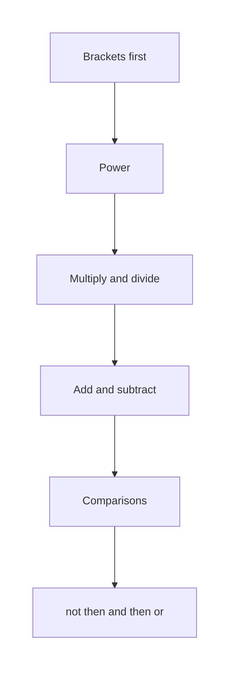
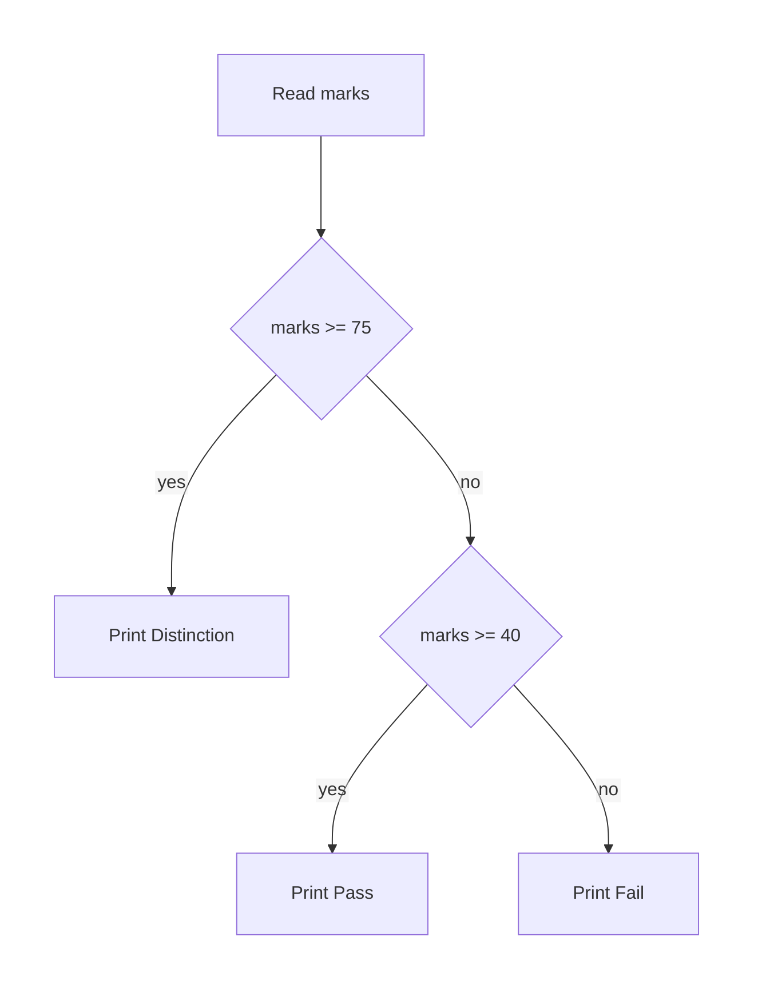

# Python — Operators & Conditional Statements

## What You Will Learn in This Lesson

You already know variables. A name can store a number, a piece of text, or `True` or `False`. This lesson uses those stored values.

A kirana counter adds prices, a college office checks whether marks reach the pass line, and a UPI screen checks whether the amount is above zero. Each of those jobs combines values, then chooses one path.

This lesson covers arithmetic, comparison, logical operators, and the short updates `+=`, `-=`, and `*=`. It also covers precedence, then `if`, `elif`, and `else` for one decision.

## A Program Still Runs from Top to Bottom

The interpreter still starts at the first line and moves downward. A condition does not change that order. It chooses which later lines run.

**Condition**

**Official Definition:** A condition is an expression that Python treats as true or false.

**In Simple Words:** A condition is a yes-or-no question written in code. The answer picks the path.

**Real-Life Example:** “Is the UPI amount greater than 0?” is a condition. If the answer is yes, the payment screen continues.

Before a program can ask that question, it needs a way to combine numbers. That is what arithmetic operators do.

## Arithmetic Operators

**Arithmetic operator**

**Official Definition:** An arithmetic operator is a symbol that combines numbers to produce a number.

**In Simple Words:** These symbols do the familiar school calculations: add, subtract, multiply, and divide.

**Real-Life Example:** Two samosas at a canteen cost `15 + 15`. The `+` is the arithmetic operator. The result is the amount to pay.

The arithmetic operators in this lesson are:

- `+` adds two numbers.
- `-` subtracts the second number from the first.
- `*` multiplies.
- `/` divides and keeps a decimal result.
- `//` divides and keeps only the whole-number part.
- `%` gives the remainder after whole-number division.
- `**` raises a number to a power.

`/` always gives a float in Python 3, even when the division comes out even. `10 / 2` is `5.0`, not `5`.

```python
# Store the price of one plate in rupees.
plate = 80  # Store this value.
# Store how many plates were ordered.
plates = 3  # Store this value.
# Add a fixed parcel charge.
parcel = 20  # Store this value.
# Multiply plates by the price of one plate.
food_total = plates * plate  # Store this value.
# Add the parcel charge to the food total.
bill = food_total + parcel  # Store this value.
# Show the bill.
print(bill)  # Show this value.
```

How the code works:

- `plates * plate` stores `240` in `food_total`.
- `food_total + parcel` stores `260` in `bill`.
- The screen shows `260`.
- The names must already store numbers. Text from `input()` needs `int()` or `float()` first, as in the previous session.

Subtraction uses the same pattern. A fee waiver reduces the bill.

## Division, Remainder, and Powers

**Floor division**

**Official Definition:** Floor division, written `//`, divides and drops the fractional part toward the lower whole number.

**In Simple Words:** `//` answers “how many full times does the second number fit into the first?”

**Real-Life Example:** A train coach has seats in rows of 6. `20 // 6` is `3`, so there are 3 full rows, and some seats are left over.

**Remainder**

**Official Definition:** The remainder operator `%` gives what is left after floor division.

**In Simple Words:** After you take out as many full groups as possible, `%` is the leftover.

**Real-Life Example:** `20 % 6` is `2`. Three full rows use 18 seats, and 2 seats remain in the coach.

**Power**

**Official Definition:** The operator `**` raises the first number to the power of the second.

**In Simple Words:** `2 ** 3` means 2 × 2 × 2, which is 8.

**Real-Life Example:** A lab doubles a sample count each hour. After 3 hours, the count is the starting count times `2 ** 3`.

```python
# Store the number of waiting passengers.
passengers = 20  # Store this value.
# Store how many seats are in one row.
seats_in_row = 6  # Store this value.
# How many full rows are needed at 6 seats each.
full_rows = passengers // seats_in_row  # Store this value.
# How many passengers do not fill a row.
leftover = passengers % seats_in_row  # Store this value.
# Ordinary division keeps the decimal result.
exact_rows = passengers / seats_in_row  # Store this value.
# Show the full rows.
print(full_rows)  # Show this value.
# Show the leftover passengers.
print(leftover)  # Show this value.
# Show the exact division.
print(exact_rows)  # Show this value.
# Show 2 to the power 3.
print(2 ** 3)  # Show this value.
```

How the code works:

- `20 // 6` stores `3` in `full_rows`.
- `20 % 6` stores `2` in `leftover`.
- `20 / 6` stores a float. The screen shows something very close to `3.3333333333333335`.
- Use `//` for whole groups and `/` when the fraction matters. The last line shows `8`, because `2 ** 3` is 2 × 2 × 2.

## Comparison Operators

**Comparison operator**

**Official Definition:** A comparison operator compares two values and produces `True` or `False`.

**In Simple Words:** The result is a bool. It is never the larger number itself. It is only yes or no.

**Real-Life Example:** A college pass mark is 40. The question “are the marks at least 40?” is a comparison. The answer is `True` or `False`.

The six comparison operators are:

- `==` means equal to.
- `!=` means not equal to.
- `>` means greater than.
- `<` means less than.
- `>=` means greater than or equal to.
- `<=` means less than or equal to.

`==` asks a question. A single `=` stores a value. Those two marks do different jobs.

```python
# Store the student's marks.
marks = 78  # Store this value.
# Store the pass mark.
pass_mark = 40  # Store this value.
# Ask whether the marks reach the pass mark.
passed = marks >= pass_mark  # Store this value.
# Ask whether the marks are exactly 100.
full_marks = marks == 100  # Store this value.
# Show the first answer.
print(passed)  # Show this value.
# Show the second answer.
print(full_marks)  # Show this value.
```

How the code works:

- `marks >= pass_mark` is `True`, because 78 is at least 40.
- `marks == 100` is `False`, because 78 and 100 are not the same.
- `passed` and `full_marks` store bool values.
- The screen shows `True` and then `False`.

Text can be compared too, for an exact match. `"Pune" == "pune"` is `False`, because capital and small letters differ.

Numbers and these yes-or-no answers can be joined with logical operators.

## Logical Operators

**Logical operator**

**Official Definition:** A logical operator combines bool values, or turns one bool into its opposite.

**In Simple Words:** `and` needs every part to be true. `or` needs at least one part to be true. `not` flips true and false.

**Real-Life Example:** A hostel room is allotted only when the fee is paid and the form is submitted. Both facts must be true. That is `and`.

```python
# Store whether the fee is paid.
fee_paid = True  # Store this value.
# Store whether the form was submitted.
form_submitted = False  # Store this value.
# Both facts must be true.
hostel_ready = fee_paid and form_submitted  # Store this value.
# At least one fact must be true.
some_step_done = fee_paid or form_submitted  # Store this value.
# Flip the form fact.
form_missing = not form_submitted  # Store this value.
# Show each result.
print(hostel_ready)  # Show this value.
# Show the or result.
print(some_step_done)  # Show this value.
# Show the flipped fact.
print(form_missing)  # Show this value.
```

How the code works:

- `True and False` stores `False` in `hostel_ready`.
- `True or False` stores `True` in `some_step_done`.
- `not False` stores `True` in `form_missing`.
- The screen shows `False`, then `True`, then `True`.

`and` and `or` can also join comparisons. The comparisons are calculated first, then `and` or `or` combines the bool results.

## Updating a Stored Number

**Assignment operator**

**Official Definition:** An assignment operator stores a new value in a name that already stores a value.

**In Simple Words:** `+=` means “take the stored number, add this, and store the result back in the same name.” `-=` subtracts. `*=` multiplies.

**Real-Life Example:** A UPI balance is `500`. A payment of `120` can be written as `balance -= 120`. The name `balance` then stores `380`.

The single `=` still means “this name stores this value.” `+=`, `-=`, and `*=` are shorter ways to update a number that is already stored.

```python
# Store the opening UPI balance.
balance = 500  # Store this value.
# Subtract a payment from the stored balance.
balance -= 120  # Update the stored number.
# Add a refund into the same name.
balance += 40  # Update the stored number.
# Show the balance after both updates.
print(balance)  # Show this value.
```

How the code works:

- After `balance -= 120`, the name stores `380`.
- After `balance += 40`, the name stores `420`.
- The screen shows `420`.
- The name must already store a number before `+=`, `-=`, or `*=` is used.

## Which Operator Runs First

**Precedence**

**Official Definition:** Precedence is the order Python uses when one line contains more than one operator.

**In Simple Words:** Python does not always move strictly left to right. Power runs before multiplication, and multiplication runs before addition. Comparisons run after the arithmetic, then `not`, then `and`, then `or`.

**Real-Life Example:** A bill of two items plus a tax on the sum should use brackets if you want the sum first. Brackets always win.

A useful order, from earlier to later, is:

- Brackets `( )`
- Power `**`
- `*`, `/`, `//`, `%`
- `+` and `-`
- Comparisons such as `>=` and `==`
- `not`
- `and`
- `or`

```python
# Without brackets, multiplication happens before addition.
without_brackets = 10 + 2 * 5  # Store this value.
# Brackets force the addition to happen first.
with_brackets = (10 + 2) * 5  # Store this value.
# Show both results.
print(without_brackets)  # Show this value.
# Show the bracketed result.
print(with_brackets)  # Show this value.
```

How the code works:

- `2 * 5` runs first, so `without_brackets` stores `20`.
- `(10 + 2)` runs first, so `with_brackets` stores `60`.
- The screen shows `20` and then `60`.
- When a line is hard to read, add brackets even if the order would already be correct.



Read this picture from top to bottom: brackets run first, and `or` runs last. Arithmetic and comparisons prepare a yes-or-no answer. `if` is how the program uses that answer.

## Choosing a Path with if

**if**

**Official Definition:** `if` runs an indented block only when its condition is true.

**In Simple Words:** Write the question, end that line with a colon, then indent the lines that should run only for a yes.

**Real-Life Example:** If the IRCTC status is confirmed, show the coach and berth. If it is not confirmed, those lines are skipped.

The lines under `if` are indented by four spaces in these notes. Python uses that indent to know which lines belong to the decision.

```python
# Store the PNR status as text.
status = "confirmed"  # Store this value.
# Run the next line only when the status matches.
if status == "confirmed":  # Take this path when the condition is true.
    # Show the berth details for a confirmed ticket.
    print("Coach S4, Berth 21")  # Show this value.
# This line is not indented, so it always runs.
print("Check complete")  # Show this value.
```

How the code works:

- The condition `status == "confirmed"` is `True`.
- The indented `print` runs, so the screen shows the berth line.
- `print("Check complete")` is not indented, so it runs either way.
- If `status` stored `"waiting"`, the berth line would be skipped and only `Check complete` would show.

A decision with two paths uses `else`.

## A Second Path with else

**else**

**Official Definition:** `else` runs its indented block when the paired `if` condition is false.

**In Simple Words:** `if` is the yes path. `else` is the no path. Only one of those two blocks runs.

**Real-Life Example:** If the kirana item is in stock, print the price. Otherwise print “out of stock.”

```python
# Store the packets left on the shelf.
packets = 0  # Store this value.
# Choose a message from the stock count.
if packets > 0:  # Take this path when the condition is true.
    # This path runs only when at least one packet is left.
    print("In stock")  # Show this value.
else:  # Take this path when the condition was false.
    # This path runs when the condition above is false.
    print("Out of stock")  # Show this value.
```

How the code works:

- `packets > 0` is `False`, because `0` is not greater than `0`.
- The `if` block is skipped.
- The `else` block runs, so the screen shows `Out of stock`.
- Change `packets` to `3` and the screen shows `In stock` instead.

When there are three or more labelled paths, use `elif` between `if` and `else`.

## More Than Two Paths with elif

**elif**

**Official Definition:** `elif` checks another condition only when every earlier condition in the same chain was false.

**In Simple Words:** Python tries `if` first. If that is false, it tries the first `elif`. It stops at the first true condition. `else` catches every remaining case.

**Real-Life Example:** A result slip can say Distinction, Pass, or Fail. Those are three paths. The first matching path is the one that prints.



The first question is the `if`. The second question is the `elif`, asked only after a no. Fail is the `else` path, and only one message is printed.

```python
# Store the marks out of 100.
marks = 63  # Store this value.
# First path: distinction.
if marks >= 75:  # Take this path when the condition is true.
    # Show distinction when marks are high enough.
    print("Distinction")  # Show this value.
elif marks >= 40:  # Try this path when earlier conditions were false.
    # This runs only when the first condition was false and marks still pass.
    print("Pass")  # Show this value.
else:  # Take this path when the condition was false.
    # This runs when both conditions above were false.
    print("Fail")  # Show this value.
```

How the code works:

- `marks >= 75` is `False` for `63`.
- `marks >= 40` is `True`, so the `elif` block runs.
- The `else` block does not run.
- The screen shows `Pass`.
- This chain is one decision. It does not place a second `if` inside the first block.

Keep the paths in a careful order. A pass check written before a distinction check would catch high marks too early and never reach distinction.

## Activity 1: Canteen Bill and a Pass Check

Do this in a file named `canteen.py`.

- Store `tea = 15` and `samosa = 20`.
- Store a bill of 2 teas and 1 samosa.
- Store `marks = 38` and print `Pass` when marks are at least 40, otherwise print `Fail`.
- Print the bill as well.

**Check answer:**

```python
# Store the tea price.
tea = 15  # Store this value.
# Store the samosa price.
samosa = 20  # Store this value.
# Two teas plus one samosa.
bill = tea * 2 + samosa  # Store this value.
# Store the marks.
marks = 38  # Store this value.
# Show the bill.
print(bill)  # Show this value.
# Choose Pass or Fail from the pass mark.
if marks >= 40:  # Take this path when the condition is true.
    # This path is the pass path.
    print("Pass")  # Show this value.
else:  # Take this path when the condition was false.
    # This path is the fail path.
    print("Fail")  # Show this value.
```

How the code works:

- `tea * 2 + samosa` stores `50`, because multiplication runs before addition.
- `marks >= 40` is `False`.
- The screen shows `50` and then `Fail`.

## Activity 2: Three Result Paths

Do this in a file named `result.py`. Use one `if`, one `elif`, and one `else`.

- If marks are at least 75, print `Distinction`.
- Otherwise, if marks are at least 40, print `Pass`.
- Otherwise print `Fail`.
- Try it with `marks = 80`, and be ready to say what changes if marks are `20`.

**Check answer:**

```python
# Store a high mark for this run.
marks = 80  # Store this value.
# Distinction is checked first.
if marks >= 75:  # Take this path when the condition is true.
    # Show distinction.
    print("Distinction")  # Show this value.
elif marks >= 40:  # Try this path when earlier conditions were false.
    # Show pass only when distinction was false.
    print("Pass")  # Show this value.
else:  # Take this path when the condition was false.
    # Show fail when both checks were false.
    print("Fail")  # Show this value.
```

How the code works:

- For `80`, the `if` condition is `True`, so the screen shows `Distinction`.
- The `elif` and `else` blocks do not run.
- If `marks` is `20`, both comparisons are false, so the screen shows `Fail`.

## Key Takeaways

- Arithmetic operators combine numbers. `/` keeps a decimal, `//` keeps the whole-number part, and `%` keeps the remainder.
- Comparison operators produce `True` or `False`. `==` compares, and `=` stores.
- `and`, `or`, and `not` combine or flip those bool answers. `+=`, `-=`, and `*=` update a stored number.
- Precedence fixes the order on a mixed line. Brackets make the order obvious.
- `if`, `elif`, and `else` choose one path in a single decision. The interpreter then continues with the next unindented line.

The next session will open how a program repeats a block of lines, and how a simple check can sit inside that repetition.

## Important Commands, Libraries, and Terminologies

| Term | Meaning in this lesson |
| --- | --- |
| Condition | A yes-or-no expression |
| `+` `-` `*` | Add, subtract, and multiply |
| `/` | Divide and keep a float result |
| `//` | Divide and keep the whole-number part |
| `%` | Remainder after floor division |
| `**` | Power |
| `==` `!=` | Equal to, and not equal to |
| `>` `<` `>=` `<=` | Greater, less, and the two “or equal” comparisons |
| `and` | True only when both parts are true |
| `or` | True when at least one part is true |
| `not` | Flips `True` and `False` |
| `+=` `-=` `*=` | Update a stored number by adding, subtracting, or multiplying |
| Precedence | The order Python uses when one line has several operators |
| `if` | Runs its block when the condition is true |
| `elif` | Tries another condition when earlier ones were false |
| `else` | Runs when every condition in the chain was false |
