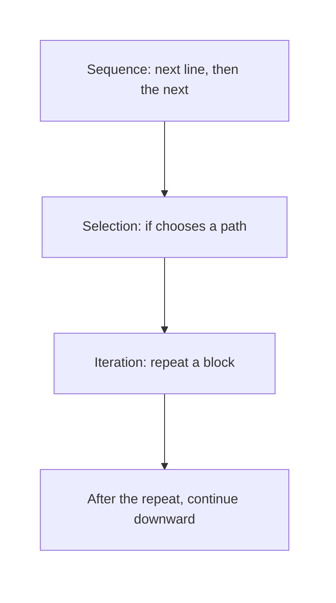
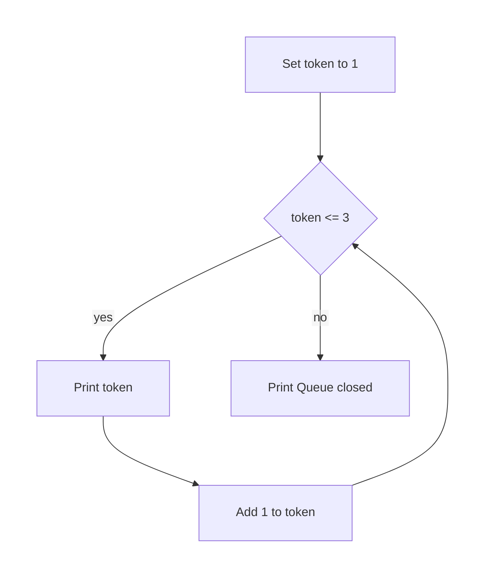
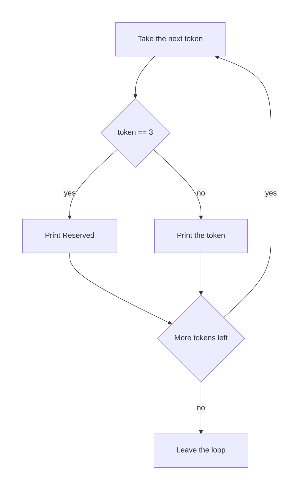

# Python — Control Flow: Conditionals & Loops

## What You Will Learn in This Lesson

You already know that a condition can choose one path, such as printing `Pass` or `Fail`. Many real jobs are not a single choice. They are the same small step done again and again.

A kirana owner counts parcels one by one, an IRCTC window calls token numbers until the queue ends, and a college office checks every roll number on a mark sheet. The new idea in this lesson is repetition.

This lesson names three control-flow ideas in plain words: sequence, selection, and iteration. It then shows `while` loops, `for` loops, and `range()`. A simple `if` inside a loop will skip a value that fails a check, using `if` and `else` only.

## Three Ways a Program Moves

**Control flow**

**Official Definition:** Control flow is the order in which the program’s lines run.

**In Simple Words:** It is the path the interpreter takes through the file. That path can be a straight line, a choice, or a repeat.

**Real-Life Example:** At a college help desk, the clerk reads the form from top to bottom, chooses pass or fail, and then repeats the same check for the next student.

Three ideas cover the movement you need now:

- **Sequence** means the lines run one after another, from top to bottom.
- **Selection** means a condition chooses a path. You already do that with `if`.
- **Iteration** means a block of lines runs again until the repetition is finished.



How to read the diagram:

- Sequence is the ordinary downward run.
- Selection is the `if` you used in the previous session.
- Iteration is the new piece. After the last repeat, the program continues below the loop.

A straight run is still the base. The next section shows sequence on its own, before any repeat.

## Sequence

**Sequence**

**Official Definition:** Sequence is control flow in which each line runs once, in the order written, and then the run moves on.

**In Simple Words:** Line 1, then line 2, then line 3. Nothing jumps back.

**Real-Life Example:** A UPI screen shows the payee name, then the amount, then the word Paid. Those three shows happen once each, in that order.

```python
# Show the payee first.
print("Payee: Sharma Kirana")  # Show this value.
# Show the amount second.
print("Amount: 240")  # Show this value.
# Show the closing word third.
print("Paid")  # Show this value.
```

How the code works:

- The interpreter starts at the first `print`.
- It then runs the second `print`, then the third.
- The screen shows three lines, in the same order as the file.
- Nothing in this file sends the interpreter back to an earlier line.

Selection sits on top of that straight order. A four-line reminder is enough, because the new work is repetition.

## Selection, in One Short Recall

**Selection**

**Official Definition:** Selection is control flow that runs one indented path when a condition is true, and a different path when it is false.

**In Simple Words:** `if` asks a yes-or-no question. The true path runs, or the `else` path runs. Then the program continues underneath.

**Real-Life Example:** If attendance is at least 75, print `Allowed`. Otherwise print `Short attendance`.

```python
# Store attendance as a percent.
attendance = 80  # Store this value.
# Choose one message.
if attendance >= 75:  # Take this path when the condition is true.
    # This path runs when attendance is high enough.
    print("Allowed")  # Show this value.
else:  # Take this path when the condition was false.
    # This path runs when attendance is too low.
    print("Short attendance")  # Show this value.
```

How the code works:

- `attendance >= 75` is true for `80`.
- The indented line under `if` prints `Allowed`.
- The `else` block does not run.
- This is one decision, not a repeat. The next sections repeat a block.

## Iteration and the while Loop

**Iteration**

**Official Definition:** Iteration is control flow that repeats a block of lines.

**In Simple Words:** The same lines run, then run again, until a stop rule is met.

**Real-Life Example:** A token display calls 1, then 2, then 3, using the same sentence each time, until the last token is called.

**while loop**

**Official Definition:** A `while` loop repeats its indented block as long as its condition stays true.

**In Simple Words:** Check the condition. If it is true, run the block, then check again. When the condition becomes false, leave the loop and continue below it.

**Real-Life Example:** While the token number is still at most 3, call that token, then move to the next number.

The condition must eventually become false. Inside the block, something has to change the value that the condition checks. If that value never changes, the loop never ends.

```python
# Start the token at 1.
token = 1  # Store this value.
# Repeat while the token is still in the queue of 3.
while token <= 3:  # Repeat while this condition holds.
    # Call the current token.
    print(token)  # Show this value.
    # Move to the next token. This update lets the loop end.
    token += 1  # Update the stored number.
# This line runs once, after the loop stops.
print("Queue closed")  # Show this value.
```

How the code works:

- `token` starts at `1`. `1 <= 3` is true, so the block prints `1`, then `token` becomes `2`.
- The check runs again. `2` prints, then `token` becomes `3`. `3` prints, then `token` becomes `4`.
- `4 <= 3` is false, so the loop stops.
- The screen shows `1`, `2`, `3`, and then `Queue closed`.



Read the diagram as a dry run. The yes arrow goes back to the question. The no arrow leaves the loop. Forgetting `token += 1` would keep the yes arrow forever, because `token` would stay `1`.

A second `while` can count downward, as long as the update moves toward the stop.

```python
# Store copies still to pack.
copies = 3  # Store this value.
# Repeat while at least one copy remains.
while copies > 0:  # Repeat while this condition holds.
    # Show how many copies are still unpacked.
    print(copies)  # Show this value.
    # Pack one copy.
    copies -= 1  # Update the stored number.
# Show that packing is finished.
print("Parcel ready")  # Show this value.
```

How the code works:

- The block prints `3`, then `2`, then `1`.
- After `1` prints, `copies` becomes `0`.
- `0 > 0` is false, so the loop stops.
- The screen then shows `Parcel ready`.

`while` is a good fit when you do not know the count in advance, or when you are walking a number until it crosses a limit. When you do know the count, a `for` loop states that count more directly.

## The for Loop

**for loop**

**Official Definition:** A `for` loop repeats its block once for each value in a sequence of values.

**In Simple Words:** You name a variable. Each time around, that name stores the next value, and the block runs.

**Real-Life Example:** A clerk has token values 1, 2, and 3. For each value, the display calls that token. The clerk does not write a separate `if` for each token.

In this lesson the sequence of values comes from `range()`, which is the next tool. The loop variable is just a name. It stores one value at a time.

```python
# Call each token from 1 up to, but not including, 4.
for token in range(1, 4):  # Repeat for each value.
    # Show the token stored on this pass.
    print(token)  # Show this value.
# This line runs after the last token.
print("Counter free")  # Show this value.
```

How the code works:

- `range(1, 4)` produces the values `1`, `2`, and `3`. It stops before `4`.
- On the first pass, `token` stores `1` and the block prints it.
- The same block then runs for `2`, then for `3`.
- The screen shows `1`, `2`, `3`, and then `Counter free`.

The name `token` is not special. Any legal variable name works. `for seat in range(1, 4)` would print the same three numbers, stored under the name `seat`.

A `for` loop still follows sequence inside the block. If the block has two prints, both run for one value before the next value starts.

```python
# Repeat for roll numbers 1 and 2.
for roll in range(1, 3):  # Repeat for each value.
    # Show a label and the current roll.
    print("Roll")  # Show this value.
    # Show the number stored in roll.
    print(roll)  # Show this value.
```

How the code works:

- For `roll` equal to `1`, both prints run, so the screen shows `Roll` and then `1`.
- The loop then stores `2` in `roll` and both prints run again.
- The screen is `Roll`, `1`, `Roll`, `2`.
- The lines inside the block stay in order on every pass.

`range()` is doing the counting. Its rules are worth a section of their own.

## range()

**range()**

**Official Definition:** `range()` builds a sequence of integers that a `for` loop can walk.

**In Simple Words:** `range(stop)` starts at `0` and stops before `stop`. `range(start, stop)` starts at `start` and stops before `stop`. `range(start, stop, step)` jumps by `step`.

**Real-Life Example:** Platform numbers 1, 2, and 3 are `range(1, 4)`. The last number you want is 3, so the stop value is 4, one past the end.

Three patterns are enough:

- `range(3)` gives `0`, `1`, `2`.
- `range(1, 4)` gives `1`, `2`, `3`.
- `range(2, 9, 2)` gives `2`, `4`, `6`, `8`.

The stop value is never included. That is the usual surprise. To include 5, stop at 6.

```python
# Show what range(3) walks: 0, 1, 2.
for number in range(3):  # Repeat for each value.
    # Print the current number.
    print(number)  # Show this value.
```

How the code works:

- There is no start written, so the values begin at `0`.
- The stop value is `3`, so `3` itself is not printed.
- The screen shows `0`, then `1`, then `2`.

```python
# Even platform numbers from 2 up to but not including 9.
for platform in range(2, 9, 2):  # Repeat for each value.
    # Show this platform.
    print(platform)  # Show this value.
```

How the code works:

- The start is `2`, the stop is `9`, and the step is `2`.
- The values are `2`, `4`, `6`, and `8`.
- `9` is not included, and the next even number would be `10`, which is past the stop.
- The screen shows those four platforms, one per line.

A step of `1` is the normal step. You can leave it out. `range(1, 4)` means the same as `range(1, 4, 1)`.

Use `for` with `range()` when you know how many times to repeat, or which integers to visit. Use `while` when the repeat depends on a condition you update yourself.

## A Check Inside the Loop

A loop repeats. Selection still chooses a path, and it can do that on each pass. This lesson keeps that check to one `if` and an `else`. The loop itself is not cut short by any other tool.

**Pattern:** if the current value fails a check, print a skip message. Otherwise print the value.

**Real-Life Example:** Token numbers 1, 2, 3, and 4 are called, but token 3 is a reserved counter. The display should not announce 3 as a normal token. It should say that 3 is reserved, then continue with 4.

```python
# Visit tokens 1, 2, 3, and 4.
for token in range(1, 5):  # Repeat for each value.
    # Token 3 fails the normal-call check.
    if token == 3:  # Take this path when the condition is true.
        # Say why this value is not announced as a normal token.
        print("Reserved")  # Show this value.
    else:  # Take this path when the condition was false.
        # Announce every other token.
        print(token)  # Show this value.
```

How the code works:

- `token` takes `1`, then `2`, then `3`, then `4`.
- For `1` and `2`, the `if` condition is false, so `else` prints the number.
- For `3`, the `if` condition is true, so the block prints `Reserved` and does not print `3`.
- For `4`, `else` prints `4`.
- The loop still visits `4`. The `if` only changes what is printed on the failing pass.

The same pattern works in a `while` loop. The update of the counter stays outside the `if`, so every pass still moves forward.

```python
# Start at token 1.
token = 1  # Store this value.
# Visit tokens while the number is at most 4.
while token <= 4:  # Repeat while this condition holds.
    # Check the reserved token.
    if token == 3:  # Take this path when the condition is true.
        # Print the skip message.
        print("Reserved")  # Show this value.
    else:  # Take this path when the condition was false.
        # Print a normal token.
        print(token)  # Show this value.
    # Move forward on every pass, including the reserved one.
    token += 1  # Update the stored number.
```

How the code works:

- The screen shows `1`, `2`, `Reserved`, and `4`.
- `token += 1` is indented under `while`, not under `else`, so it runs for token 3 as well.
- If the update sat only under `else`, token 3 would never move on, and the loop would not end.
- The check decides the message. The `while` line decides whether another pass happens.



Both answers to the check lead back to the question “more tokens left?”. The failing value is not dropped from the visit. Only the printed message changes.

## A Dry Run of One Loop

Read this fee-counter loop on paper before you run it. Write the value of `student` and what is printed on each pass.

```python
# Start with the first student in a group of 4.
student = 1  # Store this value.
# Repeat for students 1 through 4.
while student <= 4:  # Repeat while this condition holds.
    # Student 2 has no fee slip.
    if student == 2:  # Take this path when the condition is true.
        # Record the missing slip.
        print("No slip")  # Show this value.
    else:  # Take this path when the condition was false.
        # Record a normal call.
        print(student)  # Show this value.
    # Go to the next student.
    student += 1  # Update the stored number.
```

How the code works:

- Pass 1: `student` is `1`, so the screen shows `1`, then `student` becomes `2`.
- Pass 2: the check matches, so the screen shows `No slip`, then `student` becomes `3`.
- Pass 3 prints `3`. Pass 4 prints `4`. Then `student` becomes `5` and `5 <= 4` is false.
- The full screen is `1`, `No slip`, `3`, `4`.

## A Common Doubt

**Doubt:** `range(1, 5)` printed up to 4. Where is 5?

The stop value is the first number that is not included. To reach 5, write `range(1, 6)`.

**Doubt:** I wrote `range(5)` and the first number was 0.

A single number inside `range()` is the stop, and the start is 0. Write `range(1, 5)` when the first value you want is 1.

**Doubt:** My `while` loop never stops.

Check that a line inside the loop changes the value used in the condition, and that the change moves toward the stop. `token += 1` when the condition is `token <= 3` does that. Leaving the update out does not.

## Activity 1: Call Five Tokens

Do this in a file named `tokens.py`.

- Use a `for` loop and `range()` to print the tokens `1` through `5`.
- After the loop, print `Window shut`.

**Check answer:**

```python
# Tokens 1 through 5. The stop value is one past 5.
for token in range(1, 6):  # Repeat for each value.
    # Call this token.
    print(token)  # Show this value.
# This line is outside the loop.
print("Window shut")  # Show this value.
```

How the code works:

- `range(1, 6)` produces `1`, `2`, `3`, `4`, and `5`.
- Each value is printed on its own line.
- `Window shut` prints once, after the loop.

## Activity 2: Skip One Counter

Do this in a file named `skip_counter.py`.

- Visit the numbers `1` through `4` with either `for` or `while`.
- When the number is `4`, print `Closed`.
- For every other number, print the number itself.
- Do not stop the loop early. Number 4 is still visited. Only the message changes.

**Check answer:**

```python
# Visit 1, 2, 3, and 4.
for counter in range(1, 5):  # Repeat for each value.
    # Counter 4 fails the open-counter check.
    if counter == 4:  # Take this path when the condition is true.
        # Print the closed message instead of the number.
        print("Closed")  # Show this value.
    else:  # Take this path when the condition was false.
        # Print an open counter number.
        print(counter)  # Show this value.
```

How the code works:

- The screen shows `1`, `2`, `3`, and `Closed`.
- The loop still has a pass where `counter` stores `4`.
- `else` handles every number that is not `4`.

## Even Tokens, with a Check

This program visits even tokens only, and it still uses `if` and `else` for one special value. The step in `range()` chooses which numbers appear. The `if` chooses the message.

```python
# Even tokens from 2 up to but not including 8.
for token in range(2, 8, 2):  # Repeat for each value.
    # Token 4 is a staff counter.
    if token == 4:  # Take this path when the condition is true.
        # Print a staff note instead of the number.
        print("Staff")  # Show this value.
    else:  # Take this path when the condition was false.
        # Print a public token.
        print(token)  # Show this value.
```

How the code works:

- `range(2, 8, 2)` produces `2`, `4`, and `6`.
- `2` and `6` take the `else` path and print as numbers.
- `4` prints `Staff`.
- The screen is `2`, `Staff`, `6`. The loop does not visit `1`, `3`, `5`, or `7`, because the step skips them.

## Key Takeaways

- Sequence runs lines once, from top to bottom. Selection uses `if` to choose a path. Iteration repeats a block.
- A `while` loop repeats while its condition is true. A line inside the loop must change that condition toward the stop.
- A `for` loop walks values from `range()`. The stop value is not included.
- An `if` inside a loop can print a different message for a value that fails a check. The loop still visits that value when the update sits outside the `if`.
- After the last pass, the interpreter continues with the first line below the loop.

The next session will open how a loop can leave early or skip straight to the next pass, and how one loop can sit inside another.

## Important Commands, Libraries, and Terminologies

| Term | Meaning in this lesson |
| --- | --- |
| Control flow | The order in which lines run |
| Sequence | Each line runs once, from top to bottom |
| Selection | `if` chooses a path |
| Iteration | A block of lines repeats |
| `while` | Repeats while a condition stays true |
| `for` | Repeats once for each value in a sequence |
| Loop variable | The name that stores the current value of a `for` loop |
| `range(stop)` | Integers from `0` up to but not including `stop` |
| `range(start, stop)` | Integers from `start` up to but not including `stop` |
| `range(start, stop, step)` | The same idea, jumping by `step` |
| Update | A line such as `token += 1` that moves a `while` loop toward its stop |
| Check inside a loop | An `if` / `else` that changes what one pass prints |
