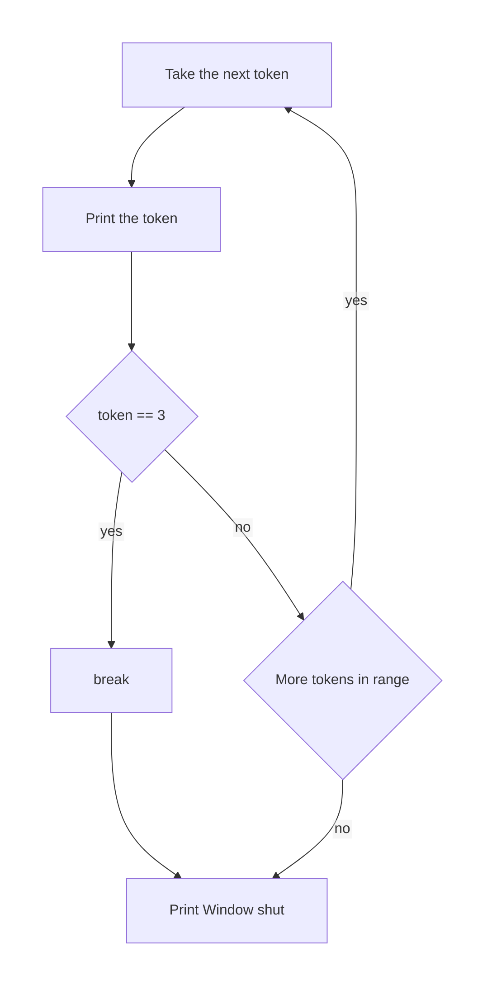
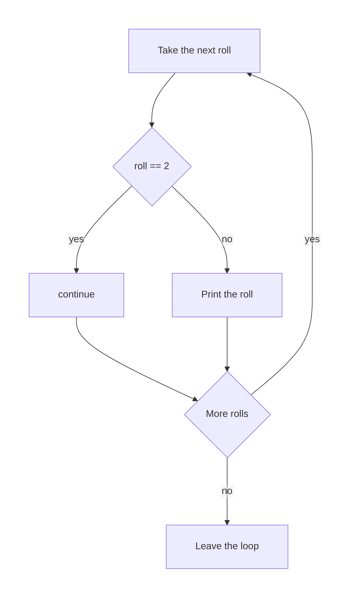
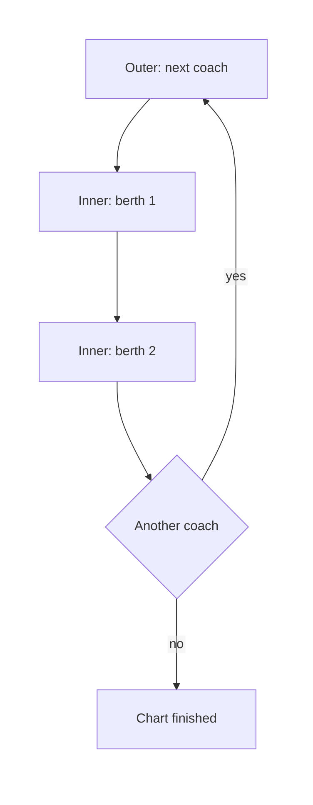

# Python — Break, Continue & Nested Loops

## What You Will Learn in This Lesson

A loop repeats a block, and you already use `while` and `for` for that repetition. Sometimes the repeat should stop before every planned value is visited. Sometimes one pass should skip its remaining lines and go straight to the next value.

A token window may close as soon as token 40 is called, a marks check may ignore a blank slip and still read the next roll number, and a coach chart may list every berth inside every coach. Those three jobs need `break`, `continue`, and a loop inside a loop.

This lesson covers when `break` is needed, when `continue` is needed, nested `for` loops, and a short `for` inside a `while`. You will dry-run the inner loop against the outer loop.

## Leave a Loop Early with break

**break**

**Official Definition:** `break` stops the loop that immediately contains it. The interpreter then continues with the first line after that loop.

**In Simple Words:** The rest of the planned passes do not run. The current loop is finished at once.

**Real-Life Example:** A help desk calls tokens 1, 2, 3, and so on, but the clerk stops the moment token 3 is called, because that was the last open token. Later numbers are not called.

`break` belongs inside the loop, almost always under an `if`. The condition says when the early stop is justified. Without a condition, the loop would stop on the first pass every time.

```python
# Visit tokens 1 through 5, but be ready to stop early.
for token in range(1, 6):  # Repeat for each value.
    # Call the current token.
    print(token)  # Show this value.
    # Stop the loop once token 3 has been called.
    if token == 3:  # Take this path when the condition is true.
        # Leave the for loop now.
        break  # Leave this loop now.
# This line runs after the loop, whether break ran or not.
print("Window shut")  # Show this value.
```

How the code works:

- The loop prints `1`, then `2`, then `3`.
- When `token` is `3`, `break` ends the loop before `4` and `5` are visited.
- The screen shows `1`, `2`, `3`, and then `Window shut`.
- `Window shut` is outside the loop, so `break` does not skip it.



Read the yes arrow from the check as an exit. The loop does not go back for another token after `break`. The line under the loop still runs.

Use `break` when the remaining values cannot change the result you already have. A search that has already found the PNR does not need to keep scanning. A queue that has reached its last open token does not need to call further numbers.

```python
# The desk copy that holds the matching PNR.
found_at = 2  # Store this value.
# Start at the first desk copy.
code_number = 1  # Store this value.
# Look through three desk copies.
while code_number <= 3:  # Repeat while this condition holds.
    # Build a stand-in code from the counter. Only number 2 matches the story.
    if code_number == found_at:  # Take this path when the condition is true.
        # Report the find.
        print("Found")  # Show this value.
        # Stop looking. Later copies are not needed.
        break  # Leave this loop now.
    # Try the next copy.
    code_number += 1  # Update the stored number.
# Show that the search has ended.
print("Search over")  # Show this value.
```

How the code works:

- On pass 1, `code_number` is `1`, so the `if` is false and the counter becomes `2`.
- On pass 2, the `if` is true, `Found` prints, and `break` leaves the `while`.
- `code_number` is not increased after the find, and pass 3 never starts.
- The screen shows `Found` and then `Search over`.

The update `code_number += 1` sits after the `if`. On the matching pass, `break` happens first, so that update does not run. That is safe here because the loop is ending anyway.

## Skip to the Next Pass with continue

**continue**

**Official Definition:** `continue` skips the rest of the current pass and starts the next pass of the same loop.

**In Simple Words:** The loop does not end. The lines under `continue` in this pass are ignored. The next value, if there is one, still gets a turn.

**Real-Life Example:** A marks clerk skips a roll number that has no script, writes nothing for it, and still opens the next script. The checking session is not over.

`continue` is also placed under an `if`. The condition names the pass that should be incomplete. The other passes run their full block.

```python
# Visit roll numbers 1 through 4.
for roll in range(1, 5):  # Repeat for each value.
    # Roll 2 has no script.
    if roll == 2:  # Take this path when the condition is true.
        # Skip the print below and take the next roll.
        continue  # Skip the rest of this pass.
    # This line does not run for roll 2.
    print(roll)  # Show this value.
```

How the code works:

- Rolls `1`, `3`, and `4` fail the `if`, so they print.
- Roll `2` hits `continue`, so `print(roll)` does not run for `2`.
- The loop still goes on to `3` and `4`. It does not finish early.
- The screen shows `1`, `3`, and `4`.



The yes path jumps to the “more rolls” question. It does not print. The no path prints, then asks the same question. Both paths can start another pass.

In a `while` loop, put the update before `continue` if the update is what moves the condition forward. Otherwise the skipped pass can repeat forever.

```python
# Start at roll 1.
roll = 1  # Store this value.
# Visit rolls 1 through 4.
while roll <= 4:  # Repeat while this condition holds.
    # Keep a copy of this roll, then move the counter first.
    current = roll  # Store this value.
    # Move forward before any continue, so the loop can end.
    roll += 1  # Update the stored number.
    # Skip the missing script.
    if current == 2:  # Take this path when the condition is true.
        # Go to the next while check.
        continue  # Skip the rest of this pass.
    # Print a roll that has a script.
    print(current)  # Show this value.
```

How the code works:

- `roll` increases before `continue`, so the next check sees a larger number.
- `current` holds the roll being judged on this pass.
- The screen shows `1`, `3`, and `4`.
- If `roll += 1` were placed under the print, the pass for `2` would `continue` before the update, and `roll` would stay `2` forever.

## When break Is Needed, and When continue Is Needed

The two tools answer different questions.

- Use **break** when the loop’s job is already finished. Later passes would be wasted or wrong. Finding a PNR, or stopping at the last open token, is this case.
- Use **continue** when this pass is not useful, but later passes still are. A missing script is this case. The session continues.
- Use an ordinary `if` / `else`, with neither tool, when every pass should still run its main lines and you only want a different message. That pattern was the previous session.

A short comparison on the same tokens makes the difference visible.

```python
# Stop at token 3. Tokens 4 and 5 are never visited.
for token in range(1, 6):  # Repeat for each value.
    # Leave once token 3 is reached, before printing it.
    if token == 3:  # Take this path when the condition is true.
        # End the loop.
        break  # Leave this loop now.
    # Print only tokens that come before the stop.
    print(token)  # Show this value.
```

How the code works:

- Tokens `1` and `2` print.
- Token `3` triggers `break` before the print, so `3` is not printed either.
- The screen shows `1` and `2` only.
- This is an early end, not a skip of one value in the middle.

```python
# Skip token 3, but keep going.
for token in range(1, 6):  # Repeat for each value.
    # Token 3 is not printed.
    if token == 3:  # Take this path when the condition is true.
        # Jump to the next token.
        continue  # Skip the rest of this pass.
    # Print every other token.
    print(token)  # Show this value.
```

How the code works:

- The screen shows `1`, `2`, `4`, and `5`.
- Token `3` is visited, then skipped.
- The loop does not end at token `3`.
- Choose `continue` for this job. Choose `break` only when `4` and `5` should not run.

## A Loop Inside a Loop

**Nested loop**

**Official Definition:** A nested loop is a loop written inside the block of another loop.

**In Simple Words:** The outer loop runs a pass. During that one pass, the inner loop runs all of its passes. Then the outer loop takes its next pass, and the inner loop starts again from the beginning.

**Real-Life Example:** An IRCTC coach chart has coaches S1 and S2. Each coach has berths 1 and 2. The clerk finishes both berths of S1 before starting S2.

The outer loop chooses the coach. The inner loop chooses the berth. The inner loop must sit indented under the outer loop.

```python
# Two coaches, numbered 1 and 2.
for coach in range(1, 3):  # Repeat for each value.
    # Two berths in the current coach.
    for berth in range(1, 3):  # Repeat for each value.
        # Show the coach and the berth together.
        print(coach, berth)  # Show this value.
```

How the code works:

- Outer pass `coach = 1`: the inner loop prints `1 1` and then `1 2`.
- Outer pass `coach = 2`: the inner loop starts again and prints `2 1` and then `2 2`.
- The screen has four lines. The inner loop ran twice, fully, once per coach.
- `print` receives two values and shows them on one line with a space between them.



One outer pass contains the whole inner chain. The inner chain does not remember the previous coach. It starts at berth 1 again.

## Dry Run: Inner Loop and Outer Loop

Write a small table before you trust a nested loop. Columns: coach, berth, what prints.

For the program above the table is:

- Coach 1, berth 1, print `1 1`.
- Coach 1, berth 2, print `1 2`.
- Coach 2, berth 1, print `2 1`.
- Coach 2, berth 2, print `2 2`.

The outer value stays fixed while the inner value changes. Only when the inner loop finishes does the outer value move.

A `break` in the inner loop stops only the inner loop. The outer loop continues with its next pass.

```python
# Coaches 1 and 2.
for coach in range(1, 3):  # Repeat for each value.
    # Berths 1, 2, and 3, with an early stop inside the coach.
    for berth in range(1, 4):  # Repeat for each value.
        # Stop this coach after berth 2.
        if berth == 2:  # Take this path when the condition is true.
            # Leave the inner loop only.
            break  # Leave this loop now.
        # Print berths that come before the inner stop.
        print(coach, berth)  # Show this value.
```

How the code works:

- For coach 1, berth 1 prints `1 1`. Berth 2 hits `break`, so berth 3 of coach 1 never runs.
- The outer loop then sets coach to 2. The inner loop starts again at berth 1.
- Coach 2 prints `2 1` and then breaks at berth 2.
- The screen shows `1 1` and `2 1`. The outer loop was not broken.

If the `break` were indented under the outer loop but not inside the inner loop, it would end the coaches as well. Indentation decides which loop `break` belongs to. Here it belongs to the inner `for`, because it is indented inside that `for`.

## A for Loop Inside a while Loop

The outer loop does not have to be a `for`. A `while` can hold a `for`. The `while` must still update its own condition, or it will not end.

**Real-Life Example:** A shop packs two parcels. Inside each parcel it checks item slips 1 and 2. The parcel counter is the `while`. The slips are the `for`.

```python
# Start with parcel 1.
parcel = 1  # Store this value.
# Pack two parcels.
while parcel <= 2:  # Repeat while this condition holds.
    # Two item slips inside this parcel.
    for slip in range(1, 3):  # Repeat for each value.
        # Show the parcel and the slip.
        print(parcel, slip)  # Show this value.
    # This parcel is finished. Move to the next parcel.
    parcel += 1  # Update the stored number.
```

How the code works:

- While `parcel` is `1`, the inner loop prints `1 1` and `1 2`.
- `parcel` becomes `2`. The inner loop runs from slip 1 again and prints `2 1` and `2 2`.
- `parcel` becomes `3`, the `while` condition fails, and the program ends.
- The screen is four lines. The inner `for` restarted for the second parcel.

`parcel += 1` is indented under the `while`, not under the `for`. It runs once per parcel, after both slips. Putting it inside the `for` would increase the parcel on every slip and would end the outer loop too soon.

## A Common Doubt

**Doubt:** I used `continue` and the `while` loop never stopped.

In a `while` loop, `continue` jumps back to the condition. Any update written below `continue` is skipped on that pass. Move the update above `continue`, or the same value can be judged forever.

**Doubt:** My inner loop printed only one coach.

Check the indent. The inner `for` must be inside the outer loop’s block. If it is typed after the outer loop, at the same indent as the outer `for`, it runs only once, after the outer loop has finished.

## Activity 1: Stop at a Full Mark

Do this in a file named `stop_at_full.py`.

- Visit marks-style numbers `1` through `6` with `for` and `range`.
- Print each number until you print `4`.
- After `4` has been printed, leave the loop with `break`.
- After the loop, print `Done`.

**Check answer:**

```python
# Numbers 1 through 6, with an early stop.
for number in range(1, 7):  # Repeat for each value.
    # Print this number first.
    print(number)  # Show this value.
    # Stop after 4 has been shown.
    if number == 4:  # Take this path when the condition is true.
        # Leave the for loop.
        break  # Leave this loop now.
# This line is outside the loop.
print("Done")  # Show this value.
```

How the code works:

- The screen shows `1`, `2`, `3`, `4`, and `Done`.
- `5` and `6` are never visited, because `break` runs when `number` is `4`.
- `Done` still prints, because it is not inside the loop.

## Activity 2: Two Counters, Two Windows

Do this in a file named `counters.py`.

- Use an outer `for` for counters `1` and `2`.
- Use an inner `for` for windows `1` and `2`.
- Print the counter and the window on each inner pass.
- On paper, write which loop changes faster.

**Check answer:**

```python
# Counters 1 and 2.
for counter in range(1, 3):  # Repeat for each value.
    # Windows 1 and 2 at the current counter.
    for window in range(1, 3):  # Repeat for each value.
        # Show this pair.
        print(counter, window)  # Show this value.
```

How the code works:

- The screen shows `1 1`, `1 2`, `2 1`, and `2 2`.
- `window` changes on every line. `counter` changes only after both windows of that counter are done.
- The inner name is the fast one. The outer name is the slow one.

## A Paper Dry Run with Both Loops

Read this program from the outside inward. Do not run it yet. Write one row each time a line prints.

```python
# Two days of the college fest.
for day in range(1, 3):  # Repeat for each value.
    # Three stalls to visit on that day.
    for stall in range(1, 4):  # Repeat for each value.
        # Stall 3 on every day is closed, so skip the print.
        if stall == 3:  # Take this path when the condition is true.
            # Go to the next stall. The day loop is not ended.
            continue  # Skip the rest of this pass.
        # Show the open stall.
        print(day, stall)  # Show this value.
```

How the code works:

- Day 1 starts. Stall 1 prints `1 1`. Stall 2 prints `1 2`. Stall 3 hits `continue`, so nothing prints for stall 3.
- The inner loop ends. Day 2 starts, and the inner loop begins again at stall 1.
- Day 2 prints `2 1` and `2 2`, then skips stall 3.
- The screen is `1 1`, `1 2`, `2 1`, `2 2`. `continue` skipped a stall. It did not skip the second day.

A row-by-row reading looks like this:

- Outer `day` is 1, inner `stall` is 1, print `1 1`.
- Outer `day` stays 1, inner `stall` is 2, print `1 2`.
- Outer `day` stays 1, inner `stall` is 3, `continue`, no print.
- Outer `day` becomes 2, inner `stall` restarts at 1, print `2 1`.
- Outer `day` stays 2, inner `stall` is 2, print `2 2`.
- Outer `day` stays 2, inner `stall` is 3, `continue`, no print.

The outer value is the slow one. The inner value is the fast one. `continue` affects only the inner pass that matched.

## While Outside, for Inside, with break

This version packs parcels with a `while`, and each parcel stops its slip list early with `break`. The outer update still runs, so the second parcel is packed.

```python
# Start at parcel 1.
parcel = 1  # Store this value.
# Pack parcels 1 and 2.
while parcel <= 2:  # Repeat while this condition holds.
    # Slips 1, 2, and 3 are possible.
    for slip in range(1, 4):  # Repeat for each value.
        # Each parcel is full after slip 1 is recorded.
        if slip == 2:  # Take this path when the condition is true.
            # Stop only this parcel's slip loop.
            break  # Leave this loop now.
        # Record the slip that fitted.
        print(parcel, slip)  # Show this value.
    # Move to the next parcel after the inner loop stops.
    parcel += 1  # Update the stored number.
# Show that packing finished.
print("Packed")  # Show this value.
```

How the code works:

- Parcel 1 prints `1 1`, then the inner `break` stops slip 2 and slip 3.
- `parcel` becomes `2` because that update is under the `while`, after the inner loop.
- Parcel 2 prints `2 1`, then its own inner loop breaks.
- The screen shows `1 1`, `2 1`, and `Packed`.
- A `break` in the inner `for` does not cancel the outer `while`.

## One More Pair: Continue in the Outer Story

A skip can sit on the outer loop as well. Here day 2 is a holiday. The inner stalls of day 2 should not run at all. `continue` on the outer loop does that, because it skips the rest of the outer pass, including the inner loop.

```python
# Days 1, 2, and 3.
for day in range(1, 4):  # Repeat for each value.
    # Day 2 is a holiday, so do not open stalls.
    if day == 2:  # Take this path when the condition is true.
        # Skip the inner loop and go to the next day.
        continue  # Skip the rest of this pass.
    # Stalls 1 and 2 run only on a working day.
    for stall in range(1, 3):  # Repeat for each value.
        # Show the open pair.
        print(day, stall)  # Show this value.
```

How the code works:

- Day 1 runs both stalls, so the screen shows `1 1` and `1 2`.
- Day 2 hits `continue` before the inner `for`, so no stall line prints for day 2.
- Day 3 runs both stalls: `3 1` and `3 2`.
- The outer `continue` skips the inner loop for that day. It does not end day 3.

## Key Takeaways

- `break` ends the loop that contains it. Lines after that loop still run. Later planned passes do not.
- `continue` skips the rest of the current pass and goes to the next pass. In a `while` loop, update the counter before `continue`.
- Use `break` when the job is already finished. Use `continue` when only this pass should be skipped. Use plain `if` / `else` when every pass should still do its main work.
- A nested loop runs the whole inner loop once for each outer pass. A `break` inside the inner loop stops only the inner loop.
- In a dry run, hold the outer value still and step the inner value. Then move the outer value and start the inner loop again.

The next session will open larger programs that use these same tools: stopping a search, skipping one bad pass, and walking each berth inside each coach.

## Important Commands, Libraries, and Terminologies

| Term | Meaning in this lesson |
| --- | --- |
| `break` | Ends the loop that immediately contains it |
| `continue` | Skips the rest of this pass and starts the next pass |
| Nested loop | A loop written inside another loop |
| Outer loop | The loop that starts a new group, such as a coach or a parcel |
| Inner loop | The loop that walks items inside one group |
| Dry run | A pass-by-pass reading that notes each variable and each print |
| Indent of `break` | Decides which loop ends when several loops are nested |
| Update before `continue` | In a `while` loop, the change that keeps the loop moving even on a skipped pass |
