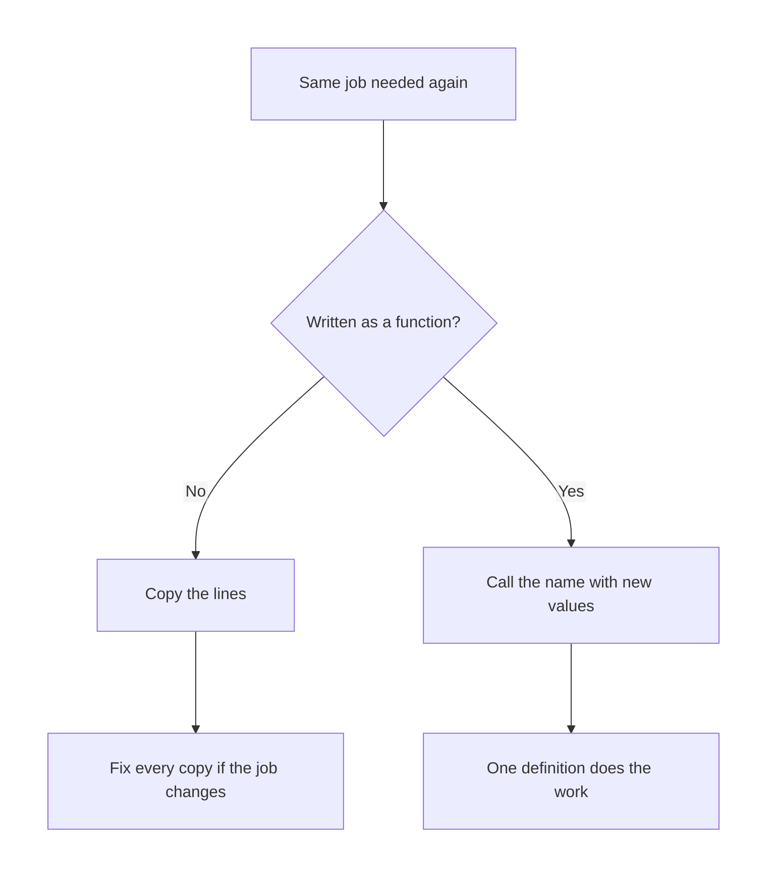
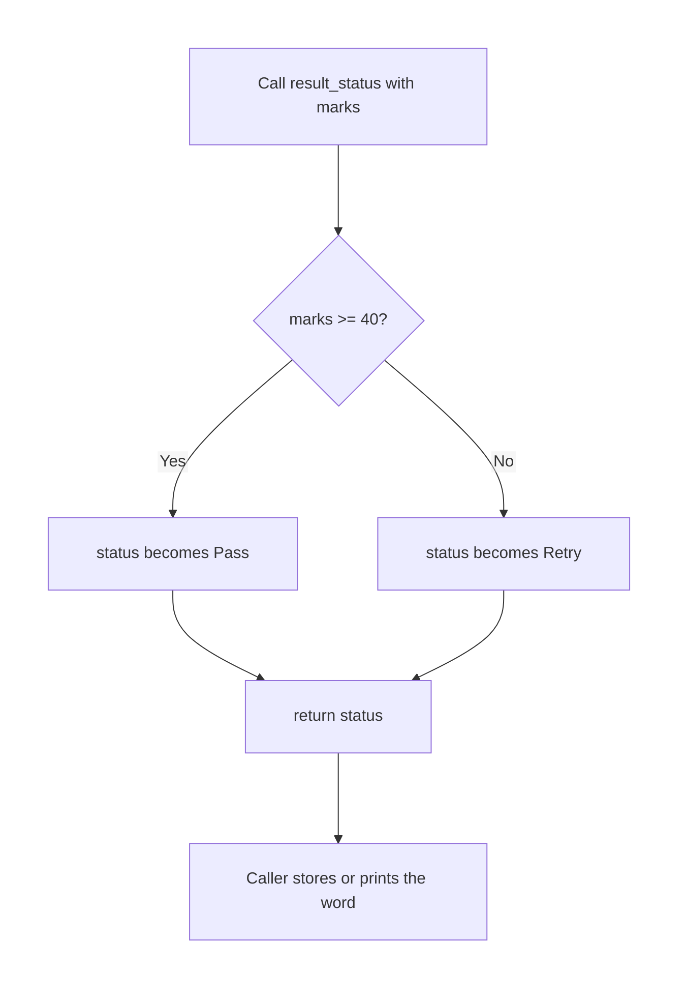

# Python — The Power of Functions

## What You Will Learn in This Lesson

In the previous session you learned how a program **decides** with `if` and `else`, and how it **repeats** work with loops. Those tools are enough to solve a small problem once, from top to bottom.

They become tiring when the same job appears again. A canteen bill, a pass-or-retry check, or a UPI note should not be copied and pasted every time the numbers change.

This lesson gives that job a **name**. You will define a function, call it, pass values in, and get a value back.

By the end of this lesson, you will be able to:

- Explain why a function exists: it repeats less and names one job
- Define a function with `def` and **call** it by name
- Tell a **parameter** apart from an **argument**
- Send a result back with `return`
- Pass **more than one** value, and give a parameter a **default**
- Use `if` and `else` inside a function you already know how to write

---

## Why Functions Exist

A program without functions is like a shop that writes the full bill formula on every slip. The formula is the same. Only the plate count changes.

- **Official Definition:** A **function** is a named block of code that performs one job and can be used whenever that job is needed.
- **In Simple Words:** A function is a labelled recipe. You write the steps once, then ask for the recipe by name.
- **Real-Life Example:** The canteen always does “plates × price”. Staff do not invent a new method for every student. They reuse the same job with new numbers.

Copying the same lines has three costs.

- A mistake must be fixed in every copy.
- A reader cannot see the **job**, only a pile of lines.
- A later change, such as adding a small packing charge, must be edited in many places.

A function removes those costs. The job has one home. Each use supplies fresh numbers.



The diagram is the whole idea of this lesson. Name the job once. Call that name whenever the job is needed.

---

## Defining a Function with `def`

- **Official Definition:** **`def`** is the keyword that starts a function definition. It is followed by the function name, parentheses, a colon, and an indented body.
- **In Simple Words:** `def` means “I am naming these indented lines.”
- **Real-Life Example:** Writing “Tea recipe” at the top of a card is like `def`. The steps under the title are the body. The card does not make tea until someone follows it.

Rules that keep a definition easy to read:

- The name uses lowercase letters and underscores, such as `canteen_bill`.
- The name should say the job, not a vague word like `do_stuff`.
- The body is indented by four spaces. Python uses that indent to know what belongs inside.
- A definition does not run the job. It only stores the job under that name.

```python
def show_welcome():  # Define a function named show_welcome with no inputs
    print("Welcome to the canteen counter")  # This line runs only when the function is called
```

**How the code works:**

- `def` stores the function. It does not print anything yet.
- The line under `def` is indented, so it belongs to `show_welcome`.
- If you run only this definition, the screen stays quiet. That is correct.
- The name `show_welcome` now exists and can be used later in the file.

A common first doubt is “I wrote the function and nothing happened.” Nothing should happen until you call it. The next section does that call.

---

## Calling a Function

- **Official Definition:** A **function call** is the use of a function’s name with parentheses, which runs the body of that function.
- **In Simple Words:** The definition is the recipe card. The call is the moment you actually follow the card.
- **Real-Life Example:** The canteen has a written step “shout the token number”. Shouting “Token 14” at the counter is the call. The written step alone does not shout.

```python
def show_welcome():  # Store the welcome job under this name
    print("Welcome to the canteen counter")  # Print one welcome line when called

show_welcome()  # Call the function; parentheses mean "run it now"
show_welcome()  # Call the same job a second time without copying the print
```

**How the code works:**

- The first two lines only define the function.
- `show_welcome()` runs the body once and prints the welcome line.
- The second call runs the same body again.
- You did not copy the `print` line. You reused the name.
- Parentheses are required. Writing `show_welcome` without `()` only points at the function. It does not run it.

Output:

```text
Welcome to the canteen counter
Welcome to the canteen counter
```

Call a function only after its `def` has appeared in the file. Python reads from top to bottom. A call placed above its definition raises `NameError` because the name does not exist yet.

---

## Parameters and Arguments

A function that always prints the same sentence is a small win. Real jobs need fresh data. The marks change. The UPI amount changes. The plate count changes.

- **Official Definition:** A **parameter** is a name listed in the function definition. An **argument** is the actual value supplied at the call.
- **In Simple Words:** The parameter is the blank on the form. The argument is what you write in that blank today.
- **Real-Life Example:** The canteen form has a blank labelled “plates”. That blank is the parameter. When Riya writes `3`, the number `3` is the argument.

```python
def announce_token(token):  # token is the parameter, a blank for one token number
    print("Now serving token")  # Print a fixed label
    print(token)  # Print whatever argument was passed for this call

announce_token(14)  # 14 is the argument for this call
announce_token(15)  # 15 is a different argument for the same parameter
```

**How the code works:**

- `token` does not have a value inside the `def` line itself. It waits for a call.
- `announce_token(14)` copies `14` into `token`, then runs the body.
- `announce_token(15)` copies `15` into `token` and runs the body again.
- The parameter name stays `token` both times. The argument changes.
- Inside the function, use the parameter name. Do not use the argument’s old name, because the function may not know that outer name.

Output:

```text
Now serving token
14
Now serving token
15
```

| Idea | Where it appears | Example in this program |
|------|------------------|-------------------------|
| Parameter | Inside the parentheses of `def` | `token` |
| Argument | Inside the parentheses of the call | `14`, then `15` |
| Body | Indented lines under `def` | The two `print` lines |

People mix the two words because both sit inside parentheses. Use this test. If you are **writing** the function, the names are parameters. If you are **using** the function, the values are arguments.

---

## Returning a Result

Printing is for the human at the screen. Often the program itself needs the answer so it can keep working. `return` hands that answer back to the caller.

- **Official Definition:** **`return`** sends a value from the function back to the place where the function was called, and then ends that call.
- **In Simple Words:** `return` is the parcel the function gives back. `print` only shows something. It does not hand a parcel to the next line.
- **Real-Life Example:** A marks clerk can shout “78” across the room, or write 78 on a slip and hand it to you. The slip is `return`. You can file that slip. A shout disappears.

```python
def doubled_marks(marks):  # Define a job that doubles one mark
    doubled = marks * 2  # Work out the doubled value
    return doubled  # Hand the value back to the caller

stored = doubled_marks(36)  # Call the function and keep what it returns
print(stored)  # Print the stored result, which is 72
```

**How the code works:**

- `doubled_marks(36)` runs the body with `marks` equal to `36`.
- `doubled` becomes `72`.
- `return doubled` sends `72` back. That value lands in `stored`.
- `print(stored)` shows `72`. The print is outside the function, so you can see the parcel.
- After `return`, no further line inside that call runs. This function has no line after `return`, so the call simply ends.

A function with no `return` still finishes. Python then hands back a special value called `None`, which means “nothing was sent”.

```python
def doubled_marks(marks):  # Define the same job name again for this example
    doubled = marks * 2  # Calculate 72 when marks is 36, but do not return it
print(doubled_marks(36))  # Print None, because the function sent nothing back
```

**How the code works:**

- The arithmetic runs, then the function ends without `return`.
- The call’s result is `None`.
- `print` shows `None`. Students often think this means the multiplication failed. The multiplication worked. The parcel was never sent.
- If you need the answer later, add `return`.

Use `print` inside a function when the job is “show this message”. Use `return` when the job is “give me a value I can store, test, or pass onward”.

```python
def canteen_total(plates, price):  # Two blanks: how many plates, and the price of one
    total = plates * price  # Multiply to get the bill amount
    return total  # Send the amount back so the caller can keep it

bill = canteen_total(3, 45)  # 3 plates at 45 rupees each
print(bill)  # Print 135
note = "Pay " + str(bill)  # Build a short note from the returned number
print(note)  # Print Pay 135
```

**How the code works:**

- The function returns a number, not a sentence.
- `bill` holds `135`, so later lines can use `bill` again.
- `str(bill)` turns the number into text so it can be joined with `"Pay "`.
- If the function had only printed `135`, the variable `bill` would not exist, and the note could not be built.

---

## More Than One Parameter

Most real jobs need several facts at once. A UPI note needs who paid, how much, and who received it.

- **Official Definition:** A function may list **multiple parameters**, separated by commas. The call must pass arguments in the same order, unless a later topic changes that habit.
- **In Simple Words:** One blank is not enough when the job needs two or three facts. Keep the order the same at the definition and at the call.
- **Real-Life Example:** A payment slip has “From”, “Amount”, and “To”. If you fill those boxes in the wrong order, the note names the wrong person.

```python
def upi_note(payer, amount, receiver):  # Three parameters in a fixed order
    text = payer + " paid Rs " + str(amount) + " to " + receiver  # Build one sentence
    return text  # Send the sentence back

line = upi_note("Ananya", 250, "Canteen")  # Arguments follow payer, amount, receiver
print(line)  # Print Ananya paid Rs 250 to Canteen
```

**How the code works:**

- `"Ananya"` lands in `payer`, `250` lands in `amount`, and `"Canteen"` lands in `receiver`.
- The order is the contract. `upi_note("Canteen", 250, "Ananya")` would swap the people.
- `str(amount)` is required because `amount` is a number and the other pieces are text.
- The function returns the full sentence, so `line` can be printed or saved.

You can pass a variable as an argument. The parameter still receives the value.

```python
def average_of_two(first, second):  # Parameters for two subject marks
    total = first + second  # Add the two marks
    average = total / 2  # Divide by 2 to get the average
    return average  # Send the average back

maths = 78  # Store one mark outside the function
science = 86  # Store the other mark outside the function
result = average_of_two(maths, science)  # Pass the two variables as arguments
print(result)  # Print 82.0
```

**How the code works:**

- `maths` and `science` are ordinary variables from the previous session’s style of work.
- At the call, their values are copied into `first` and `second`.
- Changing the parameter names inside the function does not rename `maths` or `science`.
- Division with `/` produces a float, so the printed average is `82.0`, not `82`.

A later session goes deeper into how functions can take a flexible number of values. In this lesson, you list every parameter yourself and pass one argument for each required parameter.

---

## Default Parameter Values

Some blanks have a usual answer. The canteen tea is ₹40 unless the board says otherwise. A default saves you from repeating that usual answer.

- **Official Definition:** A **default parameter value** is a value written in the definition with `=`. If the call omits that argument, Python uses the default.
- **In Simple Words:** The form already has “40” pencilled in. Leave it, or write over it for one visit.
- **Real-Life Example:** The mess assumes a standard plate. A student who wants the special plate says so. Everyone else stays on the standard price.

```python
def canteen_bill(plates, price=40):  # price defaults to 40 if the call omits it
    total = plates * price  # Use the given price or the default
    return total  # Send the bill back

print(canteen_bill(2))  # Omit price, so price is 40 and the bill is 80
print(canteen_bill(2, 55))  # Pass 55, so the default is not used and the bill is 110
```

**How the code works:**

- `plates` has no default. Every call must pass it.
- `price=40` means “use 40 when this argument is missing”.
- `canteen_bill(2)` binds `plates` to `2` and `price` to `40`.
- `canteen_bill(2, 55)` binds `price` to `55` for that call only. The definition still says `40` for the next call.
- Defaults must come **after** parameters that have no default. `def canteen_bill(price=40, plates)` is a syntax error.

---

## Decisions Inside a Function

You already know `if` and `else`. Placing them inside a function means the **decision is part of the named job**. Callers ask for the result. They do not rewrite the rule.

- **Official Definition:** A function body may contain any statements you already know, including `if` and `else`. The condition uses parameters or values computed from them.
- **In Simple Words:** The recipe can say “if the marks are enough, write Pass, otherwise write Retry.”
- **Real-Life Example:** The exam cell does not ask every teacher to remember the pass rule. The cell has one job: look at the marks and return Pass or Retry.



```python
def result_status(marks):  # Define a job that turns marks into a word
    if marks >= 40:  # Pass rule you already know how to write
        status = "Pass"  # Choose Pass when the condition is true
    else:  # The marks are below 40
        status = "Retry"  # Choose Retry when the condition is false
    return status  # Send the chosen word back

print(result_status(40))  # Boundary: 40 is Pass
print(result_status(39))  # One mark below the line is Retry
print(result_status(91))  # A high mark is still Pass in this simple rule
```

**How the code works:**

- Each call starts fresh. The previous call’s `status` does not leak into the next call.
- `marks >= 40` is the same kind of comparison you used in the previous session.
- Exactly one branch runs. Then the function reaches the shared `return`.
- `40` takes the `if` branch because `>=` includes the line itself.
- The caller receives a string and prints it. The function does not print.

Output:

```text
Pass
Retry
Pass
```

You can combine a default with a decision. The usual passing mark stays `40`, and a special paper can pass a different line.

```python
def fee_status(marks, passing=40):  # marks required, passing line defaults to 40
    if marks >= passing:  # Compare this paper’s marks with the chosen line
        return "Clear"  # Send Clear and end this call immediately
    else:  # Marks are below the chosen line
        return "Held"  # Send Held and end this call

print(fee_status(38))  # 38 is below 40, so Held
print(fee_status(40))  # 40 meets the default line, so Clear
print(fee_status(35, 30))  # The line is 30 for this call, so Clear
```

**How the code works:**

- Here `return` sits inside each branch. The first true path sends its word and stops.
- You do not need a variable named `status` if each branch returns at once.
- `fee_status(38)` uses `passing` as `40`.
- `fee_status(35, 30)` uses `passing` as `30`, so `35 >= 30` is true.
- Both styles are valid: one `return` after `if`/`else`, or a `return` inside each branch. Pick one style in a single function so the path stays easy to trace.

---

## Activity: Name the Bill

Write a function named `plate_cost` with two parameters, `plates` and `rate`. Return `plates * rate`. Do not print inside the function.

Then run these three lines and write down what you expect before you look:

```python
print(plate_cost(3, 45))  # First check
print(plate_cost(1, 40))  # Second check
print(plate_cost(5, 20))  # Third check
```

**Check your answer:**

- `plate_cost(3, 45)` returns `135`.
- `plate_cost(1, 40)` returns `40`.
- `plate_cost(5, 20)` returns `100`.
- If you see `None`, the function printed the number but did not `return` it.
- If you see an error about arguments, the call and the definition do not have the same number of required values.

A correct definition looks like this:

```python
def plate_cost(plates, rate):  # plates and rate are both required
    total = plates * rate  # Multiply to get the cost
    return total  # Hand the cost back
```

---

## Activity: Pass Line with a Default

Write `fee_note(marks, passing=40)`. Return `"Pass"` when `marks >= passing`. Otherwise return `"Retry"`.

Predict these three calls:

1. `fee_note(38)`
2. `fee_note(40)`
3. `fee_note(35, 30)`

**Check your answer:**

- Call 1 returns `Retry` because `38` is below the default `40`.
- Call 2 returns `Pass` because `40 >= 40` is true.
- Call 3 returns `Pass` because the passing line for that call is `30`.
- If call 3 returns `Retry`, the second argument was ignored or the comparison used `40` by mistake.
- If Python reports a syntax error on `def`, check that `passing=40` comes after `marks`, not before it.

```python
def fee_note(marks, passing=40):  # One required mark and a default pass line
    if marks >= passing:  # Use the default or the override
        return "Pass"  # Send Pass
    else:  # Below the line
        return "Retry"  # Send Retry
```

---

## Mistakes That Hide the Result

| What you see | Likely cause | What to change |
|--------------|--------------|----------------|
| Nothing prints | The function was defined but never called | Add a call with parentheses |
| `None` on the screen | The body prints or computes, but there is no `return` | `return` the value you need |
| `TypeError` about missing arguments | A required parameter was not passed | Pass that argument, or give it a default |
| Wrong person or wrong number | Arguments are in a different order from the parameters | Match the order in `def` |
| `NameError` on the call | The call appears above the `def` | Move the definition higher in the file |
| `SyntaxError` near `def` | A default parameter is placed before a required one | Put parameters with defaults last |
| `IndentationError` | The body is not indented | Indent every body line by four spaces |

Read the error from the bottom up until you see your file name. The line number is the first place to look, not a reason to rewrite the whole function.

---

## Walk One Call on Paper

Write the argument, the parameter, the test, and the returned word before you trust the screen.

| Step | What happens for `fee_status(35, 30)` |
|------|----------------------------------------|
| 1 | The call starts. `marks` is `35`. `passing` is `30`. |
| 2 | Python tests `35 >= 30`. The test is true. |
| 3 | The function hits `return "Clear"` and that call ends. |
| 4 | The caller receives the string `Clear`. |

| Step | What happens for `canteen_bill(2)` |
|------|-------------------------------------|
| 1 | `plates` is `2`. `price` was omitted, so it becomes `40`. |
| 2 | `total` is `2 * 40`, which is `80`. |
| 3 | `return total` sends `80` back to the caller. |

If the paper and the screen disagree, check argument order first, then look for a missing `return`.

---

## Key Takeaways

- A function exists so you repeat less and so the job has a clear name.
- `def` stores the job. A call with parentheses runs it.
- Parameters are the blanks in the definition. Arguments are the values in the call.
- `return` hands a value back. Without it, the caller receives `None`.
- A function can take several parameters, use a default, and use `if` / `else` inside the body.

In the next session you will look at where a name lives, inside the function or outside it, and at how a function can call itself and still stop. That session builds on the `def`, call, and `return` you used here.

---

## Important Commands, Libraries, and Terminologies

| Term or syntax | What it means in this lesson |
|----------------|------------------------------|
| `function` | A named block that performs one job and can be reused |
| `def` | Keyword that defines a function |
| Function name | The label you call, written in lowercase with underscores |
| Function call | `name(...)`, which runs the body |
| Parameter | Name in the definition that receives a value |
| Argument | Actual value passed in a call |
| `return` | Sends a value back to the caller and ends that call |
| `None` | The result when a function does not return anything |
| Multiple parameters | Several names in `def`, separated by commas, matched by order |
| Default parameter | `name=value` in the definition, used when the call omits that argument |
| Positional order | Arguments fill parameters from left to right |
| Function body | The indented lines that belong to the function |
| `if` / `else` inside a function | A decision that is part of the named job |
| `str(...)` | Turns a number into text so it can be joined into a message |
