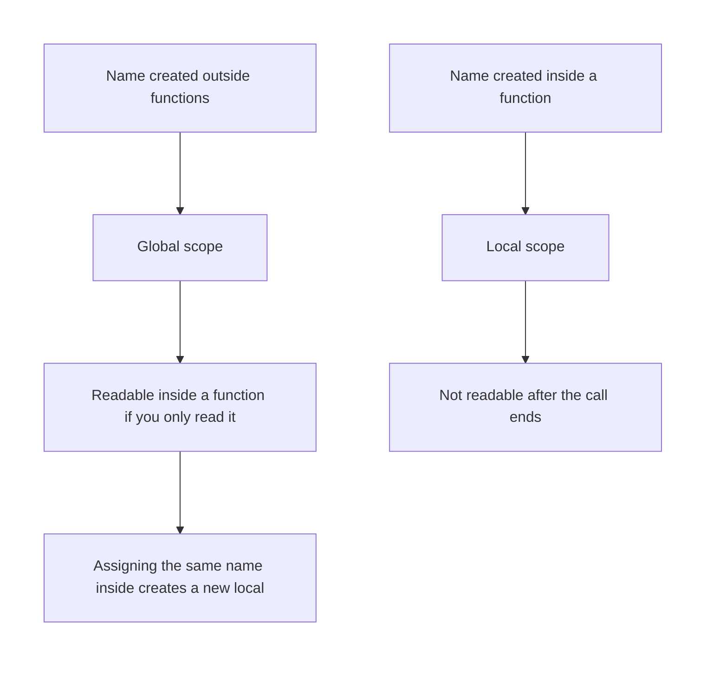
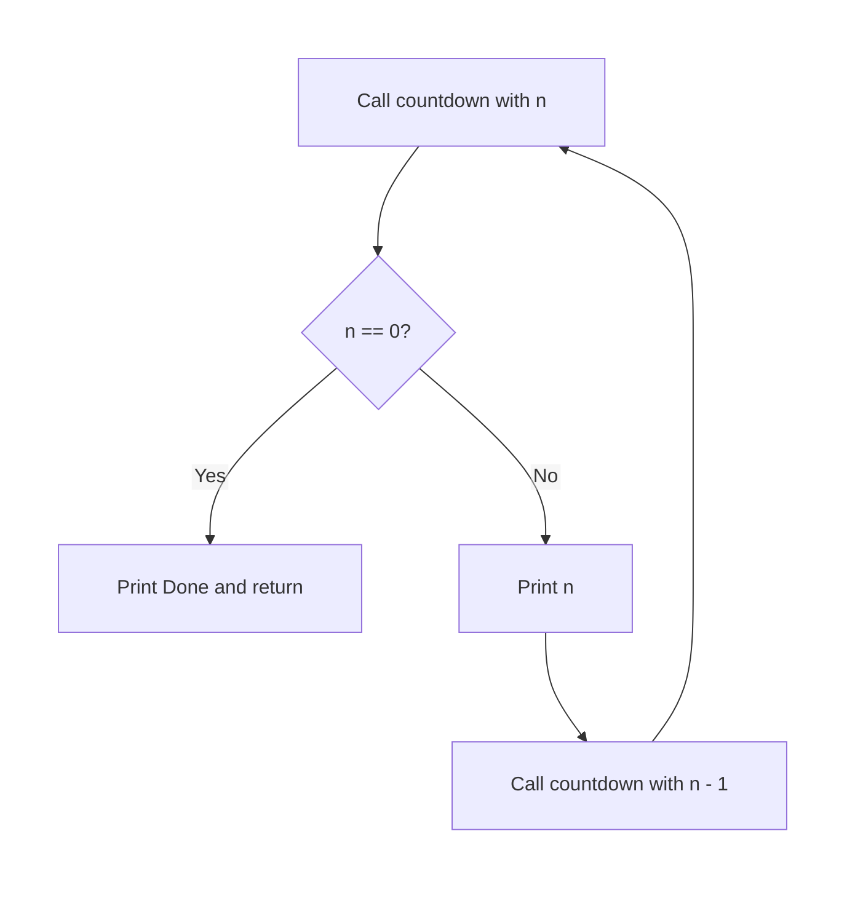

# Python — Advanced Functions

## What You Will Learn in This Lesson

In the previous session you named a job with `def`, passed arguments, and sent a result back with `return`. That is enough when every call has a fixed list of blanks and every name is obvious.

Real programs also ask where a name lives, how to accept a few numbers however many, and how a job can call itself and still stop.

This lesson covers those ideas. A short recall of `def` and `return` is enough. The new work starts at scope.

By the end of this lesson, you will be able to:

- Tell a **local** name from a **global** name
- Collect extra number arguments with `*args`
- Collect named extras with `**kwargs`
- Write a one-line **lambda**
- Write a small **recursive** function with a **base case**, and explain why it must stop

---

## A Short Recall

A function is still a named job. You define it with `def`, you run it with parentheses, and you hand a value back with `return`.

```python
def double_amount(amount):  # Recall: one parameter named amount
    return amount * 2  # Recall: send the doubled value back

print(double_amount(125))  # Call with 125 and print 250
```

**How the code works:**

- This is the same shape you used in the previous session.
- `125` is the argument. `amount` is the parameter.
- `return` is why `print` can show `250`. Without `return`, the print would show `None`.
- The rest of this lesson assumes you can already write a function like this.

---

## Local and Global Scope

- **Official Definition:** **Scope** is the region of the program where a name can be seen. A **global** name is created outside every function. A **local** name is created inside a function and exists only during that call.
- **In Simple Words:** A name written in the open file is like a notice on the hostel board. A name written inside a function is like a slip in your pocket.
- **Real-Life Example:** The mess fee on the notice board is global. The late fine you scribble while calculating one student’s bill is local. It should not change the board unless you deliberately update the board.



Reading a global from inside a function is allowed. The function does not own that name. It only looks at it.

```python
mess_fee = 2500  # Global name, created outside every function
def show_fee():  # Define a function that only reads the global
    print(mess_fee)  # Read the global mess fee and print it

show_fee()  # Call the function; prints 2500
print(mess_fee)  # The global is still 2500 after the call
```

**How the code works:**

- `mess_fee` is global because the assignment is not indented inside a function.
- `show_fee` does not assign to `mess_fee`. It only reads it, so Python uses the global.
- After the call, `mess_fee` is unchanged.
- You can print `mess_fee` outside because a global stays visible.

A name assigned inside the function is local, even when it spells the same as a global.

```python
balance = 100  # Global balance on the notice board
def add_pocket_cash():  # Define a function that writes its own balance
    balance = 40  # This creates a local balance and does not change the global
    return balance  # Send the local value back

print(add_pocket_cash())  # Prints 40, the local balance
print(balance)  # Prints 100, the global balance is unchanged
```

**How the code works:**

- The inner `balance = 40` does not edit the outer `balance`.
- Python treats an assignment inside the function as “this name is local”.
- The return value is `40`. The global print is still `100`.
- This surprises people who expected the board to change. Assignment inside creates a pocket slip.

A local name disappears when the call ends. You cannot print it outside.

```python
def late_fine():  # Define a function with one local name
    fine = 50  # fine exists only while this call runs
    return fine  # Send 50 back so the caller can keep it

kept = late_fine()  # Store the returned fine
print(kept)  # Print 50; this works because return handed the value out
```

**How the code works:**

- `fine` is local. After the call, the name `fine` does not exist outside.
- `kept` works because it received the returned number, not the local name.
- If you wrote `print(fine)` after the call, Python would raise `NameError`.
- When the outside world needs a result, `return` it. Do not expect the local name to leak out.

To change a global on purpose, declare `global` inside the function, then assign.

- **Official Definition:** The **`global`** statement tells Python that an assignment inside the function should update the global name, not create a local one.
- **In Simple Words:** You are saying “edit the hostel board, do not make a pocket copy.”
- **Real-Life Example:** A cashier adds today’s UPI collection to the counter total that everyone shares. That is an intentional update of a global, not a private scribble.

```python
counter_total = 0  # Global total collected at the canteen counter
def add_upi(amount):  # Define a function that updates the shared total
    global counter_total  # Use the global name, do not create a local one
    counter_total = counter_total + amount  # Add this UPI amount to the board
    return counter_total  # Send the new total back

print(add_upi(80))  # First payment: total becomes 80
print(add_upi(45))  # Second payment: total becomes 125
print(counter_total)  # The global itself is now 125
```

**How the code works:**

- Without the `global` line, `counter_total = ...` inside the function would be a local name.
- With `global`, both calls edit the same outer total.
- The first call adds `80`. The second adds `45` to that `80`.
- The last print reads the global directly and shows `125`.
- Use `global` only when the function’s job is to update a shared name. Prefer `return` when you can.

---

## Extra Number Arguments with `*args`

Sometimes you do not know whether a student will hand you two marks or four. Listing a fixed parameter for each mark becomes clumsy.

- **Official Definition:** **`*args`** collects extra positional arguments into one sequence inside the function. The name `args` is a habit. The star is the real syntax.
- **In Simple Words:** The star means “put every extra number I was given into one bundle I can loop over.”
- **Real-Life Example:** A teacher says “tell me the marks you have, however many subjects you sat.” Two numbers or five numbers can enter the same job.

```python
def total_marks(*args):  # Collect any number of mark arguments
    total = 0  # Start the running total at zero
    for mark in args:  # Visit each collected number
        total = total + mark  # Add this mark into the total
    return total  # Send the sum back

print(total_marks(70, 80))  # Two arguments: 70 + 80 = 150
print(total_marks(70, 80, 90))  # Three arguments: 70 + 80 + 90 = 240
print(total_marks(40))  # One argument: the total is 40
```

**How the code works:**

- The star must sit in the definition, before the name `args`.
- Each call may pass a different count of numbers.
- The `for` loop, which you already know, walks those numbers one by one.
- You are only adding the numbers that arrived. This is not a lesson on collections.
- `total_marks()` with nothing inside the parentheses returns `0`, because the loop never runs.

You may also keep one normal parameter and then a star. The normal parameter takes the first value. The star takes the rest.

```python
def scored_by(name, *args):  # name is required; the star takes the marks after it
    total = 0  # Start the sum at zero
    for mark in args:  # Add only the mark arguments, not the name
        total = total + mark  # Add this mark
    return name + " scored " + str(total)  # Build a short sentence and send it back

print(scored_by("Riya", 18, 22))  # Name plus two marks: Riya scored 40
print(scored_by("Arjun", 30))  # Name plus one mark: Arjun scored 30
```

**How the code works:**

- `"Riya"` fills `name`. `18` and `22` go into `args`.
- The loop never sees the name, so it does not try to add text.
- `str(total)` joins the number into the sentence.
- The first required argument must still be passed. `scored_by(18, 22)` would treat `18` as the name.
- A later session goes deeper into packs of values. Here the star is only a way to accept a flexible count of numbers.

---

## Named Extras with `**kwargs`

Some facts arrive with labels: who paid, and how many rupees. Two stars collect those labelled extras.

- **Official Definition:** **`**kwargs`** collects extra keyword arguments. Inside the function you can loop the labels and look each one up with square brackets.
- **In Simple Words:** One star gathers plain values. Two stars gather values that came with names at the call.
- **Real-Life Example:** A UPI slip is not just `250`. It is “amount 250” and “payer Ananya”. The labels travel with the values.

```python
def print_upi(**kwargs):  # Collect named extras such as payer and amount
    for label in kwargs:  # Visit each label that was passed
        print(label)  # Print the label
        print(kwargs[label])  # Print the value stored under that label

print_upi(payer="Ananya", amount=250)  # Pass two named arguments
```

**How the code works:**

- The call uses `name=value` pairs. Those names are chosen at the call, not fixed in advance.
- `label` becomes `"payer"` and then `"amount"`.
- `kwargs[label]` fetches the matching value, `"Ananya"` and then `250`.
- The order of labels follows the order written in the call.
- An upcoming session treats labelled lookup as its own topic. This lesson only uses it to receive named extras.

Output:

```text
payer
Ananya
amount
250
```

You can mix one normal parameter with two stars when the first fact is required and the rest are optional labels.

```python
def receipt(counter, **kwargs):  # counter is required; other labels are optional
    print(counter)  # Print the counter name first
    for label in kwargs:  # Walk any extra labels
        print(label)  # Print the label
        print(kwargs[label])  # Print the value for that label

receipt("Canteen", plates=2, paid=80)  # One plain argument and two named extras
```

**How the code works:**

- `"Canteen"` fills `counter` by position.
- `plates` and `paid` are keyword arguments collected by `**kwargs`.
- The function prints the counter, then each label and its value.
- Keep the first value positional and the rest named.
- If you write `receipt(plates=2)` and forget the counter, Python reports a missing argument.

---

## A One-Line Function with `lambda`

When the whole job is one expression, Python allows a compact form.

- **Official Definition:** A **lambda** is a function written as `lambda parameters: expression`. The expression’s value is what the lambda returns.
- **In Simple Words:** It is a tiny function without `def` and without a `return` keyword. The value of the expression is the result.
- **Real-Life Example:** “Double the token number” does not need a long recipe card. One line is the whole job.

```python
double_token = lambda token: token * 2  # One-line function that doubles a token number
print(double_token(14))  # Call it like any function and print 28
```

**How the code works:**

- `lambda` is the keyword. `token` is the parameter. `token * 2` is the expression.
- There is no `def` and no indented body.
- You still call it with parentheses: `double_token(14)`.
- The expression is returned automatically. You do not write `return`.
- Use `def` when the job has several lines or an `if` block. Use lambda when the job is one expression.

A lambda can take two numbers. The same left-to-right rule applies.

```python
plate_cost = lambda plates, rate: plates * rate  # Multiply plates by rate in one expression
print(plate_cost(3, 45))  # 3 plates at 45 rupees prints 135
print(plate_cost(2, 40))  # 2 plates at 40 rupees prints 80
```

**How the code works:**

- Two parameters sit between `lambda` and the colon, separated by a comma.
- `plate_cost(3, 45)` evaluates `3 * 45`.
- This matches the bill job from the previous session, written in one line.
- A lambda cannot hold a multi-line `if`/`else` block. For that, stay with `def`.
- The name `plate_cost` stores the lambda so you can call it.

---

## A Function That Calls Itself

- **Official Definition:** A **recursive function** is a function that calls itself. A **base case** is the condition that stops the chain and does not call again.
- **In Simple Words:** The job says “do one small step, then ask myself to do the smaller problem.” The base case says “stop, the problem is small enough.”
- **Real-Life Example:** A countdown at the canteen token board: shout 3, then 2, then 1, then “Done”. You do not keep shouting forever.



```python
def countdown(n):  # Define a function that counts down from n
    if n == 0:  # Base case: nothing left to count
        print("Done")  # Show that the countdown has stopped
        return  # Stop this call and do not call again
    print(n)  # Print the current number
    countdown(n - 1)  # Call the same function with a smaller number

countdown(3)  # Start the countdown at 3
```

**How the code works:**

- `countdown(3)` prints `3`, then calls `countdown(2)`.
- `countdown(2)` prints `2`, then calls `countdown(1)`.
- `countdown(1)` prints `1`, then calls `countdown(0)`.
- `countdown(0)` hits the base case, prints `Done`, and returns.
- Each waiting call then finishes. The chain stops because `n` moved toward `0`.

Output:

```text
3
2
1
Done
```

Factorial is the same shape with a returned number. `factorial(n)` is `n` times `factorial(n - 1)`, and `factorial(0)` is `1`.

```python
def factorial(n):  # Define a recursive factorial for a small whole number
    if n == 0:  # Base case: factorial of 0 is 1
        return 1  # Stop the chain and send 1 back
    return n * factorial(n - 1)  # Multiply n by the factorial of the smaller number

print(factorial(4))  # 4 * 3 * 2 * 1 * 1 = 24
```

**How the code works:**

- `factorial(4)` needs `factorial(3)`. That needs `factorial(2)`, then `factorial(1)`, then `factorial(0)`.
- `factorial(0)` returns `1` and does not call again.
- On the way back, Python multiplies until the printed result is `24`.
- The base case is the only reason the multiplications finish.

| Call | Waits for | Eventually returns |
|------|-----------|--------------------|
| `factorial(4)` | `factorial(3)` | `4 * 6 = 24` |
| `factorial(3)` | `factorial(2)` | `3 * 2 = 6` |
| `factorial(2)` | `factorial(1)` | `2 * 1 = 2` |
| `factorial(1)` | `factorial(0)` | `1 * 1 = 1` |
| `factorial(0)` | nothing | `1` |

### Why Recursion Needs a Stop

If the base case is missing, each call makes another call and the numbers never land. Python then raises `RecursionError` because the chain grew too long.

```python
def unsafe_count(n):  # A countdown with no base case, shown so you can see the danger
    print(n)  # Print the current number
    unsafe_count(n - 1)  # Call again with no stop; do not run this pattern

# unsafe_count(3)  # Left as a comment so this file does not crash
```

**How the code works:**

- The call line is a comment, so this program prints nothing and does not crash.
- If you removed the comment and ran `unsafe_count(3)`, it would print `3`, `2`, `1`, `0`, `-1`, and so on.
- There is no `if` that returns, so the function never stops itself.
- A recursive function needs a base case that does not call itself.
- Each new call must move toward that case. For these examples, pass `n - 1` and stop at `0`.

A safe habit: write the base case first, then the line that calls the function with a smaller input.

---

## Activity: Which Name Changed?

Read this program and predict both prints before you run it.

```python
upi_today = 100  # Global collection so far
def add_payment(amount):  # Define a function that assigns its own name
    upi_today = amount  # Local assignment, not the global
    return upi_today  # Return the local amount

print(add_payment(40))  # First print
print(upi_today)  # Second print
```

**Check your answer:**

- The first print is `40`, because the function returns its local `upi_today`.
- The second print is `100`, because the global was never updated.
- If both prints were `40`, the function would have needed `global upi_today` before the assignment.
- If the first print is `None`, the `return` line is missing.

---

## Activity: Factorial of 3

Using the `factorial` function from this lesson, predict `factorial(3)` by filling the chain.

1. `factorial(3)` waits for `factorial(2)`.
2. `factorial(2)` waits for `factorial(1)`.
3. `factorial(1)` waits for `factorial(0)`.
4. `factorial(0)` returns `1`.

**Check your answer:**

- `factorial(1)` returns `1 * 1`, which is `1`.
- `factorial(2)` returns `2 * 1`, which is `2`.
- `factorial(3)` returns `3 * 2`, which is `6`.
- If you got `0`, the base case returned `0` instead of `1`. That breaks every product above it.
- If the function never returns, the base case is missing or the call does not move toward `0`.

---

## Mistakes on Scope and Recursion

| What you see | Likely cause | What to change |
|--------------|--------------|----------------|
| Outer number stays old | Assignment inside the function created a local | Add `global`, or `return` the new value instead |
| `NameError` after the call | You printed a local name outside | Use the returned value |
| `TypeError` on a star function | A text value was passed where a number is added | Pass numbers only in these examples |
| Lambda seems to forget a return | You expected a `return` keyword | The expression after the colon is the result |
| `RecursionError` | No base case, or the call does not get smaller | Stop at `0`, and call with `n - 1` |
| Factorial is always `0` | Base case returned `0` | Return `1` when `n == 0` |

Keep `*args` for extra plain numbers and `**kwargs` for extra named values. Do not put a fixed parameter after a star in this lesson.

---

## One More Walk: Countdown on Paper

Write each call before you trust the screen. Start at `countdown(3)`.

| Call | Base case? | What it does next |
|------|------------|-------------------|
| `countdown(3)` | No | Prints `3`, then calls `countdown(2)` |
| `countdown(2)` | No | Prints `2`, then calls `countdown(1)` |
| `countdown(1)` | No | Prints `1`, then calls `countdown(0)` |
| `countdown(0)` | Yes | Prints `Done` and returns |

The stack then unwinds. No further numbers are printed. If your paper shows negative numbers, the base case was not `n == 0`.

The same walk works for factorial, except each row multiplies on the way back instead of printing on the way down.

---

## Key Takeaways

- A name assigned inside a function is local. A name assigned outside is global. Reading a global is fine. Changing it needs `global` or, better, a `return`.
- `*args` gathers a flexible count of plain values so you can loop and add them.
- `**kwargs` gathers named extras and lets you print each label and its value.
- A lambda is a one-expression function. The expression is the result.
- Recursion must have a base case. Each call must move toward that stop, or the chain never ends.

The next session leaves functions and turns to text and to an ordered collection you can grow, shrink, and loop over.

---

## Important Commands, Libraries, and Terminologies

| Term or syntax | What it means in this lesson |
|----------------|------------------------------|
| Scope | The region where a name can be seen |
| Global name | A name assigned outside every function |
| Local name | A name assigned inside a function |
| `global` | Statement that makes an assignment update the global name |
| `*args` | Collects extra positional arguments so a loop can visit them |
| `**kwargs` | Collects extra keyword arguments as labelled values |
| Keyword argument | A call written as `name=value` |
| `lambda` | One-expression function: `lambda parameters: expression` |
| Recursive function | A function that calls itself |
| Base case | The branch that stops the recursion and does not call again |
| `RecursionError` | The error when recursive calls never stop |
| `return` | Still the way a function hands a value back, as in the previous session |
| `def` | Still the way you name a multi-line function |
