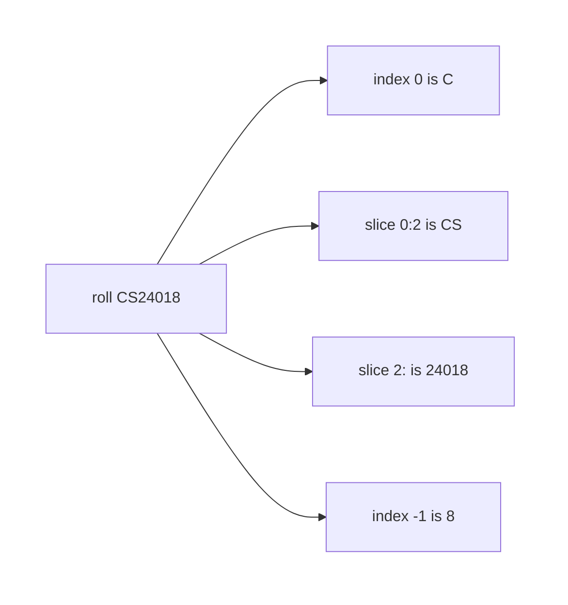
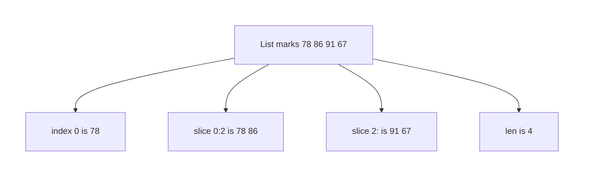

# Python — Lists & Strings

## What You Will Learn in This Lesson

In the previous session you learned how names live inside a function, how a function can take a flexible bundle of values, and how a function can call itself and stop. Those tools still work on one number or one short message at a time.

Programs also need text you can read piece by piece, and a row of values you can grow. A canteen token, a UPI note, and a list of subject marks are that kind of data.

This lesson is about **strings** and **lists**. Other collections wait until the next session.

By the end of this lesson, you will be able to:

- Index, slice, and measure a string, and use `upper`, `lower`, `strip`, `replace`, `split`, and `join`
- Explain why a string is **immutable**
- Create a list, index it, slice it, and use `append`, `insert`, `pop`, `remove`, and `len`
- Explain why a list is **mutable**, and loop over its items

---

## Strings Are Text in Order

- **Official Definition:** A **string** is an ordered sequence of characters written in quotes. Each character has a position called an **index**, starting at `0`.
- **In Simple Words:** A string is a row of letters, digits, and spaces. Python numbers the seats from the left, and the first seat is `0`, not `1`.
- **Real-Life Example:** The UPI note `"Paid 250"` is one string. The `P` sits in seat `0`. The space is a character too.

```python
note = "Paid 250"  # Store one UPI-style note as a string
print(note)  # Print the whole note
print(len(note))  # Count characters, including the space: 8
```

**How the code works:**

- Quotes create the string. Double quotes are used here. Single quotes would also work.
- `len` counts characters, not words. The space between `Paid` and `250` counts as one.
- `"Paid 250"` has indexes `0` through `7`.
- Printing `note` shows the text without the quotes.

| Index | 0 | 1 | 2 | 3 | 4 | 5 | 6 | 7 |
|-------|---|---|---|---|---|---|---|---|
| Character | P | a | i | d |   | 2 | 5 | 0 |

### Indexing One Character

- **Official Definition:** **Indexing** selects one character with square brackets and an index.
- **In Simple Words:** `note[0]` is the first character. `note[1]` is the second.
- **Real-Life Example:** On a token slip `T14`, the letter `T` is position `0` and the digit `1` is position `1`.

```python
token = "T14"  # A canteen token code
print(token[0])  # First character, T
print(token[1])  # Second character, 1
print(token[-1])  # Last character, 4; negative indexes count from the right
```

**How the code works:**

- `token[0]` is `"T"`. A one-character result is still a string.
- `token[2]` would be `"4"`. `token[3]` does not exist and raises `IndexError`.
- `token[-1]` is the last character. `token[-2]` is `"1"`.
- Negative indexes are useful when you know you want the end but not the length.

### Slicing a Piece

- **Official Definition:** **Slicing** copies a stretch of characters with `text[start:stop]`. The stop index is not included.
- **In Simple Words:** You take from `start` up to, but not including, `stop`.
- **Real-Life Example:** From the roll text `"CS24018"`, the first two letters are the branch and the rest is the number.

```python
roll = "CS24018"  # A short roll-style code used only as text
print(roll[0:2])  # From index 0 up to but not including 2: CS
print(roll[2:])  # From index 2 to the end: 24018
print(roll[:2])  # From the start up to but not including 2: CS
print(len(roll))  # Seven characters
```

**How the code works:**

- `roll[0:2]` takes indexes `0` and `1` only.
- Leaving out the stop means “go to the end”. Leaving out the start means “begin at 0”.
- Slicing copies. It does not delete those characters from `roll`.
- `len(roll)` is `7`, so the last index is `6`.



---

## String Methods You Will Use Often

A method is a function that belongs to the value. You write the string, a dot, then the method name. These methods return a **new** string. They do not edit the old one in place.

### `upper`, `lower`, and `strip`

- **Official Definition:** **`upper`** returns a new string in capitals. **`lower`** returns a new string in small letters. **`strip`** returns a new string with spaces removed from both ends.
- **In Simple Words:** `upper` and `lower` change letter case. `strip` cuts leftover spaces at the two ends, not spaces between words.
- **Real-Life Example:** A canteen form typed as `"  Tea  "` should be cleaned before you compare it with `"Tea"`.

```python
item = "  Tea  "  # A canteen item with stray spaces
print(item.strip())  # Remove spaces at both ends: Tea
print(item.upper())  # Capitals, end spaces remain: two spaces, TEA, two spaces
print(item.lower().strip())  # Small letters, then strip: tea
print(item)  # The original item is unchanged
```

**How the code works:**

- `strip` does not remove the letters. It only removes leading and trailing whitespace.
- `upper` on `"  Tea  "` still has the spaces. Case change and strip are separate jobs.
- `item.lower().strip()` does the left method first, then `strip` on that result.
- The last print shows the original, including spaces, because strings do not change themselves.

### `replace`

- **Official Definition:** **`replace`** returns a new string in which one piece of text has been swapped for another.
- **In Simple Words:** You name what to find and what to put instead. Every match is replaced unless you limit the count.
- **Real-Life Example:** A note says `"Rs 40"`. You can build a new note that says `"INR 40"` without retyping the whole line.

```python
bill_text = "Rs 40 for tea"  # A short canteen bill as text
updated = bill_text.replace("Rs", "INR")  # Swap Rs for INR in a new string
print(updated)  # Print INR 40 for tea
print(bill_text)  # The original still says Rs
```

**How the code works:**

- The first argument is the text to find. The second is the replacement.
- `replace` returns the new string. You must store it if you want to keep it.
- `bill_text` itself is unchanged.
- If the piece is missing, `replace` returns the same text and does not raise an error.

### `split` and `join`

- **Official Definition:** **`split`** breaks one string into a list of pieces. **`join`** builds one string by placing a separator between pieces.
- **In Simple Words:** `split` cuts a sentence into words. `join` glues words back with a chosen separator.
- **Real-Life Example:** The marks line `"78 86 91"` can be cut on spaces. Later you can glue subject names with a comma.

```python
marks_line = "78 86 91"  # Three marks typed in one line
parts = marks_line.split(" ")  # Cut on each space
print(parts)  # A list of three strings: 78, 86, 91
print(len(parts))  # Three pieces
```

**How the code works:**

- `split(" ")` uses a single space as the cut.
- The result is a list of strings, not numbers. `"78"` is still text.
- `len(parts)` counts pieces, which is `3`.
- `split()` with no argument also cuts on spaces and collapses extra spaces. Passing `" "` cuts on each single space.

```python
subjects = ["Maths", "Science", "English"]  # Three subject names in a list
line = ", ".join(subjects)  # Glue them with a comma and a space
print(line)  # Maths, Science, English
```

**How the code works:**

- The separator is the string on the left of `.join`. Here it is `", "`.
- `join` walks the list and puts that separator between items, not after the last one.
- Every item must be a string. Joining numbers would raise `TypeError`.
- This is the reverse direction of `split`: many pieces become one string.

### Strings Do Not Change in Place

- **Official Definition:** Strings are **immutable**. You cannot replace a character inside an existing string. Any method returns a new string.
- **In Simple Words:** You may build a new note. You may not erase one letter inside the old note.
- **Real-Life Example:** A printed UPI receipt cannot have one digit scratched into a different digit. You print a fresh receipt.

```python
name = "riya"  # A name in small letters
name = name.upper()  # Build "RIYA" and store it back into the same variable
print(name)  # Print RIYA
```

**How the code works:**

- `name.upper()` does not edit the old string. It creates `"RIYA"`.
- The assignment `name = ...` points the variable at that new string.
- It looks like the text changed. What changed is which string the name refers to.
- `name[0] = "R"` would raise `TypeError` because a character seat cannot be assigned.

---

## Lists Hold Many Values in Order

- **Official Definition:** A **list** is an ordered collection written in square brackets. Items are separated by commas, and each item has an index starting at `0`.
- **In Simple Words:** A list is a numbered row you can grow and edit. The first item is still index `0`.
- **Real-Life Example:** A canteen order `["tea", "samosa", "tea"]` keeps both teas. Order matters, and repeats are allowed.

```python
order = ["tea", "samosa", "tea"]  # Create a list of three canteen items
print(order)  # Print the whole list
print(len(order))  # Three items
print(order[0])  # First item: tea
print(order[-1])  # Last item: tea
```

**How the code works:**

- Square brackets create the list. Commas separate items.
- `len` counts items, not characters inside an item.
- Indexing works like strings: `0` is first, `-1` is last.
- The two `"tea"` items are separate seats. A list does not remove duplicates.

### Slicing a List

Slicing a list uses the same `start:stop` rule as a string. The result is a **new** list. The original stays as it was.

```python
marks = [78, 86, 91, 67]  # Four subject marks
first_two = marks[0:2]  # Indexes 0 and 1 only
print(first_two)  # [78, 86]
print(marks[2:])  # From index 2 to the end: 91 and 67
print(marks)  # The original four marks are still there
```

**How the code works:**

- `marks[0:2]` does not include index `2`.
- `marks[2:]` starts at `91`.
- Slicing does not delete from `marks`.
- You can store the slice in another name and keep both lists.



### Adding and Removing Items

- **Official Definition:** **`append`** adds one item at the end. **`insert`** adds one item at a chosen index. **`pop`** removes an item by index and returns it. **`remove`** deletes the first item equal to a value.
- **In Simple Words:** `append` sticks something on the end. `insert` opens a gap. `pop` pulls by seat number. `remove` pulls by value.
- **Real-Life Example:** A canteen queue list gains a late student at the end, or a staff member inserts someone at position `0` when a token was missed.

```python
queue = ["Riya", "Arjun"]  # Two people already in the canteen queue
queue.append("Meera")  # Add Meera at the end
print(queue)  # Riya, Arjun, Meera
queue.insert(0, "Kabir")  # Insert Kabir at index 0; others shift right
print(queue)  # Kabir, Riya, Arjun, Meera
```

**How the code works:**

- `append` takes one item and puts it after the current last index.
- `insert(0, "Kabir")` places Kabir at the front. `"Riya"` moves to index `1`.
- Both methods change `queue` itself. They return `None`, so do not write `queue = queue.append(...)`.
- After these two calls, `len(queue)` is `4`.

```python
queue = ["Kabir", "Riya", "Arjun", "Meera"]  # The queue after the inserts above
left = queue.pop(0)  # Remove index 0 and keep that name
print(left)  # Kabir left the queue
print(queue)  # Riya, Arjun, Meera remain
queue.remove("Arjun")  # Remove the first item whose value is Arjun
print(queue)  # Riya, Meera
print(len(queue))  # Two people left
```

**How the code works:**

- `pop(0)` returns the removed item, so `left` is `"Kabir"`.
- `pop()` with no index removes the last item.
- `remove` looks for a value, not an index. If the value appears twice, only the first one goes.
- `remove` returns `None`. If the value is missing, Python raises `ValueError`.
- `len` after these edits is `2`.

### Lists Can Change

- **Official Definition:** Lists are **mutable**. Methods such as `append`, `insert`, `pop`, and `remove` edit the same list object.
- **In Simple Words:** The row of boxes stays, and you can change what sits in a box.
- **Real-Life Example:** The canteen whiteboard queue is the same board all morning. Names are added and rubbed out. You do not throw away the board for each name.

```python
marks = [70, 80, 90]  # Three marks that are allowed to change
marks[1] = 85  # Replace the item at index 1
print(marks)  # 70, 85, 90
marks.append(88)  # Add a fourth mark at the end
print(marks)  # 70, 85, 90, 88
print(len(marks))  # Four items now
```

**How the code works:**

- `marks[1] = 85` is legal for a list. The same kind of assignment is illegal for a string.
- Index `1` used to be `80`. It is now `85`. The other items stay.
- `append` grows the length from `3` to `4`.
- This is the practical difference from a string: the list can be edited in place.

### Loop Over a List

You already know `for`. A list is a natural thing to walk. Each round gives you one item.

```python
marks = [70, 85, 90, 88]  # The marks after the edits above
total = 0  # Start a running total
for mark in marks:  # Visit each mark
    total = total + mark  # Add this mark
print(total)  # 70 + 85 + 90 + 88 = 333
print(len(marks))  # Still 4; the loop did not remove items
```

**How the code works:**

- The loop variable `mark` takes `70`, then `85`, then `90`, then `88`.
- `total` ends at `333`.
- Looping does not copy the list away and does not clear it.
- Use the index form only when you need the seat number. For a plain total, looping the items is enough.

```python
marks = [70, 85, 90, 88]  # Same four marks
index = 0  # Start the seat number at 0
while index < len(marks):  # Keep going while the seat exists
    print(index)  # Print the seat number
    print(marks[index])  # Print the mark in that seat
    index = index + 1  # Move to the next seat
```

**How the code works:**

- `len(marks)` is `4`, so `index` runs `0`, `1`, `2`, and `3`.
- When `index` becomes `4`, the condition fails and the loop stops.
- Forgetting `index = index + 1` would repeat forever. You already know that update rule from loops.
- This pattern is useful when you must print both the position and the value.

---

## Activity: Slice the Roll Code

`code = "EC24110"`. Predict these four expressions.

1. `code[0]`
2. `code[-1]`
3. `code[0:2]`
4. `len(code)`

**Check your answer:**

- `code[0]` is `"E"`.
- `code[-1]` is `"0"`.
- `code[0:2]` is `"EC"`. The stop index `2` is not included.
- `len(code)` is `7`.
- If you wrote `24110` for the slice `0:2`, you started at the wrong index. That stretch is `code[2:]`.

---

## Activity: Edit the Queue

Start with `queue = ["Ana", "Ben"]`. Run these steps in order.

1. `queue.append("Cara")`
2. `queue.insert(1, "Dev")`
3. `gone = queue.pop(0)`
4. `queue.remove("Ben")`

**Check your answer:**

- After step 1 the list is `["Ana", "Ben", "Cara"]`.
- After step 2 the list is `["Ana", "Dev", "Ben", "Cara"]`.
- `gone` is `"Ana"`. After step 3 the list is `["Dev", "Ben", "Cara"]`.
- After step 4 the list is `["Dev", "Cara"]` and `len(queue)` is `2`.
- If `"Ben"` is still there, `remove` was given an index instead of the value `"Ben"`.

---

## Mistakes with Text and Lists

| What you see | Likely cause | What to change |
|--------------|--------------|----------------|
| `IndexError` | The index is past the last seat | Last index is `len(...) - 1` |
| Slice feels one item short | `stop` is exclusive | `text[0:2]` keeps indexes 0 and 1 |
| `strip` left a middle space | `strip` only cleans the ends | Remove middle spaces with `replace` if you must |
| Original string still old | Strings are immutable | Store the method result: `name = name.upper()` |
| List became `None` | You assigned `append` or `remove` | Call `append` on its own line; do not assign it |
| `ValueError` on `remove` | That value is not in the list | Check the spelling, or use `pop` with an index |
| `TypeError` on `join` | An item is a number | Turn numbers into strings before joining |

A string method always hands you a new string. A list method such as `append` edits the list and hands back `None`.

---

## A Canteen Note, End to End

Read this small program as one story. The text is cleaned, then the order list is edited, then the names are joined for a slip.

```python
raw = "  tea  "  # A typed item with stray spaces
item = raw.strip()  # New string with ends cleaned
item = item.upper()  # New string in capitals: TEA
print(item)  # Print TEA
order = ["TEA"]  # Start the order with that cleaned item
order.append("SAMOSA")  # Add a second item at the end
order.insert(1, "WATER")  # Place water between tea and samosa
print(order)  # TEA, WATER, SAMOSA
print(len(order))  # Three items
slip = " | ".join(order)  # Glue the three names for one line
print(slip)  # TEA | WATER | SAMOSA
```

**How the code works:**

- `strip` then `upper` builds new strings. `raw` itself is never edited.
- `append` and `insert` change `order` in place.
- After `insert(1, "WATER")`, index `0` is still `"TEA"` and index `2` is `"SAMOSA"`.
- `join` does not change the list. It returns one new string.
- This is the usual split of jobs: clean text with string methods, then keep many values in a list.

One more cut of a marks line, so `split` stays concrete.

```python
line = "78,86,91"  # Marks separated by commas, with no spaces
pieces = line.split(",")  # Cut on each comma
print(pieces)  # Three strings: 78, 86, and 91
print(pieces[0])  # The first piece is the string 78, not the number 78
print(len(pieces))  # Three pieces
```

**How the code works:**

- The separator is `","`, so the commas are not kept in the pieces.
- Each piece is text. Adding them with `+` would glue text, not add marks.
- Turning `"78"` into a number needs `int`, which you can do when you need arithmetic.
- `pieces[0]` uses list indexing from this lesson.
- `len(pieces)` counts pieces after the cut, not characters in `line`.

| Expression | Result | Why |
|------------|--------|-----|
| `"EC24110"[0:2]` | `EC` | Stop index is not included |
| `"EC24110"[-1]` | `0` | Negative one is the last character |
| `queue.append("Cara")` | returns `None`; `queue` gains Cara at the end | `append` edits the stored list |
| `"78 86".split(" ")` | `["78", "86"]` | Pieces stay text |

Keep that table beside you when a slice looks one item short or a list variable suddenly prints `None`.

---

## Key Takeaways

- A string is ordered text. Index `0` is the first character, a slice stops before the end index, and `len` counts characters.
- `upper`, `lower`, `strip`, `replace`, `split`, and `join` return new strings. The original string does not change in place.
- A list is an ordered row that may repeat items. You can index it, slice it, and loop over it.
- `append`, `insert`, `pop`, `remove`, and item assignment change the same list. That is mutability.
- `len` counts list items. `pop` returns the removed item. `append` and `remove` return `None`.

The next session adds three more collections: a fixed pack you should not edit, a bag of unique values, and a labelled lookup. Lists stay as you learned them here.

---

## Important Commands, Libraries, and Terminologies

| Term or syntax | What it means in this lesson |
|----------------|------------------------------|
| String | Ordered text in quotes |
| Index | Position starting at `0` |
| Negative index | Count from the right; `-1` is the last character or item |
| Slice `start:stop` | Copy from `start` up to but not including `stop` |
| `len` | Number of characters in a string, or items in a list |
| `upper` / `lower` | New string in capitals or small letters |
| `strip` | New string with spaces removed from both ends |
| `replace` | New string with one piece swapped for another |
| `split` | Cut a string into a list of pieces |
| `join` | Glue strings into one string with a separator |
| Immutable | Cannot change a character inside the existing string |
| List | Ordered, editable collection in square brackets |
| `append` | Add one item at the end of the list |
| `insert` | Add one item at a chosen index |
| `pop` | Remove by index and return that item |
| `remove` | Delete the first matching value |
| Mutable | The same list can be edited in place |
| `for item in list` | Visit each item once |
