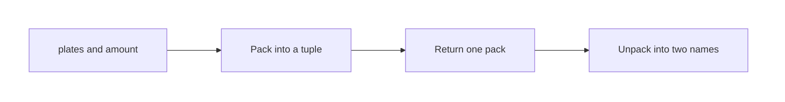
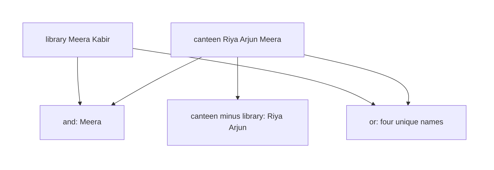

# Python — Sets, Tuples & Dictionaries

## What You Will Learn in This Lesson

In the previous session you stored text in a string and an editable row in a list. A list is the right box when order matters and you expect to add or remove items.

Not every collection should behave that way. Sometimes the pack must stay fixed. Sometimes repeats are a mistake. Sometimes you need to find a value by a label, the way a UPI app finds a name and shows an amount.

This lesson adds **tuples**, **sets**, and **dictionaries**, then a short way to choose among them and a list.

By the end of this lesson, you will be able to:

- Build an ordered, immutable **tuple**, including a packed pair
- Build a **set** of unique values and use `add`, `remove`, and `&`, `|`, `-`
- Store **key–value** pairs and use `get`, `keys`, `values`, `items`, `update`, and a loop
- Pick a list, tuple, set, or dictionary for a small real job

---

## Tuples — A Fixed Pack

- **Official Definition:** A **tuple** is an ordered collection written in parentheses. Once created, its items cannot be added, removed, or replaced. That property is immutability.
- **In Simple Words:** A tuple is a sealed pack. You can look inside by position. You cannot reshuffle the pack.
- **Real-Life Example:** A mark slip `(78, "Pass")` pairs a score with a result word. Those two facts belong together and should not be edited by accident.

```python
slip = (78, "Pass")  # A tuple: marks, then the result word
print(slip)  # Print the whole pack
print(slip[0])  # First item, index 0: 78
print(slip[1])  # Second item: Pass
print(len(slip))  # Two items
```

**How the code works:**

- Parentheses and a comma create the tuple. The comma matters more than the parentheses.
- Indexing starts at `0`, the same rule you used for lists and strings.
- `len` counts items in the pack.
- You can read `slip[0]`. You cannot assign `slip[0] = 80`. That raises `TypeError`.

A one-item tuple needs a trailing comma. Without it, Python sees only parentheses around a value, not a tuple.

```python
only_marks = (78,)  # The comma makes a one-item tuple
print(only_marks)  # Print (78,)
print(len(only_marks))  # One item
not_a_tuple = (78)  # Parentheses alone do not make a tuple
print(not_a_tuple)  # This prints 78, a plain number
```

**How the code works:**

- `(78,)` is a tuple of length `1`.
- `(78)` is just the number `78` grouped in parentheses.
- Use the trailing comma whenever a tuple has a single item.
- Longer tuples do not need a special extra comma at the end.

### Packing

- **Official Definition:** **Packing** puts several values into one tuple in a single assignment. **Unpacking** copies those items back out into separate names, in order.
- **In Simple Words:** Packing seals two or three facts into one box. Unpacking opens the box into named variables.
- **Real-Life Example:** A canteen counter packs `(token, amount)` as ` (14, 40) `. Later the receipt line unpacks the token and the amount into two names.

```python
token_and_bill = 14, 40  # Pack two numbers into a tuple without calling a function
print(token_and_bill)  # (14, 40)
token, bill = token_and_bill  # Unpack in the same order
print(token)  # 14
print(bill)  # 40
```

**How the code works:**

- A comma between values packs a tuple even when you omit the parentheses.
- Unpacking needs the same number of names as items. Two items need two names.
- The order is the contract. `bill, token = token_and_bill` would swap the meanings.
- If the counts differ, Python raises `ValueError`.
- Packing is how a function can hand back two facts at once. You already know `return`. `return 14, 40` packs a tuple for the caller.

```python
def token_bill(plates):  # A small function you already know how to define
    amount = plates * 40  # 40 rupees a plate in this example
    return plates, amount  # Pack the two results into one tuple

got_plates, got_amount = token_bill(3)  # Unpack the returned pair
print(got_plates)  # 3
print(got_amount)  # 120
```

**How the code works:**

- `return plates, amount` is packing. The caller receives one tuple.
- The left side of the assignment unpacks that tuple.
- `token_bill(3)` returns `(3, 120)`.
- This does not teach a new kind of function. It only shows why a tuple is a useful pack.
- The tuple itself stays immutable after it is returned. You read it by unpacking or by index.



---

## Sets — Unique Values, No Promised Order

- **Official Definition:** A **set** is an unordered collection of unique items, written in curly braces. A duplicate add does not create a second copy.
- **In Simple Words:** A set is a bag that keeps each value only once. Do not trust it to remember the order you typed.
- **Real-Life Example:** A canteen loyalty card should store each student roll once. Scanning the same roll again must not create a second entry.

```python
rolls = {"CS01", "EC02", "CS01"}  # The second CS01 is a duplicate
print(rolls)  # CS01 and EC02 only; order on screen may vary
print(len(rolls))  # Two unique items
```

**How the code works:**

- Curly braces with commas create a set, when the items are not `key: value` pairs.
- `"CS01"` appears twice in the literal, but the set keeps it once.
- `len` is `2`.
- Because a set is unordered, do not use an index. `rolls[0]` raises `TypeError`.

An empty set is not `{}`. Empty curly braces make a dictionary. Use `set()` for an empty set.

```python
seen = set()  # Start an empty set
print(len(seen))  # Zero items
seen.add("UPI-14")  # Add one payment reference
seen.add("UPI-15")  # Add a different reference
seen.add("UPI-14")  # Duplicate: the set stays the same size
print(len(seen))  # Two items
seen.remove("UPI-15")  # Remove that reference
print(len(seen))  # One item left
```

**How the code works:**

- `add` puts an item in if it is not already there.
- Adding a duplicate does not raise an error and does not increase `len`.
- `remove` deletes by value. If the value is missing, Python raises `KeyError`.
- There is no position to `pop` by index in the list sense. You remove a known value.
- Build the set with `set()` when you start from nothing, then `add`.

### Combining Sets

- **Official Definition:** **`&`** is the intersection: items in both sets. **`|`** is the union: items in either set, still unique. **`-`** is the difference: items in the left set that are not in the right set.
- **In Simple Words:** `&` means “both”. `|` means “either, but no doubles”. `-` means “only on the left”.
- **Real-Life Example:** One club list and one team list. Students on both lists, students on at least one list, and students only in the club are three different questions.

```python
canteen = {"Riya", "Arjun", "Meera"}  # Students who ate at the canteen
library = {"Meera", "Kabir"}  # Students who visited the library
print(canteen & library)  # Only Meera is in both
print(canteen | library)  # Riya, Arjun, Meera, Kabir, each once
print(canteen - library)  # Riya and Arjun: canteen but not library
```

**How the code works:**

- `&` keeps only shared names. Here that is `Meera`.
- `|` joins the names and drops the extra `Meera`.
- `-` reads from left to right. `library - canteen` would be `Kabir` only.
- These operators return new sets. They do not edit `canteen` or `library`.
- Printed order may differ from the order in this sentence. Membership is what matters.



---

## Dictionaries — A Value for Each Label

- **Official Definition:** A **dictionary** stores **key–value** pairs. You look up a value by its key, not by a shifting position. Keys are unique.
- **In Simple Words:** It is a labelled drawer. The label is the key. The thing inside is the value.
- **Real-Life Example:** A marks sheet maps `"Maths"` to `78` and `"Science"` to `86`. You ask for Maths. You do not hope Maths stayed at index `0`.

```python
marks = {"Maths": 78, "Science": 86}  # Two keys, each with one mark
print(marks["Maths"])  # Look up by key: 78
print(len(marks))  # Two pairs
marks["English"] = 91  # Add a new pair
print(marks["English"])  # 91
marks["Maths"] = 80  # Replace the value for an existing key
print(marks["Maths"])  # 80, not a second Maths key
```

**How the code works:**

- Each pair is `key: value`, separated by commas, inside curly braces.
- `marks["Maths"]` uses the key. A missing key used this way raises `KeyError`.
- Assigning a new key adds a pair. Assigning an old key replaces the value.
- Keys stay unique. There is still one `"Maths"` after the update.
- `len` counts pairs, not the digits inside a mark.

### `get` Instead of a Crash

- **Official Definition:** **`get`** returns the value for a key, or a default you choose when the key is absent. It does not raise `KeyError` for a missing key.
- **In Simple Words:** Ask politely. If the label is missing, take the fallback instead of crashing.
- **Real-Life Example:** A UPI screen asks for `"note"`. If the payer left no note, show `"No note"` rather than failing.

```python
upi = {"payer": "Ananya", "amount": 250}  # A small payment record
print(upi.get("payer"))  # Ananya, because the key exists
print(upi.get("note"))  # None, because note was never stored
print(upi.get("note", "No note"))  # The fallback string when note is missing
print(upi.get("amount", 0))  # 250, so the fallback 0 is not used
```

**How the code works:**

- `get` with one argument returns `None` when the key is missing.
- `get` with two arguments returns the second argument only when the key is missing.
- A present key never returns the fallback. `"amount"` returns `250`.
- `upi` itself is unchanged by `get`.
- Use square brackets when a missing key really is a bug. Use `get` when absence is normal.

### `keys`, `values`, and `items`

- **Official Definition:** **`keys`** yields the labels. **`values`** yields the stored values. **`items`** yields each pair as a `(key, value)` tuple.
- **In Simple Words:** You can walk the labels, the contents, or both together.
- **Real-Life Example:** A fee desk can print every head (`"Tuition"`) or every amount, or both on one line.

```python
fees = {"Tuition": 40000, "Mess": 2500}  # Two fee heads
print(list(fees.keys()))  # The labels, as a list so the print is stable to read
print(list(fees.values()))  # 40000 and 2500
for head, amount in fees.items():  # Unpack each pair
    print(head)  # Print the fee head
    print(amount)  # Print the amount for that head
```

**How the code works:**

- `keys` and `values` follow the order the pairs were inserted.
- Wrapping them in `list` is only so this lesson can print them in one line. You can also loop them directly.
- `items` gives pairs. The `for` line unpacks each pair into `head` and `amount`.
- The loop prints `Tuition`, then `40000`, then `Mess`, then `2500`.
- Looping `for head in fees` visits keys only. Use `items` when you need both.

### `update`

- **Official Definition:** **`update`** copies pairs from another dictionary into this one. A shared key is overwritten. A new key is added.
- **In Simple Words:** Merge a second labelled sheet into the first. Repeated labels keep the new value.
- **Real-Life Example:** The exam cell has Maths and Science. A later sheet adds English and corrects Science. One `update` applies that sheet.

```python
marks = {"Maths": 78, "Science": 86}  # Current sheet
extra = {"Science": 90, "English": 91}  # A correction and a new subject
marks.update(extra)  # Merge extra into marks
print(marks["Science"])  # 90, the newer value
print(marks["English"])  # 91, newly added
print(marks["Maths"])  # 78, untouched because extra did not mention Maths
print(len(marks))  # Three pairs
```

**How the code works:**

- `update` edits `marks` in place.
- `"Science"` already existed, so `90` replaces `86`.
- `"English"` is new, so a pair is added.
- `"Maths"` is left alone.
- `extra` is not cleared by the merge. It still holds its own pairs.

### Loop the Record

You will often loop `items` and make a small decision with `if`, which you already know.

```python
marks = {"Maths": 78, "Science": 90, "English": 91}  # After the update above
passed = 0  # Count how many subjects are at least 40
for subject, score in marks.items():  # Visit each pair
    print(subject)  # Show the subject name
    if score >= 40:  # The pass line from earlier lessons
        passed = passed + 1  # This subject clears the line
print(passed)  # All three clear, so 3
```

**How the code works:**

- Each round unpacks one key and one value.
- The `if` uses the value, not the key.
- `passed` ends at `3` because `78`, `90`, and `91` are all at least `40`.
- The dictionary is not modified by this loop.
- If one score were `35`, `passed` would be `2` and that subject would still be printed.

---

## Which Collection Fits the Job

You already know lists: ordered, repeats allowed, editable. Do not relearn `append` here. Use this comparison when you choose a box.

| Need | Choose | Why |
|------|--------|-----|
| A canteen queue people can join or leave | List | Order matters and the row changes |
| A fixed pair such as token and amount | Tuple | Order matters and the pack should not change |
| Student rolls with no duplicates | Set | Uniqueness matters more than order |
| Subject name to marks | Dictionary | You look up by a label |

- A list answers “who is in seat 0?”.
- A tuple answers “keep these facts glued and unchanged”.
- A set answers “is this roll already recorded?”.
- A dictionary answers “what is stored under this label?”.

If you need both order and uniqueness, this lesson does not add a new type. You pick the need that matters more, or you keep a list and check before you add. The four boxes above cover the jobs in this lesson.

---

## A Fee Desk in Three Boxes

The same morning at a college counter can need all three new collections. The examples stay small on purpose.

```python
window = ("Fee counter", 2)  # Tuple: counter name and window number, fixed for the day
print(window[0])  # Fee counter
print(window[1])  # 2
paid_rolls = set()  # No one has paid yet
paid_rolls.add("CS01")  # First student pays
paid_rolls.add("EC02")  # Second student pays
paid_rolls.add("CS01")  # Same roll again; still one CS01
print(len(paid_rolls))  # 2
print("CS01" in paid_rolls)  # True, the roll is in the set
print("ME09" in paid_rolls)  # False, that roll has not paid
```

**How the code works:**

- The tuple records facts that should not be edited during the day.
- `in` asks whether a value is in the set. It answers `True` or `False`.
- The second `add("CS01")` does not change the length.
- `"ME09" in paid_rolls` is `False` without an error.
- You still do not index the set. Membership is the question a set answers well.

The amounts live in a dictionary because each roll needs its own figure.

```python
paid_amount = {"CS01": 2500, "EC02": 2500}  # Roll to mess amount
paid_amount.update({"EC02": 3000, "ME09": 2500})  # Correct EC02 and add ME09
print(paid_amount.get("EC02"))  # 3000
print(paid_amount.get("CS01"))  # 2500, not mentioned in update
total = 0  # Start a running total
for roll, amount in paid_amount.items():  # Visit each pair
    print(roll)  # Print the roll
    total = total + amount  # Add this amount
print(total)  # 2500 + 3000 + 2500 = 8000
print(len(paid_amount))  # Three rolls
```

**How the code works:**

- `update` replaces `EC02` and adds `ME09`.
- `CS01` stays `2500`.
- The loop adds every value, so the total is `8000`.
- `len` counts keys after the merge, which is `3`.
- This is lookup plus a loop. It is not a new list method.

| Step | `paid_amount` keys after the step | `EC02` value |
|------|-----------------------------------|--------------|
| After the literal | `CS01`, `EC02` | `2500` |
| After `update` | `CS01`, `EC02`, `ME09` | `3000` |
| After the loop | same three keys | `3000` |

The loop reads the dictionary. It does not add or delete keys. If the total were `7500`, the old `EC02` value of `2500` was still being used.

---

## Activity: Pack and Look Up

Predict the prints.

```python
pair = ("Tea", 40)  # A fixed canteen pair
name, price = pair  # Unpack
print(name)  # First print
print(price)  # Second print
menu = {"Tea": 40, "Samosa": 20}  # Labelled prices
print(menu.get("Coffee", 0))  # Third print
```

**Check your answer:**

- The first print is `Tea`.
- The second print is `40`.
- The third print is `0`, because `"Coffee"` is missing and the fallback is `0`.
- If the third print is an error, the code used `menu["Coffee"]` instead of `get`.
- If unpacking fails, the left side does not have two names for the two items.

---

## Activity: Who Is in Both?

`hostel = {"Riya", "Arjun", "Meera"}` and `team = {"Arjun", "Kabir"}`.

Predict:

1. `hostel & team`
2. `hostel | team` as a count, using `len`
3. `hostel - team`

**Check your answer:**

- The intersection is a set containing `Arjun` only.
- The union has four unique names, so `len` is `4`.
- The difference is a set containing `Riya` and `Meera`.
- Printed order inside a set may vary. The members must match.
- If `Kabir` appears in the difference, the subtraction was written as `team - hostel`.

---

## Mistakes with These Collections

| What you see | Likely cause | What to change |
|--------------|--------------|----------------|
| `TypeError` on `slip[0] = ...` | Tuples are immutable | Build a new tuple if the facts must change |
| `(78)` is not a tuple | The comma is missing | Write `(78,)` |
| `TypeError` on `rolls[0]` | Sets have no index | Test membership or loop the values |
| Duplicates vanished | A set keeps each value once | Use a list if repeats must stay |
| `KeyError` | The key is missing and you used `[]` | Use `get` with a fallback, or add the key |
| `update` “lost” a value | The same key arrived again | The later value replaces the earlier one |
| `{}` is not an empty set | Empty braces are a dictionary | Use `set()` |

Square brackets on a dictionary expect a key. Square brackets on a tuple expect an index. The same symbols do different jobs.

---

## Quick Checks Before You Leave

Read each line as a yes or no. The answers sit underneath so you can cover them first.

- Does `(14, 40)[0]` equal `14`?
- Does a set keep two copies of `"CS01"`?
- Does `{"Tea": 40}.get("Coffee", 0)` equal `0`?
- Does `{"A", "B"} | {"B", "C"}` contain three unique values?

**Check your answer:**

- Yes. Index `0` of that tuple is `14`.
- No. A set stores `"CS01"` once.
- Yes. The missing key returns the fallback `0`.
- Yes. The union is `"A"`, `"B"`, and `"C"`.

If any answer disagreed, redo that one operator on paper before the upcoming session.

---

## Key Takeaways

- A tuple is ordered and immutable. Pack several values with commas, and unpack them in the same order.
- A set keeps unique values and does not promise order. `add` and `remove` edit it. `&`, `|`, and `-` build a new set.
- A dictionary maps each unique key to a value. `get` can supply a fallback. `keys`, `values`, and `items` let you walk the record. `update` merges pairs.
- Choose a list for an editable order, a tuple for a fixed pack, a set for uniqueness, and a dictionary for lookup by label.

The upcoming session is an introduction to GenAI and LLMs: how a language model produces a reply, and how a clear brief changes the reply you get.

---

## Important Commands, Libraries, and Terminologies

| Term or syntax | What it means in this lesson |
|----------------|------------------------------|
| Tuple | Ordered, immutable pack in parentheses |
| Index on a tuple | Read an item by position, starting at `0` |
| One-item tuple | `(value,)` with a trailing comma |
| Packing | Several values combined into one tuple |
| Unpacking | Copying tuple items into names, in order |
| Set | Unordered unique items in curly braces |
| `set()` | An empty set |
| `add` | Put a value into a set if it is not already there |
| `remove` | Delete a value from a set |
| `&` | Intersection: items in both sets |
| `\|` | Union: items in either set, still unique |
| `-` | Difference: left-set items that are not in the right set |
| Dictionary | Key–value pairs |
| Key | The label you look up; unique inside one dictionary |
| `get` | Value for a key, or a fallback if the key is missing |
| `keys` / `values` / `items` | Walk labels, contents, or both |
| `update` | Merge pairs; shared keys take the new value |
| `KeyError` | Raised when `[]` uses a missing key |
