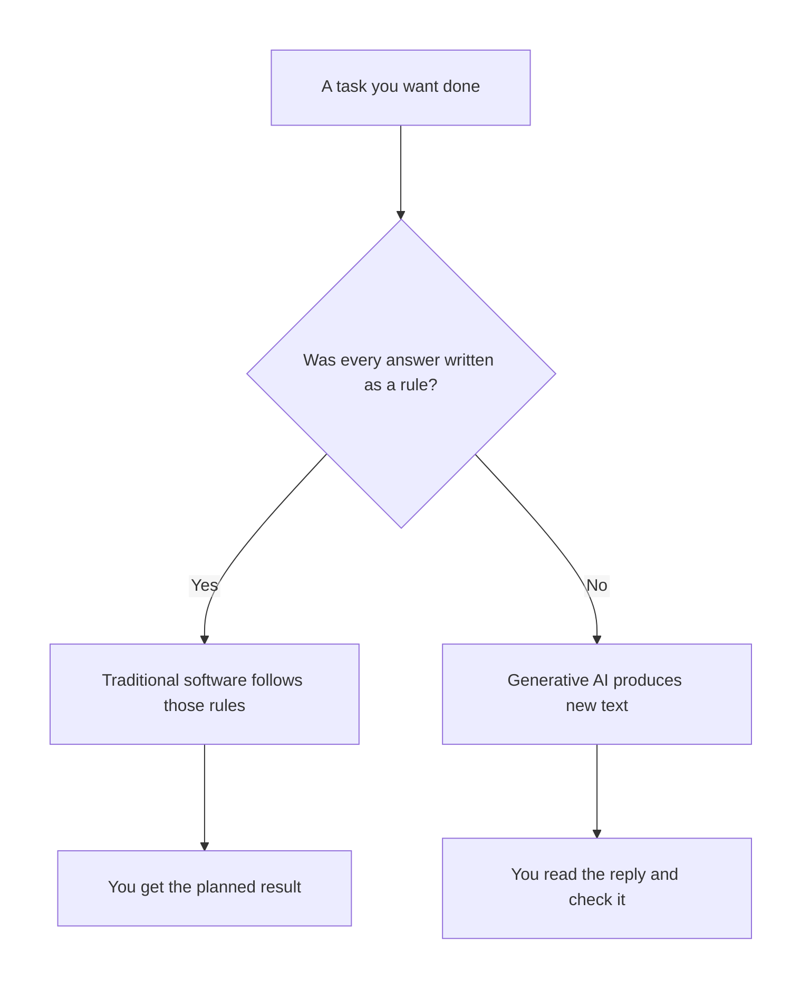
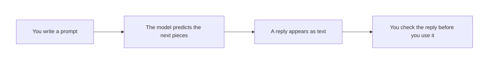
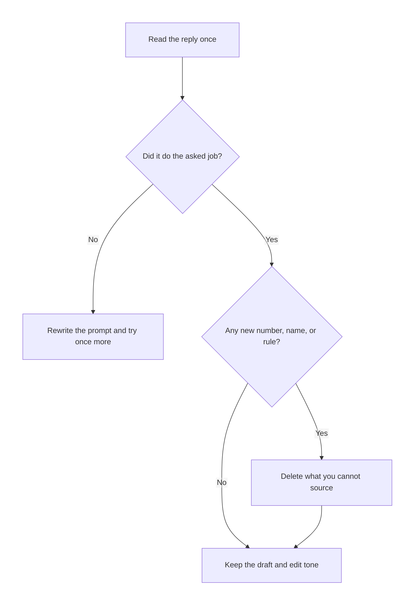

# AI — Introduction to GenAI & LLMs

## What You Will Learn in This Lesson

In the previous session you worked with Python data: lists of values, pieces of text, and dictionaries that store a name next to a value. That practice with text and stored facts is enough background for today. This lesson does not ask you to write Python.

Today you will see how ordinary software differs from software that **writes new text**. You will learn what **artificial intelligence**, **generative AI**, and a **large language model** mean in plain words.

You will also see how a model continues text, what a **token** and a **prompt** are, why a confident reply can still be wrong, and where these tools help or fail.

By the end, you will be able to:

- Separate rule-based software from software that generates new text
- Explain generative AI and a large language model without technical internals
- Describe next-word prediction and a token in everyday language
- Recognise a prompt, a hallucination, and a reply you must check
- Judge what these tools are good at and what they are weak at

---

## Two Kinds of Software

Most software you already use follows rules a person wrote in advance. A new kind of software can produce text that was not stored as a fixed answer.

- A UPI app checks a balance because a programmer wrote the steps for that check.
- A chatbot can draft a leave message you have never stored on your phone.
- Both are software. They do not work in the same way.

| Question | Traditional software | Generative software |
|----------|----------------------|---------------------|
| Who decides the exact output? | A person, through rules | A model, by continuing likely text |
| Same input again | Usually the same planned result | Often a similar but not identical reply |
| Typical job | Calculate, store, look up, enforce a rule | Draft, rewrite, explain, brainstorm |
| When it is wrong | A rule was missing or a value was wrong | The text sounds smooth and can still be false |



- **Official Definition:** **Traditional software** carries out instructions a human wrote, so each allowed input maps to a result those instructions already define.
- **In Simple Words:** It is a strict recipe. If the recipe says “add the bill,” the program adds the bill. It does not invent a new recipe.
- **Real-Life Example:** A railway ticket window system charges the fare written in its rules. It does not compose a poem about your journey.

Keep this split in mind. The rest of the lesson is about the second kind, and about the care it needs.

---

## What Artificial Intelligence Is

People use the word **AI** for many products. In this lesson it means software that performs a task we usually associate with human judgement, such as recognising, sorting, or producing language.

- **Official Definition:** **Artificial intelligence (AI)** is software that performs tasks which normally need human-like judgement, by following learned patterns or carefully designed decision steps.
- **In Simple Words:** The computer does a job that feels “smart,” such as spotting spam or drafting a sentence, without you writing every possible sentence yourself.
- **Real-Life Example:** Your phone suggesting the next word while you type a WhatsApp message is a small AI feature. A calculator that only adds numbers is not trying to judge language.

AI is a wide label. It includes tools that only **classify** and tools that **create**.

| Tool | What it does | Kind of AI |
|------|----------------|------------|
| Spam filter | Marks a mail as spam or not spam | Decides a label |
| Face unlock | Matches a face to a saved pattern | Recognises |
| Maps traffic colour | Estimates delay from past trips | Predicts a number or label |
| Chatbot that writes a paragraph | Produces new sentences | Generates text |

- A label is not a new essay. “This mail is spam” is a decision.
- A generated paragraph did not exist as a stored sentence in your notes.
- A common doubt: *“Is every app AI?”* No. An app that only opens a fixed menu is ordinary software.

You do not need the mathematics of how a model is trained. You need the behaviour: input goes in, and a useful judgement or a new text comes out.

---

## What Generative AI Is

**Generative AI** is the part of AI that **creates** new content. In this lesson the content is text.

- **Official Definition:** **Generative AI** is AI that produces new content, such as sentences, summaries, or lists, instead of only choosing a label from a fixed set.
- **In Simple Words:** You describe what you need, and the tool writes something new that fits the request.
- **Real-Life Example:** Asking a tool to turn rough hostel-mess notes into a short complaint message is generative. Asking a filter “is this mail spam?” is not.

Generative does not mean “true.” It means “newly written in a form that fits the request.”

| You ask for | A classifier returns | A generative tool returns |
|-------------|----------------------|---------------------------|
| Is this review angry? | Yes or no | Not required for this job |
| Rewrite this review politely | A label is not enough | A new polite paragraph |
| List three hostel rules in simple words | A yes/no cannot do this | Three freshly worded lines |

- The tool is assembling likely language. It is not opening your college rulebook unless you paste the rulebook in.
- Two students can receive two different wordings for the same request. Both can be useful. Either can be wrong.
- A common doubt: *“If it generated it, did it copy one web page?”* Not as a normal step you can see. It produces a continuation. That continuation can still resemble common phrases, and it can still be incorrect.

The next sections name the kind of model that does this text work, and the simple idea behind how it continues a sentence.

---

## What a Large Language Model Is

The text tools in this lesson are **large language models**, often called **LLMs**.

- **Official Definition:** A **large language model (LLM)** is a generative AI model trained on a very large amount of text so that it can continue and reshape language in response to what you type.
- **In Simple Words:** It is a text-prediction system that has read far more writing than one person could, and it uses that experience to draft a reply.
- **Real-Life Example:** The chat box inside a writing assistant, where you type “explain GST in simple words,” is an LLM product. The assistant is the shop window. The LLM is the engine that writes the reply.

An LLM is not a person, a search page, or a private diary of your files.

| It is | It is not |
|-------|-----------|
| A system that continues text | A classmate who “knows” you |
| Trained on lots of public-style writing | A live copy of every website at this minute |
| Able to draft, explain, and rephrase | A guaranteed source of facts |
| Useful when you check the result | Allowed to see files you did not provide |

- “Large” refers to the huge amount of text used in training and the size of the model. You do not need the internal design.
- The model does not remember your life between products unless that product stores the chat for you. Do not assume a new chat knows your hostel or your marks.
- A common doubt: *“Does it look up the answer like a library?”* In the basic picture of this lesson, it **continues text**. Some products add search on top. If you did not see a source, do not invent one.

You will now look at that continuation in the simplest possible way: the next small piece of text.

---

## Next-Word Prediction in Plain Words

An LLM’s basic move is to guess a **likely next piece** of text, then another, then another, until a reply is long enough.

- **Official Definition:** **Next-word prediction** is the process of choosing a probable continuation for the text so far, one small piece at a time, until a full reply is formed.
- **In Simple Words:** It is a very advanced version of the word suggestions on your phone keyboard. It does not jump to a stored essay. It keeps asking, “what fits next?”
- **Real-Life Example:** If the text so far is “Please close the,” a likely next word is “door” or “window,” not “banana.” The model picks a likely piece and then continues.

Walk through a tiny completion. No single answer is the only legal one.

| Text so far | A likely next piece | An unlikely next piece |
|-------------|---------------------|------------------------|
| Good morning, | class / team | calculator |
| The shop is | open / closed | photosynthesis |
| Two plus two is | four | Monday |
| I request leave | because / on | banana |

- The model prefers continuations that were common in the text it learned from.
- “Likely” is not the same as “true today.” A likely sentence about a bus fare can still name the wrong fare.
- A common doubt: *“Does it think?”* For this lesson, say it **predicts text**. Do not describe a mind inside the computer.

This is the whole mechanism you need. The next idea is the size of each piece it predicts.

---

## A Token Is a Small Piece of Text

Models do not always move one dictionary-word at a time. They move in **tokens**.

- **Official Definition:** A **token** is a small piece of text, often a whole word, a part of a word, a number, or a mark such as a comma, that the model reads and predicts.
- **In Simple Words:** Cut a sentence into small chunks. Each chunk is a token. The model eats and writes those chunks.
- **Real-Life Example:** In “The shop is open.” the pieces might be `The`, `shop`, `is`, `open`, and `.` — five small pieces, not one block called “the sentence.”

A longer or unfamiliar word can be more than one piece. You do not need the cutting rules.

| Text | A simple way to see the pieces | Point of the example |
|------|--------------------------------|----------------------|
| Please sit. | Please / sit / . | Words and the full stop are pieces |
| ₹120 | ₹ / 120 or a similar split | Symbols and numbers are pieces too |
| unhappiness | un / happiness, or another split | A long word may be more than one token |
| Pune | Pune | A short known word is often one token |

- You are not asked to count tokens by hand in an exam sense. You only need the idea.
- Because the model works in pieces, it can start a word, continue a word, and also mishandle a rare name.
- A common doubt: *“Is a token always one word?”* No. It is a **small piece**. Sometimes that piece is a word. Sometimes it is only part of a word.

The optional picture below is only an illustration of pieces. It is not a program.

```text
-- Sentence we want to split into small pieces
The shop is open.
-- One possible reading of the pieces
The | shop | is | open | .
-- What the model does next
predicts another piece, then another, until the reply stops
```

You now know what the model consumes and produces. The text **you** type to start that process is the prompt.

---

## What a Prompt Is

A **prompt** is the message you give the tool. At this stage, that is the whole definition you need.

- **Official Definition:** A **prompt** is the text you submit to a generative model to start or steer the text it produces.
- **In Simple Words:** It is your question, instruction, or pasted notes. The model’s reply is the continuation of that prompt.
- **Real-Life Example:** Typing “Explain a primary key in three short lines for a beginner” is a prompt. The paragraph that comes back is not the prompt. It is the reply.

A clearer prompt usually gets a more usable reply. You do not need a named formula. Name the job and the shape of the answer.

| Weak prompt | Clearer prompt | Why the second is easier to use |
|-------------|----------------|---------------------------------|
| Tell me about AI | Explain AI in five short lines for a beginner | Length and reader are named |
| Write something | Write a polite two-line leave message for fever | The task and the size are named |
| Fix this | Rewrite this sentence so a teacher can read it: … | The exact text is included |



- Put the source text in the prompt when you want a rewrite. The model cannot see your notebook.
- Ask for a short reply when you want something you can check quickly.
- A common doubt: *“Is a prompt a secret code?”* No. It is ordinary language. Clear language is enough for this lesson.

The reply can still be wrong. The name for a confident but unsupported falsehood is hallucination.

---

## Hallucination

A model can write a smooth sentence that is simply false. That failure is called a **hallucination**.

- **Official Definition:** A **hallucination** is model output that is presented as if it were factual, but is invented, distorted, or unsupported by a source you can check.
- **In Simple Words:** The tool sounds sure, and the fact is made up or mixed up. The tone is not proof.
- **Real-Life Example:** A reply says “Pune municipal bus fare from Deccan to Swargate is exactly ₹17 and has been since 2019,” with no notice you can open. If you did not verify the fare, you must treat that number as unchecked.

Why this happens, in plain words: the model is built to continue **likely** text. A likely sentence is not a checked record.

| Reply habit | What you should do |
|-------------|--------------------|
| A specific number, date, law, or quote | Check a real notice, book, or person |
| A person’s name attached to a saying | Do not repeat it until you find the saying |
| A confident “yes, the college rule is…” | Open the college rule, or paste the rule into the prompt |
| A draft of your own ideas | Useful, then you edit the facts |

- The model is not “lying” like a person who knows the truth and hides it. It is completing text.
- A hallucination can sit inside an otherwise helpful paragraph. Read line by line.
- A common doubt: *“If I ask it to be accurate, will hallucinations stop?”* They become less casual. They do not disappear. You remain the checker.

When you use these tools for study, separate **wording help** from **fact help**. Wording help is often strong. Fact help must be verified.

---

## What These Tools Are Good At and Weak At

Use an LLM where a draft is valuable and a mistake is easy to see. Do not use it as the only witness for a fact that matters.

| Strong use | Why it fits | Weak use | Why it fails |
|------------|-------------|----------|--------------|
| Rewrite a rough sentence | The meaning is already yours | Invent a citation | The paper may not exist |
| Summarise text you paste | The source is in the prompt | State today’s bus fare | It may not have that live fact |
| Explain a term in simple words | You can compare with class notes | Do exact marks arithmetic | A likely total can be wrong |
| List options for a project topic | You will pick and edit | Claim a private file’s contents | It cannot see what you did not give |
| Practise question wording | You learn by answering | Pretend to be your teacher’s official notice | It can forge an official tone |

- Good at: first drafts, simpler wording, examples, outlines, and “say this more politely.”
- Weak at: fresh facts, exact calculation, private data, and anything you cannot check.
- A common doubt: *“Should I avoid the tool?”* No. Use it for the draft. Keep the decision and the facts with you.

A short story ties the ideas together. Meera has messy notes from a Python practice class: a list of student names, a line of text, and a dictionary of one score. She pastes **her own notes** and asks for a four-line explanation a junior can read.

The tool returns clean sentences. One sentence adds “the class average was 86,” which was not in her notes. That extra number is a hallucination. She deletes it, keeps the clear wording, and submits only what she can point to in her own work.

That is the working habit of this lesson. Generate, then check, then keep.

---

## Activity 1: Traditional or Generative?

Label each item **T** for traditional software or **G** for generative AI. Write one short reason.

1. A calculator returns 25 for 5 × 5 because the multiply rule was programmed.
2. A tool writes a new three-line summary of a paragraph you pasted.
3. A turnstile opens only when a valid ticket code matches a stored code.
4. A chat box drafts a birthday wish you have not written before.
5. A spreadsheet formula adds the Amount column.
6. A tool suggests three different titles for a project you described.

**Check your answer**

1. **T.** The result is fixed by a written rule. Nothing new is composed.
2. **G.** A new summary is produced from your text.
3. **T.** Match or do not match is a rule against stored data.
4. **G.** The wish is newly written text.
5. **T.** The formula follows an instruction you set. It does not draft language.
6. **G.** New title options are generated. You still choose one.

---

## Activity 2: Pieces and a Sensible Continuation

Split each line into small pieces in a simple way. Then write **one sensible next piece**. More than one sensible answer can be correct. An unrelated word is not.

1. The library is
2. Please submit the
3. Good night

**Check your answer**

1. Pieces: `The` / `library` / `is`. A sensible next piece is `closed` or `open`. `mango` is not a sensible continuation.
2. Pieces: `Please` / `submit` / `the`. A sensible next piece is `form` or `assignment`. `river` is not.
3. Pieces: `Good` / `night`. A sensible next piece is `.` or `everyone`. The idea to check is “likely continuation,” not a single official word.

This activity practises tokens and next-piece prediction. It does not ask you to copy a model’s private rules.

---

## Activity 3: Find the Hallucination

Read the reply. The only facts you gave were: your name is Kabir, you study in Pune, and you want a two-line leave message for fever on Monday.

> Dear Sir, Kabir was absent on Monday because of fever. He is a gold medallist of the 2022 state olympiad, his attendance is 99.4 percent, and the principal has already approved this leave on the college portal.

1. List three claims that were **not** in the prompt.
2. Rewrite the leave message using only the facts you gave.
3. Say which part of the reply was still useful.

**Check your answer**

1. The gold medal, the 99.4 percent attendance, and the principal’s portal approval were not given. Each is a hallucination if you treat it as fact.
2. A safe message: “Respected Sir, I, Kabir, request leave for Monday because I have fever. I study in Pune and will complete any pending work after I return.”
3. The polite opening and the fever reason were useful. The extra achievements and the fake approval were not.

If a detail was not in your prompt and not in a source you checked, leave it out.

---

## A Worked Walk-Through You Can Copy

Use one hostel scene so the words stay concrete. Ananya wants a short message for her floor WhatsApp group. The water cooler was empty at 7 a.m. She wants the message to be polite and specific.

She does **not** start with “write something nice.” She writes a prompt that carries the facts.

| Piece she includes | Exact fact | Why it belongs in the prompt |
|--------------------|------------|------------------------------|
| Who will read it | Floor mates in the hostel group | Sets the tone |
| What happened | Cooler was empty at 7 a.m. | The only event |
| What she wants | Four polite lines and one request | Sets the shape |
| What she forbids | No blame, no invented complaint count | Blocks extra fiction |

A careful reading of the reply then uses four questions.

1. Did every event in the reply come from her prompt?
2. Did the tool add a time, a name, or a number she never gave?
3. Is the request something a warden or a floor mate can actually do?
4. Would she be willing to send the text with her own name on it?

If question 2 fails, she deletes the extra line and keeps the rest. That is generation plus a check. It is the full method of this lesson.

The same habit works on study notes. Paste a definition you already wrote. Ask for simpler words. Compare the new lines with your original definition. Keep the simpler words only when the meaning still matches.

| Study job | Paste this | Ask for this | You still check |
|-----------|------------|--------------|-----------------|
| Simplify a definition | Your own sentence | Four shorter lines | Meaning did not drift |
| Make examples | The term only | Two everyday examples | Examples are possible in real life |
| Outline an answer | The question paper line | Three headings | Headings match the question |
| Translate tone | A rude draft | A polite version | Facts stayed the same |

- Do not ask the tool to remember a chapter you did not paste.
- Do not ask it for the “official” marks of a test you have not seen.
- A common doubt: *“Can I ask for examples of a term?”* Yes. Then reject any example that could not happen, such as a shop that sells a negative number of notebooks.

---

## How a Reply Should Be Read

Read a reply in three passes. Each pass looks for a different failure.

| Pass | You look for | You fix by |
|------|----------------|------------|
| First | Did it do the job you named? | Asking again with a clearer shape |
| Second | Did it add facts you did not give? | Deleting those facts |
| Third | Could a beginner act on the wording? | Shortening long lines yourself |



- The first pass saves time. A beautiful paragraph that ignored the job is not progress.
- The second pass is the hallucination check. Confidence does not change this pass.
- The third pass is editing. You are still the author of anything you submit.

---

## Activity 4: Make a Prompt Clearer

Rewrite each weak prompt so the tool knows the job and the shape of the answer. Do not add fake facts.

1. `Tell me about databases.`
2. `Write my application.`

**Check your answer**

1. A clearer prompt: “Explain what a database is in four short lines for a beginner who has never studied computers.”
2. A clearer prompt: “Write a polite four-line leave application for a college student named Kabir who has fever on Monday. Do not add awards, attendance, or approvals I did not mention.”

A clearer prompt is still not a guarantee. You read the reply afterwards.

---

## Words People Mix Up

These pairs sound alike in conversation. They are not the same idea.

| People say | Precise meaning here | Not the same as |
|------------|----------------------|-----------------|
| AI | A wide label for judgement-like software | Only chatbots |
| Generative AI | Software that creates new content | A spam label |
| LLM | The text model behind a writing tool | The whole phone app, including buttons |
| Prompt | What you type in | The reply that comes out |
| Token | A small piece of text | A password or a fee |
| Hallucination | A false confident claim | A grammar mistake only |

- A grammar mistake is clumsy language. A hallucination can be perfect grammar and still be false.
- A token in this lesson is not a login token and not a coin.
- A common doubt: *“Is one brand name the definition of an LLM?”* A named product can **contain** an LLM. The product name is not the definition. Any similar text tool follows the same ideas.

Use the table when you hear a loose word in class. Replace it with the precise row before you answer.

One more everyday split helps. A **search box** finds pages that already exist. A **generative reply** writes sentences that may never have been stored as that exact paragraph.

| You need | Better first tool | Then you |
|----------|-------------------|----------|
| The college fee notice that was published | The college site or a search you can open | Read the notice itself |
| A simpler explanation of a paragraph you already have | A generative tool | Match it against the paragraph |
| A list of possible project titles | A generative tool | Pick one and make it specific |
| Today’s train platform | The railway app | Do not trust a chat line alone |

- Search and generation can sit in the same product. The habit does not change. If you cannot open a source, you do not have a source.
- A generated explanation of **your** pasted paragraph is fair to use after you compare meanings.
- A generated “notice” that you did not paste is not a notice. It is a draft that can pretend to be official.

---

## Common Doubts

- *“Will the same prompt always give the same paragraph?”* No. Generative tools often vary the wording. Check the meaning each time.
- *“Can I paste personal marks, passwords, or ID numbers?”* Do not paste secrets. A prompt is data you are handing to a product.
- *“Is a long prompt always better?”* A long prompt that hides the task is worse than a short prompt that names the task and includes the source text.
- *“If the grammar is perfect, is the fact true?”* No. Grammar is a strength of these tools. Truth is your job.
- *“Did we learn how the model is built inside?”* No. You learned the behaviour: prompt in, predicted text out, then a human check.

---

## Key Takeaways

- Traditional software follows written rules. Generative AI produces new text, and a large language model is the text engine behind that behaviour.
- The model continues text one small piece at a time. A token is one of those pieces, and a prompt is the text you submit to start the reply.
- A smooth reply can hallucinate. Use these tools to draft and explain, and check numbers, names, rules, and citations yourself.
- In the next session you will leave text prediction and look at how stored records sit in tables, and how a simple question language asks those tables for rows.

---

## Important Commands, Libraries, and Terminologies

| Term | What it means in this lesson |
|------|------------------------------|
| **Traditional software** | Software that follows rules a person wrote for a planned result |
| **Artificial intelligence (AI)** | Software that does a judgement-like task such as labelling or generating language |
| **Generative AI** | AI that creates new content, here new text, rather than only a label |
| **Large language model (LLM)** | A text model that continues and reshapes language from a prompt |
| **Next-word prediction** | Choosing a likely next piece of text, then another, to form a reply |
| **Token** | A small piece of text, such as a word, part of a word, number, or mark |
| **Prompt** | The instruction, question, or source text you submit |
| **Reply** | The text the model returns after the prompt |
| **Hallucination** | A confident claim that is invented or not supported by a source you can check |
| **Check** | Your step of comparing the reply with notes, a notice, or simple reasoning |
| **Classifier** | An AI tool that returns a label, such as spam or not spam, and does not write a new essay |
| **Draft** | A first wording you will edit before you rely on it |
| **Search** | Finding a page or notice that already exists, which is different from writing a new paragraph |
| **Source** | A notice, book, or pasted note you can point to when a fact is challenged |
