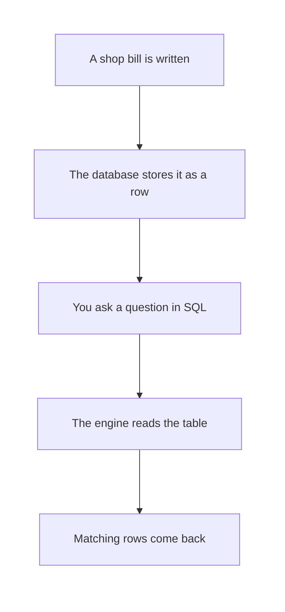
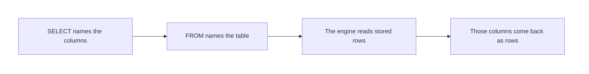

# SQL — Introduction to SQL & Databases

## What You Will Learn in This Lesson

In the previous session you saw how a text tool drafts language, and why you still check facts yourself. That habit stays useful. This lesson is about a different job: keeping records in a table and asking for them back.

You will learn why a database exists, what a table, a row, a column, and a primary key are, and what SQL is. You will store four shop orders and ask the table to show those rows.

Examples in this lesson use MySQL-style SQL. A query is a question. The engine returns rows. Filtering those rows, and functions on values, come in the next session.

By the end, you will be able to:

- Explain why related records belong in a database table
- Name a table, a row, a column, and a primary key in plain words
- Write `CREATE TABLE` and `INSERT` for a small orders table
- Write `SELECT` to return every column, or only the columns you name
- Read a result as the engine’s answer, not as a new story

---

## Why Databases Exist

A list in a notebook works until many people need the same facts, and those facts must stay complete.

- **Official Definition:** A **database** is an organised store of related records that a software engine can keep, protect, and return when a question is asked.
- **In Simple Words:** It is a shared, structured notebook that does not depend on one person’s memory or one messy file.
- **Real-Life Example:** A stationery shop in Pune sells notebooks, pens, and folders. The owner stops writing each bill only on a loose slip. The slips get lost. A database keeps each order as one stored record.

| Everyday problem | What goes wrong | What a database changes |
|------------------|-----------------|-------------------------|
| Bills on loose paper | A slip is lost | The record stays in a table |
| The same name spelled three ways in a chat | Nobody can count sales | Columns keep each fact in one place |
| Two people edit one spreadsheet cell | One save wipes the other | The engine stores rows as records |
| “I think the amount was 120” | Memory is not a record | The stored amount is the record |



- A database is not a paragraph and not a chat reply. It is stored structure.
- This lesson uses one small table so you can see every value. Real shops have many more rows. The idea is the same.
- A common doubt: *“Is an Excel file a database?”* A sheet can hold a table. A database engine is built to store many tables and answer questions in SQL. You are learning that engine’s language.

The shop example stays with you for the whole lesson. Four orders are enough to see the shape.

---

## Tables, Rows, Columns, and a Primary Key

A database holds **tables**. A table looks like a grid with a fixed set of headings.

- **Official Definition:** A **table** is a named grid of related records. A **column** is one kind of fact. A **row** is one complete record. A **primary key** is a column whose value identifies exactly one row.
- **In Simple Words:** The table is the register. Each column is a heading. Each row is one order. The primary key is the order number that never repeats.
- **Real-Life Example:** Order 1 is Asha’s notebook bill. Order 2 is Ankit’s pen-set bill. They share the same headings, and they never share the same order number.

Picture the four orders you will store:

| order_id | customer_name | item_name | city | quantity | amount | order_date |
|----------|---------------|-----------|------|----------|--------|------------|
| 1 | Asha Patil | Notebook | Pune | 2 | 120.50 | 2024-03-12 |
| 2 | Ankit Rao | Pen Set | Pune | 1 | 80.00 | 2024-06-01 |
| 3 | Meera Shah | Notebook | Nashik | 3 | 180.00 | 2023-11-20 |
| 4 | Ravi Kumar | Folder | Jaipur | 1 | 45.75 | 2024-01-09 |

| Word | In this table | What must stay true |
|------|----------------|---------------------|
| Table | `orders` | The name refers to this grid |
| Column | `city`, `amount`, and the other headings | Every row has the same headings |
| Row | Asha’s line, or any one order | One row is one order |
| Primary key | `order_id` | 1, 2, 3, and 4 are all different |

- `order_id` is a good primary key because the shop assigns it and does not reuse it.
- `customer_name` is a weak key. Two customers can share a name. Asha can also place a second order later.
- A common doubt: *“Is the first column always the primary key?”* No. The primary key is the column you **choose** as the unique identity. Here that choice is `order_id`.

Amounts use rupees with paise, so `120.50` means one hundred twenty rupees and fifty paise. Dates use the form year-month-day.

---

## What SQL Is

You talk to the database by writing **SQL**.

- **Official Definition:** **SQL (Structured Query Language)** is the language used to define tables, store rows, and ask the engine to return data.
- **In Simple Words:** SQL is how you say “build this register,” “add this bill,” and “show me these columns.”
- **Real-Life Example:** Instead of scrolling a notebook, you write a short question and the engine brings back the rows.

This lesson uses three statements only.

| Statement | Job in this lesson | Everyday meaning |
|-----------|--------------------|------------------|
| `CREATE TABLE` | Build an empty register with headings | Print a new blank register |
| `INSERT` | Add one stored order | Write one bill into the register |
| `SELECT` | Ask for columns and get rows back | Read the register out loud |

- A statement is one instruction, usually ending with a semicolon.
- The engine either changes the stored table or returns rows. `CREATE` and `INSERT` change storage. `SELECT` reads.
- A common doubt: *“Are capital letters required?”* `SELECT` and `select` both work in MySQL. These notes use capitals so keywords stand out from names such as `orders`.

You will create the table first, then insert the four bills, then ask questions.

---

## Creating the Orders Table

`CREATE TABLE` names the table and lists each column with a type. The type tells the engine what kind of value is allowed.

| Column | Type in these notes | Plain meaning |
|--------|---------------------|---------------|
| `order_id` | `INT` | A whole number |
| `customer_name` | `VARCHAR(40)` | Short text, up to 40 characters |
| `item_name` | `VARCHAR(40)` | Short text |
| `city` | `VARCHAR(30)` | Short text |
| `quantity` | `INT` | How many pieces |
| `amount` | `DECIMAL(8, 2)` | Money with two paise digits |
| `order_date` | `DATE` | A calendar date |

`PRIMARY KEY` sits on `order_id`. The engine rejects a second row that tries to reuse the same order number.

```sql
-- Build an empty orders table before any bill is stored
CREATE TABLE orders ( -- Start the list of columns
    order_id INT PRIMARY KEY, -- Unique whole number for one order
    customer_name VARCHAR(40), -- Name of the person who bought
    item_name VARCHAR(40), -- Product name on the bill
    city VARCHAR(30), -- City of the customer
    quantity INT, -- How many pieces were sold
    amount DECIMAL(8, 2), -- Bill amount in rupees and paise
    order_date DATE -- Date of the order, year-month-day
); -- End of the table definition
```

**How the code works:**

- `CREATE TABLE orders` creates a new empty table named `orders`.
- Each line inside the brackets is one column and its type.
- `order_id INT PRIMARY KEY` means the order number is a whole number and the identity of the row.
- `DECIMAL(8, 2)` allows a number with two digits after the decimal point.
- The semicolon ends the statement. After it runs, the register exists and still has no rows.

Run this once. Running it again on a table that already exists causes an error, because the name `orders` is already taken.

---

## Inserting Four Orders

`INSERT` adds rows. Each `VALUES` list must follow the same column order you named.

```sql
-- Store Asha's notebook order as row number 1
INSERT INTO orders ( -- Name the table that receives the row
    order_id, customer_name, item_name, city, quantity, amount, order_date -- Column order for the values
) -- End of the column list
VALUES ( -- Start the values for this one bill
    1, 'Asha Patil', 'Notebook', 'Pune', 2, 120.50, '2024-03-12' -- One complete order
); -- End of the insert
```

**How the code works:**

- `INSERT INTO orders` adds a row to `orders`.
- The column list fixes the order of the values that follow.
- Text and dates sit inside quotes. Numbers do not.
- After this statement, the table contains exactly one row, order 1.

Add the other three bills the same way.

```sql
-- Store Ankit's pen-set order as row number 2
INSERT INTO orders ( -- Same table as the first bill
    order_id, customer_name, item_name, city, quantity, amount, order_date -- Same column order
) -- End of the column list
VALUES ( -- Values for Ankit
    2, 'Ankit Rao', 'Pen Set', 'Pune', 1, 80.00, '2024-06-01' -- Order 2
); -- End of the insert
```

```sql
-- Store Meera's notebook order as row number 3
INSERT INTO orders ( -- Add another row, do not create a new table
    order_id, customer_name, item_name, city, quantity, amount, order_date -- Column order stays fixed
) -- End of the column list
VALUES ( -- Values for Meera
    3, 'Meera Shah', 'Notebook', 'Nashik', 3, 180.00, '2023-11-20' -- Order 3
); -- End of the insert
```

```sql
-- Store Ravi's folder order as row number 4
INSERT INTO orders ( -- Fourth stored bill
    order_id, customer_name, item_name, city, quantity, amount, order_date -- Column order stays fixed
) -- End of the column list
VALUES ( -- Values for Ravi
    4, 'Ravi Kumar', 'Folder', 'Jaipur', 1, 45.75, '2024-01-09' -- Order 4
); -- End of the insert
```

**How the code works:**

- Each statement adds one row. After all four, the table holds the picture at the start of the lesson.
- Order 3 is dated 2023 and the others are dated 2024. The table stores that. It does not sort itself for you.
- A repeated `order_id` such as a second `1` is rejected because `order_id` is the primary key.
- Text must match the quotes you type. `'Pune'` and `'pune'` are not automatically the same in every comparison you will meet later. Type the city the way you stored it.

The table is now data, not a drawing. The next step is to ask for it.

---

## Asking With SELECT and FROM

`SELECT` chooses columns. `FROM` names the table that holds the rows.

- **Official Definition:** A **query** is a `SELECT` statement that asks the engine a question. The engine answers with a set of rows made of the columns you named.
- **In Simple Words:** You point at the register and say which headings you want to see. The engine reads the stored rows and shows those headings.
- **Real-Life Example:** “Show me the customer and the amount for every bill” is a query. It is not a new bill. It does not change the four stored orders.

```sql
-- Ask for every column of every stored order
SELECT -- Start the question
    order_id, -- Show the order number
    customer_name, -- Show who bought
    item_name, -- Show the product
    city, -- Show the city
    quantity, -- Show how many pieces
    amount, -- Show the bill amount
    order_date -- Show the date
FROM orders; -- Read rows from the orders table
```

**How the code works:**

- `SELECT` lists the columns in the order you want them to appear.
- `FROM orders` tells the engine which table to read.
- No extra condition is present, so all four stored rows come back.
- The result is a grid. It is a view of the data, not a second copy you must maintain.

| order_id | customer_name | item_name | city | quantity | amount | order_date |
|----------|---------------|-----------|------|----------|--------|------------|
| 1 | Asha Patil | Notebook | Pune | 2 | 120.50 | 2024-03-12 |
| 2 | Ankit Rao | Pen Set | Pune | 1 | 80.00 | 2024-06-01 |
| 3 | Meera Shah | Notebook | Nashik | 3 | 180.00 | 2023-11-20 |
| 4 | Ravi Kumar | Folder | Jaipur | 1 | 45.75 | 2024-01-09 |

A star means “all columns.” It is shorter, and it is less clear about intent. Prefer named columns when you are learning.

```sql
-- Ask for all columns without naming each one
SELECT * -- The star means every column in the table
FROM orders; -- Read the same four rows
```

**How the code works:**

- `*` expands to every column that the table currently has.
- The four rows are the same four bills.
- If someone later adds a column, `SELECT *` would show that new column too. A named list would not, until you edit it.
- Use `SELECT *` to look at a tiny table. Use names when you want a precise question.



The engine does not invent Asha. If she is not stored, she cannot appear.

---

## Choosing Only Some Columns

You rarely need every heading. Name only the columns the question needs.

```sql
-- Ask only who bought and how much they paid
SELECT -- Choose a smaller set of columns
    customer_name, -- Keep the customer
    amount -- Keep the bill amount
FROM orders; -- Still read every stored order
```

**How the code works:**

- Two columns are requested, so the result has two columns.
- All four rows still appear, because this lesson does not filter rows.
- The stored table is unchanged. `order_id`, `item_name`, `city`, `quantity`, and `order_date` are simply not shown.
- Column order in the result follows the `SELECT` list, not the original table order.

| customer_name | amount |
|---------------|--------|
| Asha Patil | 120.50 |
| Ankit Rao | 80.00 |
| Meera Shah | 180.00 |
| Ravi Kumar | 45.75 |

Ask for the product and the city in that order.

```sql
-- Ask for the product and the city only
SELECT -- Start a two-column question
    item_name, -- First result column
    city -- Second result column
FROM orders; -- Source remains the orders table
```

**How the code works:**

- The result columns are `item_name` then `city`.
- Notebook appears twice because two stored rows sold a notebook. The query shows rows. It does not collapse them.
- Pune appears twice for the same reason. Asha and Ankit both live in the stored city Pune.
- Collapsing repeated values is not part of this lesson.

| item_name | city |
|-----------|------|
| Notebook | Pune |
| Pen Set | Pune |
| Notebook | Nashik |
| Folder | Jaipur |

One column is still a valid question.

```sql
-- Ask for the order number of every stored bill
SELECT -- A question can return a single column
    order_id -- Only the primary key values
FROM orders; -- One value from each row
```

**How the code works:**

- The result is 1, 2, 3, and 4, one per row.
- You are not asking the engine to count them. You are asking it to show them.
- Counting and sorting come in a later lesson. Here you only read what was stored.
- A query reads. It does not place a new order unless you wrote `INSERT`.
- Choosing fewer columns hides them in that answer. It does not delete them from the table.

---

## Reading the Result Like a Shopkeeper

Say the question in a sentence before you write it. Then match the sentence to `SELECT` and `FROM`.

| Shopkeeper’s sentence | SQL shape | Rows you should see |
|-----------------------|-----------|---------------------|
| Show every heading of every bill | Name all columns, or use `*` | 4 rows, 7 columns |
| Show who paid and how much | `customer_name`, `amount` | 4 rows, 2 columns |
| Show what was sold and where | `item_name`, `city` | 4 rows, 2 columns |
| Show only the bill numbers | `order_id` | 4 rows, 1 column |

- Four rows come back because four rows were stored and nothing in this lesson drops a row.
- Two notebooks do not become one line. Each order stays one row.
- A common doubt: *“Why is Meera’s date in 2023 while the others are in 2024?”* Because that is what was inserted. The engine does not “correct” old dates.
- An empty result is not an error. It means the table had no rows to show, which happens if you select before any insert.

---

## Mistakes That Look Small

These errors are common on a first day. Each one has a direct fix.

| What you wrote | What the engine does | Fix |
|----------------|----------------------|-----|
| `FROM order` | No table with that name | Use `orders` |
| `SELECT customer` | No column with that name | Use `customer_name` |
| A second insert with `order_id` 1 | Rejects the duplicate key | Use a new order number |
| `120.50` inside quotes as text | Stores text, or rejects it, depending on settings | Leave money unquoted |
| Forgot the semicolon | The statement may not run | End the statement |

- Column names in this lesson use underscores, not spaces: `customer_name`, not `customer name`.
- Quotes around `'Pune'` mark text. Quotes around `'1'` would mark the order number as text, which is not what `INT` expects.
- A common doubt: *“The colours of the letters changed and I think it failed.”* Colour is the editor. Trust the result grid or the error text, not the colour.

Write the question on paper in words, then translate. That order prevents most of these slips.

---

## Activity 1: Name the Parts

Use the stored picture. Do not write a new query yet.

1. What is the table name?
2. How many rows are stored?
3. Name two columns that hold text and one column that holds money.
4. Which value is the primary key of Meera’s order?
5. Why is `item_name` not a primary key in this table?

**Check your answer**

1. The table name is `orders`.
2. Four rows are stored, one per insert.
3. Text columns include `customer_name`, `item_name`, and `city`. The money column is `amount`.
4. Meera’s primary key is `3`.
5. `Notebook` appears on two rows. A primary key cannot repeat. `order_id` does not repeat.

---

## Activity 2: Predict the Result Grid

The four inserts have already run. Write the result of this query, including column names and every value you expect.

```sql
-- Show the city and the quantity for every order
SELECT -- Two columns only
    city, -- Customer city
    quantity -- Pieces sold
FROM orders; -- All stored rows
```

**Check your answer**

You should list four rows and only two columns. A safe listing is:

| city | quantity |
|------|----------|
| Pune | 2 |
| Pune | 1 |
| Nashik | 3 |
| Jaipur | 1 |

Pune appears twice because two orders stored that city. Do not merge them. Do not drop Ravi. Amounts and names are stored and are not part of this answer. Do not sort by quantity unless a later lesson adds that instruction. The engine may display these four rows in the stored order above.

---

## Activity 3: Translate a Shop Question

Write a full query for this sentence: “Show the customer name and the item name for every stored order.” Comment every line with `--`.

**Check your answer**

```sql
-- Show who bought and what they bought
SELECT -- Choose the two headings the sentence named
    customer_name, -- Person on the bill
    item_name -- Product on the bill
FROM orders; -- Read every stored row
```

The result has four rows: Asha Patil with Notebook, Ankit Rao with Pen Set, Meera Shah with Notebook, and Ravi Kumar with Folder. `SELECT *` would be a different question because it shows every column. A query that mentions only one of the two names does not match the sentence.

---

## Common Doubts

- *“Must I insert one row at a time?”* For this lesson, yes. Four separate inserts make the four bills easy to read.
- *“Does the table remember the order I inserted?”* It stores the rows. A later `SELECT` without an ordering instruction is for reading values, not for promising a sorted display.
- *“Can two tables exist?”* Yes in real systems. This lesson uses only `orders`.
- *“What if the amount is 45.75 and I wanted a round rupee?”* Store 45.75 if that is the bill. Rounding is a later topic.
- *“Did we filter Pune only?”* No. Every example in this lesson returns all stored rows. Choosing columns is not the same as keeping some rows and dropping others.

---

## Key Takeaways

- A database stores related records. In a table, a column is one kind of fact, a row is one record, and a primary key identifies that row.
- SQL is the language for that store. `CREATE TABLE` builds the grid, `INSERT` adds the four shop orders, and `SELECT` plus `FROM` ask for columns back.
- A query returns rows. It does not invent customers, and choosing fewer columns does not delete the rest.
- In the next session you will keep this kind of shop table and start narrowing rows with conditions, then apply simple functions to the values you selected.

---

## Important Commands, Libraries, and Terminologies

| Term | What it means in this lesson |
|------|------------------------------|
| **Database** | An organised store of records that an engine can answer questions about |
| **Table** | A named grid such as `orders` |
| **Column** | One heading, such as `city` or `amount` |
| **Row** | One complete order |
| **Primary key** | A unique identity column; here `order_id` |
| **SQL** | Structured Query Language, used to define, store, and read data |
| **MySQL-style** | The SQL spelling used in these notes |
| **`CREATE TABLE`** | Builds an empty table and its columns |
| **`INT`** | A whole-number type |
| **`VARCHAR`** | A short text type with a maximum length |
| **`DECIMAL(8, 2)`** | A number type for rupees and paise |
| **`DATE`** | A calendar date stored as year-month-day |
| **`INSERT`** | Adds a row |
| **`VALUES`** | The list of values for that row |
| **`SELECT`** | Chooses which columns to return |
| **`FROM`** | Names the table to read |
| **`SELECT *`** | Returns every column |
| **Query** | A `SELECT` question whose answer is rows |
| **Result** | The grid the engine shows for a query |
| **Engine** | The database software that stores rows and runs SQL |
