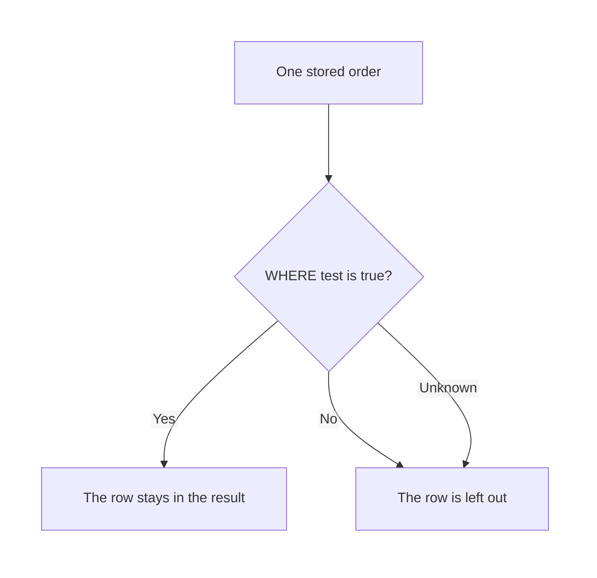
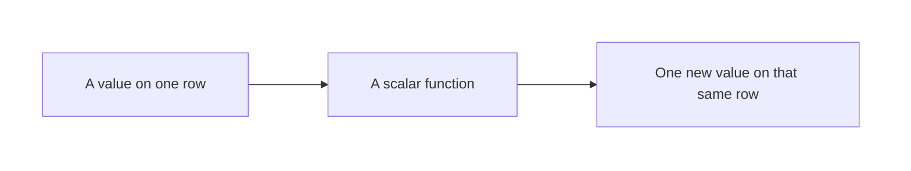

# SQL — Searching, Filtering & Powerful Functions

## What You Will Learn in This Lesson

In the previous session you stored shop orders and used `SELECT` and `FROM` to read columns. Every stored row came back, because a question with no condition keeps every row.

This lesson keeps one shop table and teaches you how to **keep only some rows**, how to remove duplicate values from a result, and how to reshape a single value with a function. Examples stay in MySQL-style SQL.

Grouping rows and computing totals come in the next session. This lesson does not total a column. It filters and reshapes.

By the end, you will be able to:

- Filter rows with `WHERE` and comparison operators
- Combine tests with `AND`, `OR`, and `NOT`
- Match patterns with `LIKE`, lists with `IN`, and ranges with `BETWEEN`
- Test missing values with `IS NULL` and drop duplicate values with `DISTINCT`
- Apply `UPPER`, `LOWER`, `LENGTH`, `ROUND`, `CONCAT`, and `YEAR` to a value

---

## The Shop Table for This Lesson

The first four orders are the ones stored in the previous session. The shop has since recorded four more bills. One of those bills has no city.

| order_id | customer_name | item_name | city | quantity | amount | order_date |
|----------|---------------|-----------|------|----------|--------|------------|
| 1 | Asha Patil | Notebook | Pune | 2 | 120.50 | 2024-03-12 |
| 2 | Ankit Rao | Pen Set | Pune | 1 | 80.00 | 2024-06-01 |
| 3 | Meera Shah | Notebook | Nashik | 3 | 180.00 | 2023-11-20 |
| 4 | Ravi Kumar | Folder | Jaipur | 1 | 45.75 | 2024-01-09 |
| 5 | Asha Patil | Marker | Jaipur | 4 | 200.00 | 2025-02-14 |
| 6 | Neha Iyer | Pen Set | Nashik | 2 | 95.00 | 2024-08-30 |
| 7 | Kabir Sen | Notebook | Pune | 1 | 60.00 | 2024-12-05 |
| 8 | Farah Khan | Folder |  | 2 | 150.25 | 2023-07-18 |

Farah’s city is missing. In the table that cell is `NULL`. It is not the word “blank” and it is not an empty pair of quotes. Every query below assumes these eight rows.

- `amount` is rupees with paise. `120.50` is greater than `100`.
- Dates are year-month-day. The year is the first four digits.
- A common doubt: *“Did Asha become two people?”* No. The same name can appear on two orders. `order_id` still identifies each row.

---

## WHERE Keeps Some Rows

`WHERE` is a test on each row. Only rows that pass are returned.

- **Official Definition:** The **`WHERE` clause** filters rows before they appear in the result. A row is kept only when its test evaluates to true.
- **In Simple Words:** `SELECT` chooses columns. `WHERE` chooses which orders deserve those columns.
- **Real-Life Example:** “Show names of orders placed in Pune” reads every bill, keeps the Pune bills, and hides the rest.

```sql
-- Keep only orders whose stored city is Pune
SELECT -- Choose the columns to show
    order_id, -- Identity of the bill
    customer_name, -- Who bought
    city -- City, so you can see the test worked
FROM orders -- Read the shop table
WHERE city = 'Pune'; -- Keep a row only when the city is Pune
```

**How the code works:**

- The engine looks at all eight rows, one at a time.
- `city = 'Pune'` is true for orders 1, 2, and 7.
- Orders 3, 4, 5, 6, and 8 fail the test, so they are absent.
- Farah is absent because a missing city is not the value `'Pune'`.

| order_id | customer_name | city |
|----------|---------------|------|
| 1 | Asha Patil | Pune |
| 2 | Ankit Rao | Pune |
| 7 | Kabir Sen | Pune |

Comparisons you can use in a test:

| Operator | Meaning | Example that is true here |
|----------|---------|---------------------------|
| `=` | Equal to | `city = 'Nashik'` for order 3 |
| `<>` | Not equal to | `city <> 'Pune'` for order 3 |
| `>` | Greater than | `amount > 100` for order 1 |
| `<` | Less than | `amount < 50` for order 4 |
| `>=` | Greater than or equal | `amount >= 80` for order 2 |
| `<=` | Less than or equal | `quantity <= 1` for order 2 |

```sql
-- Keep orders whose bill is strictly above 100 rupees
SELECT -- Columns that identify the expensive bills
    order_id, -- Which order
    item_name, -- What was sold
    amount -- The amount that passed the test
FROM orders -- Shop table
WHERE amount > 100; -- 100 itself does not pass
```

**How the code works:**

- Order 1 is 120.50, order 3 is 180.00, order 5 is 200.00, and order 8 is 150.25.
- Those four rows pass. Order 6 is 95.00, so it fails.
- `>` does not mean “at least.” A bill of exactly 100 would fail this test.
- The stored table is unchanged. Filtering changes the answer, not the saved bills.



A missing city makes `city = 'Pune'` **unknown**, not true. Unknown rows are left out. That is why Farah never appears in a city comparison until you test for `NULL` on purpose.

---

## AND, OR, and NOT

One test is often not enough. `AND`, `OR`, and `NOT` combine tests.

- **Official Definition:** **`AND`** keeps a row only when both tests are true. **`OR`** keeps a row when at least one test is true. **`NOT`** reverses a test.
- **In Simple Words:** `AND` means both. `OR` means either. `NOT` means the opposite.
- **Real-Life Example:** “Pune and at least 80 rupees” is stricter than “Pune.” “Jaipur or Nashik” is wider than either city alone.

```sql
-- Pune orders that are also at least 80 rupees
SELECT -- Show who passed both tests
    order_id, -- Bill number
    customer_name, -- Customer
    amount -- Amount that was checked
FROM orders -- Shop table
WHERE city = 'Pune' AND amount >= 80; -- Both sides must be true
```

**How the code works:**

- Pune rows are 1, 2, and 7.
- Order 1 is 120.50 and order 2 is 80.00, so both pass `amount >= 80`.
- Order 7 is 60.00, so the `AND` fails and Kabir is left out.
- The result is orders 1 and 2 only.

`OR` widens the net.

```sql
-- Orders from Jaipur or from Nashik
SELECT -- Identify the city match
    order_id, -- Bill number
    customer_name, -- Customer
    city -- The city that matched
FROM orders -- Shop table
WHERE city = 'Jaipur' OR city = 'Nashik'; -- Either city is enough
```

**How the code works:**

- Jaipur rows are 4 and 5. Nashik rows are 3 and 6.
- All four pass. Pune rows fail both sides, so they drop.
- Farah fails both sides because her city is missing, not Jaipur and not Nashik.
- A row does not need to be both cities. One match is enough.

`NOT` flips a true test to false, and a false test to true.

```sql
-- Orders that are not in Pune
SELECT -- Show the rows that survive the flip
    order_id, -- Bill number
    city -- City after the NOT test
FROM orders -- Shop table
WHERE NOT (city = 'Pune'); -- Keep rows where "city is Pune" is false
```

**How the code works:**

- Orders 3, 4, 5, and 6 have a real city that is not Pune, so they stay.
- Orders 1, 2, and 7 are Pune, so `NOT` removes them.
- Farah’s comparison is unknown, and `NOT` of unknown is still not true. She is left out.
- Use `IS NULL` when you specifically want the missing city. `NOT` will not surface it.

When you mix `AND` and `OR`, write parentheses. `AND` binds more tightly than `OR`, which surprises people.

```sql
-- Pune or Nashik, and only if the bill is at least 100
SELECT -- Columns for the checked bills
    order_id, -- Bill number
    city, -- Which of the two cities
    amount -- Amount that cleared 100
FROM orders -- Shop table
WHERE (city = 'Pune' OR city = 'Nashik') AND amount >= 100; -- Parentheses fix the meaning
```

**How the code works:**

- The parentheses first allow Pune or Nashik: orders 1, 2, 3, 6, and 7.
- `amount >= 100` then keeps order 1 (120.50) and order 3 (180.00).
- Order 2 is 80, order 6 is 95, and order 7 is 60, so they fail the amount test.
- Without parentheses, `AND` would stick only to Nashik, and every Pune row would slip through. The parentheses are part of the meaning.

---

## LIKE, IN, and BETWEEN

Some questions are not a single exact value.

- **Official Definition:** **`LIKE`** matches a text pattern. **`IN`** tests membership in a list. **`BETWEEN`** tests a closed range, including both ends.
- **In Simple Words:** `LIKE` is “looks like this shape.” `IN` is “one of these.” `BETWEEN` is “from this low value through this high value, ends included.”
- **Real-Life Example:** “Items that start with N,” “cities in this short list,” and “bills from 80 rupees through 150 rupees” are these three tools.

In these notes, `LIKE` treats capital and small letters as the same match. `%` means “any characters, including none.” `_` means “exactly one character.”

```sql
-- Products whose name starts with N
SELECT -- Show the matching product rows
    order_id, -- Bill number
    item_name -- Product that matched the pattern
FROM orders -- Shop table
WHERE item_name LIKE 'N%'; -- N, then anything
```

**How the code works:**

- `Notebook` starts with N, so orders 1, 3, and 7 pass.
- `Pen Set`, `Folder`, and `Marker` do not start with N.
- `'%Set'` would instead match `Pen Set` on orders 2 and 6.
- The pattern is about text shape, not about the amount.

```sql
-- Cities in an explicit list
SELECT -- Show the list matches
    order_id, -- Bill number
    city -- City that was in the list
FROM orders -- Shop table
WHERE city IN ('Pune', 'Jaipur'); -- Either listed city
```

**How the code works:**

- This is the same idea as `city = 'Pune' OR city = 'Jaipur'`, written as a list.
- Passing rows are 1, 2, 4, 5, and 7.
- Nashik fails. Farah fails because `NULL` is not in the list.
- `IN` does not search inside a word. It checks whole values.

```sql
-- Bills from 80 rupees through 150 rupees, ends included
SELECT -- Show the range matches
    order_id, -- Bill number
    amount -- Amount inside the range
FROM orders -- Shop table
WHERE amount BETWEEN 80 AND 150; -- 80 and 150 would both count
```

**How the code works:**

- Order 2 is 80.00, so the low end counts.
- Order 1 is 120.50 and order 6 is 95.00, so they count.
- Order 8 is 150.25, which is above 150, so it does not count.
- Orders 4, 5, and 7 fall outside as well. The result is orders 1, 2, and 6.

`NOT` works in front of these tests too: `NOT LIKE`, `NOT IN`, and `NOT BETWEEN` keep the rows that fail the positive test. A `NULL` city still will not appear in `NOT IN ('Pune')`, because the membership test is unknown.

---

## IS NULL and DISTINCT

Missing is different from a value you can compare.

- **Official Definition:** **`IS NULL`** is true when the value is missing. **`DISTINCT`** removes duplicate values from the selected result.
- **In Simple Words:** `IS NULL` finds the empty cell. `DISTINCT` shows each different value once.
- **Real-Life Example:** Farah’s city was never written down. Separately, Pune is stored on three rows, but a list of cities only needs the word Pune once.

Do not write `city = NULL`. That comparison is unknown, so the row will not come back.

```sql
-- Find the order whose city was never stored
SELECT -- Show the incomplete bill
    order_id, -- Bill number
    customer_name, -- Who bought
    city -- The missing city
FROM orders -- Shop table
WHERE city IS NULL; -- True only for a missing city
```

**How the code works:**

- Only order 8 has a missing city.
- The result is Farah Khan, with an empty city.
- `WHERE city IS NOT NULL` would return the other seven orders.
- An empty string is not used in this table. The missing mark is `NULL`.

```sql
-- List each different city once
SELECT DISTINCT -- Drop repeated values in the result
    city -- The column to make unique
FROM orders; -- Read every stored row first
```

**How the code works:**

- The cities present are Pune, Nashik, Jaipur, and one missing city.
- Pune is stored three times and appears once in this result.
- `DISTINCT` does not sort. Any display order of those four values is acceptable here.
- `DISTINCT` is not a filter on amount. It only collapses duplicate selected values.

`SELECT DISTINCT item_name` returns Notebook, Pen Set, Folder, and Marker, each once.

---

## Functions on One Value

A **scalar function** takes a value and returns one new value on the same row. It does not total many rows.

- **Official Definition:** A **scalar function** transforms a single value, such as changing case, measuring length, rounding a number, joining text, or pulling the year out of a date.
- **In Simple Words:** The row stays one row. One column gets a computed display value.
- **Real-Life Example:** Showing `ASHA PATIL` in capitals, or showing `2024` from `2024-03-12`, does not merge Asha’s two orders.

| Function | What it returns here | Illustration |
|----------|----------------------|--------------|
| `UPPER` | Capital letters | `UPPER('Asha Patil')` is `ASHA PATIL` |
| `LOWER` | Small letters | `LOWER('Asha Patil')` is `asha patil` |
| `LENGTH` | Number of characters for this plain English text | `LENGTH('Asha Patil')` is 10, space included |
| `ROUND` | A number rounded to the digits you name | `ROUND(45.75, 0)` is 46 |
| `CONCAT` | Text joined into one string | First name text, the word bought, and the item |
| `YEAR` | The year of a date | `YEAR('2024-03-12')` is 2024 |

```sql
-- Show each customer in capitals and the length of the stored name
SELECT -- Computed columns beside the id
    order_id, -- Which bill
    UPPER(customer_name) AS name_in_capitals, -- Display the name in capitals
    LENGTH(customer_name) AS name_length -- Count characters, including the space
FROM orders -- One output row per stored order
WHERE order_id = 1; -- Only Asha's first order, so the numbers are easy to check
```

**How the code works:**

- `UPPER` does not change the stored name. It changes the result cell.
- `AS` gives that result cell a heading. `AS` is a label, not a filter.
- For order 1 the capitals are `ASHA PATIL` and the length is 10.
- `LOWER(customer_name)` on the same row would show `asha patil`.

```sql
-- Round one paisa-heavy bill to the nearest rupee
SELECT -- Show the raw amount and the rounded amount
    order_id, -- Bill 4
    amount, -- Stored 45.75
    ROUND(amount, 0) AS rupees_nearest -- 0 digits after the decimal
FROM orders -- Shop table
WHERE order_id = 4; -- Ravi's folder
```

**How the code works:**

- `ROUND(amount, 0)` looks at the paise and returns a whole rupee.
- 45.75 is halfway away from a lower rupee and rounds to 46 in this MySQL-style `ROUND`.
- `ROUND(150.25, 0)` on order 8 would return 150, because 0.25 is below halfway.
- The stored `amount` remains 45.75. Only the result shows 46.

```sql
-- Build one sentence-like label from two columns
SELECT -- A single joined text column
    CONCAT(customer_name, ' bought ', item_name) AS sale_label -- Join with a fixed phrase
FROM orders -- Shop table
WHERE order_id = 1; -- Check one known row
```

**How the code works:**

- The pieces are the stored name, the characters ` bought `, and the stored item.
- The label is `Asha Patil bought Notebook`.
- `CONCAT` on these columns is safe because name and item are present on every row.
- Joining a `NULL` city with `CONCAT` would make the whole label `NULL` in MySQL. Do not join the city until you know it is present.

```sql
-- Keep orders placed in the calendar year 2024
SELECT -- Show the bill and its date
    order_id, -- Bill number
    order_date, -- Full stored date
    YEAR(order_date) AS order_year -- The year pulled out of that date
FROM orders -- Shop table
WHERE YEAR(order_date) = 2024; -- The test uses the function, not the full date
```

**How the code works:**

- `YEAR` reads the year from `order_date`.
- Orders 1, 2, 4, 6, and 7 fall in 2024.
- Orders 3 and 8 fall in 2023. Order 5 falls in 2025. They are left out.
- This is still a row filter. It does not count how many 2024 orders exist.



Functions and `WHERE` can sit together. The function either builds a result column, or it builds the value you test, as `YEAR` does above.

---

## Activity 1: Which Rows Survive?

Using the eight-row table, list the `order_id` values only.

1. `WHERE quantity = 1`
2. `WHERE city = 'Jaipur' AND amount > 100`
3. `WHERE item_name LIKE '%book'`
4. `WHERE amount BETWEEN 150 AND 200`

**Check your answer**

1. Orders 2, 4, and 7. Each has quantity 1. Order 1 has quantity 2.
2. Order 5 only. Order 4 is Jaipur but the amount is 45.75, which is not above 100.
3. Orders 1, 3, and 7. `Notebook` ends with `book`. Marker, Pen Set, and Folder do not. `LIKE` here is matching the ending, and capital letters do not block `Notebook`.
4. Orders 3, 5, and 8. The amounts 180.00, 200.00, and 150.25 are inside the closed range. 120.50 is below 150.

---

## Activity 2: Functions and a Missing City

Predict the result cell, or the `order_id` list, for each question.

1. `UPPER(item_name)` for order 2.
2. `LENGTH(customer_name)` for order 6.
3. `CONCAT(city, '-', item_name)` for order 8.
4. `WHERE city IS NULL OR amount < 50`.

**Check your answer**

1. `PEN SET`.
2. `Neha Iyer` has 9 characters, including the space.
3. The result is `NULL`, because the city is missing and MySQL `CONCAT` returns `NULL` if any piece is `NULL`.
4. Order 8 matches `IS NULL`. Order 4 matches `amount < 50`. The `OR` keeps both, so the ids are 4 and 8.

---

## Common Doubts

- *“Does WHERE delete the other orders?”* No. The next query can see them again.
- *“Is BETWEEN exclusive of the ends?”* No. Both ends are included.
- *“Will DISTINCT sort the cities alphabetically?”* Not in this lesson. Treat the result as a set.
- *“Can I total the Pune amounts now?”* Not with the tools of this lesson. A total across rows is the next session.
- *“Why did NOT city = 'Pune' hide Farah?”* Because her city test is unknown. Ask for her with `IS NULL`.
- *“Does ROUND change the stored bill?”* No. The table still holds 45.75. Only the result cell shows the rounded value.
- *“Is a function a total?”* No. `YEAR` and `UPPER` work on one value. A total of many rows waits until the next session.
- *“Does IN hide a missing city?”* Yes. Farah is not in `('Pune', 'Jaipur')`. Use `IS NULL` when she is the row you want.

---

## Key Takeaways

- `WHERE` keeps rows whose test is true. `AND`, `OR`, `NOT`, `LIKE`, `IN`, `BETWEEN`, and `IS NULL` are ways to write that test.
- `DISTINCT` collapses duplicate values in the result. `UPPER`, `LOWER`, `LENGTH`, `ROUND`, `CONCAT`, and `YEAR` each change one value and leave the row count alone.
- Parentheses matter when `AND` and `OR` appear together. A missing city is `NULL`, and it is not found with `=`.
- In the next session you will take filtered rows and compute counts and totals by group, then arrange and limit that summary.

---

## Important Commands, Libraries, and Terminologies

| Term | What it means in this lesson |
|------|------------------------------|
| **`WHERE`** | Keeps only rows that pass a test |
| **Comparison** | `=`, `<>`, `>`, `<`, `>=`, `<=` |
| **`AND`** | Both tests must be true |
| **`OR`** | At least one test must be true |
| **`NOT`** | Reverses a test |
| **`LIKE`** | Pattern match; `%` is any text, `_` is one character |
| **`IN`** | Value is in a list |
| **`BETWEEN`** | Closed range, both ends included |
| **`NULL`** | A missing value |
| **`IS NULL`** | Test that is true when a value is missing |
| **`IS NOT NULL`** | Test that is true when a value is present |
| **`DISTINCT`** | One copy of each selected value |
| **Scalar function** | A function that returns one value for one input |
| **`UPPER` / `LOWER`** | Change letter case |
| **`LENGTH`** | Character count for the plain names in this table |
| **`ROUND`** | Round a number to the digits you request |
| **`CONCAT`** | Join text pieces; a `NULL` piece makes the result `NULL` |
| **`YEAR`** | Pull the year out of a date |
| **`AS`** | A display name for a result column |
