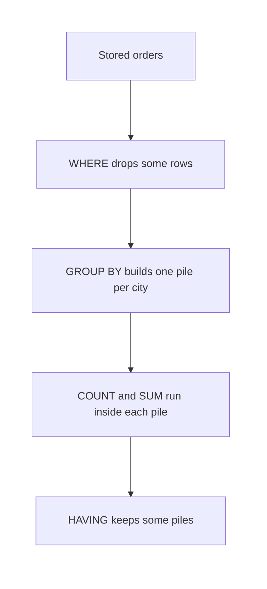

# SQL — Aggregations: GROUP BY, HAVING, ORDER BY & LIMIT

## What You Will Learn in This Lesson

In the previous session you kept some shop rows with `WHERE` and reshaped single values with functions. You did not add those rows together.

This lesson answers questions about **many rows at once**: how many, how much in total, and the smallest or largest. You will group rows, keep some groups, then arrange and shorten the summary. Examples stay in MySQL-style SQL.

`WHERE` still means “filter rows before they are grouped.” Joins across two tables come in the next session.

By the end, you will be able to:

- Use `COUNT`, `SUM`, `AVG`, `MIN`, and `MAX`
- Group rows with `GROUP BY`
- Filter groups with `HAVING` and rows with `WHERE`
- Arrange a result with `ORDER BY ASC` or `DESC`
- Keep only the first rows of an arranged result with `LIMIT`

---

## The Same Eight Orders

Every result below uses the shop table from the previous session. Farah’s city is still missing (`NULL`).

| order_id | customer_name | item_name | city | quantity | amount | order_date |
|----------|---------------|-----------|------|----------|--------|------------|
| 1 | Asha Patil | Notebook | Pune | 2 | 120.50 | 2024-03-12 |
| 2 | Ankit Rao | Pen Set | Pune | 1 | 80.00 | 2024-06-01 |
| 3 | Meera Shah | Notebook | Nashik | 3 | 180.00 | 2023-11-20 |
| 4 | Ravi Kumar | Folder | Jaipur | 1 | 45.75 | 2024-01-09 |
| 5 | Asha Patil | Marker | Jaipur | 4 | 200.00 | 2025-02-14 |
| 6 | Neha Iyer | Pen Set | Nashik | 2 | 95.00 | 2024-08-30 |
| 7 | Kabir Sen | Notebook | Pune | 1 | 60.00 | 2024-12-05 |
| 8 | Farah Khan | Folder |  | 2 | 150.25 | 2023-07-18 |

The amounts add up as follows, and you will meet this total again:

120.50 + 80.00 + 180.00 + 45.75 + 200.00 + 95.00 + 60.00 + 150.25 = **931.50**.

- Eight rows are stored. Seven of them have a city.
- A query in this lesson can return **one summary row**, or **one row per group**, instead of eight detail rows.
- A common doubt: *“Did the bills disappear?”* No. A summary is a new answer. The eight orders stay stored.

---

## Aggregate Functions

An **aggregate function** collapses many values into one.

- **Official Definition:** An **aggregate function** computes a single result from a set of rows, such as a count, a total, an average, a minimum, or a maximum.
- **In Simple Words:** Instead of listing every bill, you ask for one number that describes the set.
- **Real-Life Example:** The shopkeeper asks “how many bills, and what did they add up to?” Those are aggregates. They are not a list of names.

| Function | Plain meaning | Result on all eight orders |
|----------|---------------|----------------------------|
| `COUNT(*)` | How many rows | 8 |
| `COUNT(city)` | How many cities are filled in | 7, because Farah is skipped |
| `SUM(amount)` | Add the amounts | 931.50 |
| `AVG(amount)` | Total divided by the number of amounts | 116.4375 |
| `MIN(amount)` | Smallest amount | 45.75 |
| `MAX(amount)` | Largest amount | 200.00 |

`COUNT(*)` counts rows. `COUNT(city)` counts values that are present, so `NULL` is not counted. `AVG(amount)` is 931.50 ÷ 8 = 116.4375.

```sql
-- Ask for one summary of the whole table
SELECT -- The result is one row of totals
    COUNT(*) AS order_count, -- Count every stored order, including Farah
    SUM(amount) AS total_amount, -- Add every bill
    AVG(amount) AS average_amount, -- Divide that total by how many amounts exist
    MIN(amount) AS smallest_amount, -- Lowest bill
    MAX(amount) AS largest_amount -- Highest bill
FROM orders; -- Read all eight rows, then collapse them
```

**How the code works:**

- There is no `GROUP BY`, so the whole table is one set.
- `order_count` is 8 and `total_amount` is 931.50.
- `average_amount` is 116.4375. `smallest_amount` is 45.75. `largest_amount` is 200.00.
- `AS` only names the result headings. It does not change the arithmetic.

```sql
-- Count filled cities separately from rows
SELECT -- Two different counts
    COUNT(*) AS row_count, -- 8 rows
    COUNT(city) AS cities_filled -- 7, because NULL is ignored
FROM orders; -- Whole table
```

**How the code works:**

- `COUNT(*)` does not care that a city is missing. The row still exists.
- `COUNT(city)` skips order 8.
- `SUM` also skips a `NULL` in the column it adds. Every `amount` here is present, so the total still uses all eight bills.
- `MIN(customer_name)` on this table is `Ankit Rao`. `MAX(customer_name)` is `Ravi Kumar`. Text order follows ordinary A-to-Z order.

A filter from the previous session can sit in front of the aggregate. `WHERE` drops rows **before** the total is computed.

```sql
-- Total only the bills that are at least 100 rupees
SELECT -- Summary of the surviving rows
    COUNT(*) AS order_count, -- How many bills passed
    SUM(amount) AS total_amount -- Add only those bills
FROM orders -- Start from all rows
WHERE amount >= 100; -- Drop bills under 100 before counting
```

**How the code works:**

- Orders 1, 3, 5, and 8 pass: 120.50, 180.00, 200.00, and 150.25.
- `order_count` is 4.
- The total is 120.50 + 180.00 + 200.00 + 150.25 = 650.75.
- Orders 2, 4, 6, and 7 never enter the sum.

---

## GROUP BY

A shop usually wants a total **per city**, not one number for the whole shop.

- **Official Definition:** **`GROUP BY`** bundles rows that share a value and calculates aggregates inside each bundle.
- **In Simple Words:** Make one pile per city, then count or add inside that pile.
- **Real-Life Example:** Pune’s three bills become one Pune summary line. Nashik’s two bills become one Nashik line.

| City pile | order_id values | COUNT(*) | SUM(amount) |
|-----------|-----------------|----------|-------------|
| Pune | 1, 2, 7 | 3 | 260.50 |
| Nashik | 3, 6 | 2 | 275.00 |
| Jaipur | 4, 5 | 2 | 245.75 |
| Missing city | 8 | 1 | 150.25 |

Pune is 120.50 + 80.00 + 60.00. Nashik is 180.00 + 95.00. Jaipur is 45.75 + 200.00.

```sql
-- One summary row for each city
SELECT -- What each group will show
    city, -- The value that defines the pile
    COUNT(*) AS order_count, -- Bills inside that pile
    SUM(amount) AS total_amount -- Money inside that pile
FROM orders -- All eight rows are candidates
GROUP BY city; -- Build one group per city, including the missing city
```

**How the code works:**

- Rows with the same `city` share a group. Farah’s missing city is its own group.
- Each group produces one result row.
- The four totals are 260.50, 275.00, 245.75, and 150.25.
- This query does not promise which group appears first. Arrangement is a later section of this same lesson.

Selected columns should be either the grouped column or an aggregate. `city` is grouped. `COUNT` and `SUM` are aggregates. Asking for `customer_name` as well would be ambiguous, because one city holds several names.

```sql
-- Average bill and quantity total, per city
SELECT -- Group measures
    city, -- Group label
    AVG(amount) AS average_amount, -- Mean bill inside the city
    SUM(quantity) AS pieces_sold -- Pieces added inside the city
FROM orders -- Source rows
GROUP BY city; -- Same piles as the previous query
```

**How the code works:**

- Pune’s average is 260.50 ÷ 3 = 86.8333…. Nashik’s average is 275.00 ÷ 2 = 137.50.
- Jaipur’s average is 245.75 ÷ 2 = 122.875. The missing-city average is 150.25, because that group has one row.
- Pieces: Pune 2 + 1 + 1 = 4. Nashik 3 + 2 = 5. Jaipur 1 + 4 = 5. Farah’s group is 2.
- `AVG` uses the rows inside the group, not the eight-row shop average.



`WHERE` runs before the piles exist. A test on `SUM` or `COUNT` cannot go in `WHERE`, because those numbers do not exist yet.

---

## HAVING Versus WHERE

`HAVING` filters **groups** after the aggregates exist.

- **Official Definition:** **`HAVING`** keeps or drops whole groups by testing an aggregate or a grouped column. **`WHERE`** keeps or drops individual rows before grouping.
- **In Simple Words:** `WHERE` is the door into the pile. `HAVING` is the door out of the pile.
- **Real-Life Example:** “Ignore bills under 80, then keep only cities that still have at least two bills” uses both doors.

```sql
-- Cities that have at least two orders
SELECT -- City summary
    city, -- Group label
    COUNT(*) AS order_count, -- Size of the group
    SUM(amount) AS total_amount -- Money in the group
FROM orders -- All rows
GROUP BY city -- One pile per city
HAVING COUNT(*) >= 2; -- Drop piles that are smaller than 2
```

**How the code works:**

- Pune has 3, Nashik has 2, and Jaipur has 2, so those groups stay.
- The missing-city group has 1, so `HAVING` drops it.
- This is not a row filter. Farah’s row was grouped, and then her group failed.
- Writing `WHERE COUNT(*) >= 2` is invalid. `COUNT` is not known at `WHERE` time.

Now use both clauses. First drop cheap bills, then keep cities that still have two or more of the remaining bills.

```sql
-- Drop cheap bills, then keep cities that still have two bills
SELECT -- Summary of what survived both doors
    city, -- Group label
    COUNT(*) AS order_count, -- Bills left inside the city
    SUM(amount) AS total_amount -- Sum of the bills that passed WHERE
FROM orders -- Start with eight rows
WHERE amount >= 80 -- Row door: drop 45.75 and 60.00
GROUP BY city -- Pile what remains
HAVING COUNT(*) >= 2; -- Group door: need two surviving bills
```

**How the code works:**

- `WHERE` removes order 4 (45.75) and order 7 (60.00).
- Pune still has orders 1 and 2, so the count is 2 and the sum is 200.50.
- Nashik still has orders 3 and 6, so the count is 2 and the sum is 275.00.
- Jaipur has only order 5 left, and Farah is alone, so both groups fail `HAVING`.

| Clause | When it runs | Legal test in this lesson |
|--------|--------------|---------------------------|
| `WHERE` | Before grouping | A column on a row, such as `amount >= 80` |
| `GROUP BY` | After `WHERE` | The column you pile on, such as `city` |
| `HAVING` | After aggregates | `COUNT(*)` or `SUM(amount)` |
| `SELECT` | Shapes the summary row | Grouped columns and aggregates |

A group test on money uses the same pattern: `HAVING SUM(amount) > 260` keeps Nashik (275.00) and drops Pune (260.50), Jaipur (245.75), and the missing city (150.25).

---

## ORDER BY

A summary is easier to read when you choose the order.

- **Official Definition:** **`ORDER BY`** sorts the finished result rows. **`ASC`** sorts ascending, smallest or A-to-Z first. **`DESC`** sorts descending.
- **In Simple Words:** You decide whether the list climbs or falls. `ASC` is the default when you name a column and do not say `DESC`.
- **Real-Life Example:** A shopkeeper wants the biggest city total at the top, not whichever pile the engine happened to build first.

```sql
-- City totals, largest money first
SELECT -- Summary columns
    city, -- Group label
    SUM(amount) AS total_amount -- Money to sort by
FROM orders -- All bills
GROUP BY city -- One row per city
ORDER BY total_amount DESC; -- Largest total at the top
```

**How the code works:**

- The groups are unchanged: Nashik 275.00, Pune 260.50, Jaipur 245.75, missing city 150.25.
- `DESC` places Nashik first and the missing city last.
- `ORDER BY total_amount ASC` would flip that list.
- `ORDER BY` sorts the result. It does not change stored rows.

Detail rows can be sorted too, without any group.

```sql
-- List customer names from A to Z, and use order_id when names tie
SELECT -- Detail columns, not aggregates
    order_id, -- Tie-break column
    customer_name -- The column we sort first
FROM orders -- Eight detail rows
ORDER BY customer_name ASC, order_id ASC; -- A to Z, then smaller id first
```

**How the code works:**

- `Ankit Rao` comes first. The two `Asha Patil` rows follow, order 1 before order 5, because `order_id ASC` breaks the tie.
- Then come Farah Khan, Kabir Sen, Meera Shah, Neha Iyer, and Ravi Kumar.
- One sort column is enough when every value is unique. Two columns make a tie predictable.
- `DESC` on `customer_name` would start at Ravi Kumar instead.

---

## LIMIT

`LIMIT` keeps only the first *n* rows of the result you have already arranged.

- **Official Definition:** **`LIMIT`** restricts how many result rows are returned, counting from the start of the current result order.
- **In Simple Words:** After you sort, take the top few lines and stop.
- **Real-Life Example:** “Show me the three largest bills” means sort by amount descending, then keep three lines.

```sql
-- The three largest individual bills
SELECT -- Detail of each bill
    order_id, -- Which order
    customer_name, -- Who bought
    amount -- The sorted amount
FROM orders -- Eight bills
ORDER BY amount DESC -- Largest bill first
LIMIT 3; -- Stop after three rows
```

**How the code works:**

- Descending amounts start at 200.00 (order 5), then 180.00 (order 3), then 150.25 (order 8).
- `LIMIT 3` returns those three rows and hides the rest.
- Without `ORDER BY`, `LIMIT` still returns three rows, but it does not promise which three. Always sort first when “top” has a meaning.
- `LIMIT` is not a filter on the amount value. A fourth bill of 149 would still be hidden because of the count, not because of a `WHERE` test.

```sql
-- The two cities with the highest totals
SELECT -- City summary
    city, -- Group label
    SUM(amount) AS total_amount -- Sort key
FROM orders -- All bills
GROUP BY city -- One row per city
ORDER BY total_amount DESC -- Biggest pile first
LIMIT 2; -- Keep Nashik and Pune only
```

**How the code works:**

- Sorted totals are Nashik 275.00, then Pune 260.50, then Jaipur, then the missing city.
- `LIMIT 2` keeps Nashik and Pune.
- Jaipur’s 245.75 is real and is simply outside the top two.
- The stored table still has all four city groups for the next query.


A full summary can use every clause in this order: `WHERE`, then `GROUP BY`, then `HAVING`, then `ORDER BY`, then `LIMIT`.

```sql
-- Pune or Nashik bills of at least 80, grouped, then the richer city only
SELECT -- One winning city
    city, -- Group label
    COUNT(*) AS order_count, -- Surviving bills
    SUM(amount) AS total_amount -- Money used for the sort
FROM orders -- Eight stored orders
WHERE city IN ('Pune', 'Nashik') AND amount >= 80 -- Row door, before groups
GROUP BY city -- Two possible piles
HAVING COUNT(*) >= 2 -- Group door
ORDER BY total_amount DESC -- Richer pile first
LIMIT 1; -- Keep only that first pile
```

**How the code works:**

- `WHERE` keeps Pune orders 1 and 2, and Nashik orders 3 and 6. Kabir fails the amount test. Other cities fail the city list.
- Both remaining groups have two bills, so `HAVING` keeps both.
- Nashik’s total is 275.00 and Pune’s is 200.50, so `DESC` puts Nashik first.
- `LIMIT 1` returns only Nashik, with `order_count` 2 and `total_amount` 275.00.

---

## Activity 1: Whole-Table Numbers

Using the eight orders, write the single number each expression returns.

1. `COUNT(*)`
2. `COUNT(city)`
3. `SUM(amount)` for the whole table
4. `MAX(amount)` and `MIN(quantity)`

**Check your answer**

1. 8.
2. 7. Farah’s missing city is not counted.
3. 931.50.
4. The maximum amount is 200.00. The minimum quantity is 1, from orders 2, 4, and 7. `MIN` returns 1, not the list of those orders.

---

## Activity 2: Groups, Doors, and the Top Row

Predict the result of this query. Name the city and the total.

```sql
-- Practice query for the activity
SELECT -- City and its money
    city, -- Group label
    SUM(amount) AS total_amount -- Total inside the group
FROM orders -- All eight bills
WHERE amount > 50 -- Drop Ravi before grouping
GROUP BY city -- One pile per remaining city
HAVING SUM(amount) >= 200 -- Keep the richer piles
ORDER BY total_amount DESC -- Largest remaining total first
LIMIT 1; -- One row
```

**Check your answer**

`WHERE amount > 50` removes only order 4 (45.75). Pune’s remaining bills are 120.50, 80.00, and 60.00, which add to 260.50. Nashik stays 275.00. Jaipur is only order 5, which is 200.00. Farah stays 150.25.

`HAVING SUM(amount) >= 200` keeps Pune, Nashik, and Jaipur. It drops Farah. `ORDER BY total_amount DESC` puts Nashik first. `LIMIT 1` returns Nashik with `total_amount` 275.00.

A common slip is to subtract Ravi from Jaipur and then forget that 200.00 still passes `HAVING`. Another slip is to sort ascending and then limit, which would have returned Jaipur instead.

---

## Check the Arithmetic Before You Trust It

Add the city piles on paper once. If they match the grand total, the groups are complete.

| Check | Figures | What it confirms |
|-------|---------|------------------|
| All amounts | 931.50 | Eight bills, nothing dropped |
| City sums | 260.50 + 275.00 + 245.75 + 150.25 | Same 931.50, so no bill was grouped twice |
| Bills of at least 100 | 650.75 from four rows | `WHERE` ran before `SUM` |
| Cities with two or more bills | Pune, Nashik, Jaipur | `HAVING` dropped the one-bill group |

- 260.50 + 275.00 = 535.50. Then 535.50 + 245.75 = 781.25. Then 781.25 + 150.25 = 931.50.
- If your group totals do not add back to 931.50, a row was missed or counted twice.
- A common doubt: *“The engine showed the missing city as a blank. Is that a failed query?”* No. That blank is Farah’s group. It is one valid pile.

Use the same paper check after `WHERE`. The four bills of at least 100 rupees are 120.50, 180.00, 200.00, and 150.25. Their total is 650.75, and they sit in four different cities, so a grouped version of that filter has four groups of one bill each.

Sort direction is the other paper check. Write the four city totals in descending order before you apply `LIMIT`.

| Place after DESC | City | Total |
|------------------|------|-------|
| 1 | Nashik | 275.00 |
| 2 | Pune | 260.50 |
| 3 | Jaipur | 245.75 |
| 4 | Missing city | 150.25 |

- `LIMIT 1` on that list is Nashik. `LIMIT 2` is Nashik and Pune.
- Ascending order starts at the missing city, then Jaipur. The same `LIMIT` would then mean a different pair.
- Write the order first, then cut. That is the whole of `ORDER BY` plus `LIMIT`.
- A blank city in that ordered list is still Farah’s group, not an error row.

---

## Common Doubts

- *“Can WHERE use SUM?”* No. Filter rows with `WHERE` and groups with `HAVING`.
- *“Does GROUP BY sort?”* No. Add `ORDER BY` when the display order matters.
- *“Does LIMIT 1 mean the largest row?”* Only if you sorted descending first.
- *“Why is COUNT(city) smaller than COUNT(*)?”* `COUNT` of a column skips `NULL`.
- *“Are we joining two tables here?”* No. Every number in this lesson comes from `orders` alone.

---

## Key Takeaways

- `COUNT`, `SUM`, `AVG`, `MIN`, and `MAX` collapse rows. `GROUP BY` collapses them per shared value, such as one line per city.
- `WHERE` drops rows before the group exists. `HAVING` drops groups after `COUNT` or `SUM` exists.
- `ORDER BY ASC` or `DESC` arranges the finished rows, and `LIMIT` keeps the first of those arranged rows.
- In the next session you will connect related tables, so a question can use columns that do not all live on `orders`.

---

## Important Commands, Libraries, and Terminologies

| Term | What it means in this lesson |
|------|------------------------------|
| **Aggregate function** | One result from many rows |
| **`COUNT(*)`** | Number of rows, including rows with a missing city |
| **`COUNT(column)`** | Number of non-NULL values in that column |
| **`SUM`** | Total of a numeric column |
| **`AVG`** | Average of a numeric column |
| **`MIN` / `MAX`** | Smallest or largest value |
| **`GROUP BY`** | One result row per shared value |
| **`WHERE`** | Drops rows before grouping |
| **`HAVING`** | Drops groups after aggregates are computed |
| **`ORDER BY`** | Sorts the finished result |
| **`ASC`** | Ascending sort, and the default direction |
| **`DESC`** | Descending sort |
| **`LIMIT`** | Keeps only the first *n* rows of the current order |
| **`AS`** | Display name for a summary column |
| **Group** | The pile of rows that share a `GROUP BY` value |
| **Summary row** | A result row made of aggregates rather than one stored bill |
