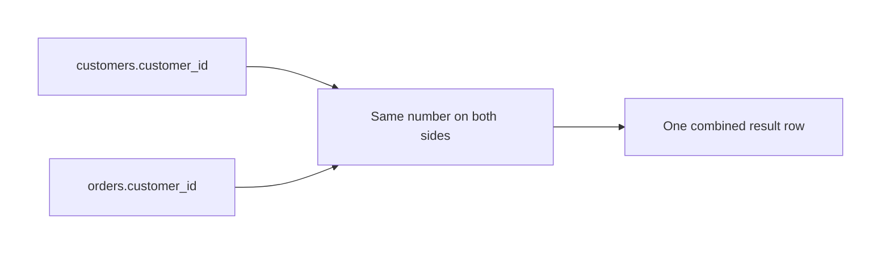
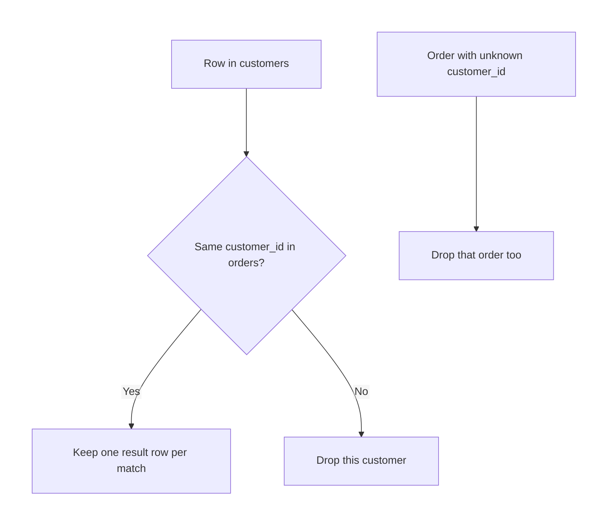

# SQL — Joins: Connecting Relational Tables

## What You Will Learn in This Lesson

In the previous session you asked questions of **one table at a time**. You filtered rows, sorted them, and summarised a column such as an amount. A real shop, college, or bank does not keep every fact in that single list.

People live in one list. Their purchases, fees, or tickets live in another list. A **join** brings those lists together for one question.

By the end of this lesson, you will be able to:

- Explain why related tables are safer than one very wide table
- Describe a **primary key** and a **foreign key** in plain words
- Write an **INNER JOIN** that keeps only matching rows
- Write a **LEFT JOIN** that keeps every row from the left table
- Write a **RIGHT JOIN** that keeps every row from the right table
- Write a **FULL OUTER JOIN** (some tools call it **FULL JOIN**)
- Use **ON** so the database pairs the correct rows
- Read **NULL** in a join result as "no match", not as zero

---

## Why Data Lives in Related Tables

A stationery shop in Pune could store every order in one huge sheet: customer name, city, item, and amount, copied again on every row. The moment Anita shifts from Pune to Nashik, someone must edit her city on every old order.

- **Official Definition:** A **relational table** stores one kind of thing. Related tables stay linked by shared id values instead of repeating whole descriptions.
- **In Simple Words:** Keep the person in one register and the purchases in another. Connect them when a question needs both.
- **Real-Life Example:** A college keeps a student register and a separate fee receipt book. The receipt stores the student id, not a fresh copy of the whole address, on every line.

One wide table also creates contradictions. One row might say Anita lives in Pune while another row says Nashik. Two smaller tables avoid that copy-paste trap.

You already know how to read one table. The next step is to **connect** two tables without mixing up who bought what.

---

## Primary Key and Foreign Key

Each table needs a way to point at one exact row. That pointer is the key.

- **Official Definition:** A **primary key** is a column (or set of columns) whose value uniquely identifies one row in a table. No two rows may share it, and it should not be empty.
- **In Simple Words:** The primary key is the roll number of that row. If you know the roll number, you know exactly which person or which order you mean.
- **Real-Life Example:** `customer_id` 1 means Anita Shah and nobody else. `order_id` 501 means one notebook bill and no other bill.

The second table does not copy Anita's city. It stores her roll number.

- **Official Definition:** A **foreign key** is a column in one table that holds the primary key value of a row in another table. It marks the relationship.
- **In Simple Words:** The foreign key is a note that says "this order belongs to customer 1".
- **Real-Life Example:** A fee receipt written for roll number 1 belongs to Anita. The receipt does not need her full biography printed again.

A strict database can refuse an order whose `customer_id` is not in the customers table. For this lesson, one practice order points at a missing customer so you can **see** an unmatched row. In live work, that broken link would usually be blocked.

Keys are the labels. A join is the step that uses those labels to line rows up.

---

## The Two Tables We Will Use

We will use a small shop example. `customers` holds people. `orders` holds what they bought.

Amounts stay on each order row. We will not total them in this lesson.

```sql
CREATE TABLE customers ( -- Create the people table
    customer_id INTEGER PRIMARY KEY, -- Unique roll number for one customer
    customer_name TEXT NOT NULL, -- Customer name must be filled
    city TEXT NOT NULL -- City must be filled
); -- End of the customers definition
```

**How the code works:**

- `CREATE TABLE customers` starts a new table named customers.
- `customer_id` is the primary key, so each id can appear only once.
- `NOT NULL` means name and city cannot be left blank.
- Nothing is stored yet. The table is only a structure.

```sql
CREATE TABLE orders ( -- Create the purchases table
    order_id INTEGER PRIMARY KEY, -- Unique number for one order
    customer_id INTEGER, -- Meant to match a customer primary key
    item_name TEXT NOT NULL, -- Name of the item sold
    amount INTEGER NOT NULL -- Price in rupees for that one order
); -- End of the orders definition
```

**How the code works:**

- `order_id` uniquely identifies one bill.
- `customer_id` is the foreign key in plain meaning: it should hold a `customers.customer_id`.
- This practice table does not lock the link, so we can store one unmatched order on purpose.
- `amount` is data on the row. It is not a total.

```sql
INSERT INTO customers (customer_id, customer_name, city) -- Columns to fill
VALUES -- Start the four customer rows
    (1, 'Anita Shah', 'Pune'), -- Customer 1 lives in Pune
    (2, 'Rahul Iyer', 'Delhi'), -- Customer 2 lives in Delhi
    (3, 'Meera Nair', 'Chennai'), -- Customer 3 has no order
    (4, 'Kabir Khan', 'Jaipur'); -- Customer 4 has no order
```

**How the code works:**

- Four people are stored. Each has a different `customer_id`.
- Meera and Kabir are real customers. They simply have not bought anything yet.
- Their rows must stay in `customers` even when no order mentions them.

```sql
INSERT INTO orders (order_id, customer_id, item_name, amount) -- Columns to fill
VALUES -- Start the four order rows
    (501, 1, 'Notebook', 120), -- Anita's first order
    (502, 1, 'Pen set', 80), -- Anita's second order
    (503, 2, 'Water bottle', 350), -- Rahul's only order
    (504, 9, 'Lamp', 500); -- Customer 9 is not in customers
```

**How the code works:**

- Anita has two orders, so her id appears twice. That is correct.
- Rahul has one order.
- Order 504 uses `customer_id` 9. There is no customer 9. This row is an unmatched order.
- Run the two `CREATE` statements and the two `INSERT` statements once. Every query below is then a complete question.

Picture the link before you write a join.



---

## What a Join Does

- **Official Definition:** A **join** combines rows from two tables into one result, using a condition that says which rows belong together.
- **In Simple Words:** A join places two registers side by side and keeps the pairs that your condition allows.
- **Real-Life Example:** You place the student register beside the fee book and look for the same roll number on both pages.

A join does not edit the stored tables. It builds a **result** for that question. The original rows stay as they were.

When one customer has two orders, the result shows **two rows** for that customer. The name repeats because each row is a different order. That repeat is not a typing error.

If a row on one side has no partner, some joins drop it and some joins keep it with **NULL** on the missing side. NULL here means "nothing matched". It does not mean the amount is zero rupees.

The kind of join you choose is the decision about **who must appear**.

---

## INNER JOIN — Only the Matches

- **Official Definition:** An **INNER JOIN** returns only rows that satisfy the join condition in **both** tables. Unmatched rows from either table are left out.
- **In Simple Words:** Show a line only when you can find the person **and** the order.
- **Real-Life Example:** A cashier lists only bills that name a customer who is actually in the register. A customer who bought nothing is absent. A bill with a fake id is absent too.

```sql
SELECT -- Choose the columns to display
    customers.customer_name, -- Name from the people table
    customers.city, -- City from the people table
    orders.order_id, -- Bill number from the orders table
    orders.item_name, -- Item on that bill
    orders.amount -- Rupees on that bill, not a total
FROM customers -- Left table in this written order
INNER JOIN orders -- Keep a row only when both sides match
ON customers.customer_id = orders.customer_id -- Pair equal id values
ORDER BY customers.customer_name, orders.order_id; -- Steady reading order
```

**How the code works:**

- The database looks at customers and orders together.
- `ON` keeps a pair only when the id numbers are equal.
- Anita matches twice, so she appears on two result rows: Notebook 120 and Pen set 80.
- Rahul matches once: Water bottle 350.
- Meera and Kabir have no order, so they disappear.
- Order 504 points at customer 9, who is not in `customers`, so the lamp disappears.
- The result has **3 rows**. `ORDER BY` only sorts the display. It does not change who matched.

| customer_name | city | order_id | item_name | amount |
|---------------|------|----------|-----------|--------|
| Anita Shah | Pune | 501 | Notebook | 120 |
| Anita Shah | Pune | 502 | Pen set | 80 |
| Rahul Iyer | Delhi | 503 | Water bottle | 350 |

Both tables must agree. That is why this join is called inner: you are inside the overlap.



Use an inner join when a missing partner means "this row is not part of the answer". A list of real sales with a real customer name is that kind of question.

---

## LEFT JOIN — Keep Every Row on the Left

The word **left** means the table named **before** the join, usually the table after `FROM`.

- **Official Definition:** A **LEFT JOIN** (also written **LEFT OUTER JOIN**) returns every row from the left table. When the right table has no match, the right-hand columns are **NULL**.
- **In Simple Words:** Nobody on the left list is dropped. If they have no partner, the partner columns stay empty.
- **Real-Life Example:** Print every customer in the register. If Meera bought nothing, her line still appears, with a blank bill number.

```sql
SELECT -- Choose the columns to display
    customers.customer_name, -- Always filled, because customers is the left table
    customers.city, -- Always filled for the same reason
    orders.order_id, -- Bill number, or NULL when this customer has no order
    orders.item_name, -- Item, or NULL when there is no order
    orders.amount -- Amount, or NULL when there is no order
FROM customers -- Left table: every customer must survive
LEFT JOIN orders -- Bring orders, but do not drop customers
ON customers.customer_id = orders.customer_id -- Pair equal id values
ORDER BY customers.customer_name, orders.order_id; -- Steady reading order
```

**How the code works:**

- Every customer is kept: Anita, Rahul, Meera, and Kabir.
- Anita still appears twice because she has two matching orders.
- Rahul appears once.
- Meera and Kabir appear once each, with NULL in `order_id`, `item_name`, and `amount`.
- Order 504 is not kept, because this join protects the **left** table, not every order.
- The result has **5 rows**: 3 matched order rows plus 2 customers without orders.

| customer_name | city | order_id | item_name | amount |
|---------------|------|----------|-----------|--------|
| Anita Shah | Pune | 501 | Notebook | 120 |
| Anita Shah | Pune | 502 | Pen set | 80 |
| Kabir Khan | Jaipur | NULL | NULL | NULL |
| Meera Nair | Chennai | NULL | NULL | NULL |
| Rahul Iyer | Delhi | 503 | Water bottle | 350 |

NULL is not zero. Kabir's amount is not ₹0. There is no order, so there is no amount.

Where those NULL rows sit in the sort can differ by tool. Do not memorise "NULL always comes last". Trust the values, and use `ORDER BY` only for a convenient reading order.

A common slip turns a left join back into an inner join.

```sql
SELECT -- Same columns as the left join
    customers.customer_name, -- Customer name
    customers.city, -- Customer city
    orders.order_id, -- We will demand that this is filled
    orders.item_name, -- Item on the remaining rows
    orders.amount -- Amount on the remaining rows
FROM customers -- Left table starts as every customer
LEFT JOIN orders -- Unmatched customers arrive with NULL order columns
ON customers.customer_id = orders.customer_id -- Pair equal id values
WHERE orders.order_id IS NOT NULL -- This test rejects NULL bill numbers
ORDER BY customers.customer_name, orders.order_id; -- Steady reading order
```

**How the code works:**

- The join first keeps Meera and Kabir with NULL order columns.
- `WHERE orders.order_id IS NOT NULL` then throws those rows away, because NULL fails the test.
- The printed result matches the inner join: 501, 502, and 503 only.
- If you want the unmatched customers, do not filter them out afterwards.

`LEFT OUTER JOIN` is the same instruction as `LEFT JOIN`. The word `OUTER` is optional in normal SQL tools.

---

## RIGHT JOIN — Keep Every Row on the Right

- **Official Definition:** A **RIGHT JOIN** (also written **RIGHT OUTER JOIN**) returns every row from the right table. When the left table has no match, the left-hand columns are **NULL**.
- **In Simple Words:** Nobody on the right list is dropped. The right list here is `orders`, so every bill appears.
- **Real-Life Example:** The accountant starts from the bill file, not from the customer register. Every bill must show up, even if the customer id is unknown.

```sql
SELECT -- Choose the columns to display
    customers.customer_name, -- Name, or NULL when the order has no customer
    customers.city, -- City, or NULL when the order has no customer
    orders.order_id, -- Every order id is kept
    orders.item_name, -- Every item is kept
    orders.amount -- Every amount is kept
FROM customers -- Left table, but this join does not protect it
RIGHT JOIN orders -- Right table: every order must survive
ON customers.customer_id = orders.customer_id -- Pair equal id values
ORDER BY orders.order_id; -- Read bills from 501 upward
```

**How the code works:**

- Orders 501, 502, and 503 find Anita or Rahul, so names are filled.
- Order 504 is kept. `customer_name` and `city` are NULL because customer 9 does not exist.
- Meera and Kabir are not kept. This join protects orders, not customers.
- The result has **4 rows**, one per order.

| customer_name | city | order_id | item_name | amount |
|---------------|------|----------|-----------|--------|
| Anita Shah | Pune | 501 | Notebook | 120 |
| Anita Shah | Pune | 502 | Pen set | 80 |
| Rahul Iyer | Delhi | 503 | Water bottle | 350 |
| NULL | NULL | 504 | Lamp | 500 |

A right join is the mirror of a left join. If you swap the tables and use `LEFT JOIN`, you protect the same side.

```sql
SELECT -- Same idea, written as a left join from orders
    customers.customer_name, -- Name, or NULL for the unknown customer
    customers.city, -- City, or NULL for the unknown customer
    orders.order_id, -- Every order id is kept
    orders.item_name, -- Every item is kept
    orders.amount -- Every amount is kept
FROM orders -- Orders are now the left table
LEFT JOIN customers -- Customers may be missing
ON orders.customer_id = customers.customer_id -- Pair equal id values
ORDER BY orders.order_id; -- Same reading order as the right join
```

**How the code works:**

- `orders` is written first, so a left join now keeps every order.
- The pairs are the same four rows as the right join above.
- Prefer the form that makes the protected table obvious to a reader.
- `RIGHT OUTER JOIN` means the same as `RIGHT JOIN`.

---

## FULL OUTER JOIN — Keep Unmatched Rows from Both Sides

- **Official Definition:** A **FULL OUTER JOIN** returns matched rows plus unmatched rows from **both** tables. Missing columns on either side are **NULL**. Some tools accept the shorter name **FULL JOIN**.
- **In Simple Words:** Show every customer and every order. If a partner is missing, leave those cells empty.
- **Real-Life Example:** A manager wants two checks at once: customers who never bought, and bills that name nobody in the register.

```sql
SELECT -- Choose the columns to display
    customers.customer_name, -- Name, or NULL when only an order exists
    customers.city, -- City, or NULL when only an order exists
    orders.order_id, -- Bill number, or NULL when only a customer exists
    orders.item_name, -- Item, or NULL when only a customer exists
    orders.amount -- Amount, or NULL when only a customer exists
FROM customers -- One side of the full picture
FULL OUTER JOIN orders -- Keep unmatched rows from both tables
ON customers.customer_id = orders.customer_id -- Pair equal id values
ORDER BY customers.customer_name, orders.order_id; -- Steady reading order
```

**How the code works:**

- Matched pairs stay as they are: Anita twice, Rahul once. Those pairs are not duplicated extra times.
- Meera and Kabir are added with NULL order columns.
- Order 504 is added with NULL customer columns.
- The result has **6 rows**: 3 matches + 2 customers without orders + 1 order without a customer.
- PostgreSQL, SQL Server, and current SQLite accept `FULL OUTER JOIN` and usually `FULL JOIN` as the same join.
- If a tool reports a syntax error, it may not support this join. MySQL is a common example. The meaning is still "keep unmatched rows from both sides".

| customer_name | city | order_id | item_name | amount |
|---------------|------|----------|-----------|--------|
| Anita Shah | Pune | 501 | Notebook | 120 |
| Anita Shah | Pune | 502 | Pen set | 80 |
| Kabir Khan | Jaipur | NULL | NULL | NULL |
| Meera Nair | Chennai | NULL | NULL | NULL |
| Rahul Iyer | Delhi | 503 | Water bottle | 350 |
| NULL | NULL | 504 | Lamp | 500 |

The last row may sort in a different place because the name is NULL. It is still the lamp order. Count rows if you are unsure.

Choose the join by the question, not by habit.

| Question | Join to write |
|----------|----------------|
| Only real sales that have a known customer | **INNER JOIN** |
| Every customer, even with no sale | **LEFT JOIN** from customers |
| Every order, even with no known customer | **RIGHT JOIN** to orders, or **LEFT JOIN** from orders |
| Every customer and every order | **FULL OUTER JOIN** |

---

## The ON Condition — How Rows Are Paired

- **Official Definition:** The **ON** clause is the join condition. It is a logical test, usually equality between the foreign key and the primary key, evaluated to decide which rows form a pair.
- **In Simple Words:** `ON` answers "what must be equal for these two rows to belong together?"
- **Real-Life Example:** Match the roll number on the receipt to the roll number in the register. Do not match a city name to an item name.

```sql
SELECT -- Show which ids the condition compared
    customers.customer_id, -- Primary key side, qualified with the table name
    customers.customer_name, -- So we can see who matched
    orders.customer_id, -- Foreign key side
    orders.order_id -- Which bill matched
FROM customers -- People table
INNER JOIN orders -- Only successful pairs
ON customers.customer_id = orders.customer_id; -- The real link
```

**How the code works:**

- `customers.customer_id = orders.customer_id` is the link between primary key and foreign key.
- Both tables contain a column named `customer_id`. Writing the table name avoids an "ambiguous column" error.
- Each equal pair becomes one result row. Anita's id equals two orders, so two rows appear.
- Rows that fail the test are dropped because this query uses an inner join.

A wrong `ON` still runs, and the answer looks tidy while being wrong.

- `ON customers.city = orders.item_name` compares a city to an item. In this data nothing equals, so an inner join returns **zero rows**.
- `ON 1 = 1` is always true. Every customer pairs with every order: 4 customers × 4 orders = **16 rows**. Anita is attached to Rahul's bottle and to the lamp.
- A blank key does not match another blank key. In SQL, `NULL = NULL` is not a successful match.

Put the **linking test** in `ON`. If you only want to protect unmatched rows, do not add a `WHERE` test that rejects NULL on the optional side.

The same pattern works for any two tables with a shared id: students and courses, patients and visits, or buses and tickets. The keywords do not change. Only the table names and the key columns change.

---

## Read a Join Result Without Getting Lost

Before you trust a result, check three things.

- **Who was protected?** Inner drops both unmatched sides. Left protects the `FROM` table. Right protects the table after `RIGHT JOIN`. Full protects both.
- **Did names repeat for a good reason?** Anita twice means two orders. One order must not appear twice unless two different conditions matched it.
- **Are empty cells NULL or zero?** NULL means no partner row. Do not add those cells as if they were ₹0 in this lesson.

You can count with your eyes on this tiny data.

| Join | Rows | Who is missing |
|------|------|----------------|
| INNER JOIN | 3 | Meera, Kabir, and order 504 |
| LEFT JOIN from customers | 5 | Order 504 only |
| RIGHT JOIN to orders | 4 | Meera and Kabir |
| FULL OUTER JOIN | 6 | Nobody |

If your count differs, look at `ON` first. Then look for a `WHERE` that removed NULL rows.

---

## Practice: Predict the Rows

Work from the four customers and four orders already inserted. Write the answer on paper, then open the check.

### Activity: Inner Overlap

You do this:

1. List the `order_id` values an **INNER JOIN** on `customer_id` will show.
2. Say whether Meera appears.
3. Say whether the lamp (order 504) appears.

**Check your answer:**

- Order ids **501**, **502**, and **503** appear.
- Meera does not appear. Kabir does not appear.
- The lamp does not appear, because customer 9 is not in `customers`.
- Anita appears on two rows, not one.

### Activity: A New Customer With No Bill

You do this:

1. Imagine a fifth customer, Diya Menon, `customer_id` 5, with no row in `orders`.
2. Decide if a **LEFT JOIN** from `customers` to `orders` shows her.
3. Decide if an **INNER JOIN** shows her.
4. Decide what you see in her `amount` column on the left join.

**Check your answer:**

- The left join shows Diya. Her `order_id`, `item_name`, and `amount` are **NULL**.
- The inner join does not show Diya.
- NULL does not mean she spent ₹0. She has no order row.

---

## Key Takeaways

- Related tables keep one fact in one place. A **primary key** identifies a row, and a **foreign key** stores that id in the other table.
- **INNER JOIN** keeps only pairs that match on **ON**. Unmatched customers and unmatched orders both disappear.
- **LEFT JOIN** keeps every row of the left table and fills the other side with **NULL** when needed. **RIGHT JOIN** does the same for the right table.
- **FULL OUTER JOIN**, also accepted as **FULL JOIN** in many tools, keeps unmatched rows from both tables. A later `WHERE` that rejects NULL can silently drop them.
- A repeated name usually means several matches, not a broken query. In the next session you will place one question **inside** another question.

---

## Important Commands, Libraries, and Terminologies

| Term / Command | What It Does |
|----------------|--------------|
| **Primary key** | A value that identifies exactly one row in a table |
| **Foreign key** | A column that stores another table's primary key |
| **Join** | Combines rows from two tables into one result |
| **`INNER JOIN`** | Keeps only rows that match in both tables |
| **`LEFT JOIN`** | Keeps every left-table row; unmatched right columns are NULL |
| **`RIGHT JOIN`** | Keeps every right-table row; unmatched left columns are NULL |
| **`FULL OUTER JOIN`** | Keeps matched rows and unmatched rows from both tables |
| **`FULL JOIN`** | Shorter name some tools accept for a full outer join |
| **`ON`** | The condition that decides which rows pair |
| **NULL in a join** | No matching row on that side; not the number zero |
| **Ambiguous column** | A column name found in both tables; qualify it with the table name |
| **`ORDER BY`** | Sorts the result for reading; it does not decide who matched |
