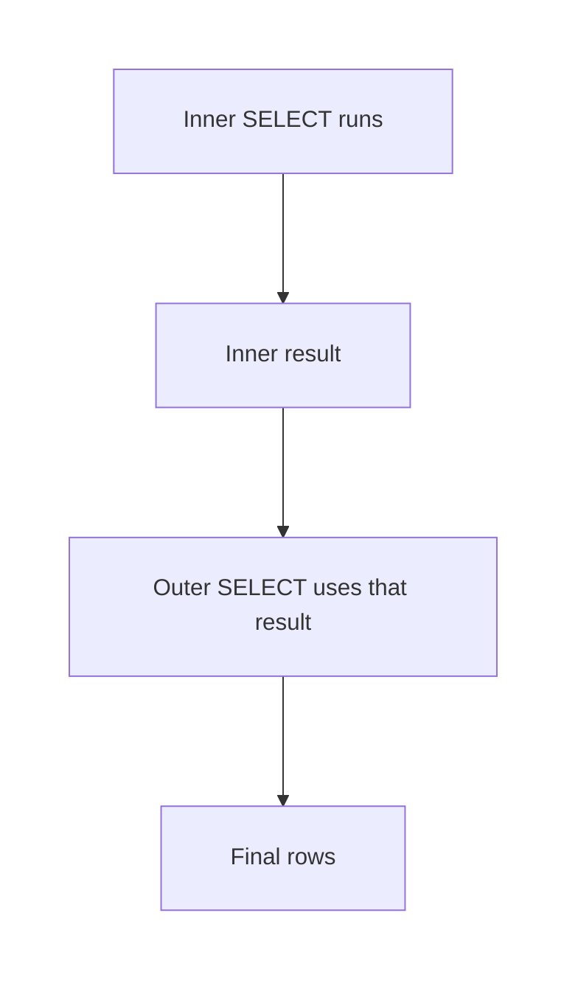
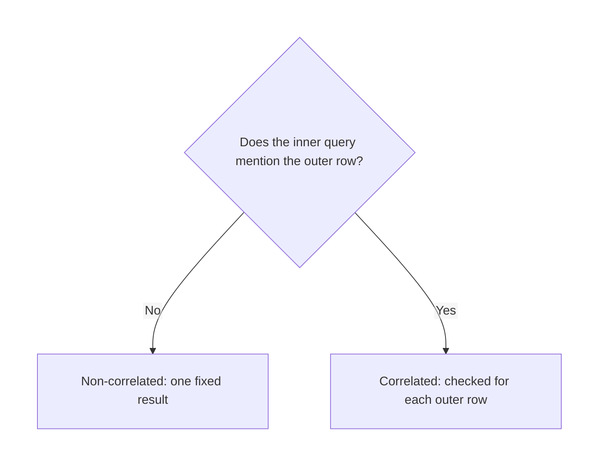

# SQL — Subqueries

## What You Will Learn in This Lesson

In the previous session you connected two tables **side by side** with a join. A join answers by lining matching rows next to each other. A **subquery** nests one question inside another question.

You already know `SELECT`, `WHERE`, and simple calculations such as an average. This lesson uses those tools **inside** a larger question. It does not rebuild the join catalogue.

By the end of this lesson, you will be able to:

- Explain what a subquery is and where the inner query sits
- Use a subquery in **WHERE** with **IN**
- Use a subquery in **WHERE** with a comparison such as `>`
- Place a **scalar subquery** in the **SELECT** list
- Place a subquery in **FROM** and give it a name
- Use **EXISTS** at a simple level
- Tell a **correlated** subquery from one that can run alone

---

## What a Subquery Is

- **Official Definition:** A **subquery** is a `SELECT` statement nested inside another SQL statement. The inner `SELECT` is evaluated so the outer statement can use its result.
- **In Simple Words:** You ask a small question first, then use that answer in the main question.
- **Real-Life Example:** Before you decide who scored above the class average, you first ask "what is the class average?" That inner question is the subquery.

The inner query is written in parentheses. Most tools expect the parentheses. The outer query is the question you wanted in the first place.

A subquery returns a small result that the outer query can test, display, or read as a temporary table. It does not, by itself, change stored rows.

Joins connect tables beside each other. A subquery nests a question inside a question.

Both are useful. This lesson practises the nested form.



---

## The Tables for This Lesson

A coaching class stores students in one table and subject scores in another. We will ask nested questions. We will not walk through every join type again.

```sql
CREATE TABLE students ( -- One row per learner
    student_id INTEGER PRIMARY KEY, -- Unique id
    student_name TEXT NOT NULL, -- Learner name
    city TEXT NOT NULL -- Home city
); -- End of students
```

**How the code works:**

- `student_id` identifies one learner.
- Name and city are required.
- The table is empty until the insert below.

```sql
CREATE TABLE scores ( -- One row per subject result
    score_id INTEGER PRIMARY KEY, -- Unique id for one result
    student_id INTEGER NOT NULL, -- Which learner earned it
    subject TEXT NOT NULL, -- Subject name
    score INTEGER NOT NULL -- Marks out of 100
); -- End of scores
```

**How the code works:**

- Each row is one subject result, not a student's whole report card.
- `student_id` points at `students` in meaning.
- `score` is the marks for that one subject.

```sql
INSERT INTO students (student_id, student_name, city) -- Columns to fill
VALUES -- Three learners
    (1, 'Anita Shah', 'Pune'), -- Id 1
    (2, 'Rahul Iyer', 'Delhi'), -- Id 2
    (3, 'Meera Nair', 'Chennai'); -- Id 3
```

**How the code works:**

- Three students are stored.
- Meera will have a low Maths score and no Science row.
- Names stay in this table only.

```sql
INSERT INTO scores (score_id, student_id, subject, score) -- Columns to fill
VALUES -- Five result rows
    (1, 1, 'Maths', 88), -- Anita Maths
    (2, 2, 'Maths', 72), -- Rahul Maths
    (3, 3, 'Maths', 65), -- Meera Maths
    (4, 1, 'Science', 91), -- Anita Science
    (5, 2, 'Science', 70); -- Rahul Science
```

**How the code works:**

- Maths marks are 88, 72, and 65. Their average is (88 + 72 + 65) / 3 = **75**.
- Science marks are 91 and 70. Meera has no Science row.
- Only Anita has a score of 90 or more.
- Run these four statements once. Each later query is complete on its own.

---

## Subquery in WHERE with IN

- **Official Definition:** **IN** tests whether a value is a member of a list. When the list is produced by a subquery, the outer row is kept only if its value appears in that inner result.
- **In Simple Words:** The inner query builds a list of ids. The outer query keeps people whose id is on that list.
- **Real-Life Example:** The office first lists roll numbers with Maths above 70, then reads only those names from the register.

```sql
SELECT -- Outer question: names of matching learners
    student_name -- The name to print
FROM students -- Look in the people table
WHERE student_id IN ( -- Keep the id only if it is in the inner list
    SELECT -- Inner question starts
        student_id -- Only the id is needed for membership
    FROM scores -- Look in the marks table
    WHERE subject = 'Maths' -- Only Maths rows
      AND score > 70 -- Marks strictly above 70
); -- End of the IN list
```

**How the code works:**

- The inner query finds Maths rows above 70: Anita (88) and Rahul (72). It returns student ids **1** and **2**.
- Meera's Maths score is 65, so id 3 is not in the list.
- `IN` checks membership. It does not copy Anita twice if she had two qualifying rows. The name is printed once.
- The outer result is **Anita Shah** and **Rahul Iyer**.

If the inner query returns no rows, the `IN` list is empty and the outer query returns no rows. A duplicate id inside the list still counts as one membership.

Use `IN` when the inner query may return **many** values and you only care whether the outer value is one of them.

---

## Subquery in WHERE with a Comparison

A comparison such as `>`, `<`, or `=` needs **one** value on the right-hand side, not a list.

- **Official Definition:** A **scalar subquery** returns exactly one column and at most one row. Used with a comparison, that single value is compared with the outer row.
- **In Simple Words:** The inner question must answer with one number. Then you ask who is above or below that number.
- **Real-Life Example:** Find the average Maths mark first. Then keep only students who scored above that average.

```sql
SELECT -- Outer question: Maths rows above the average
    student_id, -- Who scored it
    score -- Their Maths marks
FROM scores -- Marks table
WHERE subject = 'Maths' -- Stay on Maths
  AND score > ( -- Compare with one inner number
      SELECT -- Inner question
          AVG(score) -- One average
      FROM scores -- Same marks table
      WHERE subject = 'Maths' -- Average of Maths only
  ); -- The inner result must be a single value
```

**How the code works:**

- The inner `AVG` of Maths is (88 + 72 + 65) / 3 = **75**.
- The outer query keeps Maths rows whose score is **greater than** 75.
- Anita's 88 qualifies. Rahul's 72 and Meera's 65 do not.
- The result is one row: student id **1**, score **88**.
- This inner query never mentions the outer row, so it can be run **by itself** and still returns 75.

Two failures are common.

- If the inner query returns **two or more rows**, the comparison has no single number to use. PostgreSQL reports that more than one row was returned by a subquery used as an expression. Use `IN` for a list, not `>`.
- If the inner query returns **no row**, the comparison is made with NULL. `score > NULL` is not true, so the outer query keeps nobody.

`=` follows the same rule. It is correct only when the subquery returns one value. A list of ids belongs with `IN`.

---

## Scalar Subquery in SELECT

The same one-value rule applies when the subquery sits in the select list. The outer query still prints its own rows. The inner value is an extra column.

- **Official Definition:** A **scalar subquery in SELECT** is a parenthesised query in the select list that returns one column and at most one row for each outer row it serves.
- **In Simple Words:** Every output row can carry one extra number that was looked up by a nested question.
- **Real-Life Example:** Beside every student name, print the highest Maths mark in the class. That highest mark is the same number on every row.

```sql
SELECT -- Outer question: one row per student
    student_name, -- From the students table
    ( -- Start a one-value lookup
        SELECT -- Inner question
            MAX(score) -- The single highest mark
        FROM scores -- Marks table
        WHERE subject = 'Maths' -- Highest Maths mark only
    ) AS highest_maths -- Name the extra column
FROM students; -- Three students, three output rows
```

**How the code works:**

- The inner `MAX` of Maths is **88**. It does not use the outer student, so it is the same for every row.
- The outer query still returns **3 rows**, one per student.
- Each row shows that student's name and the number 88 in `highest_maths`.
- `AS highest_maths` is a column label in the result, not a new stored column.

If this inner query returned two rows, the statement would fail. If it returned no row, `highest_maths` would be NULL on every outer row, and the student names would still appear.

A scalar subquery in `SELECT` adds a column. It does not filter people out. Filtering is the job of `WHERE`.

---

## Subquery in FROM

Sometimes the inner question should produce a **small table**, and the outer question should read that table.

- **Official Definition:** A subquery in **FROM** is a derived table. The database runs the inner query, then the outer query selects from that temporary result. SQL requires a name (an alias) for that result.
- **In Simple Words:** Run a question, treat its answer like a short register, then ask a second question of that register.
- **Real-Life Example:** First make a list of students who are not in Delhi. Then read names and cities from that list only.

```sql
SELECT -- Outer question reads the temporary list
    city_list.city, -- City column from the inner result
    city_list.student_name -- Name column from the inner result
FROM ( -- Start the derived table
    SELECT -- Inner question
        city, -- Must be selected if the outer query wants it
        student_name -- Must be selected if the outer query wants it
    FROM students -- Original people table
    WHERE city <> 'Delhi' -- Drop Delhi inside the inner question
) AS city_list; -- Required name for the FROM subquery
```

**How the code works:**

- The inner query returns Anita (Pune) and Meera (Chennai). Rahul is in Delhi, so he is excluded.
- `AS city_list` names that two-row result. PostgreSQL and MySQL reject a `FROM` subquery with no name.
- The outer query can see only `city` and `student_name`, because those are the columns the inner query produced.
- The result is two rows: Pune / Anita Shah, and Chennai / Meera Nair.

The outer query cannot mention `student_id` here. The inner query did not pass that column outward. Add it to the inner select list if you need it.

This pattern is still one nested question. It is not a second copy of the database.

---

## EXISTS at a Simple Level

- **Official Definition:** **EXISTS** is true for an outer row when the inner query returns **at least one** row for that test. It is false when the inner query returns nothing. The columns listed inside `EXISTS` are ignored.
- **In Simple Words:** Ask "is there at least one matching row?" You do not need the row's values.
- **Real-Life Example:** "Is there at least one score of 90 or more for this student?" If yes, print the name. If no, skip the name.

```sql
SELECT -- Outer question: student names
    student_name -- Name to print when the test passes
FROM students -- Check each learner
WHERE EXISTS ( -- True when the inner query finds a row
    SELECT -- The select list is not used
        1 -- A placeholder value
    FROM scores -- Look for a result row
    WHERE scores.student_id = students.student_id -- This learner only
      AND scores.score >= 90 -- A high mark
); -- End of EXISTS
```

**How the code works:**

- For Anita, the inner query finds Science 91. `EXISTS` is true. Her name is kept.
- For Rahul, the highest score is 72. The inner query finds nothing. His name is dropped.
- For Meera, the only score is 65. Her name is dropped.
- The result is one name: **Anita Shah**.
- `SELECT 1` does not mean "the score is 1". Any select list would do. `EXISTS` only cares that a row came back.

`scores.student_id = students.student_id` reaches **out** to the current student. That link is what makes the test personal to each outer row. The next section names that pattern.

`NOT EXISTS` would keep the students for whom the inner query finds nothing. The idea is the opposite test. This lesson's worked example stays on `EXISTS`.

---

## Correlated and Non-Correlated

- **Official Definition:** A **non-correlated subquery** does not refer to columns of the outer query. It can be executed once, on its own, and its result does not change from outer row to outer row.
- **In Simple Words:** The inner question is independent. You could run it alone and paste the answer into the outer question.
- **Real-Life Example:** "What is the highest Maths mark?" does not depend on which student name you are printing. It is one number for the whole class.

The average query and the `highest_maths` query in this lesson are non-correlated. Neither inner `WHERE` mentions `students`.

- **Official Definition:** A **correlated subquery** refers to a column from the outer query. Logically it is re-checked for each outer row, because the inner answer can change.
- **In Simple Words:** The inner question contains a pointer back to "this row" of the outer question.
- **Real-Life Example:** "Does **this** student have a score of 90 or more?" The words "this student" change as you move down the register.

The `EXISTS` query is correlated because it uses `students.student_id` from the outer query. You cannot run that inner query alone without knowing which student is "this" student.



A useful check: copy the inner query into a new window. If it still runs and the meaning stays the same, it is non-correlated. If it complains that an outer column is missing, it is correlated.

The database may optimise the work internally. For reading and writing, trust the meaning above, not a guess about speed.

---

## Choose the Shape of the Inner Result

Match the inner result to the place you put it.

| Place | What the inner query must return | Example from this lesson |
|-------|----------------------------------|--------------------------|
| `WHERE ... IN` | One column, any number of rows | Ids with Maths above 70 |
| `WHERE ... >` or `=` | One column and one row | Average Maths mark 75 |
| `SELECT` list | One column and one row | Highest Maths mark 88 |
| `FROM` | A table, with an alias | Students who are not in Delhi |
| `WHERE EXISTS` | Any rows; columns are ignored | At least one score of 90 or more |

Common slips, checked against this data:

- `score > (SELECT student_id FROM scores WHERE subject = 'Maths')` fails because three ids come back, and `>` cannot take a list.
- A `FROM` subquery with no `AS` name fails in PostgreSQL and MySQL.
- Selecting `student_id` from `city_list` fails if the inner query did not output `student_id`.
- An `EXISTS` test with no link to the outer row can become true for **everyone** as soon as one person in the whole table qualifies. The `student_id` equality in the example prevents that.

---

## Walk the EXISTS Query One Student at a Time

Correlated subqueries feel clearer when you pretend to be the database and move one outer row at a time. Use the `EXISTS` query from this lesson. The test is: is there a score row for **this** student with marks of at least 90?

Anita Shah is the first outer row. Her `student_id` is 1. The inner query looks for a score for student 1 with `score >= 90`.

Science 91 qualifies. `EXISTS` is true. Her name stays.

Rahul Iyer is next. His id is 2. Maths 72 and Science 70 both fail `>= 90`.

The inner query returns no row. `EXISTS` is false. His name is removed.

Meera Nair is last. Her id is 3. The only score is Maths 65.

The inner query returns no row. Her name is removed. The final result is Anita alone.

That walk is the meaning of correlated. The inner text looks the same each time, but "this student" changes.

A non-correlated average does not need this walk. It is 75 before any student name is considered.

## One More Scalar Comparison

`>` is not the only comparison. `=` is valid when the inner query returns one value. Here the question is: which Maths row equals the highest Maths mark?

```sql
SELECT -- Outer question: the Maths row that matches the top mark
    student_id, -- Who scored it
    score -- The marks, which will equal the maximum
FROM scores -- Marks table
WHERE subject = 'Maths' -- Compare inside Maths only
  AND score = ( -- Equality needs one inner value
      SELECT -- Inner question
          MAX(score) -- Highest Maths mark
      FROM scores -- Marks table again
      WHERE subject = 'Maths' -- Maximum of Maths only
  ); -- One number, which is 88
```

**How the code works:**

- The inner `MAX` is **88**. The query does not mention the outer row, so it is non-correlated.
- The outer query keeps Maths rows whose score equals 88.
- Only student id **1** qualifies. Rahul 72 and Meera 65 do not.
- If two students had both scored 88, **both** outer rows would remain. `=` does not mean "only one winner" when several rows share that single maximum value.
- The inner query still returned one number. The outer table is allowed to contain that number more than once.

This is different from `IN`. `IN` expects a list. `=` expects one value.

Using `=` on a subquery that returns three ids is an error, not a quiet empty result.

## How to Read the Parentheses

Read a nested statement from the **inside** outward.

- Find the innermost `SELECT`.
- Decide whether it returns a list, one number, a small table, or a yes-no row check.
- Then read the outer verb that uses it: `IN`, a comparison, a select-list column, `FROM`, or `EXISTS`.
- Check whether any inner column name belongs to the outer query. If it does, the subquery is correlated.

Indentation does not change the meaning. It only helps your eye. The parentheses do the nesting.

A missing closing parenthesis is a syntax error. The tool usually points near the `WHERE` or the end of the statement.

The outer query cannot see columns that the inner query did not return, except in the special case of `EXISTS`, which does not use the inner columns at all. If you need a column outside, put it in the inner select list or stop nesting and ask for it directly.

Do not paste a join lesson into the parentheses. If the question is "place these two tables side by side", you already know that shape from the previous session. If the question is "answer a small question and then use it", keep the subquery.

## A Second Question on the Derived Table

The `FROM` subquery can do the filtering, and the outer query can sort or narrow that result again. The outer query still sees only the columns the inner query returned.

```sql
SELECT -- Outer question on the temporary list
    city_list.student_name, -- Name passed out by the inner query
    city_list.city -- City passed out by the inner query
FROM ( -- Derived table
    SELECT -- Inner question
        student_name, -- Column the outer query will print
        city -- Column the outer query will print
    FROM students -- People table
    WHERE city <> 'Delhi' -- Inner filter removes Rahul
) AS city_list -- Required alias
WHERE city_list.city = 'Pune' -- Outer filter on a visible column
ORDER BY city_list.student_name; -- Sort the final rows
```

**How the code works:**

- The inner query still returns Anita (Pune) and Meera (Chennai).
- The outer `WHERE` keeps only Pune, so Meera drops out at the second step.
- The result is one row: **Anita Shah**, Pune.
- `ORDER BY` here only sorts. With one row, the order is obvious.
- This is still a subquery in `FROM`, plus an ordinary filter. It is not a new kind of join.

If the outer `WHERE` mentions `student_id`, the statement fails. Add `student_id` to the inner select list first, then filter on `city_list.student_id`.

## Blank Values and Membership

Keep the inner list free of blanks when you use `IN`. A NULL inside an `IN` list does not behave like an ordinary id.

A value that truly matches a real id still matches. A value that matches nothing does not become a clear "no" when NULL is also in the list. The test is unknown rather than false.

This lesson's id lists do not contain NULL. `student_id` was inserted for every score. If you write a subquery for practice, select a column that is filled on every inner row.

`EXISTS` is calmer about this. It only asks whether a row came back. It does not compare the outer value with a NULL id unless you put that comparison in the inner `WHERE` yourself.

## Practice: Predict the Result

Use the inserted students and scores. Do the arithmetic before you look at the check.

### Activity: Who Is on the IN List

You do this:

1. List `student_id` values from `scores` where `subject` is Maths and `score` is greater than 70.
2. Write the student names an outer `IN` query would return.
3. Say whether Meera can appear twice. She cannot. Say why in one line.

**Check your answer:**

- The inner ids are **1** and **2**.
- The names are **Anita Shah** and **Rahul Iyer**.
- Meera's Maths score is 65, so she is absent. `IN` prints a person once even if the inner list had repeated that id.

### Activity: Above the Average, and EXISTS

You do this:

1. Compute the Maths average from 88, 72, and 65.
2. Say which Maths row survives `score >` that average.
3. Say which student name `EXISTS` keeps when the inner test is `score >= 90`.

**Check your answer:**

- The average is **75**.
- Only student id **1** with score **88** survives the comparison.
- `EXISTS` keeps **Anita Shah** only, because of Science **91**.
- The average subquery is non-correlated. The `EXISTS` example is correlated.

---

## Key Takeaways

- A subquery is a `SELECT` inside another statement. Joins place tables side by side. A subquery nests a question inside a question.
- `IN` accepts a list of values. A comparison such as `>` accepts only a **scalar** subquery: one column and one row.
- A scalar subquery in `SELECT` adds one value to each outer row. A subquery in `FROM` is a temporary table and needs a name.
- `EXISTS` asks whether at least one inner row comes back. The columns inside it are not the point.
- If the inner query refers to the outer row, it is **correlated**. If it can run alone, it is not. In the next session you will rank rows **without collapsing** them.

---

## Important Commands, Libraries, and Terminologies

| Term / Command | What It Does |
|----------------|--------------|
| **Subquery** | A `SELECT` nested inside another SQL statement |
| **Outer query** | The main statement that uses the inner result |
| **`IN`** | Keeps an outer row when its value is in the inner list |
| **Scalar subquery** | An inner query that returns one column and at most one row |
| **Comparison subquery** | A scalar subquery used with `>`, `<`, or `=` |
| **Scalar subquery in `SELECT`** | Adds one looked-up value as a result column |
| **Subquery in `FROM`** | A derived table the outer query reads |
| **Alias (`AS`)** | The required name of a `FROM` subquery |
| **`EXISTS`** | True when the inner query returns at least one row |
| **Non-correlated subquery** | Does not use the outer row; can run once on its own |
| **Correlated subquery** | Uses a column from the current outer row |
| **`AVG` / `MAX` inside a subquery** | Produces the single number a scalar subquery needs |
