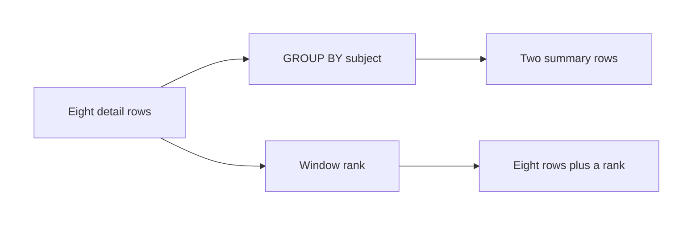
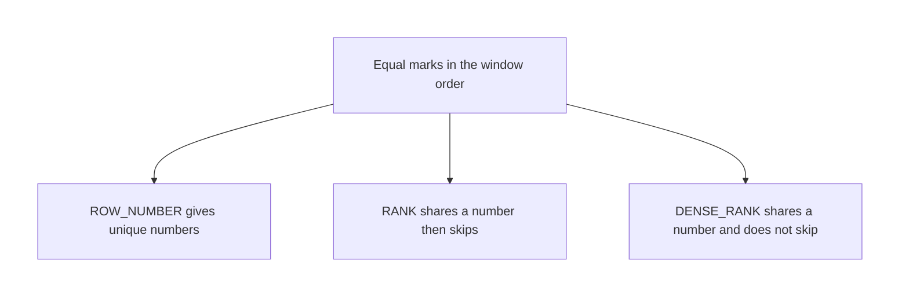

# SQL — Window Functions: Ranking

## What You Will Learn in This Lesson

In the previous session you nested one question inside another. You can already summarise a table so that many detail rows become one total. A **window function** answers a different need: keep every detail row, and still attach a rank.

This lesson ranks marks. It does not introduce lag, lead, or a running total. One contrast is enough: **GROUP BY collapses rows; a window does not.**

By the end of this lesson, you will be able to:

- Explain why a grouped total hides the original rows
- Write **OVER ()** and say what an empty window means
- Split ranks with **PARTITION BY**
- Set rank order with **ORDER BY** inside **OVER**
- Use **ROW_NUMBER**, **RANK**, and **DENSE_RANK**
- Explain how those three functions treat a **tie**

---

## Why a Window Keeps Every Row

A class teacher has eight result rows: four students, two subjects. A grouped question such as "highest marks per subject" returns **one row per subject**.

The other student names are gone. That collapse is what grouping is for.

A rank question is different. Anita and Rahul can share 92 in Maths, and you still want **both names** on the page, each with a rank beside the marks.

- **Official Definition:** A **window function** calculates a value across a set of rows related to the current row, and it does not collapse those rows into one summary row.
- **In Simple Words:** The function looks across a neighbourhood of rows, then writes its answer back onto **each** original row.
- **Real-Life Example:** In a race, you do not throw away the runners in order to say who came first. You keep every runner and write 1, 2, or 3 next to the name.

Eight input rows stay eight output rows when you only add a rank column. Grouping the same eight rows by subject would leave two rows. That is the whole contrast.



The window does not edit the stored table. It adds a calculated column in the result.

---

## The Marks Table

One table is enough. Each row is one student in one subject.

```sql
CREATE TABLE exam_marks ( -- One row per student per subject
    student_name TEXT NOT NULL, -- Learner name
    subject TEXT NOT NULL, -- Maths or Science
    marks INTEGER NOT NULL -- Marks out of 100
); -- End of the table
```

**How the code works:**

- There is no separate total column. Marks stay on the detail row.
- The same student can appear twice, once per subject.
- Nothing is stored until the insert.

```sql
INSERT INTO exam_marks (student_name, subject, marks) -- Columns to fill
VALUES -- Eight result rows
    ('Anita Shah', 'Maths', 92), -- Tied top in Maths
    ('Rahul Iyer', 'Maths', 92), -- Tied top in Maths
    ('Meera Nair', 'Maths', 85), -- Third place in Maths by marks
    ('Kabir Khan', 'Maths', 78), -- Fourth in Maths
    ('Kabir Khan', 'Science', 95), -- Clear first in Science
    ('Anita Shah', 'Science', 88), -- Tied second in Science
    ('Meera Nair', 'Science', 88), -- Tied second in Science
    ('Rahul Iyer', 'Science', 70); -- Last in Science
```

**How the code works:**

- Maths marks in descending order are 92, 92, 85, 78.
- Science marks in descending order are 95, 88, 88, 70.
- Anita and Rahul tie on 92. Anita and Meera tie on 88.
- Names will be used only as a **tie-break** so the practice result is stable.

Sort the rows in your mind before you rank them.

| subject | student_name | marks |
|---------|--------------|-------|
| Maths | Anita Shah | 92 |
| Maths | Rahul Iyer | 92 |
| Maths | Meera Nair | 85 |
| Maths | Kabir Khan | 78 |
| Science | Kabir Khan | 95 |
| Science | Anita Shah | 88 |
| Science | Meera Nair | 88 |
| Science | Rahul Iyer | 70 |

Within a tie, this lesson sorts the name A to Z. Anita comes before Rahul. Anita comes before Meera.

---

## OVER — The Window Specification

- **Official Definition:** **OVER** introduces the window. The parentheses hold the rules for which rows are visible to the function and, when needed, how those rows are ordered for the calculation.
- **In Simple Words:** `OVER (...)` tells the function which set of rows to look at, and in what sequence to number them.
- **Real-Life Example:** "Look at the whole class" and "look only at Maths, sorted by marks" are two different windows. The keyword that carries those rules is `OVER`.

An empty **OVER ()** means one window: every row of the result, with no split and no ordering rule inside the window.

```sql
SELECT -- Keep every stored column
    student_name, -- Learner
    subject, -- Subject
    marks, -- Marks
    ROW_NUMBER() OVER () AS any_number -- A unique number with no defined order
FROM exam_marks; -- All eight rows
```

**How the code works:**

- `OVER ()` does not partition and does not order.
- `ROW_NUMBER()` still writes a unique integer on each row, so the result still has **eight** rows.
- Which row receives 1 is **not defined**, because no order was requested. Do not memorise that sequence.
- Empty `OVER ()` is the right picture of "the whole result is one window". It is the wrong picture of a published rank list.

`RANK()` and `DENSE_RANK()` also accept `OVER ()` in PostgreSQL. With no `ORDER BY`, every row is a peer, so every rank is **1**.

That result is technically consistent and practically useless. Ranking needs an order. The next sections put that order inside `OVER`.

`ORDER BY` written at the **end** of the query sorts the display. It is not a substitute for `ORDER BY` inside `OVER`.

The window order decides the rank. The final `ORDER BY` only decides the printed sequence.

---

## ORDER BY inside OVER

- **Official Definition:** **ORDER BY inside OVER** defines the sequence of rows **within the window** for functions that depend on position, including the ranking functions.
- **In Simple Words:** This sort is for the rank calculation. Highest marks first, then name, in the examples below.
- **Real-Life Example:** Judges sort the race by finish time. Only after that sort do they write 1st, 2nd, and 3rd.

```sql
SELECT -- One output row per exam row
    student_name, -- Learner
    subject, -- Subject stays on the row
    marks, -- Marks stay on the row
    ROW_NUMBER() OVER ( -- Start the window
        ORDER BY marks DESC, student_name ASC -- High marks first, then name
    ) AS row_num -- Unique position across all eight rows
FROM exam_marks -- Source rows
ORDER BY marks DESC, student_name ASC; -- Display order matches the window order
```

**How the code works:**

- There is no `PARTITION BY`, so all eight rows share one window.
- `marks DESC` puts 95 first, then the two 92s, then the two 88s, then 85, 78, and 70.
- `student_name ASC` breaks ties: Anita before Rahul on 92, Anita before Meera on 88.
- `ROW_NUMBER()` assigns 1 through 8 in that sequence. No two rows share a number.
- The final `ORDER BY` makes the printed list follow the same sequence. Without it, the ranks would still be correct, but the rows might print in another order.

| row_num | student_name | subject | marks |
|---------|--------------|---------|-------|
| 1 | Kabir Khan | Science | 95 |
| 2 | Anita Shah | Maths | 92 |
| 3 | Rahul Iyer | Maths | 92 |
| 4 | Anita Shah | Science | 88 |
| 5 | Meera Nair | Science | 88 |
| 6 | Meera Nair | Maths | 85 |
| 7 | Kabir Khan | Maths | 78 |
| 8 | Rahul Iyer | Science | 70 |

This list mixes subjects. A class rank **inside Maths** needs a split. That split is `PARTITION BY`.

---

## PARTITION BY — Restart Inside Each Group

- **Official Definition:** **PARTITION BY** divides the window into partitions. The function restarts its calculation for each partition. Rows are not collapsed. Every source row remains in the output.
- **In Simple Words:** Rank Maths separately from Science. Each subject gets its own 1st place.
- **Real-Life Example:** The school publishes a Maths merit list and a Science merit list. Being first in Science does not make you first in Maths.

```sql
SELECT -- Keep the detail row
    student_name, -- Learner
    subject, -- Partition key, also displayed
    marks, -- Marks
    ROW_NUMBER() OVER ( -- Window function
        PARTITION BY subject -- Restart for each subject
        ORDER BY marks DESC, student_name ASC -- Order inside that subject
    ) AS row_num -- Position inside the subject
FROM exam_marks -- Eight source rows
ORDER BY subject, marks DESC, student_name ASC; -- Read subject by subject
```

**How the code works:**

- `PARTITION BY subject` builds two windows: the four Maths rows, and the four Science rows.
- Numbering starts again at 1 inside each subject.
- The result still has **eight** rows. Partitioning is not grouping.
- Anita is row 1 in Maths and row 2 in Science. Those are two different ranks on two different rows.

| subject | row_num | student_name | marks |
|---------|---------|--------------|-------|
| Maths | 1 | Anita Shah | 92 |
| Maths | 2 | Rahul Iyer | 92 |
| Maths | 3 | Meera Nair | 85 |
| Maths | 4 | Kabir Khan | 78 |
| Science | 1 | Kabir Khan | 95 |
| Science | 2 | Anita Shah | 88 |
| Science | 3 | Meera Nair | 88 |
| Science | 4 | Rahul Iyer | 70 |

If you omit `student_name` from the window `ORDER BY`, Anita and Rahul still receive **two different** row numbers, but the database may give 1 to either of them. Add the name when the published list must be stable.

---

## ROW_NUMBER, RANK, and DENSE_RANK

All three functions need a window. For a meaningful rank, include `ORDER BY` inside `OVER`. They differ only in how they treat **ties** — rows that the window `ORDER BY` considers equal.

- **Official Definition:** **ROW_NUMBER** assigns a unique integer to each row of the partition, following the window order. Tied values still receive different numbers.
- **In Simple Words:** Everyone gets a distinct queue number, even if the marks are equal.
- **Real-Life Example:** Two students score 92. The list still prints them as positions 1 and 2 because the name breaks the tie. Their marks are equal. Their row numbers are not.

- **Official Definition:** **RANK** assigns the same rank to tied rows. The next rank after a tie **skips**. The skip equals the count of tied rows already placed: after two people share rank 1, the next rank is 3.
- **In Simple Words:** Ties share a place, and the following place jumps ahead so the rank still reflects how many people are strictly ahead.
- **Real-Life Example:** Two gold medals at 92. Nobody is called 2nd. The next student, on 85, is 3rd.

- **Official Definition:** **DENSE_RANK** assigns the same rank to tied rows. The next distinct position receives the **next** integer, with no gap.
- **In Simple Words:** Ties share a place, and the next different mark is simply the next number. No skipped place.
- **Real-Life Example:** Two students share 1st on 92. The student on 85 is 2nd, not 3rd. The list has no missing number.

```sql
SELECT -- Show all three ranks together
    student_name, -- Learner
    subject, -- Subject partition
    marks, -- Marks that create the ties
    ROW_NUMBER() OVER ( -- Unique position
        PARTITION BY subject -- Per subject
        ORDER BY marks DESC, student_name ASC -- High marks, then name
    ) AS row_num, -- Never repeats inside the subject
    RANK() OVER ( -- Competition rank with gaps
        PARTITION BY subject -- Same partitions
        ORDER BY marks DESC, student_name ASC -- Same window order
    ) AS rank_with_gap, -- Ties share, next rank skips
    DENSE_RANK() OVER ( -- Dense competition rank
        PARTITION BY subject -- Same partitions
        ORDER BY marks DESC, student_name ASC -- Same window order
    ) AS dense_rank -- Ties share, next rank does not skip
FROM exam_marks -- Eight rows in, eight rows out
ORDER BY subject, marks DESC, student_name ASC; -- Readable subject lists
```

**How the code works:**

- The three functions see the same partitions and the same order. Only the numbering rule changes.
- `ORDER BY marks DESC, student_name ASC` makes a strict order. Anita and Rahul are **not** peers, because the names differ.
- With that order, `RANK` and `DENSE_RANK` also write 1 then 2 in Maths. The gap never appears, because the window no longer sees a tie.

A tie exists only when every column in the window `ORDER BY` is equal. Add a name, and you remove the tie for **all three** functions. Leave the order as marks alone when you want shared ranks.

To **show a tie**, order by the tied column only.

```sql
SELECT -- Ranks that treat equal marks as ties
    student_name, -- Learner, not used as a tie-break
    subject, -- Subject
    marks, -- The only sort key inside the window
    ROW_NUMBER() OVER ( -- Still unique
        PARTITION BY subject -- Per subject
        ORDER BY marks DESC -- Marks only, so equal marks are peers
    ) AS row_num, -- Unique, but which tied row is 1 is not fixed
    RANK() OVER ( -- Gap after a tie
        PARTITION BY subject -- Per subject
        ORDER BY marks DESC -- Peers share marks
    ) AS rank_with_gap, -- Shared rank, then a skip
    DENSE_RANK() OVER ( -- No gap after a tie
        PARTITION BY subject -- Per subject
        ORDER BY marks DESC -- Peers share marks
    ) AS dense_rank -- Shared rank, no skip
FROM exam_marks -- Source
ORDER BY subject, marks DESC, student_name; -- Display only; name is not inside OVER
```

**How the code works:**

- `ORDER BY marks DESC` inside `OVER` makes equal marks into peers.
- `RANK` and `DENSE_RANK` are therefore determined. `ROW_NUMBER` is unique but the winner inside a tie is **not** guaranteed.
- The final `ORDER BY` includes the name so **you** can read the table. It does not change the rank values.
- Maths: both 92s get rank 1 and dense rank 1. Meera on 85 gets rank **3** and dense rank **2**. Kabir on 78 gets rank **4** and dense rank **3**.
- Science: Kabir on 95 is 1 for every function. The two 88s share rank **2** and dense rank **2**. Rahul on 70 gets rank **4** and dense rank **3**.

| subject | student_name | marks | row_num | rank_with_gap | dense_rank |
|---------|--------------|-------|---------|---------------|------------|
| Maths | Anita Shah | 92 | 1 or 2 | 1 | 1 |
| Maths | Rahul Iyer | 92 | the other of 1 or 2 | 1 | 1 |
| Maths | Meera Nair | 85 | 3 | 3 | 2 |
| Maths | Kabir Khan | 78 | 4 | 4 | 3 |
| Science | Kabir Khan | 95 | 1 | 1 | 1 |
| Science | Anita Shah | 88 | 2 or 3 | 2 | 2 |
| Science | Meera Nair | 88 | the other of 2 or 3 | 2 | 2 |
| Science | Rahul Iyer | 70 | 4 | 4 | 3 |

`ROW_NUMBER` never repeats. `RANK` repeats and then skips. `DENSE_RANK` repeats and does not skip.

A three-way tie makes the skip obvious. Suppose four marks in one partition, ordered high to low: **10, 10, 10, 7**.

- `ROW_NUMBER` writes 1, 2, 3, 4. The three 10s still get different numbers.
- `RANK` writes 1, 1, 1, 4. Three people share 1st, so the next rank is 4. Ranks 2 and 3 are skipped.
- `DENSE_RANK` writes 1, 1, 1, 2. The next different mark is 2nd. Nothing is skipped.



Use `ROW_NUMBER` when a list must show a unique slot, such as "top 1 row only" after you have defined a tie-break. Use `RANK` when a shared medal should push the next person down. Use `DENSE_RANK` when the next person should be the next whole number, with no gap.

---

## Read One Subject as a Number Line

Write the Maths marks in the window order `marks DESC`: **92, 92, 85, 78**. Do not sort by name inside the window for this reading. Names are only labels so you can talk about the rows.

The first 92 has nobody strictly ahead of it. `RANK` is 1. `DENSE_RANK` is 1.

`ROW_NUMBER` will be either 1 or 2.

The second 92 has the same marks as the first, so it is a peer. `RANK` stays 1. `DENSE_RANK` stays 1.

`ROW_NUMBER` takes the other of 1 or 2. Two rows have been seen. The **next** rank will care about how many rows are strictly ahead, not only how many distinct marks you have seen.

The 85 has **two** rows strictly ahead of it. `RANK` is 1 + 2 = **3**. There is only **one** distinct rank value strictly ahead (the shared 1), so `DENSE_RANK` is 1 + 1 = **2**.

`ROW_NUMBER` is 3, because a row number never repeats and never looks at ties.

The 78 has **three** rows strictly ahead. `RANK` is **4**. Distinct ranks strictly ahead are 1 and 2, so `DENSE_RANK` is **3**.

`ROW_NUMBER` is 4.

Science is the same arithmetic on **95, 88, 88, 70**.

- 95: `RANK` 1, `DENSE_RANK` 1, `ROW_NUMBER` 1.
- First 88: `RANK` 2, `DENSE_RANK` 2, `ROW_NUMBER` 2 or 3.
- Second 88: `RANK` 2, `DENSE_RANK` 2, the other row number.
- 70: two rows of 88 sit ahead, plus Kabir's 95, so three rows are strictly ahead. `RANK` is **4**. Distinct ranks ahead are 1 and 2, so `DENSE_RANK` is **3**. `ROW_NUMBER` is 4.

That arithmetic is the definition you can trust if a screen sorts the tied names the other way. The shared ranks do not flip. Only `ROW_NUMBER` inside the tie can flip.

## What Changes If You Add a Tie-Break

Add `student_name ASC` **inside** `OVER`, not only at the end of the query. Anita and Rahul no longer share a window position, because A comes before R.

Maths then becomes a strict list: Anita 92, Rahul 92, Meera 85, Kabir 78. All three functions write **1, 2, 3, 4**.

The marks are still equal on the first two rows. The window does not call them a tie anymore, because the full sort key is not equal.

Putting the name only in the final `ORDER BY` does **not** do this. The final sort changes the printed order. The rank was already computed from the window order.

Students often sort the output, see Anita above Rahul, and believe the rank itself used the name. It did not, unless the name is inside `OVER`.

## Choose the Function for the Question

Use the question's words, not a habit.

- "Give every row a unique slot, and break ties by name." Use `ROW_NUMBER` with `ORDER BY marks DESC, student_name ASC` inside `OVER`.
- "If marks are equal, share the place and leave a gap, the way a race does when two runners share gold." Use `RANK` with `ORDER BY marks DESC` only.
- "If marks are equal, share the place, and let the next mark take the next whole number." Use `DENSE_RANK` with `ORDER BY marks DESC` only.
- "Restart the list for each subject." Add `PARTITION BY subject` on every window in the select list. One function with a partition and another without it will mix a subject rank and an overall rank on the same row. That is allowed, and it is confusing if you did not mean it.

Copy the same `OVER (...)` clause onto each ranking function when you want them compared fairly. Different windows on the same row are a different question.

The output width grows by one column per function. The output **height** stays equal to the number of source rows, unless a `WHERE` filters them.

This lesson's queries do not filter. Eight rows enter, eight rows leave.

## A Checklist Before You Trust a Rank

Run this list on every ranking query in this lesson.

- Count input rows and output rows. Both should be 8 for the exam table. If you see 2, the query grouped. It did not window.
- Find every `OVER`. If one rank has `PARTITION BY subject` and another does not, you mixed a subject list with an overall list.
- Read the window `ORDER BY` from left to right. The first column is the main order. Later columns break ties.
- If `marks` is the only sort key, equal marks share `RANK` and `DENSE_RANK`. `ROW_NUMBER` still splits them, in an unspecified way.
- If `student_name` is also inside `OVER`, there is no tie left in this data. All three functions then agree on 1, 2, 3, 4 inside each subject.
- Confirm the final `ORDER BY` is only for reading. Cover it with your hand and the rank values stay the same.
- For a gap, use the "rows strictly ahead" count. Two people on rank 1 means the next `RANK` is 3. The next `DENSE_RANK` is 2.

Apply the checklist to Science once more, without looking at the earlier table.

Kabir has 95. Nobody is ahead. Every function that orders by marks descending gives him **1** inside Science.

Anita and Meera have 88. They share `RANK` **2** and `DENSE_RANK` **2**. Their row numbers are **2** and **3**, and the database may assign those two numbers in either direction.

Rahul has 70. Three Science rows have higher marks. His `RANK` is **4**.

His `DENSE_RANK` is **3**. His `ROW_NUMBER` is **4**.

The same checklist on the toy marks 10, 10, 10, 7 gives `RANK` values 1, 1, 1, 4 and `DENSE_RANK` values 1, 1, 1, 2. The last row's row number is 4.

## Practice: Predict the Ranks

Use the eight exam rows. For these checks, the window is `PARTITION BY subject ORDER BY marks DESC` with **no** name inside `OVER`.

### Activity: Maths Places

You do this:

1. List the Maths marks from high to low.
2. Write `RANK` and `DENSE_RANK` for 92, 92, 85, and 78.
3. Say what `ROW_NUMBER` does with the two 92s.

**Check your answer:**

- The marks order is 92, 92, 85, 78.
- `RANK` is **1, 1, 3, 4**.
- `DENSE_RANK` is **1, 1, 2, 3**.
- `ROW_NUMBER` is four different numbers. Which of the two 92s is 1 is not fixed unless you add a tie-break inside `OVER`.

### Activity: Science, and a Three-Way Tie

You do this:

1. Write `RANK` and `DENSE_RANK` for Science marks 95, 88, 88, 70.
2. For a separate list 10, 10, 10, 7, write `RANK` of the last row and `DENSE_RANK` of the last row.
3. Say whether adding these rank columns reduces eight exam rows to two.

**Check your answer:**

- Science `RANK` is **1, 2, 2, 4**. Science `DENSE_RANK` is **1, 2, 2, 3**.
- On 10, 10, 10, 7, the last row has `RANK` **4** and `DENSE_RANK` **2**.
- The exam result still has **eight** rows. A window does not collapse them. Grouping would.

---

The window clause can be repeated in full on every function. Some tools also let you name a window once and reuse the name.

This lesson writes the clause out in full each time so you can see `PARTITION BY` and `ORDER BY` next to the function they serve. Reusing a name is a shorthand, not a different rank.

Keep the select list readable. Put the stored columns first (`student_name`, `subject`, `marks`), then the three rank columns. A reader can then check a rank against the marks without scrolling sideways in a small result.

If two windows on one query use different orders, label the columns with names that say so, such as `subject_rank` and `overall_rank`. This lesson's comparison queries use one window shape at a time so the three functions stay comparable.

## Say the Rank Out Loud

Use one sentence per row so the tie rule becomes speech, not only a table. Stay inside Science. Order by marks descending only.

- Kabir scored 95. Say "rank 1, dense rank 1, row number 1".
- Anita scored 88. Say "rank 2, dense rank 2". Her row number is 2 or 3.
- Meera scored 88. Say the same shared ranks: "rank 2, dense rank 2". She takes the row number Anita did not take.
- Rahul scored 70. Say "rank 4, dense rank 3, row number 4". Rank 3 is unused because two students shared rank 2.

Now say Maths the same way. Both 92s are "rank 1, dense rank 1". The 85 is "rank 3, dense rank 2".

The 78 is "rank 4, dense rank 3".

If a classmate adds the student name inside `OVER` and then asks why the 85 became rank 4, the answer is: the name destroyed the tie, so the second 92 consumed rank 2. Remove the name from the window order if the shared medal is what you wanted.

Eight spoken lines, two subjects, still eight rows on the page. Nothing was collapsed.

## Key Takeaways

- **GROUP BY** collapses detail rows into summaries. A window function writes its answer on the original rows and leaves those rows in place.
- **OVER ()** describes the window. Empty parentheses mean the whole result. **PARTITION BY** restarts the calculation inside each group without collapsing. **ORDER BY inside OVER** sets the sequence used for ranking.
- **ROW_NUMBER** is always unique. **RANK** shares a value on a tie and skips. **DENSE_RANK** shares a value and does not skip.
- A tie exists only when the window `ORDER BY` treats the rows as equal. An extra tie-break column removes the tie for every ranking function.
- A final `ORDER BY` sorts the printout. It does not assign the rank. The upcoming session leaves SQL and opens a grid you can see and edit directly.

---

## Important Commands, Libraries, and Terminologies

| Term / Command | What It Does |
|----------------|--------------|
| **Window function** | Calculates across related rows without collapsing them |
| **`OVER`** | Starts the window specification |
| **`OVER ()`** | One window over the whole result, with no split and no window order |
| **`PARTITION BY`** | Restarts the window inside each group of rows |
| **`ORDER BY` inside `OVER`** | Orders rows for the rank calculation |
| **Final `ORDER BY`** | Sorts the printed result only |
| **`ROW_NUMBER`** | Unique position; ties still get different numbers |
| **`RANK`** | Shared rank on a tie; the next rank skips |
| **`DENSE_RANK`** | Shared rank on a tie; the next rank does not skip |
| **Peer rows** | Rows that the window `ORDER BY` considers equal |
| **Tie-break** | An extra `ORDER BY` column that makes a unique sequence |
| **GROUP BY contrast** | Collapses many detail rows into one summary row |
