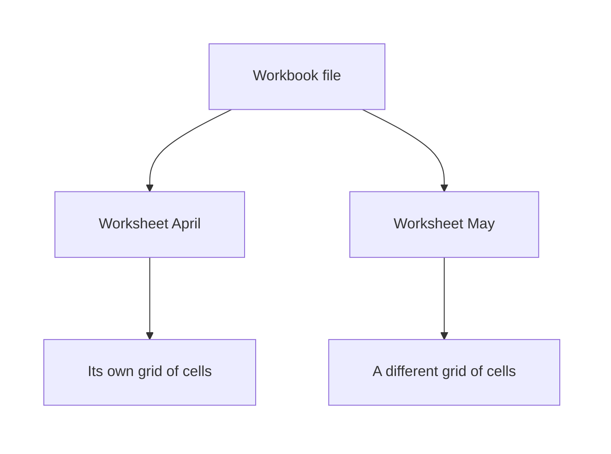
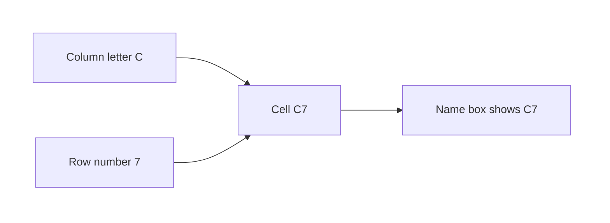

# Excel — Understanding the Excel Interface

## What You Will Learn in This Lesson

In the previous session you asked questions of tables. The rows came back as a result you could read.

Excel is a grid you can see. You click a cell, type a value, and the value stays on the sheet.

This lesson is about the screen itself: the file, the sheets, the ribbon, the formula bar, and the addresses of cells. You will enter and edit text, select ranges, and insert or delete rows and columns. You will not calculate anything yet.

By the end of this lesson, you will be able to:

- Tell a **workbook** from a **worksheet**
- Find the **ribbon**, its **tabs**, the **formula bar**, and the **name box**
- Name a cell by its **address**, such as **A1**
- Enter data, change it, and cancel an edit
- Select a **range**, a whole row, and a whole column
- Insert and delete rows and columns
- Widen a column until the text is visible
- Use **zoom**, and optionally freeze a header row so scrolling is easier

---

## Workbook and Worksheet

- **Official Definition:** A **workbook** is the Excel file. It holds one or more worksheets, and it is what you save, close, and open again.
- **In Simple Words:** The workbook is the whole notebook. The file name is the name of that notebook.
- **Real-Life Example:** `FeeRegister.xlsx` is one workbook. Inside it you might keep a sheet for April fees and another sheet for May fees.

- **Official Definition:** A **worksheet** (also called a **sheet**) is one grid of rows and columns inside the workbook.
- **In Simple Words:** A sheet is one page of the notebook. You look at one sheet at a time.
- **Real-Life Example:** The tab named April is one sheet. Clicking the tab named May shows a different grid in the same file.

A new workbook usually opens with one sheet, often named Sheet1. You can add more.

Deleting a sheet removes that grid from the file. It does not delete the workbook until you delete the file itself.

The sheet tabs sit along the bottom of the window. The active tab is the sheet you are looking at.

A click on another tab switches the grid. Double-click a tab to rename it, type the new name, and press Enter.

Saving the workbook saves every sheet in it. You do not save sheets as separate files unless you deliberately copy them out, which is outside this lesson.

---

## The Ribbon and Its Tabs

- **Official Definition:** The **ribbon** is the band of commands across the top of the Excel window. Commands are grouped under **tabs**.
- **In Simple Words:** The ribbon is the row of tools. Each tab is a labelled group, such as Home or View.
- **Real-Life Example:** On a phone, you switch between apps by their icons. In Excel you switch tool groups by clicking Home, Insert, or View.

Click **Home** when you are entering, clearing, or inserting rows. Click **View** when you want zoom or a frozen header.

Other tabs stay on the ribbon for later lessons. Today you do not need them.

If the ribbon is collapsed, you may see only the tab names. Click a tab, or the small pin, so the commands show.

Hiding the ribbon does not delete your data. It only hides the buttons.

The title bar above the ribbon shows the workbook name. Under that, the tabs are Home and its neighbours.

The grid begins below the formula bar. Learn those three horizontal bands first: title, ribbon, then the grid.

---

## Name Box and Formula Bar

Above the column letters you will see two boxes side by side.

- **Official Definition:** The **name box** is the small box at the left of the formula bar. It shows the address of the active cell. You can type an address there and press Enter to jump to that cell.
- **In Simple Words:** The name box tells you where you are. It says A1 when the selected cell is A1.
- **Real-Life Example:** It works like a house number displayed on a gate. You read it to know which cell is active, and you can type another number to go there.

- **Official Definition:** The **formula bar** is the long box to the right of the name box. It shows the contents of the active cell, and it is where you can type or edit those contents.
- **In Simple Words:** Whatever is stored in the selected cell appears in the formula bar. Click there if you want to change it.
- **Real-Life Example:** The cell might be too narrow to show a long city name. The formula bar still shows the full text.

The formula bar is where a formula will be typed in the next session. This lesson types ordinary values only: names, cities, and numbers as data. You will not build a calculation today.

When a cell is empty, the formula bar is empty too. When you start typing, the formula bar shows the same characters you see in the cell.

Press Enter to store them. Press Esc to throw the unfinished edit away.

A green tick and a red cross may appear beside the formula bar while you are typing. The tick stores the edit, like Enter.

The cross cancels it, like Esc. They are not part of your data.

---

## Rows, Columns, Cells, and Addresses

- **Official Definition:** A **column** is a vertical line of cells, named with letters: A, B, C, and so on. After Z the names continue AA, AB, AC.
- **In Simple Words:** Columns run up and down. The letter is painted on the top of the column.
- **Real-Life Example:** Column A might hold student names all the way down the sheet. Column B might hold their cities.

- **Official Definition:** A **row** is a horizontal line of cells, named with numbers: 1, 2, 3, and so on.
- **In Simple Words:** Rows run left to right. The number is painted on the left of the row.
- **Real-Life Example:** Row 1 is often the heading row: Name, City, Marks. Row 2 is the first student.

- **Official Definition:** A **cell** is the rectangle where one column crosses one row. It holds one value.
- **In Simple Words:** A cell is one box in the grid.
- **Real-Life Example:** The box where column C crosses row 5 is one cell. It might hold the number 88.

- **Official Definition:** A **cell address** (also called a cell reference) names a cell by its column letter and then its row number. **A1** means column A, row 1.
- **In Simple Words:** Letter first, number second. A1 is the top-left cell. You do not write 1A.
- **Real-Life Example:** "C7" means walk to column C, then down to row 7. The name box shows C7 when that cell is active.

The **active cell** is the one selected now. It has a thicker border. Anything you type goes into the active cell, not into a cell you are only looking at.

Click a cell once to make it active. The name box updates immediately. If the name box and the border disagree, click the cell again before you type.

A value lives in one cell. It does not live "between" cells. If you need Name and City, use two cells, for example A2 and B2, on the same row.

---

## Entering and Editing Data

You do this to store a new value:

1. Click the cell. Check the name box.
2. Type the text or the number. Do not start with a symbol that Excel treats as a calculation. Type the characters of the value itself.
3. Press Enter to store it and move down, or Tab to store it and move right.
4. Look at the formula bar. It should show exactly what you meant to store.

You do this to change a value that is already stored:

1. Click the cell once.
2. Double-click the cell, or press F2, or click inside the formula bar.
3. Edit the characters.
4. Press Enter to keep the change, or Esc to keep the old value.

You do this to empty a cell without removing the row:

1. Click the cell.
2. Press Delete.
3. The row and column stay. Only that cell's contents are gone.

Delete clears contents. It does not pull the cells below upward. Removing the whole row is a different command, covered below.

A number and a piece of text are both just values in this lesson. 88 in a cell is the marks you typed. It is not a total of anything.

A long name is text. If you see a surprise symbol after you type, press Esc and type the name again.

Clicking another cell while you are still typing will usually store the edit first. If you did not want to store it, click the cell you just filled and edit it, or press Ctrl+Z to undo. Undo is on the Home tab as well, as a curved arrow.

---

## Selecting Ranges

- **Official Definition:** A **range** is a rectangular block of cells. It is written as the address of one corner, a colon, and the address of the opposite corner. **A1:B3** is that block.
- **In Simple Words:** A range is several cells selected together, forming a rectangle.
- **Real-Life Example:** A1:B3 covers names and cities for three rows: A1, B1, A2, B2, A3, B3. That is 3 rows × 2 columns = 6 cells.

You do this to select a range:

1. Click the first cell. Hold the mouse button.
2. Drag to the last cell. Release.
3. Or click the first cell, hold Shift, and click the last cell.

The name box may show the size while you drag, then the address of the active corner when you stop. Count the cells yourself when you are learning: rows multiplied by columns.

You do this to select a whole row or column:

1. Click the row number at the left to select that entire row.
2. Click the column letter at the top to select that entire column.
3. Click another row number to move the selection. The previous row is no longer selected unless you held Ctrl, which adds to the selection.

Selecting does not change the stored values. It only marks which cells the next command will affect. If you type while a range is selected, the value goes into the active cell, not into every cell of the range.

Click any single cell to shrink the selection back to one cell. If a huge range is highlighted by accident, click one cell before you press Delete. Otherwise you may clear more than you intended.

---

## Inserting and Deleting Rows and Columns

Inserting adds a blank row or a blank column and shifts the existing cells. Deleting removes that row or column and shifts the others back. Neither command is the same as clearing one cell.

You do this to insert a row:

1. Right-click the row number **above which** you want the new row. To put a blank row between row 1 and the current row 2, right-click the number 2.
2. Choose Insert.
3. The old row 2 moves down and becomes row 3. Addresses below the insert all change.

You do this to insert a column:

1. Right-click the column letter. The new column appears to the **left** of the letter you clicked.
2. Choose Insert.
3. Old data shifts right. If names were in column A and you insert at A, the names move to column B.

You do this to delete a row or column:

1. Right-click the row number or the column letter.
2. Choose Delete.
3. The grid closes up. Data that was below moves up, or data that was to the right moves left.

Home also has an Insert menu and a Delete menu for the same jobs. Use whichever you can see. The result is the same: a whole row or a whole column is added or removed.

If you only wanted to erase a name, you used the wrong command when the entire row disappears. Press Ctrl+Z immediately to undo. Then click the single cell and press Delete.

After an insert, check the name box. A value you knew as A2 may now be A3. The value moved.

It was not copied.

---

## Column Width and Zoom

Text that is longer than the column can look cut off. The full text is still stored. The formula bar proves it.

- If the cell to the right is empty, the text may look as if it spills into that empty cell. It is still stored in the original cell.
- If the cell to the right has its own value, the long text looks clipped. Widen the column to read it.

You do this to widen a column:

1. Move the pointer to the boundary line just to the right of the column letter.
2. Drag the boundary until the longest entry on that sheet is visible.
3. Or double-click that boundary. Excel widens the column to fit the longest entry.

Column width is about reading. It does not change the address, and it does not change the stored characters. A narrow column is not a missing value.

- **Official Definition:** **Zoom** changes how large the grid looks on the screen. It does not change cell values, addresses, or column widths stored in the file.
- **In Simple Words:** Zoom is the magnifying glass. 100% is the usual size.
- **Real-Life Example:** You zoom in to read a small laptop screen, then zoom back to 100% before you show the sheet to someone else.

You do this to zoom:

1. Find the slider at the bottom-right of the window.
2. Drag toward the plus sign to zoom in, or toward the minus sign to zoom out.
3. Or open the View tab and choose a zoom size. Return to 100% when you want the normal view.

Zoom is personal to your screen. A classmate who opens the same workbook may see a different zoom. The cells they see are the same cells.

---

## Freeze a Header While You Scroll

Freezing is optional. It is a way to **navigate** a long sheet. It is not a way to design a report.

- **Official Definition:** **Freeze Panes** locks chosen rows or columns on the screen so they stay visible while you scroll the rest of the sheet.
- **In Simple Words:** The heading row stays put. The rows below it move.
- **Real-Life Example:** Row 1 says Name, City, Marks. You scroll down to row 80 and the headings are still on screen, so you do not forget which column you are in.

You do this:

1. Click the View tab.
2. Choose Freeze Panes, then Freeze Top Row, if you only need row 1 to stay.
3. Scroll downward. Row 1 should remain visible.
4. Choose Unfreeze Panes on the same menu when you want normal scrolling again.

Freezing does not lock the cells against editing. You can still click the header and change the word Name.

It also does not hide rows. It only holds them on the screen while you move.

If the wrong row freezes, unfreeze first, click a cell in the body of the sheet, and freeze the top row again. Do not insert decorative titles for this step. One heading row is enough.

---

## A Sheet You Can Build by Hand

Build a tiny class list so every part of the window has a job. Use one sheet.

| Cell | What you type |
|------|----------------|
| A1 | Name |
| B1 | City |
| A2 | Anita Shah |
| B2 | Pune |
| A3 | Rahul Iyer |
| B3 | Delhi |

You do this:

1. Open a new workbook. Confirm the name box can show A1. Click A1 if it does not.
2. Type the six values in the table. Press Tab to move from Name to City, and Enter when you want to move down.
3. Click A2. The formula bar must show Anita Shah, not Name.
4. Widen column A until Anita Shah is fully visible.
5. Rename the sheet tab from Sheet1 to ClassList.

Nothing in that grid is a calculation. Name, City, Pune, and Delhi are text you typed. The addresses tell you where each piece sits.

If Anita appears in A1, you started typing in the heading cell. Clear A1, type Name again, and put Anita in A2. Check the name box before every entry until the habit sticks.

---

## Practice With Check Answers

### Activity: Name the Cell

You do this:

1. Click the cell where column C crosses row 7.
2. Read the name box.
3. Type the address of column B, row 2, into the name box and press Enter.
4. Say which cell is active now.

**Check your answer:**

- The first name box reading is **C7**.
- After you type B2 and press Enter, the active cell is **B2**.
- The address is letter then number. B2 is correct. 2B is not an address.
- The formula bar shows whatever is already stored in B2. If you never typed there, it is empty.

### Activity: Count a Range, Then Insert a Row

You do this:

1. Select the range A1:C4. Count the rows, the columns, and the cells.
2. Type Fees in A1 and Anita in A2, if those cells are empty. If they already have other text, note that text first so you can restore it.
3. Insert a new row above the current row 2.
4. Read the name box for the cell that now holds Anita.

**Check your answer:**

- A1:C4 has **3 columns** (A, B, and C) and **4 rows** (1 through 4). The cell count is 3 × 4 = **12**.
- Inserting above row 2 pushes Anita down. Anita is now in **A3**. A2 is blank.
- A1 still holds Fees, because you inserted below it.
- Clearing Anita with the Delete key would have left her row in place. Insert moved the row. Those are different actions.

### Activity: Width, Zoom, and a Frozen Heading

You do this:

1. Type a long city name, such as Visakhapatnam, in C2.
2. Narrow column C until the name looks cut off. Then read the formula bar.
3. Double-click the column boundary so the name fits.
4. Set zoom to 100% if it is not already.
5. Freeze the top row, scroll down, then unfreeze.

**Check your answer:**

- While the column is narrow, the formula bar still shows **Visakhapatnam**. The stored text did not shrink.
- After the double-click, the column is wide enough to show that text.
- Zoom does not change C2's address or its text.
- While the top row is frozen, row 1 stays visible as you scroll. After you unfreeze, row 1 scrolls away with the rest.

---

## Move Around the Grid

The mouse is enough, and the keyboard is often faster. Neither method changes a value until you type.

You do this with the mouse:

1. Click a cell to select it.
2. Use the vertical scroll bar to move down a long sheet. Use the horizontal scroll bar to move right.
3. Click a sheet tab when you want a different grid. Scrolling does not change sheets.

You do this with the keyboard:

1. Press the arrow keys to move one cell at a time.
2. Press Tab to move right. Press Enter to move down after you have stored a value.
3. Press Ctrl+Home to return to the beginning of the sheet. On most sheets that cell is A1.
4. Hold Shift and press an arrow key to grow the selection by one cell.

Ctrl+Home is navigation. It does not insert a row, and it does not clear A1. If A1 holds a heading, that heading is still there when you arrive.

The scroll bars move your **view**. The active cell stays where it was until you click or use an arrow.

You can be looking at row 40 while the name box still says A1. Click a cell in view before you type, or you will edit A1 by mistake.

## What Each Sheet Remembers

Sheets in one workbook do not share cells. Anita in A2 on ClassList is not automatically in A2 on a second sheet.

You do this:

1. Build the six class-list entries on the first sheet, as in the table above.
2. Click the plus sign beside the sheet tabs to add a sheet.
3. Click A2 on the new sheet and read the formula bar.
4. Click the first sheet tab again and read A2.

**Check your answer:**

- The new sheet's A2 is empty. The formula bar is blank.
- The first sheet's A2 still shows Anita Shah.
- Renaming a tab does not move those values. It only changes the label on the tab.
- Zoom on one sheet can differ from zoom on another. The stored text does not travel with the zoom.

A workbook is the file you save. If you close without saving, the sheets you added and the names you typed can disappear together.

Save from the title bar when the list is worth keeping. Saving writes the grids as they are. It does not calculate.

## Read Addresses Before You Trust Your Eyes

Column width and zoom change appearance. Addresses do not.

| What you see | What is still true |
|--------------|--------------------|
| Text looks cut off | The formula bar holds the full text |
| The grid looks large at 150% zoom | The name box still says the same address |
| A frozen row 1 stays on screen | The row number is still 1, and lower rows still have their own numbers |
| An inserted row pushes Anita down | The name box shows the new address, often A3 instead of A2 |

You do this as a short reading drill:

1. Put Pune in B2.
2. Note the address before you change anything else.
3. Insert a column at A, so a blank column appears on the left.
4. Find Pune. Read the name box.

**Check your answer:**

- Pune started in **B2**.
- After a column insert at A, old column B shifts right and becomes column C.
- Pune is now in **C2**, on the same row, because you inserted a column, not a row.
- The characters Pune did not change. Only the address changed.

If that shift surprises you, undo once. Watch the name box while you insert again.

The letter changes. The city does not.

## A Map of the Window

Use this list when the screen feels crowded. Start at the top and move down.

- Title bar: workbook file name.
- Ribbon tabs: Home for editing, View for zoom and freeze.
- Name box: address of the active cell.
- Formula bar: contents of that cell.
- Column letters: A, B, C, across the top of the grid.
- Row numbers: 1, 2, 3, down the left of the grid.
- Active cell: the box with the thick border.
- Sheet tabs: one tab per worksheet, along the bottom.
- Zoom slider: bottom-right, screen size only.

Point at each item on your own window and say its name. If you cannot find the name box, look immediately left of the formula bar, just above column A.

The grid is the part you edit. The ribbon is the part that offers commands.

Students sometimes look for a typed name inside the ribbon. They sometimes click Home in order to store a city. Type in the cell instead.

Use the ribbon only when you need a command such as insert, zoom, or freeze.

## Key Takeaways

- A **workbook** is the file. A **worksheet** is one grid inside it, chosen from the tabs at the bottom.
- The **ribbon** holds commands under tabs. The **name box** shows the active address. The **formula bar** shows what the cell stores, and it is where a formula will be typed in the next session.
- A cell address is the column letter plus the row number, as in **A1**. A range such as A1:B3 is a rectangle of those cells.
- Enter stores a value. Esc cancels an edit. Delete clears one cell. Insert and Delete on a row number or column letter add or remove a whole line of the grid.
- Widen a column to see text, and use zoom to see the grid more comfortably. Freeze Top Row only to keep headings in view while you scroll.

---

## Important Commands, Libraries, and Terminologies

| Term / Command | What It Does |
|----------------|--------------|
| **Workbook** | The Excel file that contains the sheets |
| **Worksheet / sheet** | One grid inside the workbook |
| **Sheet tab** | The bottom tab you click to switch sheets |
| **Ribbon** | The command band at the top |
| **Tab** | A group of ribbon commands, such as Home or View |
| **Name box** | Shows the active cell's address, and can jump to an address you type |
| **Formula bar** | Shows and edits the active cell's contents |
| **Column** | A vertical series of cells, labelled with letters |
| **Row** | A horizontal series of cells, labelled with numbers |
| **Cell** | One intersection of a column and a row |
| **Cell address** | Column letter then row number, such as A1 |
| **Active cell** | The cell that will receive what you type |
| **Range** | A rectangular block, written with a colon, such as A1:B3 |
| **Insert row / column** | Adds a blank row or column and shifts existing cells |
| **Delete row / column** | Removes that row or column and closes the gap |
| **Column width** | How wide the column looks; the stored text does not change |
| **Zoom** | Screen magnification; values and addresses stay the same |
| **Freeze Top Row** | Keeps row 1 visible while you scroll |
