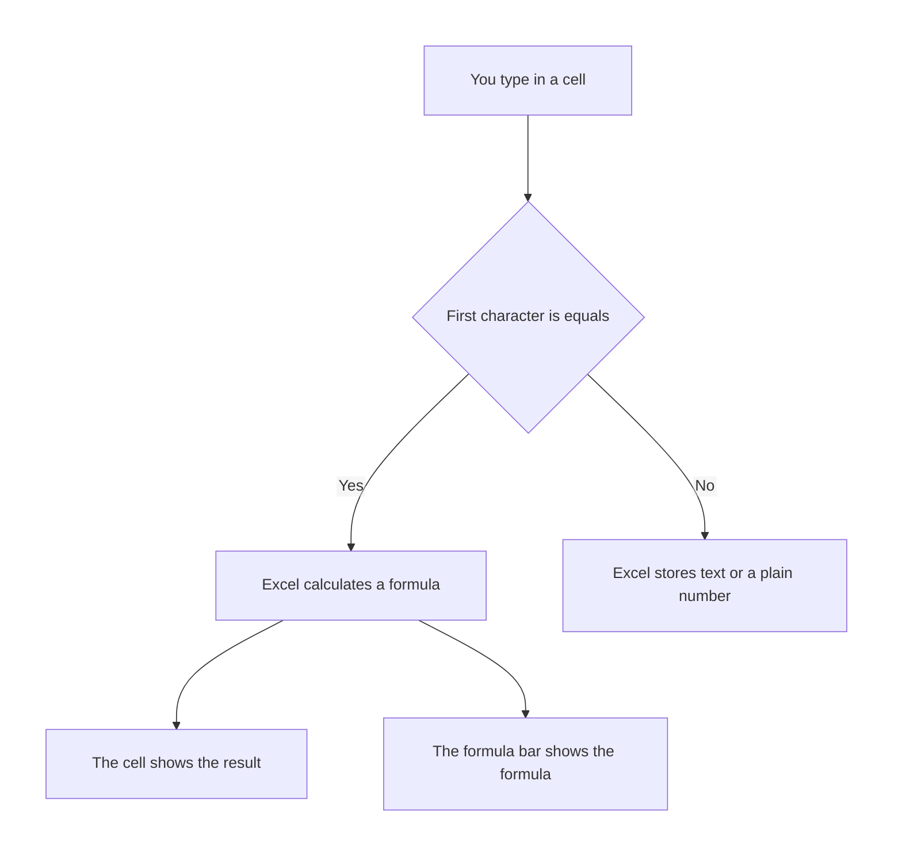
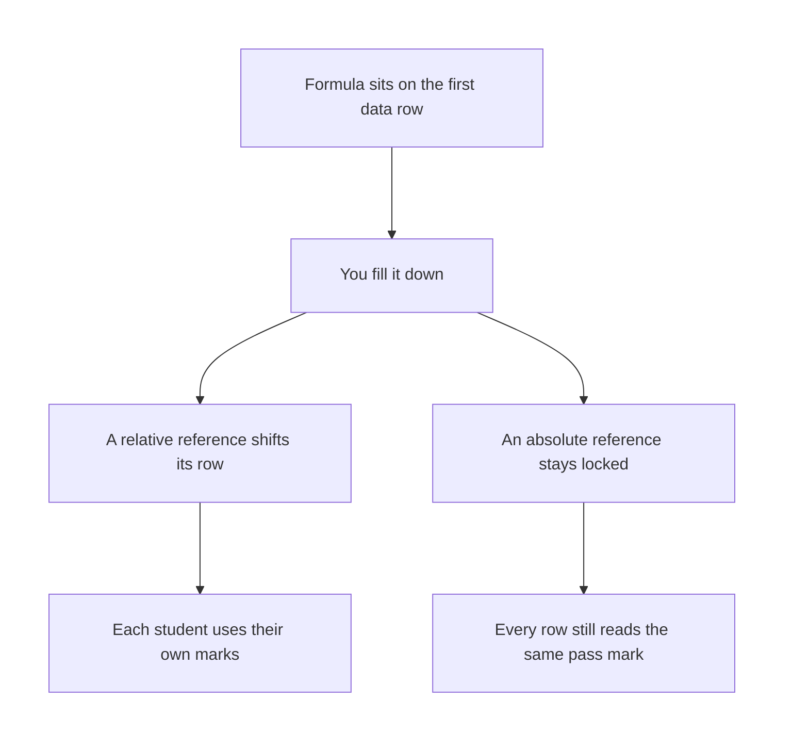

# Excel — Functions in Excel

## What You Will Learn in This Lesson

You already know the grid, the ribbon, and how to click a cell and type. This lesson starts from that point and teaches calculation. You will write formulas that read other cells, and you will copy one formula down a list.

By the end, you will be able to:

- Explain what a formula is, and why it must start with `=`
- Point a formula at cells with a cell reference and a range
- Tell a relative reference apart from an absolute reference such as `$A$1`
- Use `SUM`, `AVERAGE`, `COUNT`, `COUNTA`, `MIN`, and `MAX` on a small sheet
- Write a simple `IF` that returns one of two answers
- Fill a formula down so each row calculates its own cells

The running example is a short marks sheet for four students, described in tables below. Activity 2 uses a small expense list. Both stay as text and tables.

---

## A Formula Calculates from Cells

A number you type stays as you typed it. A formula asks Excel to work out a fresh result from cells. When a mark changes, a formula result can change with it.

- **Official Definition:** A **formula** is an instruction, stored in a cell, that Excel calculates. It begins with the equals sign.
- **In Simple Words:** You type a recipe. Excel cooks it and shows the dish in the cell.
- **Real-Life Example:** The class teacher does not re-add four marks on paper after one student retakes a test. The total cell adds the four mark cells again.



Click the result cell whenever you want to check the recipe. The grid shows the answer. The formula bar, just above the grid, shows what you typed.

A **function** is a named calculation you place inside a formula, such as `SUM` or `IF`. A formula can be a function, or it can be plain arithmetic such as `=B2+C2`. Both still begin with `=`.

- **Official Definition:** A **function** is a built-in calculation with a name and arguments inside brackets.
- **In Simple Words:** `SUM` is the name of the adding tool. The cells you list inside the brackets are what it adds.
- **Real-Life Example:** Asking a cashier to total a bill is a function. Pointing at three item prices is giving the arguments.

Excel accepts `sum` in small letters and still understands it. These notes write function names in capitals so they are easy to spot.

---

## The Equals Sign Is the Switch

If the first character is not `=`, Excel does not calculate. `SUM(B2:B5)` without the equals sign is stored as text. The cell will not show `246`.

- **Official Definition:** The **equals sign** is the first character of every Excel formula. It switches the cell from storage to calculation.
- **In Simple Words:** No equals sign means "keep these characters." An equals sign means "work this out."
- **Real-Life Example:** A written note that says "add the marks" is a reminder. A formula that starts with `=` is the actual addition.

A space before `=` also blocks calculation, because the first character is then a space. A space after `=` is allowed. `= SUM(B2:B5)` still calculates.

Press Enter to confirm a formula. Press Esc to cancel the edit and keep the old contents. You can edit in the cell or in the formula bar.

---

## Cell References and Ranges

A formula becomes useful when it points at cells instead of repeating typed numbers. If Riya's mark moves from `72` to `75`, every formula that points at her cell can update.

- **Official Definition:** A **cell reference** is the column letter and row number that identify one cell, such as `B2`.
- **In Simple Words:** `B2` means "the cell in column B, row 2."
- **Real-Life Example:** On a seating chart, "column B, bench 2" picks one student. `B2` picks one cell the same way.

- **Official Definition:** A **range** is a block of cells written with a colon between the first cell and the last cell, such as `B2:B5`.
- **In Simple Words:** The colon means "through." `B2:B5` includes `B2`, `B3`, `B4`, and `B5`.
- **Real-Life Example:** "Roll numbers 2 through 5" includes both ends. A range includes both ends too.

A comma lists separate pieces. `B2,B4` means those two cells only, and skips `B3`.

Do not type a rupee sign or the word "marks" inside a number you plan to add. Type `72`, not `72 marks`. The functions in this lesson add and compare plain numbers.

---

## Relative and Absolute References

When you copy a formula down, some addresses should move and one address should stay. That is the difference between a relative reference and an absolute reference.

- **Official Definition:** A **relative reference** is a cell address with no dollar signs, such as `B2`. Excel shifts it when the formula is filled down or across.
- **In Simple Words:** `B2` means "the mark on this same row." On the next row it becomes `B3`.
- **Real-Life Example:** "The person beside me" changes when you move to the next bench. A relative reference changes with the row.

- **Official Definition:** An **absolute reference** locks the column and the row with dollar signs, as in `$E$1`. The address does not change when the formula is filled.
- **In Simple Words:** `$E$1` always means cell `E1`, on every row.
- **Real-Life Example:** The pass mark is written once on the board. Every student's result looks at that same number, not at a new number on each bench.



Type the dollar signs yourself, or press F4 while the cursor is on the reference. The first press of F4 turns `E1` into `$E$1`. Further presses change the lock.

For this lesson, stop when both the column and the row show a dollar sign.

The pass mark lives in `E1` as the number `40`. A result formula on row 2 should compare `B2` with `$E$1`. After a fill down, row 3 still compares its own mark with `$E$1`.

---

## A Small Marks Sheet

Picture a sheet with names in column A and marks in column B. The pass mark sits alone in `E1`. Totals and other results sit below the four names, not inside the list of marks.

|  | A | B | C | D | E |
|--|---|---|---|---|---|
| 1 | Student | Marks | Result |  | 40 |
| 2 | Riya | 72 |  |  |  |
| 3 | Arun | 45 |  |  |  |
| 4 | Meera | 38 |  |  |  |
| 5 | Kabir | 91 |  |  |  |
| 6 | Total |  |  |  |  |
| 7 | Average |  |  |  |  |
| 8 | How many scores |  |  |  |  |
| 9 | Highest |  |  |  |  |
| 10 | Lowest |  |  |  |  |

`E1` displays `40`. That cell is the pass mark. Column C is still empty.

You will fill it with a simple `IF` later in the lesson.

The four marks are `72`, `45`, `38`, and `91`. Keep those numbers in mind while you read each function. Every function below uses this same block, `B2:B5`, unless a note says otherwise.

Row 6 is the total row. The formula that adds the marks must cover `B2:B5` only. If the total formula also includes its own cell, Excel reports a circular reference.

A circular reference means the formula depends on itself. Place the total outside the range it adds.

---

## SUM Adds the Numbers

`SUM` adds numbers in a range. Text in that range is ignored. A blank cell adds nothing.

- **Official Definition:** **`SUM`** returns the total of the numeric values in its arguments.
- **In Simple Words:** It adds the numbers and skips words and empty cells.
- **Real-Life Example:** Adding the prices on a canteen bill, while a handwritten note in the margin is not added.

The total goes in `B6`.

```excel
=SUM(B2:B5)
```

**How the formula works**

- `=` tells Excel to calculate.
- `SUM` is the function that adds.
- `B2:B5` is the one argument: start at `B2`, end at `B5`, and include every cell between them.

`B6` displays `246`, because `72 + 45 + 38 + 91 = 246`. The formula bar still shows `=SUM(B2:B5)`.

|  | A | B |
|--|---|---|
| 2 | Riya | 72 |
| 3 | Arun | 45 |
| 4 | Meera | 38 |
| 5 | Kabir | 91 |
| 6 | Total | =SUM(B2:B5) |

If one mark cell contains the word `Absent`, `SUM` skips that word. The total uses only the numeric marks. A zero is a number, so `SUM` includes a typed `0`.

---

## AVERAGE Finds the Mean

`AVERAGE` adds the numbers and divides by how many numbers it found. It ignores text and blank cells. It does not ignore a zero.

- **Official Definition:** **`AVERAGE`** returns the arithmetic mean of the numeric values in its arguments.
- **In Simple Words:** Add the scores, then divide by how many scores were actually numbers.
- **Real-Life Example:** A teacher adds four test scores and divides by four. A blank answer sheet is not treated as a zero unless someone typed `0`.

The average goes in `B7`.

```excel
=AVERAGE(B2:B5)
```

**How the formula works**

- `=` starts the calculation.
- `AVERAGE` is the function that finds the mean.
- `B2:B5` is the argument. Excel uses every number in that range.

`B7` displays `61.5`, because `246 / 4 = 61.5`.

If the range contains no numbers, `AVERAGE` shows `#DIV/0!`. That message means Excel was asked to divide by zero counts of numbers. Type at least one numeric mark, or point the range at the cells that hold marks.

A zero mark changes the story. Suppose the marks were `72`, `0`, and `48`. The average is `(72 + 0 + 48) / 3 = 40`.

If the middle cell were blank instead of `0`, the average would be `(72 + 48) / 2 = 60`. Type `0` only when the score really is zero.

---

## COUNT Counts Numbers

`COUNT` tells you how many cells in the range hold a number. Words and blanks are not counted.

- **Official Definition:** **`COUNT`** returns how many cells in the arguments contain a numeric value.
- **In Simple Words:** It counts scores, not names and not the word Absent.
- **Real-Life Example:** You ask, "How many answer sheets have a number on them?" You do not count the sheet that only says Absent.

The count goes in `B8`.

```excel
=COUNT(B2:B5)
```

**How the formula works**

- `=` starts the calculation.
- `COUNT` is the function that counts numeric cells.
- `B2:B5` is the argument. Each of `72`, `45`, `38`, and `91` is a number.

`B8` displays `4`. If Meera's cell said `Absent` instead of `38`, `COUNT` would display `3`.

`COUNT` on a range that includes the header `Marks` still returns `4`, because the header is text. Including the total cell would be a mistake if that total is itself a number. Count the mark cells, `B2:B5`.

---

## COUNTA Counts Cells That Are Not Empty

`COUNTA` counts every cell that holds something. Numbers count. Words count.

A truly empty cell does not count.

- **Official Definition:** **`COUNTA`** returns how many cells in the arguments are not empty.
- **In Simple Words:** If you can see something in the cell, `COUNTA` counts it. A blank cell is skipped.
- **Real-Life Example:** Counting how many name slots on a register have been filled, whether the entry is a name or a note.

Names sit in `A2:A5`. All four names are text, so `COUNT` on that range returns `0`. `COUNTA` is the function that can count those names.

```excel
=COUNTA(A2:A5)
```

**How the formula works**

- `=` starts the calculation.
- `COUNTA` counts non-empty cells.
- `A2:A5` is the argument: Riya, Arun, Meera, and Kabir.

The cell displays `4`.

Compare the two functions on a status list:

|  | A | What is stored |
|--|---|----------------|
| 1 | 72 | A number |
| 2 | Absent | Text |
| 3 |  | Empty |
| 4 | 15 | A number |

`=COUNT(A1:A4)` displays `2`. `=COUNTA(A1:A4)` displays `3`. The empty cell is the one both functions skip. A cell that contains only a space looks blank, but it is not empty, so `COUNTA` counts it.

Delete the space if you want a real blank.

---

## MIN and MAX Find the Ends of the List

`MIN` returns the smallest number in the range. `MAX` returns the largest number. Text is ignored. A typed zero is a real number and can be the minimum.

- **Official Definition:** **`MIN`** returns the smallest numeric value in its arguments.
- **In Simple Words:** It finds the lowest score.
- **Real-Life Example:** Looking down a price list for the cheapest bus ticket.

- **Official Definition:** **`MAX`** returns the largest numeric value in its arguments.
- **In Simple Words:** It finds the highest score.
- **Real-Life Example:** Spotting the top scorer on the same marks list.

Highest goes in `B9`. Lowest goes in `B10`.

```excel
=MAX(B2:B5)
```

**How the formula works**

- `=` starts the calculation.
- `MAX` picks the largest number.
- `B2:B5` is the argument. The numbers are `72`, `45`, `38`, and `91`.

`B9` displays `91`.

```excel
=MIN(B2:B5)
```

**How the formula works**

- `=` starts the calculation.
- `MIN` picks the smallest number.
- `B2:B5` is the same mark block.

`B10` displays `38`.

If the range has no numbers, `MIN` and `MAX` return `0`. Read that `0` together with `COUNT`. If `COUNT` is `0`, nobody has a numeric mark yet.

If `COUNT` is at least `1` and `MIN` is `0`, someone really scored zero.

---

## A Simple IF Gives One of Two Answers

`IF` asks one question. When the answer is yes, it returns the first result. When the answer is no, it returns the second result.

- **Official Definition:** **`IF`** returns `value_if_true` when `logical_test` is true, and `value_if_false` when `logical_test` is false.
- **In Simple Words:** One test, then one of two labels.
- **Real-Life Example:** If the score reaches the pass mark on the board, write Pass. Otherwise write Fail.

The test for Riya uses her mark and the locked pass mark.

```excel
=IF(B2>=$E$1,"Pass","Fail")
```

**How the formula works**

- `=` starts the calculation.
- `IF` is the function that chooses between two results.
- `B2>=$E$1` is the first argument, the test. It asks whether Riya's mark is greater than or equal to the pass mark in `$E$1`.
- `"Pass"` is the second argument, returned when the test is true. The quotes make it text.
- `"Fail"` is the third argument, returned when the test is false.

`C2` displays `Pass`, because `72` is greater than `40`. The quotes do not appear in the cell.

|  | A | B | C |
|--|---|---|---|
| 1 | Student | Marks | Result |
| 2 | Riya | 72 | =IF(B2>=$E$1,"Pass","Fail") |
| 3 | Arun | 45 |  |
| 4 | Meera | 38 |  |
| 5 | Kabir | 91 |  |

`E1` holds `40` and is written as `$E$1` inside the formula. A mark of exactly `40` passes, because the test uses `>=`, which means "greater than or equal to." Meera's `38` fails. You will place the same formula on the other rows by filling down, in the next section.

Write numbers in the test without quotes. Write words such as `Pass` with quotes. `=IF(B2>=$E$1,Pass,Fail)` looks for cells or names called Pass and Fail, which is a different instruction.

---

## Filling a Formula Down

You do not retype the result formula on every row. You write it once, then fill it down. Relative references shift.

Absolute references stay.

- **Official Definition:** **Fill down** copies a formula into the cells below and adjusts relative references for each new row.
- **In Simple Words:** One formula becomes a column of formulas, each pointed at its own row.
- **Real-Life Example:** You write the marking rule for the first student, then apply that same rule to each next name on the list.

The fill handle is the small square at the bottom-right corner of the selected cell. The pointer becomes a thin plus. Drag that plus down through `C5`.

You can also select `C2:C5` and press Ctrl+D on Windows, or Control+D on a Mac. Excel for the web accepts the same shortcut in many browsers. If the browser captures the keys, drag the fill handle instead.

On the desktop app, Home, then Fill, then Down does the same job.

After the fill, the sheet holds these formulas:

| Cell | Formula | What the cell displays |
|------|---------|------------------------|
| C2 | =IF(B2>=$E$1,"Pass","Fail") | Pass |
| C3 | =IF(B3>=$E$1,"Pass","Fail") | Pass |
| C4 | =IF(B4>=$E$1,"Pass","Fail") | Fail |
| C5 | =IF(B5>=$E$1,"Pass","Fail") | Pass |

`B2` became `B3`, then `B4`, then `B5`, because `B2` is relative. `$E$1` stayed `$E$1` on every row, because both parts are locked. Arun passes with `45`. Meera fails with `38`.

Kabir passes with `91`. Double-clicking the fill handle fills down beside existing values. When a neighbouring column has a gap, drag the handle yourself.

---

## Student Activity 1 — Marks, Count, and a Pass Rule

Build this sheet. `E1` holds `40`. Write each formula yourself, then fill the result column down.

|  | A | B | C | E |
|--|---|---|---|----------------|
| 1 | Student | Marks | Result | 40 |
| 2 | Lata | 40 |  |  |
| 3 | Om | 39 |  |  |
| 4 | Priya | 80 |  |  |
| 5 | Dev |  |  |  |
| 6 | Total |  |  |  |
| 7 | Average |  |  |  |
| 8 | Scores entered |  |  |  |
| 9 | Names entered |  |  |  |
| 10 | Highest |  |  |  |
| 11 | Lowest |  |  |  |

Dev's mark cell `B5` is empty on purpose. Use `B2:B5` for the mark functions so that empty cell is inside the range. Use `A2:A5` when you count names.

### Check your answers

| Cell | Formula | Displays |
|------|---------|----------|
| B6 | =SUM(B2:B5) | 159 |
| B7 | =AVERAGE(B2:B5) | 53 |
| B8 | =COUNT(B2:B5) | 3 |
| B9 | =COUNTA(A2:A5) | 4 |
| B10 | =MAX(B2:B5) | 80 |
| B11 | =MIN(B2:B5) | 39 |
| C2 | =IF(B2>=$E$1,"Pass","Fail") | Pass |
| C3 | =IF(B3>=$E$1,"Pass","Fail") | Fail |
| C4 | =IF(B4>=$E$1,"Pass","Fail") | Pass |
| C5 | =IF(B5>=$E$1,"Pass","Fail") | Fail |

`159 / 3 = 53`, so the average uses three numbers, not four. Dev has a name, which `COUNTA` counts, and no mark, which `COUNT` skips. An empty mark fails the `>=` test, so `C5` shows Fail.

Lata's `40` passes because the test includes equality.

---

## Student Activity 2 — Fill an Expense Formula

A shop list uses one service rate for every row. `E1` holds `0.10`. Fill the charge formula down from `C2`. Also add the amount column.

|  | A | B | C | E |
|--|---|---|---|---|
| 1 | Item | Amount | With charge | 0.10 |
| 2 | Pen | 20 |  |  |
| 3 | File | 80 |  |  |
| 4 | Stapler | 150 |  |  |

Write `=B2*(1+$E$1)` in `C2` before you fill.

### Check your answers

| Cell | Formula after the fill | Displays |
|------|------------------------|----------|
| C2 | =B2*(1+$E$1) | 22 |
| C3 | =B3*(1+$E$1) | 88 |
| C4 | =B4*(1+$E$1) | 165 |
| B5, if you add a total under the amounts | =SUM(B2:B4) | 250 |

`20 * 1.10 = 22`. `80 * 1.10 = 88`. `150 * 1.10 = 165`. The rate cell in every filled formula is still `$E$1`. If a filled formula shows `E2` or `E3`, the dollar signs were missing before the fill.

---

## Mistakes That Quietly Spoil a Result

Read the formula bar before you trust a total. The cell can show a number that looks tidy while the range is wrong.

- The first character is not `=`, so the cell holds text that looks like a formula.
- The total cell is inside its own `SUM` range, so Excel warns about a circular reference.
- `AVERAGE` points at an empty range and shows `#DIV/0!`.
- A blank was typed as `0`, so the average dropped.
- `COUNT` was used on a column of names, so the result is `0`. Use `COUNTA` for filled text.
- The pass mark was relative, so after the fill only the first row still reads `E1`.

---

## Where This Skill Goes Next

The next session uses a different skill: looking up a code in a table to bring back a fee or a city name. You will still start those formulas with `=`, and you will still lock a table range when you fill down.

---

## Key Takeaways

- A formula starts with `=`. The cell shows the result, and the formula bar shows the formula.
- A relative reference such as `B2` shifts when you fill down. An absolute reference such as `$E$1` stays locked.
- `SUM`, `AVERAGE`, `MIN`, and `MAX` use numbers. `COUNT` counts numbers. `COUNTA` counts cells that are not empty.
- A simple `IF` returns the true result or the false result from one test, such as `B2>=$E$1`.
- Fill down writes the formula on each row. Check the first filled cell and the last filled cell in the formula bar.

---

## Important Commands, Libraries, and Terminologies

| Term | What it means in this lesson |
|------|------------------------------|
| Formula | An instruction that starts with `=` and is calculated by Excel |
| Function | A named calculation such as `SUM` or `IF`, used inside a formula |
| Formula bar | The strip above the grid that shows the formula while the cell shows the result |
| Equals sign | The first character that turns a cell into a calculation |
| Cell reference | A column letter plus a row number, such as `B2` |
| Range | Cells from a start address through an end address, such as `B2:B5` |
| Relative reference | An address with no dollar signs. It shifts when filled |
| Absolute reference | An address with both parts locked, such as `$E$1` |
| `SUM` | Adds the numbers in its arguments and ignores text |
| `AVERAGE` | Divides the numeric total by how many numbers were found |
| `COUNT` | Counts cells that contain numbers |
| `COUNTA` | Counts cells that are not empty |
| `MIN` | Returns the smallest number in the arguments |
| `MAX` | Returns the largest number in the arguments |
| `IF` | Returns one value when a test is true and another when it is false |
| Fill down | Copies a formula downward and adjusts relative references |
| Circular reference | A formula that includes its own cell in the calculation |
| `#DIV/0!` | The message `AVERAGE` shows when the range contains no numbers |
