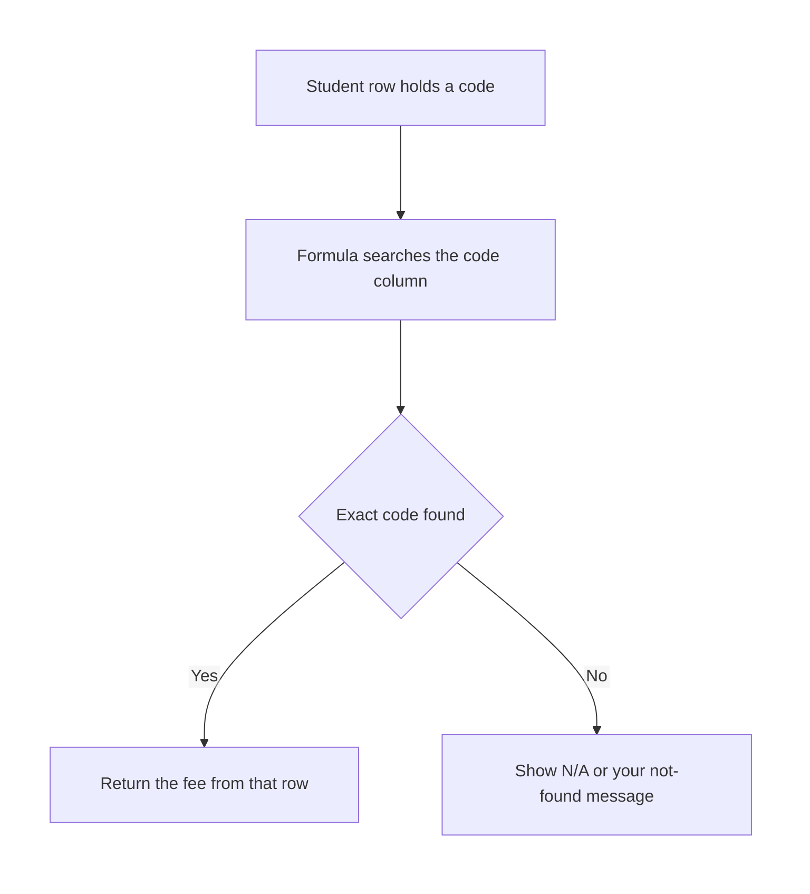
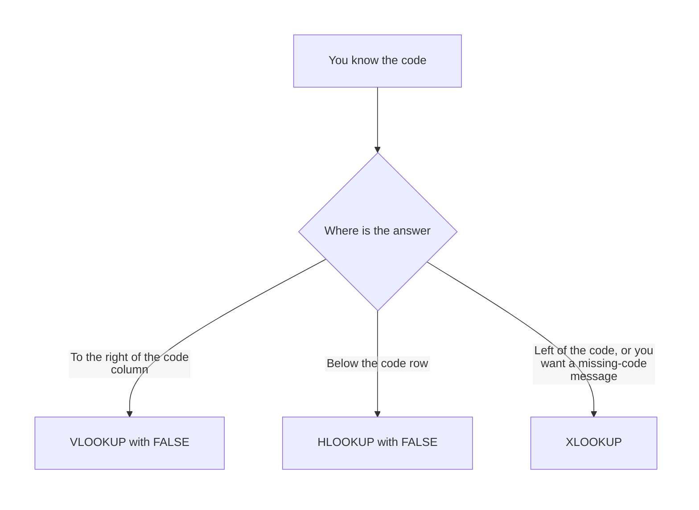

# Excel — VLOOKUP, XLOOKUP & HLOOKUP

## What You Will Learn in This Lesson

You already write formulas that start with `=` and you can lock a range with dollar signs when you fill down. This lesson does not rebuild those skills. It uses them to fetch a related value from a table.

By the end, you will be able to:

- Explain why a lookup is used when the answer already sits in a table
- Write `VLOOKUP` with a lookup value, a table, a column index, and exact match `FALSE`
- Say what goes wrong when the lookup column is not the leftmost column
- Say what goes wrong when approximate match `TRUE` is used on codes
- Write `HLOOKUP` to look across a top row and return a cell from a row below
- Write `XLOOKUP` with a lookup range, a return range, and an if-not-found message
- Explain why `XLOOKUP` can return a column that sits to the left of the code

The examples are a course-fee table and a city-code table. Every match in the worked sheets is an exact match.

---

## Why a Lookup Exists

A formula such as a total calculates a new number. A lookup does a different job. The fee is already typed in a table.

The student's row only holds a short code, and the formula goes and collects the matching fee.

- **Official Definition:** A **lookup** finds a value in a list and returns a related value from the same row or the same column.
- **In Simple Words:** You show Excel a code. Excel finds that code in a table and brings back the cell you asked for.
- **Real-Life Example:** A fee clerk sees `DAT` on a form and reads across the fee chart to the Data Basics row, then copies `4000` onto the form.

Typing `4000` by hand on every row is slow, and a later fee change will not flow into those typed numbers. A lookup formula keeps reading the fee table. Change the table, and every formula that points at it can show the new fee.



The search in this lesson is exact. `DAT` must match `DAT`. A nearby code is not an acceptable answer for a fee or a city name.

---

## The Fee Table and the Student List

Keep the fee chart in one block and the class list in another. The chart below uses columns F, G, and H. The class list uses columns A, B, and C.

Headers sit on row 1. Data starts on row 2.

|  | A | B | C | D | E | F | G | H |
|--|---|---|---|---|---|---|---|---|
| 1 | Name | Code | Fee |  |  | Code | Course | Fee |
| 2 | Asha | DAT |  |  |  | EXL | Excel Basics | 2500 |
| 3 | Imran | EXL |  |  |  | DAT | Data Basics | 4000 |
| 4 | Neha | PYT |  |  |  | PYT | Python Start | 5500 |
| 5 | Ravi | SQL |  |  |  |  |  |  |

The lookup table for the formulas is `$F$2:$H$4`. The header row is outside that range, so Excel does not try to match the word `Code` as if it were a course code. Dollar signs lock the table when the formula is filled down the class list.

`SQL` is on Ravi's row on purpose. It is not in the fee chart. An exact lookup should say that the code is missing, instead of inventing a fee.

---

## VLOOKUP and Its Four Arguments

`VLOOKUP` searches down the leftmost column of the table you give it, then returns a cell from a column to the right on that same row. The V means vertical. The search runs down a column.

- **Official Definition:** **`VLOOKUP`** looks for a value in the first column of a table and returns a value from a column to the right, on the matching row.
- **In Simple Words:** Find the code in the left column of the table, then step right to the fee.
- **Real-Life Example:** Find `DAT` in the code column, stay on that row, and read the third column of the chart, which is the fee `4000`.

Asha's fee goes in `C2`.

```excel
=VLOOKUP(B2,$F$2:$H$4,3,FALSE)
```

**How the formula works**

- `=` tells Excel to calculate.
- `VLOOKUP` is the function that searches down the first column of a table.
- `B2` is the lookup value, the code on Asha's row. The cell contains `DAT`.
- `$F$2:$H$4` is the table. The search uses column F only, because that is the leftmost column of this range. Columns G and H are available to return.
- `3` is the column index. Column F counts as 1, column G as 2, and column H as 3, so `3` returns the fee.
- `FALSE` asks for an exact match. Only a real `DAT` row may supply the fee.

`C2` displays `4000`. The formula bar still shows the formula.

|  | A | B | C |
|--|---|---|---|
| 1 | Name | Code | Fee |
| 2 | Asha | DAT | =VLOOKUP(B2,$F$2:$H$4,3,FALSE) |
| 3 | Imran | EXL |  |
| 4 | Neha | PYT |  |
| 5 | Ravi | SQL |  |

Fill `C2` down through `C5`. The lookup value shifts with the row. The table stays `$F$2:$H$4` because of the dollar signs.

| Cell | Formula | Displays |
|------|---------|----------|
| C2 | =VLOOKUP(B2,$F$2:$H$4,3,FALSE) | 4000 |
| C3 | =VLOOKUP(B3,$F$2:$H$4,3,FALSE) | 2500 |
| C4 | =VLOOKUP(B4,$F$2:$H$4,3,FALSE) | 5500 |
| C5 | =VLOOKUP(B5,$F$2:$H$4,3,FALSE) | #N/A |

Imran's code `EXL` returns `2500`. Neha's code `PYT` returns `5500`. Ravi's code `SQL` is absent, so Excel shows `#N/A`.

- **Official Definition:** **`#N/A`** means the lookup did not find an exact match in the search column.
- **In Simple Words:** The code is not in the table, or it is not written the same way.
- **Real-Life Example:** The clerk looks down the fee chart, does not see `SQL`, and leaves the fee blank with a clear "not on the chart" mark.

`#N/A` is not a broken file. It is the exact-match function telling you the code is missing. Check spelling, extra spaces, and whether the code is a number in one place and text in the other. `VLOOKUP` is not case-sensitive: `dat` matches `DAT`.

An extra space in `DAT ` does not match `DAT`.

The column index counts inside the table, not across the whole sheet. In `$F$2:$H$4`, index `2` returns the course name, not the fee. Index `4` is past the end of a three-column table, and Excel shows `#REF!`.

```excel
=VLOOKUP(B2,$F$2:$H$4,2,FALSE)
```

**How the formula works**

- `B2` is still the code `DAT`.
- `$F$2:$H$4` is the same fee chart.
- `2` returns the second column of that chart, the course name.
- `FALSE` still demands an exact code.

The cell displays `Data Basics`.

If someone later inserts a new column inside the chart, the number `3` does not move by itself. The formula can start returning the wrong field. Read the column index again after you insert a column in the table.

---

## When the Lookup Column Is Not Leftmost

`VLOOKUP` always searches the leftmost column of the range you name. It can return a column to the right of that. It cannot return a column to the left of the column it searches.

Suppose the chart is stored with the fee first:

|  | F | G | H |
|--|---|---|---|
| 1 | Fee | Code | Course |
| 2 | 2500 | EXL | Excel Basics |
| 3 | 4000 | DAT | Data Basics |
| 4 | 5500 | PYT | Python Start |

If the table range is `$F$2:$H$4`, the leftmost column is the fee, so Excel searches fees, not codes. A search for `DAT` does not belong in a column of amounts.

If you start the range at the code, `$G$2:$H$4`, Excel can find `DAT` and can return the course from the next column. The fee sits to the left of the code, outside that range, so this `VLOOKUP` cannot bring the fee back.

That is the leftmost rule in daily work. Put the code in the first column of the `VLOOKUP` table, and put the fee in a column to its right. When the fee must stay to the left of the code, use `XLOOKUP`, which is covered later in this lesson.

---

## The Approximate-Match Pitfall

The fourth argument controls how close a match is allowed to be. `FALSE` means exact. `TRUE` means approximate. If you leave the fourth argument out, Excel uses approximate match.

- **Official Definition:** **Approximate match** is the `TRUE` setting. Excel does not require the lookup value to appear exactly, and it expects the first column to be sorted in ascending order.
- **In Simple Words:** `TRUE` may hand you a neighbour. `FALSE` hands you the exact code or `#N/A`.
- **Real-Life Example:** Asking for city code `MUM` and receiving some other city's name, with no error on the cell, because the match was allowed to be approximate.

For fee codes and city codes, type `FALSE` every time. These tables are not sorted number bands. An approximate search can show another row's fee and still look like a normal number.

You will not see `#N/A` just because the code was missing or the table was unsorted.

```excel
=VLOOKUP(B2,$F$2:$H$4,3,FALSE)
```

**How the formula works**

- `B2` is the code you intend to match in full.
- `$F$2:$H$4` is the fee chart, with codes in the left column.
- `3` returns the fee column.
- `FALSE` refuses a neighbour. A missing code becomes `#N/A` instead of a quiet wrong fee.

Do not omit the fourth argument on these sheets. `=VLOOKUP(B2,$F$2:$H$4,3)` is approximate match, because the missing argument is treated as `TRUE`.

---

## HLOOKUP Looks Across, Then Down

Some charts are written sideways. The codes sit in one row, and the names sit in a row underneath. `HLOOKUP` searches across that top row, then returns a cell from a lower row. The H means horizontal.

- **Official Definition:** **`HLOOKUP`** looks for a value in the first row of a table and returns a value from a row below, in the matching column.
- **In Simple Words:** Find the code along the top, then step down to the city name.
- **Real-Life Example:** A campus list has `BLR`, `DEL`, `MUM`, and `HYD` across the header, and the city names on the next row. You look across for `MUM`, then read downward to Mumbai.

|  | A | B | C | D | E |
|--|---|---|---|---|---|
| 1 |  | BLR | DEL | MUM | HYD |
| 2 |  | Bengaluru | Delhi | Mumbai | Hyderabad |
| 4 | Code entered | MUM |  |  |  |
| 5 | City |  |  |  |  |

The city name goes in `B5`.

```excel
=HLOOKUP(B4,$B$1:$E$2,2,FALSE)
```

**How the formula works**

- `=` starts the calculation.
- `HLOOKUP` searches the first row of the table, from left to right.
- `B4` is the lookup value. The cell contains `MUM`.
- `$B$1:$E$2` is the table. Row 1 of this range holds the codes. Row 2 holds the city names.
- `2` is the row index. The first row of the table counts as 1, so `2` returns the city name on the row below.
- `FALSE` demands an exact code.

`B5` displays `Mumbai`.

`HLOOKUP` looks downward only. The row you return must be the top row or a row beneath it, inside the table. If the city names were above the codes, a search on the code row could not reach upward for the name.

Rearrange the chart so the codes are on the first row of the range, or use `XLOOKUP`.

A row index of `1` returns the code itself. A row index of `3` on this two-row table shows `#REF!`, because the table has no third row.

`TRUE` has the same pitfall here as in `VLOOKUP`. For city codes, keep `FALSE`.

---

## XLOOKUP Separates the Search from the Return

`XLOOKUP` takes the cells to search and the cells to return as two ranges. They do not have to be one block with a column number. The return range may sit to the left of the search range.

- **Official Definition:** **`XLOOKUP`** searches a lookup range and returns the matching item from a return range. An optional argument supplies a result when nothing matches.
- **In Simple Words:** Point at the code column, point at the answer column, and say what to show if the code is missing.
- **Real-Life Example:** The fee is stored to the left of the code. You still search the code column and bring back the fee column.

`XLOOKUP` is in Microsoft 365, Excel 2021, and Excel for the web. Older desktop copies such as Excel 2016 may show `#NAME?` because the name is unknown there. On those copies, `VLOOKUP` still runs.

If you see `#NAME?` only on `XLOOKUP`, the function is missing from that install, and the sheet itself is fine.

On the original fee chart, Asha's fee can be written without a column index.

```excel
=XLOOKUP(B2,$F$2:$F$4,$H$2:$H$4,"Code not found")
```

**How the formula works**

- `=` starts the calculation.
- `XLOOKUP` pairs a found position in one range with the same position in another range.
- `B2` is the lookup value, Asha's code `DAT`.
- `$F$2:$F$4` is the lookup range, the code column only.
- `$H$2:$H$4` is the return range, the fee column. `DAT` is the second code, so Excel returns the second fee, `4000`.
- `"Code not found"` is the if-not-found argument. It is used when the code is absent.

`C2` displays `4000`. Filled down, Ravi's `SQL` displays `Code not found` instead of `#N/A`.

The default match is exact. You do not pass `FALSE` to get that behaviour. These notes stay with that default and do not use approximate search.

|  | A | B | C |
|--|---|---|---|
| 2 | Asha | DAT | =XLOOKUP(B2,$F$2:$F$4,$H$2:$H$4,"Code not found") |
| 5 | Ravi | SQL | =XLOOKUP(B5,$F$2:$F$4,$H$2:$H$4,"Code not found") |

Now put the fee to the left of the code and still retrieve it. This is the layout `VLOOKUP` could not serve.

|  | F | G |
|--|---|---|
| 2 | 2500 | EXL |
| 3 | 4000 | DAT |
| 4 | 5500 | PYT |

```excel
=XLOOKUP(B2,$G$2:$G$4,$F$2:$F$4,"Code not found")
```

**How the formula works**

- `B2` is the code to find.
- `$G$2:$G$4` is the lookup range. The codes are in column G.
- `$F$2:$F$4` is the return range. The fees sit to the left of the codes.
- `"Code not found"` appears when the code is missing.

For `DAT`, the cell displays `4000`. The search column is not the leftmost column of the sheet, and the answer comes from the left. That is allowed for `XLOOKUP`.

The same idea works upward on the city chart. Search the code row and return the name row that sits above it.

```excel
=XLOOKUP(B4,$B$2:$E$2,$B$1:$E$1,"Code not found")
```

**How the formula works**

- `B4` holds the code, such as `MUM`.
- `$B$2:$E$2` is the lookup range, the row of codes.
- `$B$1:$E$1` is the return range, the row of names above the codes.
- `"Code not found"` covers a code that is not on that row.

If `B2:E2` contains `BLR`, `DEL`, `MUM`, and `HYD`, and row 1 contains the city names, `MUM` returns `Mumbai`. `HLOOKUP` could not return a row above its search row. `XLOOKUP` can, because the return range is named on its own.



`XLOOKUP` is the more flexible of the three for this work. It does not need the answer to sit to the right. It does not need a column index that breaks when a column is inserted between the code and the fee, because you point at the fee cells themselves.

It can carry an if-not-found message in the formula. Its default is an exact match, which is the match these code tables need.

Use `VLOOKUP` when the code is already the left column and you are on a copy of Excel that has no `XLOOKUP`. Use `HLOOKUP` when the chart is a short row and the answer is below the codes. Use `XLOOKUP` when you can, especially if the fee sits to the left or you want a clear missing-code message.

---

## Read One Row from the Formula Bar

After you fill the fee column, click each result and read the formula bar before you trust the amount. The cell can show a tidy number while the column index points at the wrong field.

| What you see in the cell | What to check in the formula bar |
|--------------------------|----------------------------------|
| 4000 on Asha's row | The lookup value is `B2`, the table is `$F$2:$H$4`, the index is `3`, and the last argument is `FALSE` |
| Data Basics when you wanted a fee | The column index is `2`, which is the course name. Change it to `3` for the fee |
| #N/A | The code is missing, or it differs by a space or by text versus number. `FALSE` is doing an exact job |
| A fee for a code that is not on the chart | The fourth argument is missing or is `TRUE`. Type `FALSE` |
| #REF! | The column index is larger than the number of columns in the table |
| #NAME? on XLOOKUP only | That Excel install does not provide `XLOOKUP`. Use `VLOOKUP` with the code in the left column |

A correct exact match for `DAT` on the original chart is the fee `4000` and, if you ask for column `2`, the course `Data Basics`. Those are two different return columns from the same found row. The row does not change when only the index changes.

Keep the lookup value as a cell reference, not a code typed inside every formula. `B2` becomes `B3` when you fill down. A formula that contains the typed word `"DAT"` will keep looking up `DAT` on every row, so every student would show `4000`.

```excel
=VLOOKUP(B3,$F$2:$H$4,3,FALSE)
```

**How the formula works**

- `B3` is Imran's code on the original list, which is `EXL`.
- `$F$2:$H$4` is the locked fee chart. Filling down did not move it.
- `3` returns the fee column.
- `FALSE` accepts only an exact `EXL` row.

The cell displays `2500`. If the table in the formula bar has become `$F$3:$H$5`, the dollar signs were missing and the chart has slipped down by one row.

---

## Course Name and Fee from the Same Code

You can bring back two fields from one code by writing two formulas. Both search the same left column. Each one uses its own column index.

This is still exact `VLOOKUP`, not a new kind of search.

|  | A | B | C | D |
|--|---|---|---|---|
| 2 | Asha | DAT | =VLOOKUP(B2,$F$2:$H$4,2,FALSE) | =VLOOKUP(B2,$F$2:$H$4,3,FALSE) |

`C2` displays `Data Basics`. `D2` displays `4000`.

```excel
=XLOOKUP(B2,$F$2:$F$4,$G$2:$G$4,"Code not found")
```

**How the formula works**

- `B2` is the code `DAT`.
- `$F$2:$F$4` is the code column, the lookup range.
- `$G$2:$G$4` is the course-name column, the return range.
- `"Code not found"` is shown when the code is absent.

The cell displays `Data Basics`. Pair it with the fee `XLOOKUP` that returns `$H$2:$H$4` when you need the amount as well. Each formula names its own return range, so neither one depends on a column count.

Use the same pattern for a city only when the city chart is vertical, with codes in the left column and names to the right. When the city chart is a single row of codes, stay with `HLOOKUP` or with `XLOOKUP` on that row.

---

## Student Activity 1 — Exact Fee from a Code

Build the fee chart in `F2:H4` and the class list in columns A to C, as in the table below. `E1` is unused. Write a `VLOOKUP` in `C2` and fill it down. Then, in `D2`, write an `XLOOKUP` that returns the same fee and shows `Code not found` when the code is missing.

Fill that down as well.

|  | A | B | F | G | H |
|--|---|---|---|---|---|
| 1 | Name | Code | Code | Course | Fee |
| 2 | Asha | DAT | EXL | Excel Basics | 2500 |
| 3 | Imran | WEB | DAT | Data Basics | 4000 |
| 4 | Neha | PYT | PYT | Python Start | 5500 |
| 5 | Ravi | EXL |  |  |  |

Imran's code is `WEB`. It is not on the chart.

### Check your answers

| Cell | Formula | Displays |
|------|---------|----------|
| C2 | =VLOOKUP(B2,$F$2:$H$4,3,FALSE) | 4000 |
| C3 | =VLOOKUP(B3,$F$2:$H$4,3,FALSE) | #N/A |
| C4 | =VLOOKUP(B4,$F$2:$H$4,3,FALSE) | 5500 |
| C5 | =VLOOKUP(B5,$F$2:$H$4,3,FALSE) | 2500 |
| D2 | =XLOOKUP(B2,$F$2:$F$4,$H$2:$H$4,"Code not found") | 4000 |
| D3 | =XLOOKUP(B3,$F$2:$F$4,$H$2:$H$4,"Code not found") | Code not found |
| D4 | =XLOOKUP(B4,$F$2:$F$4,$H$2:$H$4,"Code not found") | 5500 |
| D5 | =XLOOKUP(B5,$F$2:$F$4,$H$2:$H$4,"Code not found") | 2500 |

A column index of `2` would show the course name, not the fee. A missing `FALSE` would turn the `VLOOKUP` into an approximate match. `WEB` has no exact row, so `VLOOKUP` shows `#N/A` and `XLOOKUP` shows the message you typed.

---

## Student Activity 2 — City Code Across a Row

Lay the city chart sideways, then look up one code with `HLOOKUP` and one code with `XLOOKUP`.

|  | B | C | D | E |
|--|---|---|---|---|
| 1 | BLR | DEL | MUM | HYD |
| 2 | Bengaluru | Delhi | Mumbai | Hyderabad |
| 4 | DEL |  |  |  |
| 5 |  |  |  |  |
| 7 | HYD |  |  |  |
| 8 |  |  |  |  |

Put the `HLOOKUP` in `B5`. Put an `XLOOKUP` in `B8` that searches row 1 and returns row 2. Use `City not found` when the code is missing.

### Check your answers

| Cell | Formula | Displays |
|------|---------|----------|
| B5 | =HLOOKUP(B4,$B$1:$E$2,2,FALSE) | Delhi |
| B8 | =XLOOKUP(B7,$B$1:$E$1,$B$2:$E$2,"City not found") | Hyderabad |

`B4` holds `DEL`, so the horizontal lookup steps down to Delhi. `B7` holds `HYD`, so the `XLOOKUP` returns Hyderabad from the row below. A row index of `1` in `HLOOKUP` would return `DEL` itself, not the city name. `FALSE` stays in the `HLOOKUP` so a typo cannot quietly return a neighbour.

---

## The Same Code Under Each Function

Use `DAT` once and notice what each function is allowed to return. The fee chart in `F2:H4` has the code on the left and the fee in column 3. A second chart, with the fee in `F` and the code in `G`, is the left-side case.

| Need | Formula shape | Result for DAT |
|------|---------------|----------------|
| Fee to the right of the code | =VLOOKUP(B2,$F$2:$H$4,3,FALSE) | 4000 |
| Course name to the right of the code | =VLOOKUP(B2,$F$2:$H$4,2,FALSE) | Data Basics |
| Fee when the fee is left of the code | =XLOOKUP(B2,$G$2:$G$4,$F$2:$F$4,"Code not found") | 4000 |
| A missing code with a custom message | =XLOOKUP(B2,$F$2:$F$4,$H$2:$H$4,"Code not found") | Code not found, when B2 is SQL |
| City below a code row | =HLOOKUP(B4,$B$1:$E$2,2,FALSE) | The city under that code |

`VLOOKUP` does not gain a leftward search by changing the column index to a negative number. The index starts at `1` for the column being searched. `HLOOKUP` does not gain an upward search by using a row index of `0`. Stay inside the table, or switch to `XLOOKUP` and name the return range directly.

---

## Mistakes That Return the Wrong Cell

- The code column is not the leftmost column of the `VLOOKUP` range, so Excel searches the wrong field.
- The fourth argument is missing or set to `TRUE`, so a code table can return a neighbour with no error.
- The column index counts sheet columns instead of columns inside the table. In `F:H`, the fee is `3`, even though H is the eighth column of the sheet.
- The table range includes the header, and a code happens to match header text. Start the range on the first data row.
- Dollar signs were left off the table, so the filled formulas slide onto empty rows.
- An extra space or a number stored as text fails the exact match and shows `#N/A` or the not-found message.
- `XLOOKUP` shows `#NAME?` on an old Excel. Use `VLOOKUP` there, with the code in the left column and `FALSE` as the last argument.

---

## Before You Close the Sheet

The next session is about making this kind of sheet readable as a report.

---

## Key Takeaways

- A lookup fetches a value that is already stored, such as a fee for a course code or a city name for a city code.
- `VLOOKUP` needs the lookup value, the table, the column index, and `FALSE` for an exact match. It searches the leftmost column and returns a column to the right.
- Leaving out `FALSE`, or typing `TRUE`, allows an approximate match that can show the wrong fee on a code table.
- `HLOOKUP` searches the top row of its table and returns a row below. It does not look upward.
- `XLOOKUP` names the lookup range and the return range separately, can return a column to the left, and can show your own message when the code is missing.

---

## Important Commands, Libraries, and Terminologies

| Term | What it means in this lesson |
|------|------------------------------|
| Lookup | Find a code and return a related cell from the same row or column |
| `VLOOKUP` | Search down the leftmost column of a table and return a cell to the right |
| Lookup value | The code you are trying to find, often a cell such as `B2` |
| Table array | The block `VLOOKUP` or `HLOOKUP` searches, such as `$F$2:$H$4` |
| Column index | The count of the return column inside the table. The leftmost column is `1` |
| `FALSE` | Exact match. The code must appear as written |
| `TRUE` | Approximate match. Risky on unsorted codes, and the default if the argument is omitted |
| `#N/A` | Exact lookup failed because the code was not found |
| `#REF!` | The column index or row index points outside the table |
| `HLOOKUP` | Search across the first row of a table and return a cell from a lower row |
| Row index | The count of the return row inside an `HLOOKUP` table. The top row is `1` |
| `XLOOKUP` | Search one range and return from another range, which may sit to the left |
| Lookup range | The cells `XLOOKUP` searches, such as the code column |
| Return range | The cells `XLOOKUP` brings back, such as the fee column |
| If not found | The optional `XLOOKUP` result used when the code is missing |
| `#NAME?` | Excel does not recognise the function name on that install |
