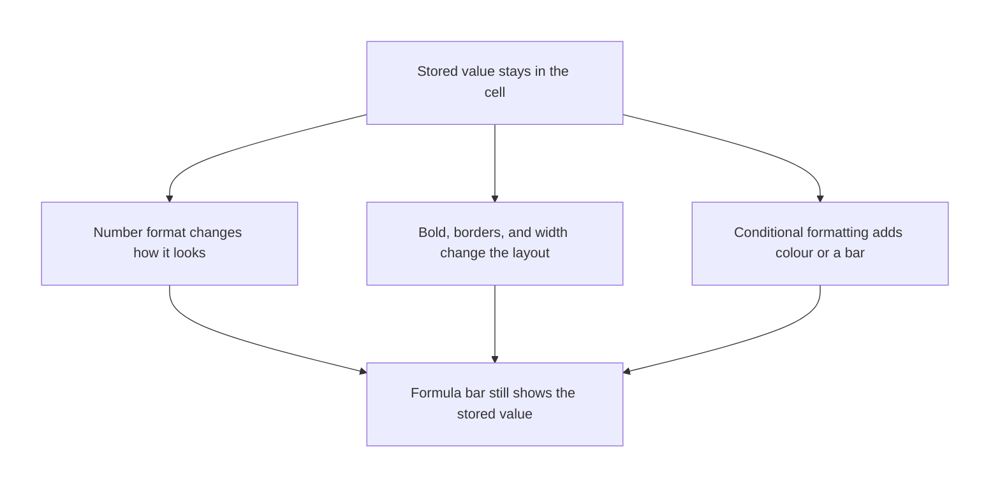
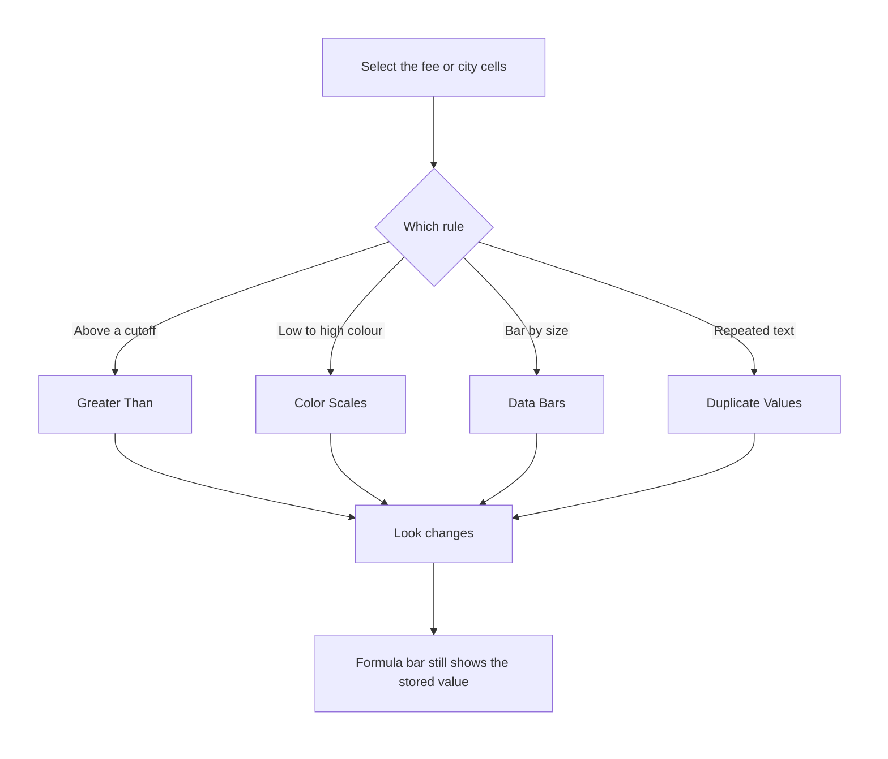

# Excel — Report Making: Basic & Conditional Formatting

## What You Will Learn in This Lesson

The numbers on this sheet are already in place, including a total that has already been calculated. This lesson does not rebuild formulas. It makes the same sheet readable as a report, on screen and on paper, and then adds rules that colour cells while leaving the stored numbers alone.

By the end, you will be able to:

- Set column widths so labels and amounts are fully visible
- Make a header row bold and give the sheet a clear title row
- Apply currency, percent, and date formats without changing the stored values
- Add borders, set alignment, and wrap long header text
- Set a print area and fit the report to the page
- Highlight cells greater than a value
- Add a colour scale, data bars, and a duplicate-values highlight
- Confirm that a formatting rule changes the look, not the number in the cell

The running example is a short campus fee report. City names repeat on purpose, so duplicate highlighting has something to find.

---

## A Sheet Becomes a Report

A working sheet can be correct and still be hard to read. Columns cut words in half, amounts sit as bare numbers, and the title is missing. A report is the same data, arranged so another person can see what the columns mean.

- **Official Definition:** A **report layout** is the set of widths, text styles, number formats, borders, and page settings that make a sheet readable.
- **In Simple Words:** The numbers stay. The presentation is cleaned up so a reader can follow them.
- **Real-Life Example:** A fee list pinned on a noticeboard needs a title, a date, rupee amounts, and lines that separate one student from the next.

Formatting in this lesson is display. Click a formatted cell and read the formula bar. You still see the original number, date, or decimal.

A total that was already calculated still uses those stored numbers.

Manual colour is paint you apply once. A conditional formatting rule watches the value and updates the look when the value changes. Both leave the stored number as it was.

---

## The Campus Fee Report

Use this layout. Row 1 is the title. Row 2 is the report date.

Row 4 is the header. Rows 5 to 9 are students. Row 10 already shows the total `20000`.

You will not rebuild that total. You will only make it sit clearly under the fee column.

|  | A | B | C | D |
|--|---|---|---|---|
| 1 | Campus Fee Report |  |  |  |
| 2 | 24/09/2026 |  |  |  |
| 4 | Name | City | Fee | Share of total |
| 5 | Asha | Pune | 1000 | 0.05 |
| 6 | Imran | Delhi | 2000 | 0.10 |
| 7 | Neha | Pune | 3000 | 0.15 |
| 8 | Ravi | Kochi | 4000 | 0.20 |
| 9 | Lata | Pune | 10000 | 0.50 |
| 10 | Total |  | 20000 |  |

The shares are already decimals: `0.05` means five percent of the total. They add to `1`. The fees add to the total already shown in `C10`.

Pune appears three times. Delhi and Kochi appear once each.

Type the date in the order your Excel already uses. On many Indian setups that is day, then month, then year, such as `24/09/2026`. If Excel accepts it as a date, the formula bar shows a date, not a sentence.

---

## Column Widths

A narrow column hides the rest of a label when the next cell is full. A number or a date that does not fit may show as `#####`. The value is still stored.

Widening the column reveals it.

- **Official Definition:** **Column width** is how wide a column is drawn. The width number is a character count for the standard font, not a measure in centimetres.
- **In Simple Words:** Drag the column until the words and amounts fit.
- **Real-Life Example:** "Share of total" needs more room than "Fee". Give that column a wider setting.

Drag the boundary line to the right of the column letter. Double-click that boundary to fit the widest entry in the column. On the Home tab, Format, then Column Width, lets you type a width.

A larger number makes a wider column.

For this report, a width near `18` suits Name, `14` suits City, `14` suits Fee, and `16` suits Share of total. These are starting points. Autofit after you wrap the header, because wrapping changes how much width you need.

---

## A Bold Header and a Clear Title

The header row names the columns. The title row names the whole report. Readers should see those two jobs at a glance.

- **Official Definition:** A **header row** is the row of column names directly above the data.
- **In Simple Words:** Name, City, Fee, and Share of total are headers, not student records.
- **Real-Life Example:** On a printed notice, the column names stay darker than the names of the students.

Select row 4 and click Bold on the Home tab, or press Ctrl+B on Windows or Command+B on a Mac. Excel for the web uses the same Bold button on the Home tab. Bold changes the look of the text.

The words in the cells stay the same.

- **Official Definition:** A **title row** is a row above the table that states what the report is.
- **In Simple Words:** Put `Campus Fee Report` in row 1 and make it stand out from the column names.
- **Real-Life Example:** The notice has one large heading, then the date, then the table.

Select `A1:D1` and choose Merge and Center on the Home tab. The title text is kept in `A1`, which is the upper-left cell of the merge, and it is shown across the four columns. Merge the title only.

Leave the data rows unmerged so each fee stays in its own cell.

Make the title bold, and raise the font size from the Home tab, for example to 16. The date in `A2` can stay in a smaller size. After you apply a date format, `A2` should read as a date, not as a title.

---

## Currency, Percent, and Date Formats

Number formats change how a value is drawn. They do not replace the value with the symbols you see.

- **Official Definition:** A **number format** is a display pattern for a numeric value, such as currency, percent, or date.
- **In Simple Words:** The cell can show `₹1,000` while the formula bar still shows `1000`.
- **Real-Life Example:** A receipt prints rupees and paise, but the amount you would add is still the plain number.

Select `C5:C10`. On the Home tab, open the number format list and choose Currency, or open Format Cells and choose Currency with the symbol `₹`. Accounting Number Format is the other rupee-style choice on the same ribbon.

It lines the symbol up at the edge of the cell. Either one can show the fee as rupees. The stored fees remain `1000`, `2000`, `3000`, `4000`, `10000`, and `20000`.

- **Official Definition:** A **currency format** displays a numeric amount with a currency symbol and a chosen number of decimal places.
- **In Simple Words:** You still typed `1000`. Excel draws the rupee sign for you.
- **Real-Life Example:** Lata's fee shows as `₹10,000.00`, and the formula bar shows `10000`.

- **Official Definition:** A **percent format** displays a decimal as a percentage. The stored value is the decimal.
- **In Simple Words:** `0.50` with a percent format looks like `50%`. The formula bar still shows `0.50`.
- **Real-Life Example:** Lata's share is half of the total. The cell holds `0.50` and shows `50%` after the format is applied.

Select `D5:D9` and choose Percent, or click the percent style. If you type `50` and then apply percent, the cell shows `5000%`, because `50` becomes fifty hundred percent on screen. Type the decimal `0.50`, or type `50%` while entering, when you mean fifty percent.

Applying the format does not divide a number that is already stored.

- **Official Definition:** A **date format** displays Excel's stored date serial as a day, month, and year.
- **In Simple Words:** The cell remembers the day. The format decides whether you see `24-Sep-2026` or another date pattern.
- **Real-Life Example:** The report date stays 24 September 2026 even if you switch the display from `24/09/2026` to a longer month name.

Select `A2` and choose Short Date or Long Date from the number format list. If the column is too narrow for the pattern you chose, you may see `#####`. Widen column A.

The date is still stored. A value that Excel stored as text will not follow a date format. Retype it as a real date if the formula bar shows an apostrophe or if the date refuses to change pattern.

---

## Borders, Alignment, and Wrap Text

Lines and alignment tell the eye where each value belongs. They do not lock the cells, and they do not change what is stored.

- **Official Definition:** A **border** is a line drawn on one or more edges of a cell.
- **In Simple Words:** Borders are the ruled lines of the table.
- **Real-Life Example:** A fee notice uses a line under the column names and a box around the student rows so the total is easy to find.

Select `A4:D10`. On the Home tab, open the Borders menu and choose All Borders. Then select `A4:D4` and apply a bottom border or a thicker outside border so the header sits apart from the names.

The Borders button is in the Font group on the desktop app and on Excel for the web.

- **Official Definition:** **Alignment** is the horizontal or vertical position of a value inside its cell.
- **In Simple Words:** Names sit to the left. Amounts sit to the right. Headers can sit in the centre.
- **Real-Life Example:** Rupee amounts line up at the right edge so tens and thousands are easy to compare.

Select `A5:B9` and click Align Left. Select `C5:C10` and click Align Right if the currency format has not already done that. Select `A4:D4` and click Center.

Vertical alignment can stay centered when a wrapped header makes the row taller. These buttons are on the Home tab, in the Alignment group.

- **Official Definition:** **Wrap text** shows the full contents of a cell on more than one line inside the same cell and increases the row height.
- **In Simple Words:** A long header folds instead of hiding behind the next column.
- **Real-Life Example:** "Share of total" can appear on two lines in row 4, and the student names below stay on one line each.

Select `D4` and click Wrap Text. If the row does not grow, double-click the boundary under the row number to autofit the height. Wrap text does not cut the stored label.

You still see the full words in the formula bar.

---

## Print Area and Fit to Page

The screen can show helper cells that you do not want on paper. Print settings choose the block that prints and shrink that block onto the page. They do not change the column widths you see while editing.

- **Official Definition:** A **print area** is the range Excel will print. Cells outside it remain on the sheet and are left off the paper.
- **In Simple Words:** You mark the report block as the only part that should print.
- **Real-Life Example:** Rough notes in column Z stay on the working sheet and do not appear on the notice.

Select `A1:D10`. On the desktop app, open the Page Layout tab, then Print Area, then Set Print Area. Clear Print Area, on the same menu, sends printing back to the used sheet.

In Excel for the web, page tools are thinner. Open File, then Print, and check which range will be printed. Set the print area on the desktop app when the web page does not offer that command.

- **Official Definition:** **Fit to page** scales the printout so the chosen width, and optionally the height, occupies the paper. The on-screen column widths stay as you set them.
- **In Simple Words:** The report shrinks on paper so you do not lose the last column.
- **Real-Life Example:** A four-column fee notice is squeezed to one page wide instead of printing Share of total on a second sheet.

On the desktop app, use Page Layout, then Scale to Fit. Set Width to 1 page. Set Height to 1 page when the report is short, as this one is.

File, then Print, shows a preview before anything is sent to a printer. The same print screen often offers scaling such as Fit Sheet on One Page or Fit All Columns on One Page. In Excel for the web, look for those scaling choices under File, then Print.

Landscape paper is the wider page direction, and it helps when a report has many columns. This fee report is narrow, so portrait still fits once scaling is set.

Check the preview for three things. The title and the date appear. The four columns appear on one page.

The total already shown in `C10` appears with the student rows.

---

## Conditional Formatting Watches the Value

Conditional formatting is a rule. When the value meets the rule, Excel changes the appearance. When the value no longer meets the rule, the extra appearance drops away.

The stored number is untouched either way.

- **Official Definition:** **Conditional formatting** applies a visual format only while a cell's value meets a rule you set.
- **In Simple Words:** Colour, a bar, or a scale is tied to the number. The number itself stays in the cell.
- **Real-Life Example:** Fees above a limit glow on the notice. If a fee is edited down to the limit, the glow can switch off, and the amount is still the amount.

The command is on the Home tab: Conditional Formatting. In the product, the colour-scale menu is spelled Color Scales. These notes use "colour" in sentences and the menu name when telling you what to click.

Select the data cells, not the whole sheet, when you add a rule. For fees, select `C5:C9` if the total should stay plain, or include `C10` only when you want the total judged by the same rule. The examples below leave the total outside the highlight so the eye stays on the student fees.

Clear a rule without clearing your bold text, borders, or number formats. Use Conditional Formatting, then Clear Rules, then Clear Rules from Selected Cells, or Clear Rules from Entire Sheet. Home, then Clear, then Clear Formats removes manual formatting as well, so prefer Clear Rules when the report layout should remain.

---

## Highlight Cells Greater Than a Value

A greater-than rule colours cells whose value is above a number you type. The boundary is strict. A fee equal to the cutoff is not greater than the cutoff, so it stays plain.

- **Official Definition:** A **greater-than rule** is a highlight-cells rule that formats values strictly above the number you enter.
- **In Simple Words:** Above the cutoff, the cell changes look. The cutoff itself does not.
- **Real-Life Example:** Any student fee above `4000` is marked, so Lata's `10000` stands out and Ravi's `4000` does not.

Select `C5:C9`. Choose Conditional Formatting, then Highlight Cells Rules, then Greater Than. Type `4000`.

Pick a fill, such as a light red or a green fill. Confirm.

| Fee stored | Greater than 4000 |
|------------|-------------------|
| 1000 | No highlight from this rule |
| 2000 | No highlight from this rule |
| 3000 | No highlight from this rule |
| 4000 | No highlight from this rule |
| 10000 | Highlighted |

Click Lata's cell. The formula bar still shows `10000`, not a colour and not a rupee sentence. The total in `C10` still shows `20000`, because the rule did not add or remove any fee.

If you later change Lata's fee from `10000` to `3500`, the highlight drops, and the stored value is `3500`. The rule is watching the cell. A one-time fill colour from the paint bucket would have stayed until you cleared it by hand.

---

## Colour Scales

A colour scale paints the selected numbers along a gradient. The lowest value gets one end colour. The highest value gets the other end.

Values in between get a blend. Every stored number stays the same.

- **Official Definition:** A **colour scale** is a conditional format that maps the smallest and largest values in the selection to the two ends of a colour gradient.
- **In Simple Words:** Small fees lean toward one colour and large fees lean toward the other.
- **Real-Life Example:** On the fee column, `1000` sits at the low end of the scale and `10000` sits at the high end. `4000` falls in between.

Select `C5:C9`. Choose Conditional Formatting, then Color Scales, and pick a scale. You do not type a cutoff.

Excel uses the smallest and largest numbers inside the selection. Adding or removing a fee in that selection can shift the colours, because the ends of the scale move. The amounts in the formula bar do not shift with the colours.

If a greater-than rule and a colour scale both apply to the same cells, both try to format those cells. The sheet can look noisy. Clear one rule if you only wanted one kind of signal.

For practice, you may apply the scale on a copy of the fee column, or clear the greater-than rule first, then apply the scale.

---

## Data Bars

A data bar draws a bar inside the cell. The bar's length follows the value. The largest value in the selection gets the longest bar.

The number remains the number you stored.

- **Official Definition:** A **data bar** is a conditional format that draws a bar whose length represents the cell's value relative to the other values in the selection.
- **In Simple Words:** A bigger fee grows a longer bar in the same cell as the amount.
- **Real-Life Example:** Lata's `10000` carries the longest bar. Asha's `1000` carries the shortest bar among these five fees.

Select `C5:C9`. Choose Conditional Formatting, then Data Bars, and pick a gradient or a solid bar. The fees are positive, so the bars grow in the ordinary direction.

The formula bar for Lata still shows `10000`. The total already calculated in `C10` is unchanged, and it stays out of the bar comparison when it is not selected.

Data bars, colour scales, and greater-than rules can be used one at a time on this lesson's fee column. Stacking all three on the same five cells makes the report harder to read. Pick the signal the reader needs.

A cutoff calls for greater than. A spread from low to high calls for a scale or a bar.

---

## Duplicate Values

A duplicate-values rule highlights every cell in the selection whose entry appears more than once. It does not delete the extra row. A value that appears once stays plain.

- **Official Definition:** A **duplicate values** rule formats cells whose contents occur more than once inside the selection.
- **In Simple Words:** Repeated cities light up. Cities that appear once do not. Nothing is removed.
- **Real-Life Example:** Pune is on three rows, so those three city cells are highlighted. Delhi and Kochi appear once, so they stay plain.

Select `B5:B9`, the city column without the header. Choose Conditional Formatting, then Highlight Cells Rules, then Duplicate Values. Choose a fill and confirm.

The same dialog can mark unique values instead. This lesson uses the duplicate choice.

| City | Times in B5:B9 | Highlighted as a duplicate |
|------|----------------|----------------------------|
| Pune | 3 | Yes |
| Delhi | 1 | No |
| Pune | 3 | Yes |
| Kochi | 1 | No |
| Pune | 3 | Yes |

The stored text is still `Pune`, `Delhi`, or `Kochi`. Highlighting did not merge the rows and did not change the fees beside them. Include the header only when you want the header text judged too. `City` appears once, so it would stay plain, but keeping the header outside the selection makes the rule easier to explain.

Spelling matters. `Pune` and `pune` are treated as the same for this rule in Excel, because the comparison is not case-sensitive. `Pune ` with a trailing space is not the same text as `Pune`, so it may not join the duplicate group. Type the city the same way on each row before you trust the highlight.

---

## What the Reader Sees and What Excel Stores

Walk down the finished report and compare the cell with the formula bar. This check catches a format that was applied to the wrong kind of value.

| Cell | Stored value | Display after formatting |
|------|--------------|--------------------------|
| A1 | Campus Fee Report | Title text, merged across A1:D1 |
| A2 | The date 24 September 2026 | A date pattern such as 24-Sep-2026 |
| A4 | Name | Bold header |
| D4 | Share of total | Bold header, wrapped if the column is narrow |
| C5 | 1000 | A rupee amount such as ₹1,000.00 |
| D5 | 0.05 | 5% |
| C8 | 4000 | A rupee amount. Not highlighted by a greater-than-4000 rule |
| C9 | 10000 | A rupee amount. Highlighted if that greater-than rule is on |
| B5 | Pune | City text. Highlighted when the duplicate rule includes this column |
| C10 | 20000 | The total already calculated, shown in currency, not rebuilt here |

A currency format can show two decimal places. `1000` may look like `₹1,000.00`. The stored value is still `1000`.

Percent follows the same split. `0.20` displays as `20%`, and the formula bar shows `0.20`. Typing `20` and then applying percent shows `2000%`.

---

## Manual Formatting and Rules Side by Side

Use manual formatting for the parts that should stay put: the title, the header, the borders, the number formats, and the alignments. Use conditional formatting for the parts that should react: a fee above a cutoff, a spread of fee sizes, or a city typed more than once.

| Job | Where you do it | Stored value |
|-----|-----------------|--------------|
| Bold the header | Home, Bold | Unchanged |
| Rupee display | Currency or Accounting format | Unchanged number |
| Percent display | Percent format | Unchanged decimal |
| Date display | Date format | Unchanged date |
| Ruled lines | Borders menu | Unchanged |
| Fold a long header | Wrap Text | Unchanged text |
| Mark fees above 4000 | Highlight Cells Rules, Greater Than | Unchanged number |
| Colour from low fee to high fee | Color Scales | Unchanged number |
| Bar length by fee size | Data Bars | Unchanged number |
| Mark repeated cities | Duplicate Values | Unchanged text |

The paint-bucket fill is manual colour. It stays after the fee changes, which is why it is a weak way to mark "greater than 4000". The greater-than rule repaints itself from the value.

Neither one writes a new number into the cell.

When you copy a cell to another place, decide what you need. A normal copy brings the value and the formatting. These notes do not ask you to paste values only.

They ask you to read the formula bar so you can tell the amount apart from its rupee sign, its colour, and its bar.

---

## Mistakes That Make a Report Lie Visually

The numbers can be right while the page still misleads a reader. Check these before you share the sheet.

- A column shows `#####`. Widen it. Do not retype the fee.
- A header looks blank because the next cell covers the spill. Wrap the text or widen the column. The full header is still stored.
- Currency was applied to the name column, so names may become unexpected number displays. Apply `₹` only to `C5:C10`.
- Percent was applied to `0.05` and correctly shows `5%`. Percent applied to a cell that holds `5` shows `500%`. Read the formula bar.
- The title was typed into `A1`, then the data rows were merged as well. Unmerge the student rows so each city and fee stays in its own cell.
- The print area is only `A4:D9`, so the title, the date, and the total stay off the paper. Extend it to `A1:D10`.
- Fit to page was set, but the preview still uses a print area that cuts the share column. Fix the print area first, then set the width to one page.
- Greater than `4000` was applied to the whole column, including the header or an old note. Limit the rule to `C5:C9` when you only want student fees.
- A duplicate rule includes the header and a second cell that also says `City`, so the header lights up. Select `B5:B9` only.
- Clear Formats was used to remove a colour scale, and the bold header, borders, and rupee format disappeared with it. Use Clear Rules when you only want the conditional rule gone.
- The total in `C10` was edited by hand during layout. Put `20000` back. This lesson does not rebuild the total. It only displays the total that is already there.

---

## Student Activity 1 — Lay Out the Fee Report

Build the campus fee report from the table in this lesson. Then do the layout steps below. Do not retype the total. `C10` already holds `20000`.

- Set column widths so Name, City, Fee, and Share of total are fully visible
- Bold row 4, and merge and centre the title in `A1:D1`
- Format `C5:C10` as currency with `₹`
- Format `D5:D9` as percent
- Format `A2` as a date
- Put all borders on `A4:D10`, left-align the names, and wrap `D4` if the header is cramped
- Set the print area to `A1:D10` and fit the width to one page

### Check your answers

| Check | What you should see |
|-------|---------------------|
| Formula bar of `C9` | `10000`, even if the cell shows a rupee amount |
| Formula bar of `D9` | `0.50`, while the cell shows `50%` |
| Formula bar of `A2` | A date for 24 September 2026, not the words Campus Fee Report |
| Title | `Campus Fee Report` shown across `A1:D1`, stored in `A1` |
| `C10` | Still `20000` under a currency format |
| `D5` | Shows `5%` because the stored value is `0.05` |
| Print area | `A1:D10`, one page wide in the preview |

If `D9` shows `5000%`, the cell holds `50` rather than `0.50`. Retype `0.50` and apply percent again. If the date shows `#####`, widen column A.

---

## Student Activity 2 — Rules That Do Not Change the Numbers

On a copy of the same fees and cities, apply two rules and predict the highlights before you read the answer table. Clear the first rule before you apply a colour scale or data bars if the column starts to look crowded.

- On `C5:C9`, highlight cells greater than `4000`
- On `B5:B9`, highlight duplicate values
- Click the highlighted fee and the highlighted cities and read the formula bar

### Check your answers

| Cell | Stored value | What the rule does |
|------|--------------|--------------------|
| C5 | 1000 | Not greater than 4000, so no greater-than highlight |
| C6 | 2000 | Not greater than 4000 |
| C7 | 3000 | Not greater than 4000 |
| C8 | 4000 | Equal to 4000, so no greater-than highlight |
| C9 | 10000 | Greater than 4000, so this fee is highlighted |
| B5 | Pune | Duplicate, highlighted |
| B6 | Delhi | Unique, not highlighted |
| B7 | Pune | Duplicate, highlighted |
| B8 | Kochi | Unique, not highlighted |
| B9 | Pune | Duplicate, highlighted |
| C10 | 20000 | Unchanged. It was already the total, and it was outside the fee rule |

A colour scale on `C5:C9` puts `1000` at one end and `10000` at the other. Data bars on the same cells give `10000` the longest bar. In every case the formula bar of `C9` still shows `10000`.

Clearing the rules removes the colour and the bars and leaves the currency format, the borders, and the numbers in place.

---

## A Careful Close

Clear layout and conditional highlights sit under later data work, whenever these numbers are checked, shared, or discussed. The stored fees, shares, date, and total remain the values you can still read in the formula bar.

---

## Key Takeaways

- Column width, a bold header, a title row, borders, alignment, and wrap text make a sheet readable. They do not change the stored values.
- Currency, percent, and date formats change the display. The formula bar still shows the number, the decimal, or the date.
- Print area chooses what prints. Fit to page shrinks that printout onto the paper and leaves the on-screen widths as you set them.
- Greater than, colour scales, data bars, and duplicate values are conditional formats. A fee equal to the cutoff is not highlighted by a greater-than rule.
- Conditional formatting does not change the stored number. Clear Rules removes the rule and leaves the report layout in place.

---

## Important Commands, Libraries, and Terminologies

| Term | What it means in this lesson |
|------|------------------------------|
| Column width | How wide the column is drawn. Widen it when you see `#####` or cut-off text |
| Header row | The bold column names above the data |
| Title row | The report name above the table, merged across the columns for display |
| Number format | A display pattern such as currency, percent, or date |
| Currency format | Shows a symbol such as `₹` while the stored amount stays a plain number |
| Percent format | Shows a decimal as a percentage. `0.50` displays as `50%` |
| Date format | Shows a stored date as a day, month, and year |
| Border | A line on a cell edge, applied from the Borders menu |
| Alignment | Left, centre, or right placement inside the cell |
| Wrap text | Folds long text onto extra lines and can increase row height |
| Print area | The range that prints. Other cells can remain on the sheet |
| Fit to page | Print scaling so the report width fits the paper |
| Conditional formatting | A rule that changes appearance while the value qualifies |
| Greater Than | Highlight Cells Rules choice for values strictly above a cutoff |
| Color Scales | Menu name for a colour gradient from low values to high values |
| Data Bars | Bars inside cells, longer for larger values in the selection |
| Duplicate Values | Highlights entries that occur more than once. It does not delete rows |
| Clear Rules | Removes conditional formatting and leaves manual report formatting |
